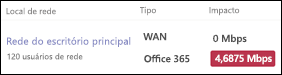

# Verificar sua conexão com a Internet para o Sistema de Telefonia do Teams

O Sistema de Telefonia do Teams é a tecnologia da Microsoft para habilitar os recursos de telefone no Microsoft Teams usando a nuvem do Microsoft 365. Cada dispositivo que usa o Microsoft Teams e o Sistema de Telefonia precisa de uma conexão com a Internet.

Para obter a melhor experiência do Sistema de Telefonia, você precisa de uma conexão de internet de banda larga que possa dar suporte ao número máximo de chamadas telefônicas que sua organização pode fazer a qualquer momento. Você também precisa garantir que os computadores em sua rede possam acessar os serviços do Microsoft 365.

## Verificar a velocidade de conexão com a Internet

Este artigo ajuda a determinar se a conexão com a Internet é rápida o suficiente para o número de pessoas que precisam fazer chamadas telefônicas. Você fornecerá informações sobre sua organização e obterá um relatório que mostra a quantidade de conexão com a Internet que será usada pelo Teams e pelo Sistema de Telefonia.

### Coletar informações sobre sua conexão com a Internet e os usuários

Antes de começar, você precisa das seguintes informações:

* A velocidade da conexão com a Internet
* Quantas pessoas usarão o Sistema de Telefonia principalmente do seu escritório
* Quantas pessoas usarão o Sistema de Telefonia principalmente de um local remoto, como uma home office

### Inserir suas informações no planejador de rede

Siga estas etapas:

1. Em um navegador, vá até [https://admin.teams.microsoft.com](https://admin.teams.microsoft.com). Entre usando uma conta que tenha permissões de Administrador Global. A conta que você usou para se inscrever no Microsoft 365 tem essas permissões.
2. Abra **Planejamento** e selecione **Planejador de rede**.
3. Em **Planos de rede**, selecione **Adicionar**. Digite um nome ao seu plano e selecione **Aplicar**.
4. Selecione o nome do seu plano de rede.
5. Na próxima página, selecione **Adicionar um site de rede** na guia **Sites de rede**.
6. Preencha o nome **do site de rede**, **os campos de** capacidade de **link de Rede** , Usuários de Rede e Internet e, em seguida, **selecione Salvar**. Deixe os outros campos na tela em branco e não selecione as opções **ExpressRoute** ou **Conectado à WAN**.
7. Na guia **Relatório**, selecione **Iniciar um relatório**.
8. Insira um nome **de relatório e** o número de usuários de **rede (****Office** e **Remote**) e selecione  Gerar relatório para criar um relatório que mostra os requisitos de largura de banda do Teams. Vamos lhe dizer como ler o relatório na próxima seção.

### Localizar a velocidade mínima de conexão com a Internet

Quando você seleciona **Gerar relatório**, o Microsoft 365 cria um relatório.

Na coluna **Impacto** e na linha **Office 365**, esse número mostra a quantidade de conexão com a Internet que o Teams e o Sistema de Telefonia usarão. Recomendamos que esse número não seja mais de 30% da velocidade total de conexão com a Internet. Por exemplo, se sua conexão com a Internet for *de 60 Mbps*, o Teams e o Sistema de Telefonia não devem usar mais de *18 Mbps*.

Use esta equação para determinar a velocidade mínima de conexão com a Internet: <*número de impacto>/0,3*.  

Digamos que o número de impacto seja *4,6875 Mbps*. O cálculo para encontrar a velocidade mínima de conexão com a Internet seria *4,6875 /0,3 = 15,6*. Nesse caso, a velocidade de conexão com a Internet deve ser de *pelo menos 15,6 Mbps*.

Se o Teams e o Sistema de Telefonia usarem mais de 30% da velocidade total de conexão com a Internet, o número **de** impacto aparecerá vermelho. Nesse caso, talvez seja necessário atualizar sua conexão com a Internet.

>[!NOTE]
> O impacto de largura de banda fornecido pelo Planejador de Rede é apenas uma estimativa. É recomendável usar o [Painel de Qualidade de Chamada](../cqd-what-is-call-quality-dashboard.md) para monitorar ativamente a experiência do usuário para chamadas de áudio e vídeo com o Microsoft Teams dentro de sua organização.

## Verifique se os computadores e dispositivos da rede podem acessar o Microsoft 365

Computadores e dispositivos que usam o Sistema de Telefonia devem usar portas de rede específicas para se comunicar com os serviços do Microsoft 365. Essas portas são essencialmente portas pelas quais os dispositivos se falam entre si por meio de uma rede ou da Internet. O firewall deve permitir que os dispositivos em sua rede cheguem ao Microsoft 365 através das seguintes portas de rede de *saída*:

* **Portas TCP** 80 e 443
* **Portas UDP** 3478, 3479, 3480 e 3481

A maneira mais fácil de verificar se o firewall permite a comunicação nessas portas de rede é executar um teste de conectividade usando a ferramenta de conectividade de rede do [Microsoft 365](/microsoft-365/enterprise/office-365-network-mac-perf-onboarding-tool) do local do escritório que você deseja testar. Depois de concluir o teste, verifique os resultados e as recomendações.
