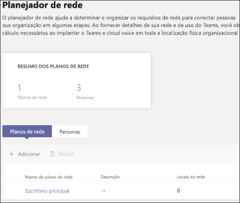
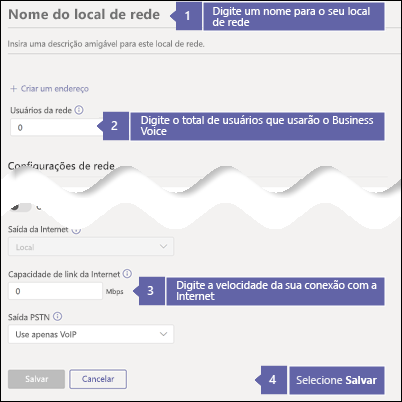
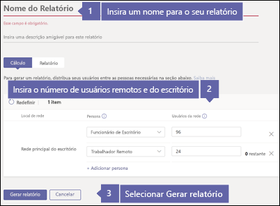
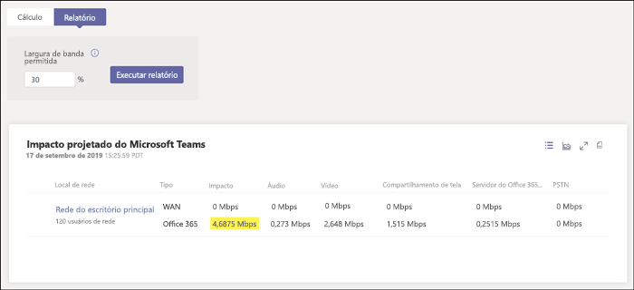

# Verifique sua conexão com a Internet para obter o Business Voice

O Business Voice está localizado na nuvem do Microsoft 365. Todo dispositivo que usa o Microsoft Teams e o Business Voice precisa de uma conexão com a Internet.

Para obter a melhor experiência do Business Voice, você precisa de uma conexão de Internet de banda larga que suporte o número máximo de chamadas telefônicas que sua organização pode fazer a qualquer momento. Você também precisa garantir que os computadores da sua rede possam acessar os servidores do Microsoft 365.

Para seguir estas etapas, você precisa ter um locatário com uma das seguintes assinaturas:

* Microsoft 365 Business Basic
* Microsoft 365 Business Standard
* Office 365 E1
* Office 365 E3
* Office 365 F1
* Microsoft 365 A1
* Microsoft 365 A3
* Microsoft 365 E3
* Microsoft 365 Business

Você não precisa de uma licença do Business Voice para seguir estas etapas.

## Verifique a velocidade da sua conexão com a Internet

Este artigo ajuda a determinar se sua conexão com a Internet é rápida o suficiente para o número de pessoas que precisam fazer chamadas telefônicas e hospedar videoconferências. Você fornecerá informações sobre sua organização e receberá um relatório que mostra quanto da sua conexão com a Internet será usada pelo Teams e Business Voice.

### Coletar informações sobre a conexão com a Internet e os usuários

Antes de começar, você precisa das seguintes informações:

* A velocidade da sua conexão com a Internet.
* Quantas pessoas usarão o Business Voice do seu escritório.
* Quantas pessoas usarão o Business Voice de um local remoto, como um escritório residencial.

### Inserir suas informações no planejador de rede

Siga estas etapas:

1. Em um navegador, vá para https://admin.teams.microsoft.com. Entre usando uma conta que tenha permissões de Administrador Global. A conta que você usou para se inscrever no Microsoft 365 ou Office 365 tem essas permissões.
2. Abra **Planejamento** e selecione **Planejador de rede**.
3. Em **Planos de rede**, selecione **Adicionar**. Digite um nome ao seu plano e selecione **Aplicar**. Seu plano de rede deve ter a seguinte aparência:

    
1. Selecione o nome do seu plano de rede. (É o **Escritório principal** na imagem acima.)
2. Na próxima página, selecione **Adicionar um site de rede** na guia **Sites de rede**.
3. Preencha somente os campos indicados na captura de tela a seguir e, em seguida, selecione **Salvar**. Deixe os outros campos na tela em branco e não selecione as opções **ExpressRoute** ou **Conectado à WAN**.

    
1. Na guia **Relatório**, selecione **Iniciar um relatório**.
1. Insira as seguintes informações e, em seguida, selecione **Gerar relatório** para criar um relatório que mostre os requisitos de largura de banda para o Teams. Mostraremos como ler o relatório na próxima seção.

    

### Encontre sua velocidade mínima de conexão com a Internet

Ao selecionar **Gerar relatório**, o Microsoft 365 ou Office 365 cria um relatório parecido com este:

O número realçado mostra o quanto da sua conexão com a Internet será usada pelo Teams e Business Voice. Recomendamos que esse número não ultrapasse 30% da velocidade total da conexão com a Internet. Por exemplo, se sua conexão com a Internet for 60 Mbps, o Teams e o Business Voice deverão usar no máximo 18 Mbps.

Use esta equação para determinar a velocidade mínima da conexão com a Internet: *\<highlighted number> / 0,3*. Com o número realçado na imagem anterior, o cálculo é *4,6875/0,3 = 15,6*. Nesse caso, a velocidade da conexão com a Internet deve ter pelo menos 15.6 Mbps.

Se o Teams e o Business Voice usarem mais de 30% da velocidade total da conexão com a Internet, o número realçado aparecerá em vermelho. Nesse caso, talvez seja necessário atualizar sua conexão com a Internet.

## Verifique se os computadores e dispositivos da rede podem acessar o Microsoft 365

Os computadores e dispositivos que usam o Business Voice devem usar portas de rede específicas para se comunicar com os servidores do Microsoft 365. Essas portas são essencialmente portas através das quais os dispositivos se comunicam através de uma rede ou da Internet. O firewall deve permitir que os dispositivos em sua rede cheguem ao Microsoft 365 através das seguintes portas de rede de *saída*:

* **Portas TCP** 80 e 443
* **Portas UDP** 3478, 3479, 3480 e 3481

A maneira mais fácil de verificar se o firewall permite a comunicação nas portas de rede é fazer uma chamada de teste no Teams:

1. Vá para https://aka.ms/getteams em um computador na rede e instale o Teams. Verifique se o computador possui alto-falantes e microfone.
2. Abra o Teams e entre usando uma conta do Microsoft 365.
3. No Teams, selecione sua foto do perfil e, em seguida, vá para **Configurações** > **Dispositivos**.
4. Em **Dispositivos de áudio**, selecione **Faça uma chamada de teste**.
5. Siga as etapas para deixar uma mensagem e reproduzi-la.

   * Se a chamada for conectada e você ouvir sua mensagem, seu firewall está configurado corretamente.
   * Se a chamada for conectada, mas você não conseguir ouvir as instruções ou a mensagem, verifique se os alto-falantes e o microfone estão configurados corretamente e tente novamente.
   * Se a chamada não se conectar ou se conectar, mas você não conseguir ouvir sua mensagem, talvez seja necessário atualizar o firewall para permitir o acesso às portas de rede necessárias. Verifique a documentação do firewall ou entre em contato com um especialista em TI para obter ajuda.

 Se você é um profissional de TI e deseja obter mais informações sobre como preparar redes maiores ou mais complexas para dar suporte ao Business Voice, confira [Avaliar meu ambiente](../3-envision-evaluate-my-environment.md). Este artigo fornece informações sobre largura de banda, requisitos de proxy e firewall e como usar a [Ferramenta de Avaliação de Rede](../3-envision-evaluate-my-environment.md#test-the-network) para testar sua rede.

