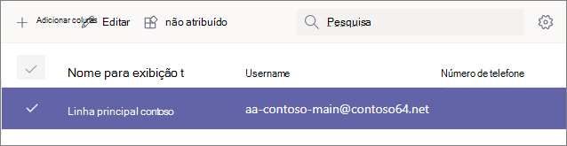

# Etapa 4: Configurar uma conta de recurso do Business Voice

As contas de recursos não são atribuídas a nenhum usuário específico. Em vez disso, as contas de recurso, que usam uma licença de usuário virtual gratuita, são usadas por dispositivos e serviços em Microsoft 365. Em Microsoft Teams, contas de recursos são atribuídas a números de telefone e são associadas a atendimentos automáticos e filas de chamadas.

Ao associar contas de recursos a atendimentos automáticos e filas de chamadas, você pode adicionar um ou mais números de telefone gratuitos ou de chamada gratuita a eles. Por exemplo, você pode associar uma conta de recurso a um número de chamada a um atendimento automático para chamadores locais. Para chamadas de longa distância, você pode associar outra conta de recurso a um número de chamada gratuita ao mesmo atendimento automático.

As seções deste artigo mostram como configurar uma conta de recurso e atribuir um número de telefone a ela. Mais tarde, você associará a conta de recurso a um atendente automático.

O vídeo a seguir mostra como concluir essas etapas no Teams de administração.

> [!VIDEO https://www.microsoft.com/videoplayer/embed/RE4OFYG]

## Obter licenças de usuário virtual

As contas de recursos exigem uma licença para trabalhar com os atendimentos automáticos e filas de chamada. Você pode usar uma licença de *Microsoft 365 Sistema de Telefonia - Usuário Virtual.*

> [!NOTE]
> Você só deverá executar as etapas a seguir se tiver se inscreveu para um período de avaliação do Business Voice. Se você comprou licenças do Business Voice, as licenças virtuais já devem ser aplicadas à sua conta. 
>
> Para ver se você já tem licenças virtuais, entre Microsoft 365 usando uma conta com permissões de administrador global. Em seguida, vá para Cobrança > [Seus produtos](https://admin.microsoft.com/Adminportal/Home#/subscriptions). Se você tiver licenças virtuais, elas aparecerão como Microsoft 365 Sistema de Telefonia **- Usuário Virtual**.

1. Abra o Centro de administração do Microsoft 365 e faça logoff com um usuário que seja um administrador global (geralmente essa é a conta que você usou para se inscrever para Microsoft 365).
2. No painel de navegação esquerdo, vá para <a href="https://admin.microsoft.com/Adminportal/Home#/catalog" target="_blank"> **Cobrança**  >  **Serviços**</a>de Compra  >  **Complementos**  >  **Consulte todos os produtos complementos**.
3. Role até o final para encontrar a licença **Microsoft 365 Sistema de Telefonia – Usuário Virtual.** Selecione **Detalhes** **e,** em seguida, Comprar .
4. Na página de compra de licença, selecione o número de licenças de usuário virtual que você deseja. Você precisa de uma licença virtual para cada atendimento automático e fila de chamada que planeja configurar. Recomendamos selecionar pelo menos cinco licenças para que você possa facilmente configurar mais atendimentos automáticos e filas de chamada no futuro sem precisar comprar mais licenças imediatamente.
5. **Desmarque Atribuir automaticamente a todos os seus usuários sem licenças**.
6. Selecione **Check-out agora**.
7. Confirme seu pedido, selecione **Próximo** e, em **seguida, Coloque o pedido**.

> [!NOTE]
> Lembre-se de que você ainda deve  **Comprar** a licença mesmo que ela tenha um custo zero.

## Criar uma conta de recurso

Depois de receber sua Microsoft 365 Sistema de Telefonia *- Licença de Usuário Virtual,* você pode criar sua conta de recurso.

1. Abra o Microsoft Teams de administração e faça logoff com um usuário que seja um administrador global (geralmente essa é a conta que você usou para se inscrever no Microsoft 365).
2. No painel de navegação esquerdo, vá para Configurações de toda a organização Contas <a href="https://admin.teams.microsoft.com/company-wide-settings/resource-accounts" target="_blank">   >  **de recursos.**</a>
3. Selecione **Adicionar**.
4. No painel **Adicionar conta de** recurso, preencha Nome **de** exibição e, em seguida, Nome de **usuário**. Escolha um nome de exibição descritivo, como "Atendimento automático de linha principal" para descrever a finalidade da conta de recurso.
5. Em **Tipo de conta de recurso,** selecione Atendimento **automático**.
6. Selecione **Salvar**.

## Atribuir uma licença

Depois de criar sua conta de recurso, você precisará atribuir uma Microsoft 365 Sistema de Telefonia *- licença* de usuário virtual *ou* Sistema de Telefonia licença.

1. Abra o Centro de administração do Microsoft 365 e faça logoff com um usuário que seja um administrador global (geralmente essa é a conta que você usou para se inscrever para Microsoft 365).
1. No painel de navegação esquerdo, vá para <a href="https://admin.microsoft.com/Adminportal/Home#/users" target="_blank"> **Usuários**  >  **Usuários ativos.**</a>
1. Selecione sua conta de recurso.
1. Na guia **Licenças e Aplicativos,** em **Licenças,** selecione **Microsoft 365 Sistema de Telefonia - Usuário Virtual**.
1. Selecione **Salvar alterações** e, em **seguida, Fechar**.

## Atribuir um número de serviço

1. Abra o Microsoft Teams de administração e faça logoff com um usuário que seja um administrador global (geralmente essa é a conta que você usou para se inscrever no Microsoft 365).
1. No painel de navegação esquerdo, vá para Configurações de toda a organização Contas <a href="https://admin.teams.microsoft.com/company-wide-settings/resource-accounts" target="_blank">   >  **de recursos.**</a>
1. Selecione a conta de recurso que você acabou de criar e clique em **Atribuir/desatribuição.**
1. Na lista **Telefone de tipos de número,** escolha **Online**.
1. Na caixa **Número de telefone atribuído,** pesquise o número que deseja usar e clique em **Adicionar**. Certifique-se de incluir o código do país (por exemplo, **+1** 250 555 0012)
1. Clique em **Salvar**.

> [!div class="nextstepaction"]
> [Próxima etapa: Atribuir números de telefone aos usuários](set-up-assign-numbers.md)
