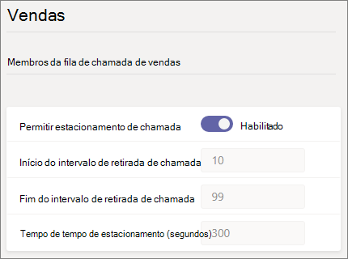
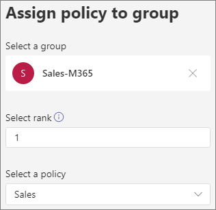

# Estacionamento e recuperação de chamadas no Microsoft Teams

Estacionamento de chamada e recuperação é um recurso que permite que um usuário coloque uma chamada em espera. Quando uma chamada é estacionada, o serviço gera um código exclusivo para recuperação de chamada. O usuário que estacionou a chamada ou outra pessoa pode usar esse código com um aplicativo ou dispositivo com suporte para recuperar a chamada. (Consulte [Park a call in Teams](https://support.office.com/article/park-a-call-in-teams-8538c063-d676-4e9a-8045-fc3b7299bb2f) para obter detalhes.)

Alguns dos cenários comuns para o uso do estacionamento de chamada são:

- Uma recepcionista estaciona uma chamada para alguém que trabalha em uma fábrica. Em seguida, a recepcionista anuncia a chamada e o número de código no sistema de endereços público. O usuário para quem a chamada é pode, em seguida, escolher um telefone Teams no piso da fábrica e inserir o código para recuperar a chamada.
- Um usuário estaciona uma chamada em um dispositivo móvel porque a bateria do dispositivo está ficando sem energia. Em seguida, o usuário pode inserir o código para recuperar a chamada de um telefone Teams de mesa.
- Um representante de suporte estaciona uma chamada do cliente e envia um comunicado em um canal Teams para um especialista recuperar a chamada e ajudar o cliente. Um especialista inssi o código em Teams clientes para recuperar a chamada

Para estacionar e recuperar chamadas, um usuário deve ser Enterprise Voice usuário e deve ser incluído em uma política de estacionamento de chamadas.

> [!NOTE]
> O estacionamento de chamada e a recuperação só estão disponíveis [Teams](teams-and-skypeforbusiness-coexistence-and-interoperability.md) modo de implantação somente e não são suportados em telefones IP Skype for Business ip.

## Configurar estacionamento de chamada e recuperar

Você deve ser um administrador Teams para configurar o estacionamento de chamada e recuperar. Ele está desabilitado por padrão. Você pode habilita-lo para usuários e criar grupos de usuários usando a política de estacionamento de chamada. Quando você aplica a mesma política a um conjunto de usuários, eles podem estacionar e recuperar chamadas entre si.

Por padrão, o intervalo de números de retirada de chamada é de 10 a 99. Você também pode criar seu próprio intervalo personalizado entre 10-9999. A primeira chamada estacionada será renderizada um código de retirada do início do intervalo (por exemplo, 10). A próxima chamada estacionada será renderizada com um código de retirada incrementado em 1; ou seja, 11 e assim por diante, até o final do intervalo ser renderizado como um código de retirada. Depois disso, os códigos de retirada renderizados começam de novo desde o início do intervalo mais uma vez. 

Você pode especificar um tempo máximo como o número de segundos a ser aguardado antes de tocar de volta quando a chamada estacionada não foi a escolhida. O intervalo permitido é de 120 a 1800 segundos e o valor padrão é 300 segundos.

Para definir o intervalo de estacionamento personalizado e o tempo de tempo de estacionamento, use os cmdlets New e Set-CsTeamsCallParkPolicy disponíveis no Módulo 2.6.0 do PowerShell Teams ou posterior. (Alterações personalizadas de intervalo de estacionamento e tempo de tempo de estacionamento não podem ser gerenciadas no centro de administração Teams de estacionamento. Observe que o Teams de administração continuará a mostrar os valores padrão.)

Para habilitar uma política de estacionamento de chamada:

1. Na navegação à esquerda do centro de administração Microsoft Teams, vá para **Políticas**  >  **de estacionamento de Chamada de Voz**.
2. Na guia **Gerenciar políticas,** clique em **Adicionar**.
3. Dê um nome à política e **alterne Permitir** estacionamento de chamada para **On**. (O intervalo de retirada de chamada e o tempo de saída não podem ser personalizados.)

    

4. Selecione **Salvar**.

Você pode editar a política selecionando-a na lista e clicando em **Editar**.

Para que a política funcione, ela deve ser atribuída aos usuários. Você pode [atribuir a política aos usuários individualmente](assign-policies-users-and-groups.md) ou atribuí-la a um grupo.

Para atribuir uma política de estacionamento de chamada a um grupo

1. Na página **Políticas de estacionamento de** chamada, na guia Atribuição de **política** de grupo, clique em **Adicionar grupo**.
2. Pesquise o grupo que você deseja usar e clique em **Adicionar**.
3. Escolha uma classificação em comparação com outras atribuições de grupo.
4. Em **Selecionar uma política,** escolha a política à qual você deseja atribuir esse grupo.

    

5. Selecione **Aplicar**.

## Tópicos relacionados

[Estae uma chamada no Teams](https://support.office.com/article/park-a-call-in-teams-8538c063-d676-4e9a-8045-fc3b7299bb2f)

[Atribuir políticas aos usuários no Microsoft Teams](policy-assignment-overview.md)

[New-CsTeamsCallParkPolicy](/powershell/module/skype/new-csteamscallparkpolicy)

[Set-CsTeamsCallParkPolicy](/powershell/module/skype/set-csteamscallparkpolicy)

[Grant-CsTeamsCallParkPolicy](/powershell/module/skype/grant-csteamscallparkpolicy)
