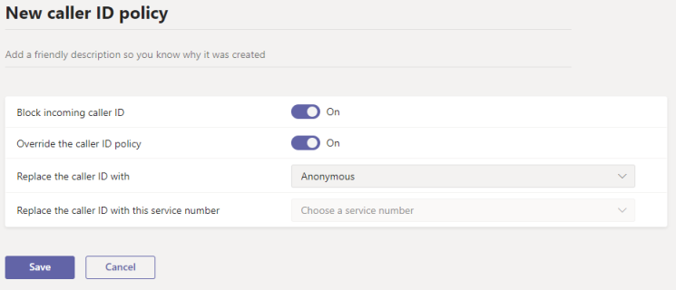

# Gerenciar políticas de identificação de chamadas no Microsoft Teams

> [!NOTE]
> Para definir a ID do chamador como um número de telefone da conta de recurso e definir o nome da parte de chamada, use os cmdlets do PowerShell New-CsCallingLineIdentity ou Set-CsCallingLineIdentity no módulo 2.3.1 do Teams PowerShell ou posterior. (Essas opções não estão disponíveis no Microsoft Teams de administração.) 

Por padrão, quando um Teams faz uma chamada para um telefone PSTN, o número de telefone do Teams usuário fica visível. Da mesma forma, quando um chamador PSTN faz uma chamada para um usuário Teams, o número de telefone do chamador PSTN fica visível.

Como administrador, você pode usar políticas de ID do chamador para alterar ou bloquear a ID do chamador (também conhecida como ID de linha de chamada). Você pode usar políticas de ID do chamador para exibir um número de telefone alternativo para usuários Teams sua organização, bloquear o número de telefone de saída, impedir que um número de entrada seja exibido ou definir o Nome da Parte de Chamada (CNAM). Por exemplo, quando um usuário faz uma chamada, você pode alterar a ID do chamador para exibir o número de telefone principal e o nome da empresa da sua organização, em vez do número de telefone do usuário.

Você gerencia políticas de ID do chamador indo para **políticas** de ID do Chamador de Voz no centro de administração  >   Microsoft Teams de voz. Você pode usar a política global (padrão para toda a organização) ou criar e atribuir políticas personalizadas. Os usuários em sua organização obterão automaticamente a política global, a menos que você crie e atribua uma política personalizada.

## Criar uma política de ID do chamador personalizado

1. Na navegação à esquerda do centro de administração Microsoft Teams, vá para **Políticas** de  >  **ID do Chamador de Voz.**
2. Clique em **Adicionar**.  

3. Insira um nome e uma descrição para a política.
4. A partir daqui, escolha as configurações que você deseja:

    - **Bloquear a ID do chamador** de entrada: a opção Ativar essa configuração para impedir que a ID do chamador de chamadas de entrada seja exibida.
    - **Substituir a política** de ID do chamador : ativação dessa configuração para permitir que os usuários substituam as configurações na política em relação à exibição do número para os chamador ou não. Isso significa que os usuários podem escolher se exibirão a ID do chamador. Para obter mais informações, [consulte End user control of outbound caller ID](./how-can-caller-id-be-used-in-your-organization.md#end-user-control-of-outbound-caller-id).
    - **Substitua a ID do chamador por**: De definir a ID do chamador a ser exibida para os usuários selecionando um dos seguintes:

        - **Número do usuário**: Exibe o número do usuário. 
        - **Número de** serviço : Permite definir um número de telefone de serviço a ser exibido como a ID do chamador.
        - **Anônimo**: exibe a ID do chamador como Anônima.

    - **Substitua a ID do chamador por esse número de** serviço : escolha um número de serviço para substituir a ID do chamador dos usuários. Essa opção estará disponível se você selecionou **Número de serviço** em Substituir a **ID do chamador por**.

5. Clique em **Salvar**.

## Editar uma política de ID do chamador

Você pode editar a política global ou quaisquer políticas personalizadas que você criar. 

1. Na navegação à esquerda do centro de administração Microsoft Teams, vá para **Políticas** de  >  **ID do Chamador de Voz.**
2. Selecione a política clicando à esquerda do nome da política e, a seguir, clique em **Editar**.
3. Altere as configurações que você deseja e clique em **Salvar**.

## Atribuir uma política de ID de chamador personalizada aos usuários

[!INCLUDE [assign-policy](includes/assign-policy.md)]

## Tópicos relacionados

[New-CsCallingLineIdentity](/powershell/module/skype/new-cscallinglineidentity)

[Set-CsCallingLineIdentity](/powershell/module/skype/set-cscallinglineidentity)

[Atribua políticas a seus usuários no Teams](policy-assignment-overview.md)