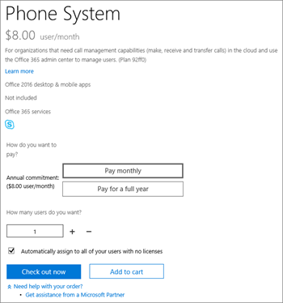

# Planos de chamadas para o Microsoft 365

As chamadas para outros usuários do Skype for Business e do Microsoft Teams são gratuitas, mas se você quiser que os usuários possam ligar para telefones regulares e ainda não tiver um provedor de serviços para fazer chamadas de voz, você precisará comprar um Plano de Chamadas. Para obter mais informações, consulte [Sistema de Telefonia e Planos de Chamadas](calling-plan-landing-page.md).
  
Aqui estão as opções de Planos de Chamadas:
  
- **Plano de Chamadas Domésticas**: os usuários licenciados podem chamar números localizados no país/região em que estão atribuídos no Microsoft 365. Minutos de entrada ilimitados são incluídos. Os minutos de saída são incluídos com base na licença adquirida.

- **Plano** de Chamadas Internacionais: os usuários licenciados podem chamar números localizados no país/região em que sua licença do Microsoft 365 é atribuída ao usuário com base na localização do usuário e para números internacionais em [196 países/](country-and-region-availability-for-audio-conferencing-and-calling-plans/users-can-make-outbound-calls-to-these-countries-and-regions.md)regiões. Minutos de entrada ilimitados são incluídos. Os minutos de saída são incluídos com base na licença adquirida.

- Plano de Chamadas Pagas Conforme o **Uso: os** usuários licenciados podem chamar números localizados no país/região em que sua licença do Microsoft 365 é atribuída ao usuário com base na localização do usuário e para números internacionais em  [196 países/](country-and-region-availability-for-audio-conferencing-and-calling-plans/users-can-make-outbound-calls-to-these-countries-and-regions.md)regiões. Minutos de entrada ilimitados são incluídos. Nenhum minuto de saída está incluído. Todas as chamadas de saída são cobradas com base nos minutos usados, seja com créditos de comunicação ou cobrança pós-pagamento.

Todos os usuários no mesmo país/região (esse é o local do país do usuário definido na área de licenciamento do Centro de administração do Microsoft 365) com o mesmo Plano de Chamadas compartilham um pool de minutos. Por exemplo, se você tiver 100 usuários localizados no mesmo país/região com um Plano de Chamadas Domésticas de 120 minutos atribuído, eles compartilharão um pool de 12.000 minutos. Todas as chamadas que excederem esses minutos são cobradas por minuto.

Visite [a disponibilidade de país e](country-and-region-availability-for-audio-conferencing-and-calling-plans/country-and-region-availability-for-audio-conferencing-and-calling-plans.md) região para saber mais sobre minutos mensais disponíveis para cada organização em cada país/região.
  
> [!IMPORTANT]
> O país/região baseia-se na localização da licença do usuário nos **usuários Centro de administração do Microsoft 365** >  **Active** e **NÃO** no endereço de cobrança listado no Perfil da Organização no **Centro de administração do Microsoft 365.**

> [!NOTE]
> O pooling só está disponível em planos de chamada idênticos.

  
Para obter informações detalhadas sobre limites de uso e termos de uso, consulte o período de discagem gratuita da [Audioconferência](complimentary-dial-out-period.md).
  
## Como comprar um plano de chamadas

1. Primeiro, você deve comprar **uma licença de complemento do Sistema de Telefonia**. Para fazer isso, [entre no Centro de administração do Microsoft 365 e escolha](https://go.microsoft.com/fwlink/p/?linkid=868433) >  > **Assinaturas** de Complemento de Serviços de Compra de Cobrança compram  > **agora**.

    
  
    > [!NOTE]
    > Dependendo do seu plano, talvez seja necessário comprar mais complementos antes de comprar licenças do Sistema de Telefonia. Para saber mais, confira [o licenciamento de complemento do Microsoft Teams](./teams-add-on-licensing/microsoft-teams-add-on-licensing.md).
  
2. Depois de comprar licenças do Sistema de Telefonia, você pode comprar o Plano de Chamadas entrando no [Centro de administração do Microsoft 365](https://go.microsoft.com/fwlink/p/?linkid=868433) >  >  e escolher **assinaturas** de Complemento de Serviços de Compra de Cobrança e, em seguida, selecionando **Comprar agora**. Você verá os Planos de Chamadas lá.

Você pode comprar e atribuir diferentes Planos de Chamadas a diferentes usuários, dependendo das necessidades da sua organização. Depois de selecionar o Plano de Chamadas necessário, prossiga para o check-out. Você atribui um plano a cada usuário no Centro de administração do Microsoft 365. Para saber como, confira [Atribuir licenças de complemento do Microsoft Teams](./teams-add-on-licensing/microsoft-teams-add-on-licensing.md).
  
## Você tem um provedor de serviços que fornece conectividade PSTN local para usuários híbridos?

Nesse caso, você não precisa comprar um Plano de Chamadas. Office 365 Enterprise E5 inclui o complemento **Sistema** de Telefonia, para que você possa prosseguir para o check-out.
  
Em seguida, atribua as licenças de complemento Enterprise E5 ou **Sistema** de Telefonia aos usuários no Centro de administração do Microsoft 365. Para saber como, confira [Atribuir licenças de complemento do Microsoft Teams](./teams-add-on-licensing/microsoft-teams-add-on-licensing.md).
  
## Informações de preços

- [Preços para Planos de Chamadas e Sistema de Telefonia](https://www.microsoft.com/microsoft-365/microsoft-teams/voice-calling)
- [Preços de Audioconferência](https://www.microsoft.com/microsoft-365/microsoft-teams/online-meetings)

## Para obter mais informações

Aqui estão mais artigos que explicam como configurar seus Planos de Chamadas:
  
- [Configurar Planos de Chamadas](set-up-calling-plans.md)
- [Licenciamento do complemento do Microsoft Teams](./teams-add-on-licensing/microsoft-teams-add-on-licensing.md)
- [Veja o que você obtém com o Sistema de Telefonia no Microsoft 365 ou Office 365](./here-s-what-you-get-with-phone-system.md)

## Artigos relacionados

- [Instalar o Skype for Business Online](/SkypeForBusiness/set-up-skype-for-business-online/set-up-skype-for-business-online)
- [Configurar a Caixa Postal na Nuvem - Ajuda da administração](set-up-phone-system-voicemail.md)
- [Configurar Planos de Chamadas](set-up-calling-plans.md)
- [Adicionar fundos e gerenciar Créditos de Comunicação](add-funds-and-manage-communications-credits.md)
