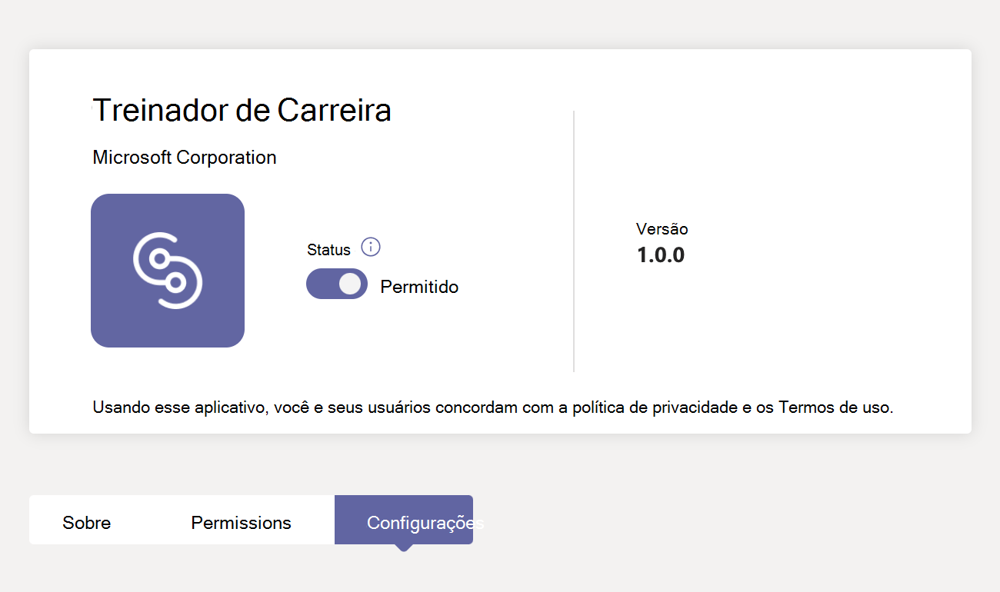
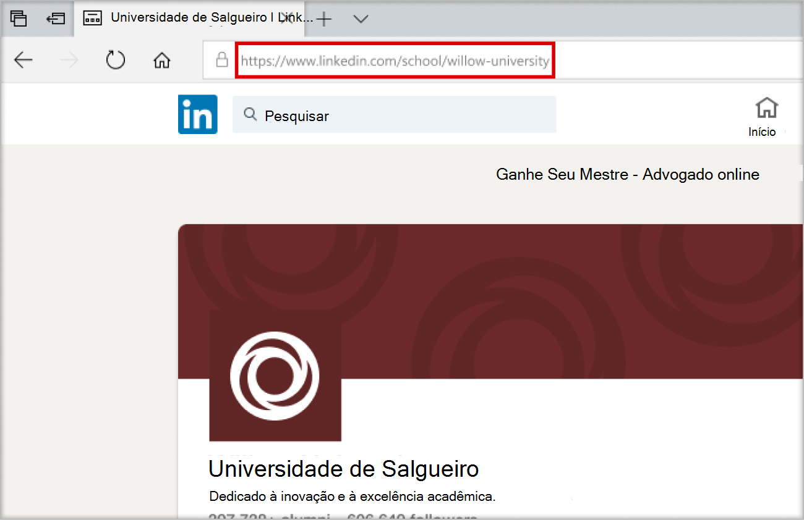
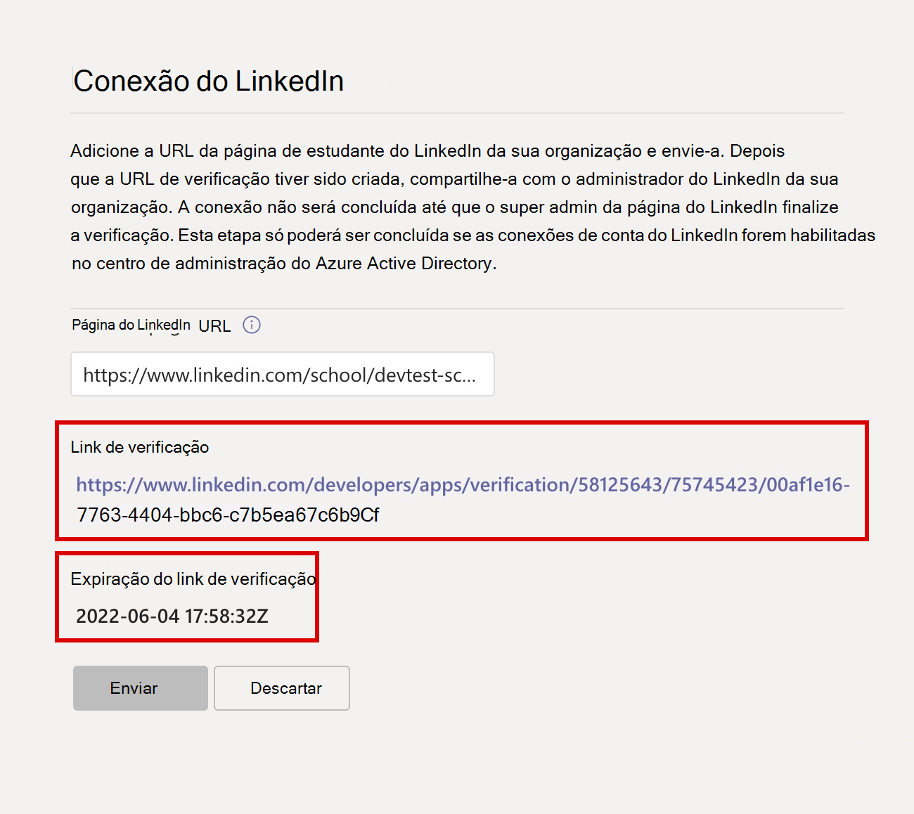
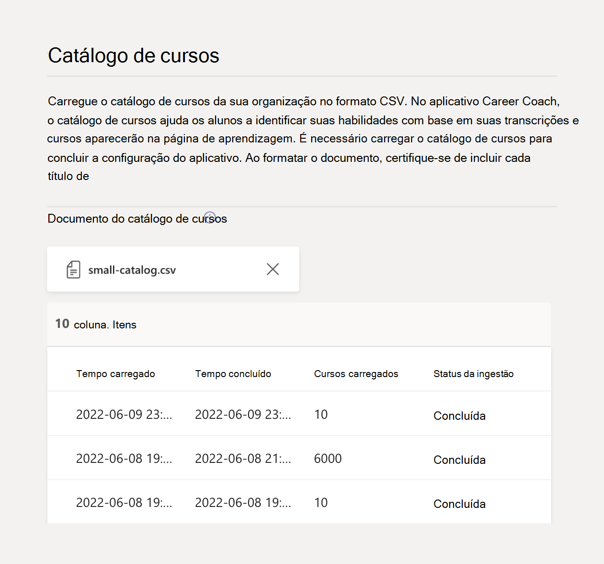

# Configurar e configurar o Career Coach para Microsoft Teams

Este artigo é para que os administradores de TI da educação aprendam a configurar o Career Coach para Microsoft Teams.

As principais etapas para configurar, configurar e liberar o Career Coach são:

1. [Etapa 1: preparar seu locatário para o Career Coach](#step-1-prepare-your-microsoft-365-tenant-for-career-coach).
1. [Etapa 2: Comprar licenças do Career Coach](#step-2-purchase-career-coach-licenses).
1. [Etapa 3: Acessar configurações do Career Coach](#step-3-access-the-career-coach-app-settings).
1. [Etapa 4: configurar configurações do Career Coach](#step-4-configure-career-coach-settings).
1. [Etapa 5: disponibilizar o Career Coach para sua instituição](#step-5-make-career-coach-available-to-your-institution).

## Identificar funções e permissões

A configuração do Career Coach requer vários tipos de funções de administrador. Essas funções e permissões podem ser atribuídas a um indivíduo ou podem exigir colaboração com profissionais de TI em sua instituição de ensino. Use a lista de verificação abaixo para identificar os indivíduos necessários para concluir as tarefas referenciadas.

Você pode verificar as funções atribuídas da sua conta visitando os [usuários Centro de administração do Microsoft 365 > usuários > usuários ativos](https://go.microsoft.com/fwlink/p/?linkid=834822) > Selecione seu nome de usuário para confirmar sua função.

Saiba mais sobre [funções de administrador no Centro de administração do Microsoft 365](/microsoft-365/admin/add-users/about-admin-roles).

### [Centro de administração do Microsoft 365 tarefas](https://go.microsoft.com/fwlink/p/?linkid=2024339)

Função: [Administrador Global](/azure/active-directory/roles/permissions-reference#global-administrator)

Tarefas do Coach de Carreira:

- [Comprar licenças](#step-2-purchase-career-coach-licenses).
- [Atribuir licenças](#assign-career-coach-licenses-to-users).

### [Tarefas do centro de administração do Azure Active Directory](https://go.microsoft.com/fwlink/p/?linkid=2067268)

Função: [Administrador Global](/azure/active-directory/roles/permissions-reference#global-administrator)

Tarefa do Coach de Carreira:

- [Ative as conexões da conta do LinkedIn](#turn-on-linkedin-account-connections).

### [Tarefas do centro de administração do Teams](https://admin.teams.microsoft.com/dashboard)

Função: [Administrador do Teams](/azure/active-directory/roles/permissions-reference#teams-administrator)

Tarefas do Coach de Carreira:

- [Adicione o Career Coach como um aplicativo instalado](#add-career-coach-as-an-installed-app).
- [Configure as configurações do aplicativo Career Coach](#step-4-configure-career-coach-settings).
- [Configurar políticas](#identify-roles-and-permissions).
- [Fixar o aplicativo](#identify-roles-and-permissions).

### Tarefas do portal do desenvolvedor do LinkedIn

Função: [Página da Escola do LinkedIn Super Administração](https://www.linkedin.com/help/linkedin/answer/a541981)

Tarefa do Coach de Carreira:

- [Verifique a Página da Escola do LinkedIn](#verify-the-linkedin-school-page).

## Preparar-se para o Career Coach

Antes de configurar e configurar o Career Coach, siga estas etapas de preparação.

1. [Etapa 1: preparar seu locatário para o Career Coach](#step-1-prepare-your-microsoft-365-tenant-for-career-coach).
1. [Etapa 2: Comprar licenças do Career Coach](#step-2-purchase-career-coach-licenses).

### Etapa 1: preparar seu locatário Microsoft 365 para o Career Coach

#### Ativar conexões de conta do LinkedIn

Há duas maneiras pelas quais as conexões de conta do LinkedIn são usadas pelo Career Coach:

- Para permitir que alunos, professores e funcionários conectem suas Microsoft conta 365 à conta do LinkedIn e [enviem convites do LinkedIn do Career Coach](https://support.microsoft.com/topic/career-coach-quick-start-guide-for-students-c419db47-9290-4961-9684-c3f86a9b3708#bkmk_connect_your_linkedin_account).
- Para ativar os recursos [Criar sua Rede](https://support.microsoft.com/topic/career-coach-quick-start-guide-for-students-c419db47-9290-4961-9684-c3f86a9b3708#bkmk_build_your_network) e [Explorar Carreiras](https://support.microsoft.com/topic/career-coach-quick-start-guide-for-students-c419db47-9290-4961-9684-c3f86a9b3708#bkmk_discover_your_career_path) usando dados de ex-alunos públicos do LinkedIn.

Para ativar as conexões da conta do LinkedIn:

1. Entre no [centro de administração Azure AD](https://go.microsoft.com/fwlink/p/?linkid=2067268) com [uma conta de administrador global](#identify-roles-and-permissions) para a organização Azure AD.

2. Selecione **Usuários**.

3. Na página **Usuários** , selecione **Configurações de usuário**.

4. **As conexões de conta do LinkedIn devem ser definidas** como **Grupo Sim** ou **Selecionado** para Coach de Carreira a ser configurado corretamente.

   - Selecione **Sim** para ativar o serviço para todos os usuários em sua instituição de ensino.
   - Selecione **Grupo selecionado** para ativar o serviço para apenas um grupo de usuários selecionados em sua instituição de ensino.

Para obter mais informações, confira [Conexões de conta do LinkedIn no Azure Active Directory](/azure/active-directory/enterprise-users/linkedin-integration).

> [!NOTE]
> Nenhum dado é compartilhado sem o consentimento do usuário.

#### Permitir aplicativos Microsoft no Teams

O Career Coach é um aplicativo Microsoft e, portanto, ele deve ser permitido nas políticas de permissão do aplicativo teams.

1. Entre no **[centro de administração do Teams](https://go.microsoft.com/fwlink/p/?linkid=2066851)**.

2. Na navegação à esquerda, selecione **[Políticas de permissão](https://admin.teams.microsoft.com/policies/manage-apps)** **de aplicativos** >  do Teams.

3. Selecione sua política preferencial.
    1. Se você não tiver certeza de qual política usar, consulte a  [Microsoft documentação](policy-packages-edu.md) de gerenciamento de políticas do Teams ou use o [assistente](easy-policy-setup-edu.md) de política de educação para configurar uma política para Microsoft Teams.

Saiba mais sobre [como configurar políticas de permissão](teams-app-permission-policies.md).

#### Adicionar o Career Coach como um aplicativo instalado

Esta etapa garante que o Career Coach esteja configurado corretamente para sua instituição e os alunos possam encontrar o Career Coach.

1. Entre no [centro de administração do Teams](https://go.microsoft.com/fwlink/p/?linkid=2066851).

2. Selecione **Políticas de instalação** de **aplicativos** > do Teams e selecione sua política preferida.
    1. Se você não tiver certeza de qual política usar, consulte a  [Microsoft documentação](policy-packages-edu.md) de gerenciamento de políticas do Teams ou use o [assistente](easy-policy-setup-edu.md) de política de educação para configurar uma política para Microsoft Teams.

3. Em **Aplicativos instalados**, selecione  **+ Adicionar aplicativos**.

4. No painel **Adicionar aplicativos instalados** , pesquise os aplicativos que você deseja instalar automaticamente para os usuários quando eles iniciarem o Teams. Você também pode filtrar aplicativos por política de permissão de aplicativo.

5. Quando você tiver escolhido sua lista de aplicativos, selecione **Adicionar**.

6. Selecione  **Salvar** > **Confirmar**.

Editar ou atribuir uma política pode levar algumas horas para que as alterações entrem em vigor. O Career Coach não estará disponível no Microsoft Teams até que as alterações sejam concluídas.

### Etapa 2: Comprar licenças do Career Coach

#### Tipos de licença

O Career Coach requer uma licença para acessar o aplicativo.

Há dois tipos de licença disponíveis.

- A **licença Student** foi projetada para alunos.
- A **licença do Corpo docente** foi projetada para professores, funcionários e profissionais de TI envolvidos no apoio aos alunos com o Career Coach.
  - Uma **licença do Career Coach Faculty** deve ser atribuída ao administrador de TI que conclui a configuração.

#### Licenças de compra

O Career Coach está disponível em todo o mundo (exceto China e Rússia) para instituições de ensino qualificadas como uma licença de complemento por meio de Registro para Soluções de Educação (EES), Provedores de Serviços de Nuvem (CSP) e Centro de administração do Microsoft 365 (web direct).

Como um aplicativo Microsoft Teams, o locatário deve ter Microsoft 365 A3/A5 ou Office 365 A1/A3/A5 para comprar a licença do Coach de Carreira complementar. Licenças separadas são oferecidas para alunos e usuários do corpo docente.

#### Inscrever-se para uma avaliação gratuita

Uma avaliação gratuita padrão de 90 dias está disponível para 25 alunos e 25 licenças de professor. Uma avaliação está disponível por locatário qualificado. As licenças de avaliação podem ser ativadas de Centro de administração do Microsoft 365 por locatários qualificados para comprar licenças do Career Coach.

Para ativação de avaliação, entre [em Centro de administração do Microsoft 365 > Cobrança > Comprar serviços > procurar o Career Coach](https://go.microsoft.com/fwlink/p/?linkid=868433) para encontrar a [avaliação da licença estudantil](https://signup.microsoft.com/signup?OfferId=b3a40ff2-3d0d-481e-a0ed-f4de1069f201) e a [avaliação da licença do professor](https://signup.microsoft.com/signup?OfferId=6f6e7db5-b9ab-4baa-86be-f13d0ae6a2c8).

## Configurar e configurar configurações do Career Coach

Para configurar e configurar as configurações do Career Coach para sua instituição, siga estas etapas.

1. [Etapa 3: acesse as configurações do aplicativo Career Coach](#step-3-access-the-career-coach-app-settings).
1. [Etapa 4: configurar configurações do Career Coach](#step-4-configure-career-coach-settings).

### Etapa 3: Acessar as configurações do aplicativo Career Coach

Para configurar as configurações do Career Coach e permitir que elas sejam usadas para usuários, você deve ser um administrador global ou administrador de serviço do Teams para acessar a página.

1. Entre no [centro de administração do Teams](https://go.microsoft.com/fwlink/p/?linkid=2066851).
2. Na navegação à esquerda, selecione Aplicativos  > **do Teams** **Gerenciar aplicativos**.
3. Pesquise ou navegue pelo **Career Coach**.
4. Selecione **Coach de Carreira** e **, em seguida, Configurações**.

### Etapa 4: configurar configurações do Career Coach

As seguintes configurações do Career Coach podem ser configuradas para alunos, professores e funcionários.

- [Conexão do LinkedIn](#linkedin-connection-required) (necessária)
- [Marca e preferências](#brand-and-preferences-optional) (opcional)
- [Catálogo de cursos](#course-catalog-optional) (opcional)
- [Campos de estudo](#fields-of-study-optional) (opcional)
- [Opções de personalização](#customization-options-optional) (opcional)

#### Conexão do LinkedIn (necessária)

A configuração de conexão do LinkedIn conecta o Career Coach com dados de ex-alunos públicos da Página da Escola do LinkedIn da sua instituição.

Essa etapa só poderá ser concluída se as [conexões da conta do LinkedIn estiverem habilitadas no Azure Active Directory](#turn-on-linkedin-account-connections). A configuração de conexão do LinkedIn ativa os recursos [Criar sua Rede](https://support.microsoft.com/topic/career-coach-quick-start-guide-for-students-c419db47-9290-4961-9684-c3f86a9b3708#bkmk_build_your_network) e [Explorar Carreiras](https://support.microsoft.com/topic/career-coach-quick-start-guide-for-students-c419db47-9290-4961-9684-c3f86a9b3708#bkmk_discover_your_career_path) .

> [!IMPORTANT]
> Esta é uma seção necessária. O Coach de Carreira não pode ser ativado sem a conexão da Página da Escola do LinkedIn verificada.
>
> A conexão do LinkedIn dá suporte a vários locatários.

##### Adicionar a URL da Página da Escola do LinkedIn

O processo de adição da URL da Página da Escola do LinkedIn é tratado por um Administrador do Teams. A etapa subsequente de verificar a URL é concluída pelo super administrador da Página Da Escola do LinkedIn da instituição de ensino.

1. Entre no **[centro de administração do Teams](https://go.microsoft.com/fwlink/p/?linkid=2066851)**.

2. Selecione Aplicativos  > **do Teams****Gerenciar aplicativos** > **Configurações** > **do Coach** >  de Carreira **Conexão LinkedIn**.

3. Selecione **Conectar ao LinkedIn**.

4. Localize a Página da Escola do LinkedIn da sua instituição pesquisando no LinkedIn e selecionando o filtro **Escola** . Ou conecte-se com um membro da equipe de marketing em sua instituição para determinar a Página Correta da Escola do LinkedIn a ser usada. Para obter mais informações, consulte [Como identificar páginas do LinkedIn](https://www.linkedin.com/help/linkedin/answer/40133/differences-between-a-linkedin-page-for-a-school-and-company?lang=en).

    

5. Adicione a **URL da Página da Escola do LinkedIn**. A URL deve ser uma *página da escola*, não uma *página da empresa* e normalmente é formatada como `https://www.linkedin.com/school/willow-university/`.

   

6. Selecione **Enviar**.

7. Depois que a **URL da Página da Escola do LinkedIn** for enviada com êxito, a página de configurações será atualizada para mostrar o link   **verificação** e  **a expiração do link de verificação**. O link de verificação expira após 30 dias.

8. Copie o **link Verificação** e compartilhe-o com o super administrador da Página Da Escola do LinkedIn da sua instituição de ensino.

9. O Super administrador da Página da Escola do LinkedIn usará o link de verificação exclusivo para [verificar a Página da Escola do LinkedIn](#verify-the-linkedin-school-page) e associá-la ao Career Coach.

10. Para confirmar se a verificação e as configurações foram enviadas com êxito, verifique se o [status de configuração do Career Coach](#configuration-status) está marcado **como Concluído**.

##### Verificar a Página da Escola do LinkedIn

A verificação da Página da Escola do LinkedIn deve ser concluída pelo [super administrador da Página da Escola do LinkedIn](https://www.linkedin.com/help/linkedin/answer/a541981) da sua instituição de ensino.

Você pode verificar as funções de administrador da sua conta do LinkedIn entrando no LinkedIn e visitando a Página da Escola do LinkedIn da sua instituição de ensino. Se sua conta receber uma função de Administrador Super, você verá o **modo de exibição super administrador** listado ao lado do nome da instituição de ensino na página linkedIn. Se você não vir a marca **de exibição do Super administrador** , não será um super administrador para a página da sua escola.

1. Depois que a **URL da Página da Escola do LinkedIn** for enviada pelo administrador do Teams, a página mostrará o **link verificação** e **a expiração do link de verificação**. O link de verificação expira após 30 dias.

     

2. Copie o link de verificação e compartilhe-o com o super administrador da Página da Escola do LinkedIn.

3. A página do LinkedIn Super administrador abrirá o link de verificação para associar o Career Coach à página da sua escola. Para obter mais informações, confira [Documentação adicional sobre a verificação de página do LinkedIn](https://www.linkedin.com/help/linkedin/answer/102672).

4. Depois que a verificação for concluída, o administrador do Teams poderá exibir se as configurações foram enviadas com êxito verificando se o [status de configuração do Career Coach](#configuration-status) está marcado **como Concluído**.

   

#### Marca e preferências (opcional)

Personalize o Career Coach para corresponder à marca da sua instituição de ensino. Você é responsável por respeitar os direitos dos outros, incluindo direitos autorais e de marca registrada.

1. Entre no **[centro de administração do Teams](https://go.microsoft.com/fwlink/p/?linkid=2066851)**.

2. Selecione Aplicativos  > **do Teams****Gerenciar aplicativos** > **Configurações** > **do Career Coach** > **Editar marca e preferências**.

3. Em **Branding**, adicione **Nome da organização**.

4. Carregue o **ícone Organização**. O ícone é usado em todo o Career Coach para identificar conteúdo exclusivo para sua instituição de ensino, recursos de catálogo de cursos em todo o aplicativo e na seção experiências do mundo real do painel.

    O ícone é melhor formatado como:

    - Um PNG transparente
    - Proporção de 1:1
    - Tamanho máximo de 64 px x 64 px

5. Carregue a **imagem da miniatura de conteúdo de aprendizagem**. A miniatura será usada para recursos de aprendizagem do catálogo de cursos em todo o aplicativo quando uma imagem específica não for especificada para um curso oferecido por sua instituição de ensino.

    A miniatura é melhor formatada como:

    - Um PNG
    - Proporção de 16:9
    - Tamanho máximo de 360 px x 200 px

6. Esta etapa é opcional. Adicione a **URL da política de privacidade da organização**. Se adicionada, a política de privacidade da instituição estará disponível para os alunos revisarem no Career Coach.

7. Selecione **Enviar**.

8. Para confirmar se as configurações foram enviadas com êxito, verifique [o status de configuração do Career Coach](#configuration-status) para **Concluir**.

#### Catálogo de cursos (opcional)

O catálogo de cursos registra os cursos e as aulas oferecidos por sua instituição de ensino.

O Career Coach usa dados do catálogo de cursos para identificar as habilidades de um aluno a partir de sua transcrição e sugerir cursos a serem feitos.

Esses cursos são usados no Career Coach em duas áreas:

- Os cursos são retornados como parte dos [recursos de aprendizagem](https://support.microsoft.com/topic/career-coach-quick-start-guide-for-students-c419db47-9290-4961-9684-c3f86a9b3708#bkmk_grow_real_world_skills).  

- Cursos e metadados de curso, como títulos de curso e descrições, são usados para ajudar os alunos a identificar suas habilidades ao [carregar uma transcrição](https://support.microsoft.com/topic/career-coach-quick-start-guide-for-students-c419db47-9290-4961-9684-c3f86a9b3708#bkmk_Set_up_your_profile).

Para criar o catálogo de cursos, crie uma lista de todos os cursos ministrados em sua instituição de ensino e carregue-o como um arquivo CSV usando o [formato e o esquema do catálogo de cursos](#course-catalog-document-format-and-schema).

Comece com o documento do catálogo  de [cursos de exemplo](https://aka.ms/career-coach/docs/it-admins/sample-catalog)para garantir a formatação adequada.Você também pode fazer referência às seções [de formato de documento e esquema do catálogo de cursos](#course-catalog-document-format-and-schema) para obter detalhes sobre campos necessários e recomendados.

##### Adicionar o catálogo de cursos

1. Entre no **[centro de administração do Teams](https://go.microsoft.com/fwlink/p/?linkid=2066851)**.

2. Selecione Aplicativos  > **do Teams****Gerenciar aplicativos** >**Catálogo de** **cursos de Configurações** >  do Search **Career Coach** > .

3. Selecione **Carregar Catálogo de Cursos** > Carregar cursos no formato CSV com as colunas necessárias: courseId, title e sourceLink.
    1. Cada linha deve incluir dados para cada uma das colunas necessárias.
    1. *Incluir os campos recomendados melhora a experiência dos alunos retornando melhores resultados de pesquisa e identificação de habilidades.*

4. Uma visualização de uma seção do catálogo de cursos carregado será exibida para sua referência.

5. Selecione **Enviar** quando estiver pronto.

6. O [status do documento carregado](#course-catalog-status) é mostrado na página de configurações.

7. Para confirmar se as configurações foram enviadas com êxito, verifique se o [status de configuração do Career Coach](#configuration-status) está marcado **como Concluído**.

Para carregar um novo arquivo, verifique se o último arquivo está limpo selecionando (**X**) para fechar a visualização do documento. Essa ação permitirá que o botão **Carregar** seja exibido novamente.

##### Formato e esquema do catálogo de cursos

O documento precisa estar no formato CSV com um tamanho máximo de 18 MB. Arquivos grandes devem ser divididos em vários arquivos menores que incluem um máximo de 15.000 linhas para processamento bem-sucedido.

O documento deve conter os metadados de curso necessários: **título do curso**,  **ID do curso** e  **URL do curso**.

Comece com o documento do [catálogo de cursos de exemplo]( https://aka.ms/career-coach/docs/it-admins/sample-catalog) para garantir a formatação adequada. *Incluir os campos recomendados melhora a experiência dos alunos retornando melhores resultados de pesquisa e identificação de habilidades.*

A tabela a seguir mostra os itens a serem incluídos no catálogo do curso.

| Nome             | Status      | Tipo   | Descrição                                                                    |
|------------------|-------------|--------|--------------------------------------------------------------------------------|
| courseId         | Obrigatório    | String | O courseId mapeia para o que é gerado na transcrição do aluno.             |
| Título            | Obrigatório    | String | O título do curso.                                                              |
| sourceLink       | Obrigatório    | URL    | Link do site para a página do curso para saber mais sobre o curso e o currículo.   |
| Descrição      | Recomendado | String | Texto de introdução para o curso que descreve os objetivos de aprendizagem.       |
| idioma         | Recomendado | String | Idioma do curso. Use códigos de linguagem padrão.                           |
| Formato           | Recomendado | String | Modo de ensino (online, vídeo, pessoalmente).                                   |
| thumbnailLink    | Recomendado | URL    | Link de miniatura para a imagem do curso.                                            |
| miniaturaAltText | Recomendado | String | Texto alt de acessibilidade para a imagem                                           |
| educationLevel   | Recomendado | String | Nível de estudo, ex. Graduação/pós-graduação.                                       |
| Tópicos           | Recomendado | String | Tópicos ou marcas associadas às habilidades que os cursos ensinam.          |

##### Status do catálogo de cursos

O status do catálogo do curso é mostrado na página Configurações do catálogo do Curso depois que um documento é carregado, fornecendo detalhes do status de carregamento e processamento do documento.

Durante o processamento, o Career Coach analisará seu documento para duplicatas, normalizará e enriquecerá seu catálogo extraindo habilidades de títulos e descrições e armazená-lo para uso na página Learn e durante os uploads de transcrição do aluno para identificação de habilidades.

| Coluna           | Valor     | Descrição                                                                                        |
| ---------------- | --------- | -------------------------------------------------------------------------------------------------- |
| Tempo carregado    | Timestamp | Data e hora em que um administrador de TI carregou um documento.                                                     |
| Tempo concluído   | Timestamp | Data e hora em que o documento foi processado completamente.                                               |
| Cursos carregados | Inteiro   | Número de cursos encontrados no documento.                                                           |
| Status de ingestão | Pendente   | Documento na fila para processamento.                                                                  |
| Status de ingestão | Executando   | Atualmente, o documento está sendo processado. Esse processo pode levar até 6 horas, dependendo do tamanho do documento. |
| Status de ingestão | Sucesso   | O processo de ingestão está concluído e os cursos estarão disponíveis no Career Coach depois que todas as configurações necessárias forem configuradas. |
| Status de ingestão | Falhou    | Verifique o formato do documento e recarregue.                                                           |
| Duplicatas       | Inteiro   | Número de cursos duplicados encontrados no documento.                                                 |

Se uma coluna no status do catálogo do curso estiver em branco, o documento estiver sendo processado no momento e esses valores não estiverem disponíveis. Esse processo pode levar até 6 horas, dependendo do tamanho do catálogo. Depois que o documento for processado, os valores serão preenchidos. Você pode atualizar a página para verificar se há atualizações.

#### Campos de estudo (opcional)

Os campos de estudo são sinônimos de grandes áreas de interesse, cursos acadêmicos e programas de graduação. Esses campos de estudo são referenciados pelos alunos quando começam a usar o Career Coach e começam a configurar seu perfil personalizado.

A lista de campos permite que os alunos descubram campos de estudo que possam interessar a eles e adicionem seu foco acadêmico planejado ao seu perfil no Career Coach.

> [!IMPORTANT]
> Se você estiver configurando campos de estudo para o Career Coach, adicione todos os campos de estudo disponíveis para alunos como Engenharia, Inglês, Negócios e assim por diante.

##### Adicionar os campos de estudo

1. Entre no **[centro de administração do Teams](https://go.microsoft.com/fwlink/p/?linkid=2066851)**.

2. Selecione Aplicativos  > **do Teams****Gerenciar aplicativos** > Pesquisar **Configurações** >   do **Coach** > **de Carreira Campos de estudo**.

3. Selecione **Carregar** para carregar os campos do arquivo de estudo no formato CSV. Uma visualização dos campos do documento de estudo será exibida.

4. Selecione **Enviar**.

5. Para confirmar se as configurações foram enviadas com êxito, verifique se o [status de configuração do Career Coach](#configuration-status) está marcado **como Concluído**.

##### Campos de formato e esquema de documento de estudo

O documento precisa estar no formato CSV com um tamanho máximo de 18 MB. O documento deve conter os metadados necessários: **campo do nome do estudo**.

A tabela a seguir mostra os itens a serem incluídos nos campos de estudo:

| Nome          | Status   | Tipo   | Descrição                    |
|---------------|----------|--------|--------------------------------|
| fieldsOfStudy | Obrigatório | String | O nome do campo de estudo |

#### Opções de personalização (opcional)

A configuração de Personalização dá suporte à adição de oportunidades para obter experiências reais ao painel que sua instituição de ensino oferece aos alunos.

Os links recomendados para incluir devem ajudar os alunos a obter experiência no mundo real, como quadros de trabalho, eventos, escritório de serviços de carreira, eventos relacionados à carreira e clubes estudantis.

1. Entre no **[centro de administração do Teams](https://go.microsoft.com/fwlink/p/?linkid=2066851)**.

2. Selecione Aplicativos  > **do Teams****Gerenciar aplicativos** > Pesquisar **Configurações** **do Coach** >  de Carreira.

3. **Selecione Personalizar a experiência** > **+ Adicionar**

4. Adicione cada **título**, **URL** e **descrição da dica de informações** > Selecione **Aplicar**.

5. Uma visualização das informações adicionadas será exibida.

6. Selecione **Enviar**.

### Status das configurações do Career Coach

A página configurações do Career Coach no centro de administração do Teams fornece um resumo de status de etapas incompletas, pendentes, concluídas e com falha para configurar o Career Coach.

A mensagem de status pode ajudá-lo a determinar se o Career Coach está configurado corretamente e pronto para liberar para seu locatário.

#### Status de configuração

A seção status de configuração da página de configurações do aplicativo exibirá o status em tempo real usando a legenda a seguir.

| Categoria                    | Status                                        | Descrição                                                 |
| --------------------------- | --------------------------------------------- | ----------------------------------------------------------- |
| Status de provisionamento de serviço | O Career Coach está inicializando seu locatário.     | O provisionamento de serviço ocorre automaticamente ao acessar a página de configurações do Career Coach. As alterações de configuração não serão aceitas até que a configuração inicial seja concluída. O tempo estimado para o provisionamento de serviços é de até 15 minutos. |
| Status de provisionamento de serviço | O Career Coach está pronto para ser configurado.       | A página configurações do Career Coach está pronta para que o administrador de TI envie as configurações. |
| Marca e preferências       | Não iniciado                                   | Configurações não enviadas. Essa é uma etapa opcional e não impedirá a conclusão da configuração. |
| Marca e preferências       | Ausente: Ícone de aprendizagem                        | Carregue uma imagem de miniatura de conteúdo de aprendizagem. |
| Marca e preferências       | Ausente: Logotipo                                 | Carregar um ícone da instituição. |
| Marca e preferências       | Ausente: Nome da instituição                     | Carregue um nome da instituição. |
| Marca e preferências       | Completa                                      | A configuração está concluída. |
| Upload do catálogo de cursos       | Não iniciado                                   | Catálogo de cursos não enviado. Essa é uma etapa opcional e não impedirá a conclusão da configuração. |
| Upload do catálogo de cursos       | Ausente: um upload bem-sucedido do catálogo de cursos   | Verifique o status do catálogo do curso para obter detalhes sobre o processamento do catálogo de cursos. |
| Upload do catálogo de cursos       | Completa                                      | A configuração está concluída. |
| Conexão escolar do LinkedIn  | Não iniciado                                   | A URL da Página da Escola do LinkedIn não foi enviada. |
| Conexão escolar do LinkedIn  | Ausente: uma URL de página da escola do LinkedIn aprovada | Aguardando a aprovação da verificação de super administrador da Página da Escola do LinkedIn. |
| Conexão escolar do LinkedIn  | Completa                                      | Nenhuma ação adicional necessária. A configuração está concluída. |
| Campos de carregamento de estudo      | Não iniciado                                   | Campo de estudo CSV não enviado. Essa é uma etapa opcional e não impedirá a conclusão da configuração. |
| Campos de carregamento de estudo      | Ausentes: áreas de interesse                    | Verifique se o campo de carregamento do estudo é bem-sucedido. |
| Campos de carregamento de estudo      | Completa                                      | A configuração está concluída. |

Depois que todas as etapas necessárias forem marcadas como concluídas, o Career Coach poderá ser liberado com êxito para seu locatário.

## Etapa 5: disponibilizar o Career Coach para sua instituição

Neste ponto, o Career Coach foi configurado para sua instituição.

Em seguida, siga estas etapas para garantir que o Career Coach esteja disponível para sua instituição no Microsoft Teams.

### Atribuir licenças do Career Coach aos usuários

Para obter instruções passo a passo, consulte [Atribuir licenças aos usuários](/microsoft-365/admin/manage/assign-licenses-to-users).

### Configurar políticas e fixar o aplicativo

Fixar o Career Coach irá adicioná-lo ao trilho esquerdo da janela Microsoft Teams para torná-lo mais acessível e visível para os alunos. Se você preferir fixar o Career Coach para um subconjunto de seus usuários, precisará implementar uma [política de instalação](teams-app-setup-policies.md) com esse grupo incluído.

1. Entre no **[centro de administração do Teams](https://go.microsoft.com/fwlink/p/?linkid=2066851)**.

2. Selecione **Políticas de instalação** de **aplicativos** >  do Teams e selecione sua política preferida.

    Se você não tiver certeza de qual política usar, consulte a [documentação Microsoft Gerenciamento de Políticas do Teams](policy-packages-edu.md) ou use o [assistente de política de educação](easy-policy-setup-edu.md) para configurar uma política para Microsoft Teams.

3. Em **Aplicativos fixados**, escolha **Adicionar aplicativos**.

4. Selecione sua política preferencial em **Pesquisar com base nessa política de permissão do aplicativo**.

5. Pesquise **o Career Coach** em **Pesquisar pelo nome** e selecione  **Adicionar** > **Adicionar** para fechar o painel.

6. Escolha o pedido para que o aplicativo apareça e selecione **Confirmar**.

Os alunos serão notificados no Microsoft Teams que o Treinador de Carreira foi fixado.
