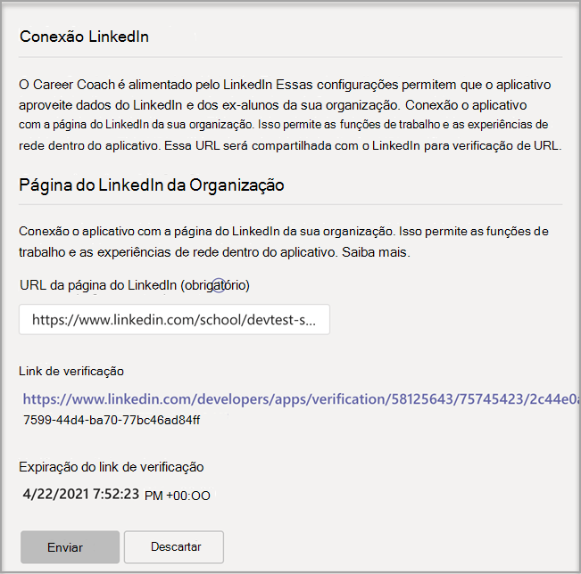
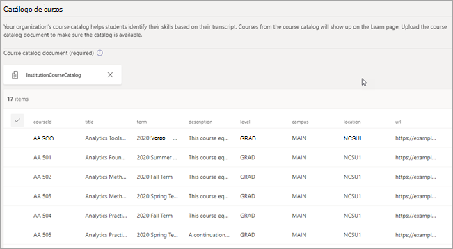

# Comprar, configurar e habilitar Coach de carreira para Microsoft Teams

Coach de carreira é um aplicativo Microsoft Teams para Educação desenvolvido pelo LinkedIn que fornece orientações personalizadas para que os alunos do ensino superior naveguem em sua jornada de carreira. Coach de carreira oferece às instituições educacionais uma solução de carreira unificada para que os alunos descubram seu caminho de carreira, cresçam habilidades do mundo real e criem sua rede em um só lugar.

## Idiomas com suporte

Coach de carreira está localizado nos seguintes idiomas:

- Chinês (Simplificado, China Do Continente)
- Chinês (Tradicional, Taiwan)
- Inglês (EUA)
- Inglês (Reino Unido)
- Francês (Canadá)
- Francês (França)
- Alemão (Deutschland)
- Japonês (Japão)
- Português (Brasil)
- Espanhol (Espanha)
- Espanhol (México)

Saiba mais sobre [Coach de carreira](https://aka.ms/career-coach).

> [!TIP]
> Use as práticas recomendadas e dicas úteis neste guia para habilitar os recursos do Coach de carreira para alunos, professores e funcionários. Consulte o [artigo guia de planejamento](https://support.microsoft.com/office/c5d0b934-bfcf-4fe7-8a85-ba7bbb1b6ad4) rápido.

## Revisar os requisitos

Para habilitar Coach de carreira para sua instituição educacional, revise o que você precisa para fazer com que o aplicativo seja executado.

**Requisitos técnicos**

- Office 365 locatário com Azure Active Directory.

- Microsoft Teams.

- Conexões de conta do LinkedIn em Azure Active Directory.

**Licenças**

- Docentes

- Alunos

> [!IMPORTANT]
> Uma Coach de carreira de professores deve ser atribuída ao administrador de IT concluindo a configuração.

**Dados e arquivos de sua instituição educacional**

- Logotipo e ativos gráficos da instituição educacional no formato necessário.

- Dados do catálogo de cursos.

- Lista de campos de estudo oferecidos.

- Página do [LinkedIn da instituição educacional](https://www.linkedin.com/help/linkedin/answer/40133/differences-between-a-linkedin-page-for-a-school-and-company?lang=en).

- URL da política de privacidade da instituição educacional.

- Links de instituições educacionais para recursos relacionados à carreira, como serviços de carreira e postagem de trabalho de alunos (opcional).

- Assinatura Learning campus do LinkedIn (preferencial).

## Comprar as Coach de carreira de Coach de carreira

Coach de carreira está disponível em todo o mundo (exceto a China e a Rússia) para instituições de ensino superior qualificadas como uma licença de complemento por meio de Inscrição para Soluções de Educação (EES), Provedores de Serviços de Nuvem (CSP) e Centro de administração do Microsoft 365 (web direct). Como aplicativo Microsoft Teams, o locatário deve ter Microsoft 365 A3/A5 ou Office 365 A1/A3/A5 para comprar a licença de Coach de carreira de complemento. Licenças separadas são oferecidas para alunos e usuários do corpo docente/funcionários.

Uma avaliação gratuita padrão de 90 dias está disponível para 25 alunos e 25 licenças de professores/funcionários. As licenças de avaliação podem ser ativadas Centro de administração do Microsoft 365 locatários qualificados para comprar Coach de carreira.

### Atribuir licenças de aplicativo aos usuários

Para obter instruções passo a passo, consulte [Atribuir licenças aos usuários](/microsoft-365/admin/manage/assign-licenses-to-users).

### Ativar conexões de conta do LinkedIn

Coach de carreira **requer** que os usuários da sua instituição educacional tenham a capacidade de conectar sua conta Microsoft 365 à conta do LinkedIn que é facilitada no Coach de carreira.

1. Entre no Centro de administração do [Azure AD](https://aad.portal.azure.com/) com uma conta que é um administrador global da organização do Azure AD.

2. Selecione **Usuários**.

3. Na página **Usuários** , selecione **Configurações do usuário**.

4. **As conexões de conta do LinkedIn** devem ser definidas como **Grupo** Sim ou **Selecionado** para que Coach de carreira sejam configuradas corretamente.

   

   > [!NOTE]
   > Nenhum dado é compartilhado até que os usuários consentam em conectar suas contas.

   - Selecione **Sim** para habilitar o serviço para todos os usuários em sua instituição educacional.

   - Selecione **Grupo selecionado** para habilitar o serviço apenas para um grupo de usuários selecionados em sua instituição educacional.

Para obter mais informações, consulte [conexões de conta do LinkedIn em Azure Active Directory](/azure/active-directory/enterprise-users/linkedin-integration).

## Acessar as configurações Coach de carreira aplicativos

Use Microsoft Teams centro de administração para configurar Coach de carreira para sua instituição educacional e habilita-la para os usuários.

> [!IMPORTANT]
> Você deve ser um administrador global ou Teams de serviço para acessar a página.

1. Entre no centro de **[Teams de administração](https://admin.teams.microsoft.com)**.

2. Na navegação à esquerda, selecione Teams **[appsManage](https://admin.teams.microsoft.com/policies/manage-apps)** >  apps.  

3. Pesquise ou procure **Coach de carreira**.  

4. Selecione **Coach de carreira** e selecione **Configurações**.  

    

## Configurar as configurações Coach de carreira aplicativos

Coach de carreira tem cinco categorias de configuração:

- [Marca e preferências](#brand-and-preferences) - obrigatório

- [Conexão LinkedIn](#linkedin-connection) - necessária

- [Catálogo de](#course-catalog) cursos - obrigatório

- [Campos de estudo](#fields-of-study) - obrigatório

- [Personalização](#customization)

> [!IMPORTANT]
> Marca e preferências, configuração do LinkedIn, catálogo de cursos e Campos  de estudo são necessários para habilitar efetivamente o aplicativo para alunos, professores e funcionários.

### Marca e preferências

Personalize Coach de carreira para corresponder à marca da sua instituição educacional. Você é responsável por respeitar os direitos dos outros, incluindo direitos autorais e marcas comerciais.

> [!IMPORTANT]
> Esta é uma seção necessária- Coach de carreira não pode ser habilitada sem a Marca e as preferências enviadas.

1. Entre no centro de **[Teams de administração](https://admin.teams.microsoft.com)**.

2. Selecione **Teams appsManage** >  **[apps](https://admin.teams.microsoft.com/policies/manage-apps)** >  **Coach de carreira** >  **Brand e preferências**.

3. Upload ícone **da instituição educacional**. O ícone é usado em todo o Coach de carreira para identificar conteúdo exclusivo para sua instituição educacional, recursos de catálogo de cursos em todo o aplicativo e na seção experiências do mundo real do painel. O ícone é melhor formatado como:

    - Um PNG transparente
    - Proporção de 1:1
    - Tamanho máximo de 64 px x 64 px

4. Upload **miniatura da instituição educacional**. A miniatura será usada para recursos de catálogo de cursos em todo o aplicativo quando uma imagem específica não estiver disponível para um curso. A miniatura é melhor formatada como:

    - Um PNG
    - Proporção de 16:9
    - Tamanho máximo de 360 px x 200 px

5. Adicione a **URL da política de privacidade da instituição educacional**. Se adicionada, a política de privacidade da instituição estará disponível para que os alunos revisem no Coach de carreira app.

6. Selecione **Enviar**.

### Conexão LinkedIn

A configuração do LinkedIn conecta Coach de carreira com dados de ex-alunos públicos do LinkedIn.

> [!IMPORTANT]
> Esta é uma seção necessária Coach de carreira não pode ser habilitada sem a conexão de página do LinkedIn verificada.

#### Adicionar a página do LinkedIn
  
1. Entre no centro de **[Teams de administração](https://admin.teams.microsoft.com)**.

2. Selecione **Teams appsManage** >  **[apps](https://admin.teams.microsoft.com/policies/manage-apps)** >  **Coach de carreira** >  **LinkedIn connection**.

3. Encontre a página LinkedIn pesquisando no LinkedIn e selecionando o **filtro Escola** . Ou conecte-se a um membro da equipe de serviços de carreira para determinar a página escolar correta do LinkedIn a ser usada. Para obter mais informações, [consulte Como identificar páginas do LinkedIn](https://www.linkedin.com/help/linkedin/answer/40133/differences-between-a-linkedin-page-for-a-school-and-company?lang=en).

    

4. Adicione a URL da página da escola do LinkedIn. A URL deve ser uma página de escola e não uma página da empresa e normalmente formatada como `https://www.linkedin.com/school/willow-university/`.

   

5. Selecione **Enviar**.
#### Verificar a página do LinkedIn 

> [!IMPORTANT]
> A verificação deve ser concluída pelo super administrador de página do LinkedIn da sua instituição educacional.

1. Se enviada com êxito, a página será atualizada para mostrar o **link Verificação** e **expiração do link Verificação**. O link de verificação expira após 30 dias.

     

2. Copie o link de verificação e compartilhe-o com a página super admin do LinkedIn da sua instituição educacional. Saiba mais sobre a função de super-administrador de página do [LinkedIn na documentação do administrador da página do LinkedIn](https://www.linkedin.com/help/linkedin/answer/102672).

3. O super administrador de página do LinkedIn usará o link de verificação exclusivo para associar Coach de carreira com a página da sua escola. Consulte [Documentação adicional sobre a verificação de página do LinkedIn](https://www.linkedin.com/help/linkedin/answer/102672) para obter mais informações.

   

### Catálogo de cursos

O catálogo de cursos representa os cursos e aulas oferecidos aos alunos pela sua instituição educacional.

> [!IMPORTANT]
> Esta é uma seção necessária- Coach de carreira não pode ser habilitada sem um catálogo de cursos.

Esses cursos são usados dentro do aplicativo em duas áreas:

- Os cursos são retornados como parte dos recursos de aprendizagem.  

- Cursos e metadados de curso, como descrições, são usados para ajudar os alunos a identificar suas habilidades ao carregar uma transcrição.  

Para criar o catálogo de cursos, crie uma lista de todos os cursos ministrados em sua instituição educacional e carregue-o como um arquivo CSV. O aplicativo desenha do catálogo de cursos para identificar as habilidades de um aluno a partir de sua transcrição e sugerir cursos a fazer.

#### Adicionar o catálogo de cursos

1. Entre no centro de **[Teams de administração](https://admin.teams.microsoft.com)**.

1. Selecione **Teams aplicativos** &gt; **[Gerenciar aplicativos Coach de carreira](https://admin.teams.microsoft.com/policies/manage-apps)** &gt;  &gt; **Configurações** &gt;**catálogo de cursos**.  

2. Upload cursos no formato CSV com as colunas necessárias: courseId, title e sourceLink. Cada linha deve incluir dados para cada uma das colunas necessárias. _Incluir os campos recomendados melhora a experiência dos alunos retornando melhores resultados de pesquisa e identificação de habilidades._

4. Selecione **Enviar**.

   

#### Formato e esquema do documento do catálogo de cursos

O documento precisa estar no formato CSV com um tamanho máximo de 18 MB. O documento deve conter o título do curso **de** campos necessário, **a ID** do curso e **a URL do curso**. 

> [!TIP]
> Comece com o [documento de catálogo de cursos]( https://aka.ms/career-coach/docs/it-admins/sample-catalog) de exemplo para garantir a formatação adequada. _Incluir os campos recomendados melhora a experiência dos alunos retornando melhores resultados de pesquisa e identificação de habilidades._

A tabela a seguir mostra os itens a incluir no catálogo de cursos:

| Nome             | Status      | Tipo   | Descrição                                                                    |
|------------------|-------------|--------|--------------------------------------------------------------------------------|
| courseId         | Obrigatório    | string | Geralmente, a id do curso (normalmente mapeia para o que é gerado na transcrição). |
| title            | Obrigatório    | string | Geralmente o título do curso.                                                      |
| sourceLink       | Obrigatório    | URL    | Link do site para a página do curso.                                               |
| description      | Recomendado | string | Texto de introdução para o curso.                                              |
| idioma         | Recomendado | string | Idioma do curso. Use códigos de idioma padrão.                           |
| format           | Recomendado | string | Modo de ensino (online, vídeo, pessoalmente).                                   |
| thumbnailLink    | Recomendado | URL    | Link em miniatura para a imagem do curso.                                            |
| thumbnailAltText | Recomendado | string | Texto alt de acessibilidade para a imagem                                           |
| educationLevel   | Recomendado | string | Nível de estudo, ex. Graduando/Graduando.                                       |
| tópicos           | Recomendado | string | Tópicos ou marcas associadas às habilidades que os cursos ministram.          |

### Campos de estudo

Os campos de estudo são sinônimos de áreas de interesse principais, de nível acadêmico e de grau. Esses títulos são referenciados pelos alunos quando começam a usar o aplicativo e começam a configurar seu perfil personalizado.

> [!IMPORTANT]
> Esta é uma seção necessária- Coach de carreira não pode ser habilitada sem uma lista de campos de estudo.

#### Adicionar os campos de estudo

1. Entre no centro de **[Teams de administração](https://admin.teams.microsoft.com)**.
1. Selecione **Teams aplicativos** &gt; **[Gerenciar aplicativos Coach de carreira](https://admin.teams.microsoft.com/policies/manage-apps)** &gt;  &gt; **Configurações** &gt;**Campos de estudo**.  

2. Upload campo de estudo no formato CSV.

3. Selecione **Enviar**.

#### Campos de formato e esquema de documentos de estudo

Adicione todos os campos de estudo disponíveis para alunos como Engenharia, Inglês, Negócios e assim por diante. A lista de campos permite que os alunos descubram campos de estudo que podem interesse a eles e adicionem sua área de foco ao perfil.

> [!TIP]
> Comece com o [campo de exemplo do documento de](https://aka.ms/career-coach/docs/it-admins/sample-fieldsofstudy) estudo para garantir a formatação adequada.

A tabela a seguir mostra os itens a incluir nos campos de estudo:

| Nome          | Status   | Tipo   | Descrição                    |
|---------------|----------|--------|--------------------------------|
| fieldsOfStudy | Obrigatório | string | O nome do campo de estudo |

### Personalização

Coach de carreira pode ser personalizado para ser exclusivo da sua instituição educacional. A personalização dá suporte à adição de experiências ao painel. É recomendável adicionar links a placas de trabalho, eventos, escritório de serviços de carreira, eventos relacionados à carreira, clubes de alunos e qualquer outro recurso que ajude os alunos a obter experiência no mundo real.

#### Adicionar experiências personalizadas

1. Entre no centro de **[Teams de administração](https://admin.teams.microsoft.com)**.

1. Selecione **Teams aplicativos** &gt; **[Gerenciar aplicativos Coach de carreira](https://admin.teams.microsoft.com/policies/manage-apps)** &gt;  > **Configurações** &gt; **Personalização**.

2. Adicione cada título, URL e descrição curta.  
  
3. Selecione **Enviar**.

## Disponibilizar Coach de carreira para sua organização

Agora que Coach de carreira foi configurado para sua organização. Siga estas etapas para garantir que o Coach de carreira está disponível para a organização no Microsoft Teams.

### Habilitar o aplicativo

Depois de concluir a configuração, habilita o aplicativo para alunos e usuários licenciados para que eles tenham acesso a Coach de carreira.  
  
> [!IMPORTANT]
> Você deve ter permissões de função de administrador global ou Teams de administrador.

1. Entre no centro de **[Teams de administração](https://admin.teams.microsoft.com)**.

1. Selecione **Teams aplicativos** &gt; **[Gerenciar aplicativos Coach de carreira](https://admin.teams.microsoft.com/policies/manage-apps)**&gt;.

2. Mova a alternância Status para **Permitido**.  

   > [!NOTE]
   > **Permitido** significa que o aplicativo está disponível para usuários em sua instituição educacional. Bloqueado significa que o aplicativo não está disponível para os alunos.

### Adicionar Coach de carreira como um aplicativo instalado

> [!IMPORTANT]
> Esta etapa garante que o Coach de carreira seja configurado corretamente para sua organização e que os alunos encontrem Coach de carreira.

1. Entre no centro de **[Teams de administração](https://admin.teams.microsoft.com)**.

2. Selecione **Teams políticas de instalação** **de aplicativos** &gt; e selecione sua política preferida.
Se você não tiver certeza de qual política usar, poderá consultar a documentação de gerenciamento de política Microsoft Teams ou usar o  Assistente de Política de Educação para configurar uma política para Microsoft Teams.

3. Em Aplicativos instalados, selecione **Adicionar aplicativos**.

4. No painel Adicionar aplicativos instalados, pesquise os aplicativos que você deseja instalar automaticamente para os usuários quando eles começarem a Teams. Você também pode filtrar aplicativos por política de permissão do aplicativo. Quando você escolher sua lista de aplicativos, selecione **Adicionar**.

5. Selecione **Salvar**.

> [!NOTE]
> A edição ou a atribuição de uma política pode levar algumas horas para que as alterações entre em vigor. O Coach de carreira aplicativo não estará disponível no Microsoft Teams até que as alterações sejam concluídas.

### Fixar o aplicativo

Fixar Coach de carreira tornar o aplicativo mais acessível e visível para os alunos.

1. Entre no centro de **[Teams de administração](https://admin.teams.microsoft.com)**.

2. Selecione **Teams políticas de instalação** **de aplicativos** &gt; e selecione sua política preferida.
Se você não tiver certeza de qual política usar, poderá consultar a documentação de gerenciamento de política Microsoft Teams ou usar o  Assistente de Política de Educação para configurar uma política para Microsoft Teams.

3. Em **Aplicativos fixados**, escolha **Adicionar aplicativos**.

4. **Pesquise Coach de carreira** e selecione **Adicionar**.

5. Escolha a ordem para que o aplicativo apareça e selecione **Salvar**.

> [!NOTE]
> Os alunos serão notificados Microsoft Teams que Coach de carreira foi fixado.

Referência [Gerenciar políticas de configuração de aplicativos na Microsoft](/microsoftteams/teams-app-setup-policies) para obter mais detalhes.

## Coach de carreira status das configurações

A Coach de carreira de configurações do Teams Admin Center fornece um relatório de status de etapas incompletas, pendentes, completas e com falha para configurar o aplicativo. Esses status podem ajudá-lo a determinar se Coach de carreira está configurado corretamente e pronto para lançamento para seu locatário.

### Status da configuração

A seção status de configuração da página de configurações do aplicativo exibirá o status atual.

| Categoria              | Status                    | Descrição                                                 |
| --------------------- | ------------------------- | ----------------------------------------------------------- |
| Provisionamento de serviço  | Pendente                   | O aplicativo está sendo adicionado ao locatário. Nenhuma ação mais necessária. |
| Provisionamento de serviço  | Concluído                  | Pronto para o administrador de IT enviar configurações.                      |
| Marca e preferências | Não iniciado               | Configurações precisa ser enviado.                              |
| Marca e preferências | Campos _obrigatórios ausentes_ | O administrador de IT precisa adicionar ou carregar os campos ausentes.         |
| Marca e preferências | Concluído                  | Nenhuma ação mais necessária.                                   |
| Catálogo de cursos        | Não iniciado               | O catálogo precisa ser enviado.                              |
| Catálogo de cursos        | Incompleto                | Verifique o status de ingestão para obter detalhes sobre como resolver.   |
| Catálogo de cursos        | Concluído                  | Nenhuma ação mais necessária.                                   |
| Conexão LinkedIn   | Não iniciado               | A URL da página da escola do LinkedIn precisa ser enviada.             |
| Conexão LinkedIn   | Pendente                   | Aguardando aprovação do administrador da página escolar do LinkedIn.               |
| Conexão LinkedIn   | Concluído                  | Nenhuma ação mais necessária.                                   |
| Campos de estudo       | Não iniciado               | O documento precisa ser enviado.                             |
| Campos de estudo       | Concluído                  | Nenhuma ação mais necessária.                                   |

> [!NOTE]
> Depois que todas as etapas são marcadas como concluídas, o aplicativo pode ser lançado com êxito para seu locatário e atribuir Coach de carreira licenças. Para obter instruções passo a passo, consulte [Atribuir licenças aos usuários](/microsoft-365/admin/manage/assign-licenses-to-users?view=o365-worldwide).

### Status do catálogo de cursos

O status do catálogo de cursos é mostrado na página Configurações do catálogo de cursos depois que um documento é carregado, fornecendo detalhes sobre o carregamento e o processamento do documento.

| Coluna           | Valor     | Descrição                                                                                        |
| ---------------- | --------- | -------------------------------------------------------------------------------------------------- |
| Tempo carregado    | Timestamp | Data e hora em que um administrador de IT carregou um documento.                                                     |
| Tempo concluído   | Timestamp | Data e hora em que o documento foi completamente processado.                                               |
| Cursos carregados | Integer   | Número de cursos encontrados no documento.                                                           |
| Status de ingestão | Pendente   | Documento na fila para processamento.                                                                  |
| Status de ingestão | Executando   | No momento, o documento está sendo processado. Esse processo pode levar até 60 minutos.                        |
| Status de ingestão | Sucesso   | O processo de ingestão está concluído e os cursos e estarão disponíveis no aplicativo depois de totalmente configurados. |
| Status de ingestão | Falha    | Verifique o formato do documento e recarregue.                                                            |
| Duplicatas       | Integer   | Número de cursos duplicados encontrados no documento.                                                 |

> [!NOTE]
> Se uma coluna estiver em branco, o documento está sendo processado no momento e esses valores não estão disponíveis. Depois que o documento tiver sido processado, os valores serão preenchidos. Você pode atualizar a página para verificar se há atualizações.

## Solução de problemas

- Se você vir "Coach de carreira atualmente está sendo configurada para você usar em breve" no aplicativo Coach de carreira, as seções necessárias não __foram concluídas__. As __seções a seguir__ são necessárias para serem concluídas antes que Coach de carreira possam ser [usadas](#brand-and-preferences): Marca e preferências, conexão [LinkedIn](#linkedin-connection), catálogo [de](#course-catalog) cursos e [Campos de estudo](#fields-of-study).

- Os CSVs para o catálogo de cursos e o campo de estudo têm formatos obrigatórios e um tamanho máximo de 18 MB. Consulte o esquema Coach de carreira [de documentos](#course-catalog-document-format-and-schema) do catálogo de cursos e Coach de carreira [campos do esquema](#fields-of-study-document-format-and-schema) de documento de estudo para garantir a configuração adequada.

- Em páginas de configurações com campos obrigatórios, se os campos não foram concluídos, a página não enviará. Você não verá uma mensagem de aviso; a página simplesmente não enviará.

- Ao configurar o Coach de carreira, uma faixa de erro pode aparecer informando "Não é possível atualizar as configurações do aplicativo. Tente novamente." Isso provavelmente ocorre devido ao locatário provisionar o aplicativo Coach de carreira, que pode levar até 15 minutos. Se isso acontecer, aguarde 15 minutos antes de enviar novamente.

- Se o Coach de carreira aplicativo não estiver sendo exibido Microsoft Teams, as alterações de política podem não ter feito efeito. As alterações de política podem levar algumas horas para ser atualizadas. O Coach de carreira aplicativo não estará disponível no Microsoft Teams até que as alterações sejam concluídas.

## Removendo seus dados de locatário

Os dados do locatário incluem informações carregadas ou geradas como parte da configuração do aplicativo. Para excluir todos os dados em um Coach de carreira locatário, solicite que o administrador global do locatário abra um tíquete de suporte solicitando que os dados do locatário sejam excluídos permanentemente. Esteja ciente de que esse processo não é reversível. Depois que a remoção de dados for concluída, o aplicativo Coach de carreira retornará ao estado pré-configurado e não personalizado para todos os usuários e um administrador do Teams precisará configurar o aplicativo novamente para continuar a usá-lo.

O seguinte explica o processo de exclusão:

- Um tíquete de suporte deve ser arquivado por um administrador global do locatário informando claramente a solicitação para que os dados do locatário sejam excluídos permanentemente. **Não há capacidade de limitar o conjunto de dados ou a janela de tempo da exclusão**.

- Depois de arquivado, o tíquete de suporte será endereçado após uma semana para atender à política de retenção mínima da conformidade. Você pode cancelar a operação durante esse período.

- Após uma semana, a equipe Coach de carreira garante que todos os dados relacionados ao locatário serão excluídos. O suporte da Microsoft monitora o tíquete e o notificará depois que o processo de exclusão for concluído, em no **menos 30 dias**.

## Recursos

Os recursos a seguir ajudarão você a planejar seu Coach de carreira aplicativo.

- [Bem-vindo ao Microsoft Teams](Teams-overview.md)

- [Como implantar o Teams](get-started-with-teams-resources-for-org-wide-rollout.md?tabs=SmallBusiness)

- [Visão geral de equipes e canais no Microsoft Teams](teams-channels-overview.md)

- [Gerenciando aplicativos Microsoft Teams Admin Center](manage-apps.md)

- [Kit de Orientação Virtual Online](https://www.microsoft.com/education/remote-learning/virtual-orientation)

- [Limites e especificação de Teams canais](limits-specifications-teams.md)

- [Iniciando o treinamento de administrador para Microsoft Teams](ITAdmin-readiness.md)

- [Solução de problemas do Teams](/microsoftteams/troubleshoot/teams-welcome)

- [Gerenciar políticas de permissões de aplicativo no Microsoft Teams](teams-app-permission-policies.md)
