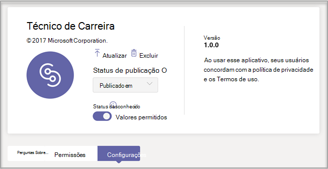
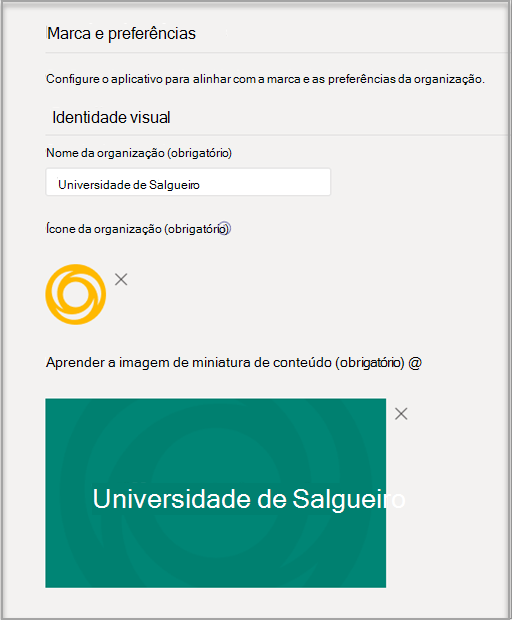
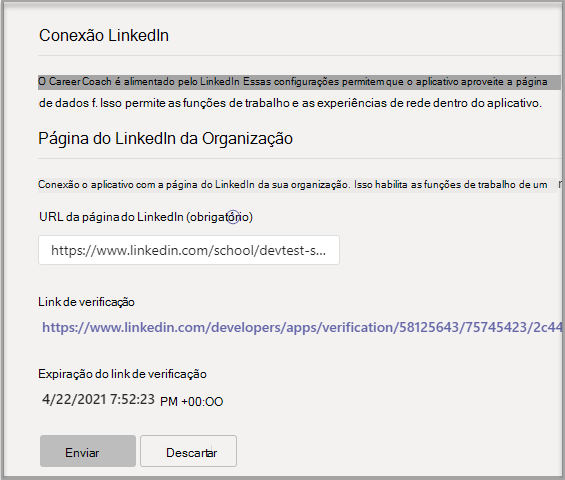

# Comprar, configurar e habilitar o Career Coach para Microsoft TeamsPurchase, configure, and enable Career Coach for Microsoft Teams

O Career Coach é um Microsoft Teams para Educação, desenvolvido pelo LinkedIn, que fornece orientações personalizadas para que os alunos do ensino superior naveguem em sua jornada de carreira.Career Coach is a Microsoft Teams for Education app powered by LinkedIn that provides personalized guidance for higher education students to navigate their career journey. O Career Coach oferece às instituições educacionais uma solução de carreira unificada para que os alunos descubram seu caminho de carreira, cresçam habilidades do mundo real e criem sua rede em um só lugar.Career Coach offers educational institutions a unified career solution for students to discover their career path, grow real-world skills, and build their network all in one place.

Saiba mais sobre [o Career Coach](https://aka.ms/career-coach).Learn more about [Career Coach](https://aka.ms/career-coach).

> [!NOTE]
> Use as práticas recomendadas e dicas úteis neste guia para habilitar os recursos do Career Coach para alunos, professores e funcionários.Use the best practices and helpful tips in this guide to enable the capabilities of Career Coach for students, faculty, and staff. Consulte o [artigo guia de planejamento](https://support.microsoft.com/office/c5d0b934-bfcf-4fe7-8a85-ba7bbb1b6ad4) rápido.See the [Quick planning guide](https://support.microsoft.com/office/c5d0b934-bfcf-4fe7-8a85-ba7bbb1b6ad4) article.

## Revisar os requisitosReview the requirements

Para habilitar o Career Coach para sua instituição educacional, revise o que você precisa para fazer com que o aplicativo seja executado.To enable Career Coach for your educational institution, review what you need to get the app up and running.

**Requisitos técnicos****Technical requirements**

  - Office 365 locatário com Azure Active DirectoryOffice 365 tenant with Azure Active Directory

  - Microsoft TeamsMicrosoft Teams

  - Conexões de conta do LinkedIn em Azure Active DirectoryLinkedIn account connections in Azure Active Directory

**Licenças****Licenses**

  - DocentesFaculty 

  - AlunosStudents

> [!NOTE]
> Uma licença do Corpo Docente do Técnico de Carreira deve ser atribuída ao administrador de IT concluindo a configuração.A Career Coach Faculty license must be assigned to the IT admin completing the configuration.

**Dados e arquivos de sua instituição educacional****Data and files from your educational institution**

  - Dados do catálogo de cursosCourse catalog data

  - Campos de estudo oferecidosFields of study offered

  - Página do LinkedIn da instituição educacionalEducational institution’s LinkedIn page

  - Assinatura do campus do LinkedIn Learning (preferencial)LinkedIn Learning campus subscription (preferred)

## Comprar as licenças do Career CoachPurchase the Career Coach licenses

O Career Coach está disponível em todo o mundo (exceto China e Rússia) para instituições de ensino superior qualificadas por meio de Inscrição para Soluções de Educação (EES), Provedores de Serviços de Nuvem (CSP) e centro de administração Microsoft 365 (web direct).Career Coach is available worldwide (except China and Russia) for qualified higher education institutions through Enrollment for Education Solutions (EES), Cloud Service Providers (CSP), and Microsoft 365 admin center (web direct). Como um Microsoft Teams, os clientes devem ter Microsoft 365 A3/A5 ou Office 365 A1/A3/A5.As a Microsoft Teams app, customers must have Microsoft 365 A3/A5 or Office 365 A1/A3/A5.

### Atribuir licenças de aplicativo aos usuáriosAssign app licenses to users

Para obter instruções passo a passo, consulte [Atribuir licenças aos usuários](https://docs.microsoft.com/microsoft-365/admin/manage/assign-licenses-to-users).For step-by-step instructions, see [Assign licenses to users](https://docs.microsoft.com/microsoft-365/admin/manage/assign-licenses-to-users).

### Ativar conexões de conta do LinkedInTurn on LinkedIn account connections

O Coach **de Carreira** exige que os usuários da sua instituição educacional tenham a capacidade de conectar sua conta Microsoft 365 sua conta do LinkedIn que é facilitada no Career CoachCareer Coach **requires** your educational institution’s users to have the ability to connect their Microsoft 365 account to their LinkedIn account that is facilitated within Career Coach

1. Entre no Centro de administração do [Azure AD](https://aad.portal.azure.com/) com uma conta que é um administrador global da organização do Azure AD.Sign in to the [Azure AD admin center](https://aad.portal.azure.com/) with an account that's a global admin for the Azure AD organization.

2. Selecione **Usuários**.Select **Users**.

3. Na página **Usuários,** selecione **Configurações do usuário**.On the **Users** page, select **User settings**.

4. Em conexões de conta **do LinkedIn,** permita que os usuários conectem suas contas para acessar suas conexões do LinkedIn em alguns aplicativos da Microsoft.Under **LinkedIn account connections**, allow users to connect their accounts to access their LinkedIn connections within some Microsoft apps. Nenhum dado é compartilhado até que os usuários consentam em conectar suas contas.No data is shared until users consent to connect their accounts.

   - Selecione **Sim** para habilitar o serviço para todos os usuários em sua instituição educacionalSelect **Yes** to enable the service for all users in your educational institution

   - Selecione **Grupo selecionado** para habilitar o serviço apenas para um grupo de usuários selecionados em sua instituição educacionalSelect **Selected group** to enable the service for only a group of selected users in your educational institution

   - Selecione **Não** para retirar o consentimento de todos os usuários em sua instituição educacionalSelect **No** to withdraw consent from all users in your educational institution

Saiba como integrar [conexões de conta do LinkedIn Azure Active Directory](/azure/active-directory/enterprise-users/linkedin-integration)Learn how to [Integrate LinkedIn account connections in Azure Active Directory](/azure/active-directory/enterprise-users/linkedin-integration)

## Configurar o Career Coach no Teams de administraçãoConfigure Career Coach in the Teams admin center

Usando as configurações de administrador no Microsoft Teams de administração, você pode configurar o Career Coach para sua instituição educacional e habilita-lo para os usuários.Using the admin settings in the Microsoft Teams admin center, you can configure Career Coach for your educational institution and enable it for users.

## Acessar as configurações do aplicativo Career CoachAccess the Career Coach app settings

Use a [página Gerenciar aplicativos](/microsoftteams/manage-apps) para exibir os Teams aplicativos no catálogo de aplicativos da sua instituição educacional.Use the [Manage apps page](/microsoftteams/manage-apps) to view the Teams apps in your educational institution’s app catalog.

1. Entre no centro de **administração Teams.**Sign in to the **Teams admin center**.

2. Na navegação à esquerda, selecione Teams  >  **aplicativos Gerenciar aplicativos**.In the left navigation, select **Teams apps** > **Manage apps**.  

    > [!NOTE]
    > Você deve ser um administrador global ou Teams de serviço para acessar a página.You must be a global admin or Teams service admin to access the page.

3. Pesquise ou procure **o Career Coach**.Search or browse for **Career Coach**.  

4. Selecione **Técnico de** Carreira e selecione **Configurações.**Select **Career Coach**, and then select **Settings.**  

    

### Configurar as configurações do aplicativo de Técnico de CarreiraConfigure the Career Coach app settings

O Career Coach tem cinco categorias de configuração:Career Coach has five configuration categories:

- [Marca e preferênciasBrand and preferences](#brand-and-preferences)

- [Configuração do LinkedInLinkedIn configuration](#linkedin-configuration)

- [Catálogo de cursosCourse catalog](#course-catalog)

- [Campos de estudoFields of study](#fields-of-study)

- [PersonalizaçãoCustomization](#customization)

> [!NOTE]
> Marca e preferências, configuração do LinkedIn,  catálogo de cursos e Campos de estudo são necessários para habilitar efetivamente o aplicativo para alunos, professores e funcionários.Brand and preferences, LinkedIn configuration, Course catalog, and Fields of study are **required** to effectively enable the app for students, faculty, and staff.

#### Marca e preferênciasBrand and preferences

De definir o nome, o logotipo e o idioma padrão da sua instituição educacional na página de configurações de marca e preferências.Set your educational institution’s name, logo, and default language on the brand and preferences settings page.

##### Ícone da instituição educacionalEducational institution icon

O ícone da instituição educacional é usado em todo o Career Coach para identificar conteúdo exclusivo para sua instituição educacional, recursos de catálogo de cursos em todo o aplicativo e na seção experiências do mundo real do painel.The educational institution icon is used throughout Career Coach to identify content unique to your educational institution, course catalog resources throughout the app, and on the real-world experiences section of the dashboard. O ícone é melhor formatado como:The icon is best formatted as:

 - Um PNG transparenteA transparent PNG
 - Proporção de 1:1Aspect ratio of 1:1
 - Tamanho máximo de 64 px x 64 px.Maximum size of 64 px x 64 px.

##### Miniatura da instituição educacionalEducational institution thumbnail

O ícone da instituição educacional será usado para recursos de catálogo de cursos em todo o aplicativo quando uma imagem específica não estiver disponível para um curso.The educational institution icon will be used for course catalog resources throughout the app when a specific image isn't available for a course. O ícone é melhor formatado como:The icon is best formatted as:

- Um PNGA PNG
- Proporção de 16:9Aspect ratio of 16:9
- Tamanho máximo de 360 px x 200 px.Maximum size of 360 px x 200 px.

#### Configuração do LinkedInLinkedIn configuration

A configuração do LinkedIn conecta o Career Coach com dados de ex-alunos públicos do LinkedIn.The LinkedIn configuration connects Career Coach with public alumni data from LinkedIn.

> [!NOTE]
> O Career Coach não pode ser habilitado sem a conexão de página do LinkedIn verificada.Career Coach can't be enabled without the LinkedIn page connection verified.

##### Adicionar e confirmar a página do LinkedInAdd and confirm the LinkedIn page

Determine a página do LinkedIn da instituição educacional.Determine the educational institution's LinkedIn page. Encontre a página do LinkedIn pesquisando no LinkedIn ou conectando-se a um membro da equipe de serviços de carreira para determinar a página correta a ser usada.Find the LinkedIn page by searching on LinkedIn or connecting with a career services staff member to determine the correct page to use.  
  
1. Entre no centro de **administração Teams.**Sign in to the **Teams admin center**.

1. Selecione **Teams**  >  **aplicativos Gerenciar**  >  **aplicativos Conexão** LinkedIn do Coach de  >  **Carreira.**Select **Teams apps** > **Manage apps** > **Career Coach** > **LinkedIn connection**.

2. Insira a URL da página do LinkedIn da sua instituição educacional.Enter your educational institution's LinkedIn page URL.  

3. Selecione **Aplicar**.Select **Apply**.

4. Copie a URL de verificação e compartilhe-a com a documentação de administrador de página do LinkedIn da sua instituição [educacional.](https://www.linkedin.com/help/linkedin/answer/4783/linkedin-page-admins-overview?lang=en)Copy the verification URL and share it with your educational institution’s LinkedIn page admin [LinkedIn page admin documentation](https://www.linkedin.com/help/linkedin/answer/4783/linkedin-page-admins-overview?lang=en). O link de verificação expira após 30 dias.The verification link expires after 30 days.  

     

#### Catálogo de cursosCourse catalog

O catálogo de cursos representa os cursos e aulas oferecidos aos alunos pela sua instituição educacional.The course catalog represents the courses and classes offered to students by your educational institution. Esses cursos são usados dentro do aplicativo em duas áreas:These courses are used within the app in two areas:

- Os cursos são retornados como parte dos recursos de aprendizagem.Courses are returned as part of learning resources.  

- Cursos e metadados de curso, como descrições, são usados para ajudar os alunos a identificar suas habilidades ao carregar uma transcrição.Courses and course meta data, like descriptions, are used to help students identify their skills when they upload a transcript.  

Para criar o catálogo de cursos, crie uma lista de todos os cursos ministrados em sua instituição educacional e carregue-o como um arquivo CSV.To create the course catalog, put together a list of all courses taught at your educational institution and upload it as a CSV file. O aplicativo desenha do catálogo de cursos para identificar as habilidades de um aluno a partir de sua transcrição e sugerir cursos a fazer.The app draws from the course catalog to identify a student’s skills from their transcript and to suggest courses to take. 

> [!NOTE]
> Consulte [Local dos dados em Teams](location-of-data-in-teams.md) segurança e [conformidade](security-compliance-overview.md) para obter informações sobre a proteção das informações dos alunos.See [Location of data in Teams](location-of-data-in-teams.md) and [Security and compliance](security-compliance-overview.md) for information about protecting of student information. 

##### Formatação e esquema de documentos do catálogo de cursosCourse catalog documents formatting and schema

O documento precisa estar no formato CSV com um tamanho máximo de 18 MB.The document needs to be in CSV format with a maximum size of 18 MB. O documento deve conter o título do curso **de** campos necessários , **a ID do** curso e a URL do **curso.**The document must contain the required fields **course title**, **course ID**, and **course URL**. Incluir os campos recomendados melhora a experiência dos alunos retornando melhores resultados de pesquisa e identificação de habilidades.Including the recommended fields improves the experience for students by returning better search results and skill identification.

> [!NOTE]
> Comece com o [documento de catálogo de cursos]( https://aka.ms/career-coach/docs/it-admins/sample-catalog) de exemplo para começar.Start with the [sample course catalog]( https://aka.ms/career-coach/docs/it-admins/sample-catalog) document to get started.

A tabela a seguir mostra os itens a incluir no catálogo de cursos:The following table shows the items to include in the course catalog:

| NomeName             | StatusStatus      | TipoType   | DescriçãoDescription                                                                    |
|------------------|-------------|--------|--------------------------------------------------------------------------------|
| courseIdcourseId         | ObrigatórioRequired    | stringstring | Geralmente, a id do curso (normalmente mapeia para o que é gerado na transcrição).Usually the course id (Typically maps to what is generated in the transcript). |
| titletitle            | ObrigatórioRequired    | stringstring | Geralmente o título do curso.Usually the course title.                                                      |
| sourceLinksourceLink       | ObrigatórioRequired    | URLURL    | Link do site para a página do curso.Website link to the course page.                                               |
| descriptiondescription      | RecomendadoRecommended | stringstring | Texto de introdução para o curso.Introduction text for the course.                                              |
| languagelanguage         | RecomendadoRecommended | stringstring | Idioma do curso.Language of the course. Use códigos de idioma padrão.Use standard language codes.                           |
| formatformat           | RecomendadoRecommended | stringstring | Modo de ensino, por exemplo, online, vídeo, pessoalmente.Mode of teaching, e.g., online, video, in-person.                              |
| thumbnailLinkthumbnailLink    | RecomendadoRecommended | URLURL    | Link em miniatura para a imagem do curso.Thumbnail link to the course image.                                            |
| thumbnailAltTextthumbnailAltText | RecomendadoRecommended | stringstring | Texto alt de acessibilidade para a imagemAccessibility alt text for the image                                           |
| educationLeveleducationLevel   | RecomendadoRecommended | stringstring | Nível de estudo, ex.Study level, ex. Graduando/Graduando.Undergraduate/Graduate.                                       |
| tópicostopics           | RecomendadoRecommended | stringstring | Tópicos ou marcas associadas às habilidades que os cursos ministram.Topics or tags that are associated with the skills the courses teach.          |

##### Adicionar o catálogo de cursosAdd the course catalog

1. Entre no centro de **administração Teams.**Sign in to the **Teams admin center**.

1. Selecione **Teams** &gt; **aplicativos Gerenciar** &gt; **aplicativos Career Coach** &gt; **Configurações** Catálogo de &gt; **Cursos.**  Select **Teams apps** &gt; **Manage apps** &gt; **Career Coach** &gt; **Settings** &gt;  **Course catalog**.

2. Upload cursos no formato CSV.Upload courses in CSV format.

4. Selecione **Aplicar**.Select **Apply**.

   

#### Campos de estudoFields of study

Os campos de estudo são sinônimos de áreas de interesse principais, de nível acadêmico e de grau.The fields of study are synonymous with major areas of interest, academic major, and degree. Esses títulos são referenciados pelos alunos quando começam a usar o aplicativo e começam a configurar seu perfil personalizado.These titles are referenced by students when they start using the app and begin setting up their personalized profile.

Adicione todos os campos de estudo disponíveis para alunos como Engenharia, Inglês, Negócios e assim por diante.Add all fields of study available to students such as Engineering, English, Business, and so on. A lista de campos permite que os alunos descubram campos de estudo que podem interesse a eles e adicionem sua área de foco ao perfil.The list of fields lets students discover fields of study that may interest them and add their area of focus to their profile.

> [!NOTE]
> Comece com o [campo de exemplo do documento de](https://aka.ms/career-coach/docs/it-admins/sample-fieldsofstudy) estudo.Start with the [sample field of study](https://aka.ms/career-coach/docs/it-admins/sample-fieldsofstudy) document.
##### Adicionar os campos de estudoAdd the fields of study

1. Entre no centro de **administração Teams.**Sign in to the **Teams admin center**.
1. Selecione **Teams** &gt; **aplicativos Gerenciar** &gt; **aplicativos Career Coach** &gt; **Configurações** Campos &gt; **de estudo**.  Select **Teams apps** &gt; **Manage apps** &gt; **Career Coach** &gt; **Settings** &gt;  **Fields of study**.

2. Upload campo de estudo no formato CSV.Upload field of study in CSV format.

3. Selecione **Aplicar**.Select **Apply**.

#### PersonalizaçãoCustomization

O Career Coach pode ser personalizado para ser exclusivo da sua instituição educacional.Career Coach can be customized to be unique to your educational institution. A personalização dá suporte à adição de experiências ao painel.The customization supports adding experiences to the dashboard. É recomendável adicionar links a placas de trabalho, eventos, escritório de serviços de carreira, eventos relacionados à carreira, clubes de alunos e qualquer outro recurso que ajude os alunos a obter experiência no mundo real.It's recommended to add links to job boards, events, career services office, career-related events, student clubs, and any other resources that help students gain real-world experience.

##### Adicionar experiências personalizadasAdd customized experiences

1. Entre no centro de **administração Teams.**Sign in to the **Teams admin center**.

1. Selecione **Teams** &gt; **aplicativos Gerenciar** &gt; **aplicativos Career Coach**  >  **Configurações** &gt; **Personalização.**Select **Teams apps** &gt; **Manage apps** &gt; **Career Coach** > **Settings** &gt; **Customization**.

2. Adicione cada URL, um título e uma descrição curta.Add each URL, a title, and short description.  
  
3. Selecione **Aplicar**.Select **Apply**.

## Disponibilizar o Career Coach para sua organizaçãoMaking Career Coach available to your organization

Agora que o Career Coach foi configurado para sua organização.Now that Career Coach has been configured for your organization. Siga estas etapas para garantir que o Career Coach está disponível para a organização Microsoft Teams.Follow these steps to ensure that Career Coach is available to organization in Microsoft Teams.

### Habilitar o aplicativoEnable the app

Depois de concluir a configuração, habilita o aplicativo para alunos e usuários licenciados para que eles tenham acesso ao Career Coach.After you complete the configuration, enable the app for students and licensed users so they'll have access to Career Coach.  
  
> [!NOTE]
> Você deve ter permissões de função de administrador global ou Teams de administrador.You must have Global or Teams admin role permissions.

1. Entre no centro de **administração Teams.**Sign in to the **Teams admin center**.

1. Selecione **Teams** &gt; **aplicativos Gerenciar aplicativos** &gt; **Career Coach**.Select **Teams apps** &gt; **Manage apps** &gt; **Career Coach**.

2. Mover a alternância Status para **Permitido**.Move the Status toggle to **Allowed**.  

  > [!NOTE]
  > Permitido significa que o aplicativo está disponível para usuários em sua instituição educacional.Allowed means that the app is available for users in your educational institution. Bloqueado significa que o aplicativo não está disponível para os alunos.Blocked means that the app isn't available to students.

### Adicionar o Career Coach como um aplicativo instaladoAdd Career Coach as an installed app

> [!NOTE]
> Esta etapa garante 1) que o Career Coach seja configurado corretamente para sua organização 2) que os alunos encontrem o Career Coach.This step ensures 1) that Career Coach is properly configured for your organization 2) that students find Career Coach.

1. Entre no centro de **administração Teams.**Sign in to the **Teams admin center**.

2. Selecione **Teams políticas de instalação de** &gt;  &gt; *aplicativos Sua política*.Select **Teams apps** &gt;**Setup policies** &gt; *Your policy*. 

3. Em Aplicativos instalados, selecione Adicionar aplicativos.Under Installed apps, select Add apps.

4. No painel Adicionar aplicativos instalados, pesquise os aplicativos que você deseja instalar automaticamente para os usuários quando eles começarem a Teams.In the Add installed apps pane, search for the apps you want to automatically install for users when they start Teams. Você também pode filtrar aplicativos por política de permissão do aplicativo.You can also filter apps by app permission policy. Quando você escolher sua lista de aplicativos, selecione Adicionar.When you've chosen your list of apps, select Add.

### Fixar o aplicativoPin the app

O Pinning Career Coach torna o aplicativo mais acessível e visível para os alunos.Pinning Career Coach will make the app more accessible and visible for students.

1. Entre no centro de **administração Teams.**Sign in to the **Teams admin center**.

2. Selecione **Teams políticas de instalação de** &gt;  &gt; *aplicativos Sua política*.Select **Teams apps** &gt;**Setup policies** &gt; *Your policy*. 

3. Em **Aplicativos Fixados,** escolha **Adicionar aplicativos**.Under **Pinned apps**, choose **Add apps**.

4. **Pesquise o Técnico** de Carreira e selecione **Adicionar**.Search for **Career Coach**, and then select **Add**.

5. Escolha a ordem para que o aplicativo apareça e selecione **Salvar**.Choose the order for the app to appear and select **Save**.

> [!NOTE]
> Os alunos serão notificados Microsoft Teams que o Career Coach foi fixado.Students will be notified in Microsoft Teams that Career Coach has been pinned.

Referência [Gerenciar políticas de configuração de aplicativos na Microsoft](https://docs.microsoft.com/microsoftteams/teams-app-setup-policies) para obter detalhes adicionais.Reference [Manage app setup policies in Microsoft](https://docs.microsoft.com/microsoftteams/teams-app-setup-policies) for additional details.

## RecursosResources

Os recursos a seguir ajudarão você a planejar seu aplicativo de Técnico de Carreira.The following resources will help you plan your Career Coach app.

- [Bem-vindo ao Microsoft TeamsWelcome to Microsoft Teams](Teams-overview.md)

- [Como implantar o TeamsHow to roll out Teams](get-started-with-teams-resources-for-org-wide-rollout.md?tabs=SmallBusiness)

- [Visão geral de equipes e canais no Microsoft TeamsOverview of teams and channels in Microsoft Teams](teams-channels-overview.md)

- [Gerenciando aplicativos Microsoft Teams Admin CenterManaging apps in Microsoft Teams Admin Center](manage-apps.md)

- [Segurança, privacidade e conformidade no Microsoft TeamsSecurity, privacy, and compliance in Microsoft Teams](security-compliance-overview.md)

- [Kit de Orientação Virtual OnlineOnline Virtual Orientation Kit](https://www.microsoft.com/education/remote-learning/virtual-orientation) 

- [Limites e especificação de Teams canaisLimits and specification of Teams channels](limits-specifications-teams.md)

- [Localização de dados no Microsoft TeamsLocation of data in Microsoft Teams](location-of-data-in-teams.md)

- [Iniciando o treinamento de administrador para Microsoft TeamsGetting started with admin training for Microsoft Teams](ITAdmin-readiness.md)

- [Solução de problemas do TeamsTeams troubleshooting](/microsoftteams/troubleshoot/teams-welcome)

- [Gerenciar políticas de permissões de aplicativo no Microsoft TeamsManage app permission policies in Microsoft Teams](teams-app-permission-policies.md)
