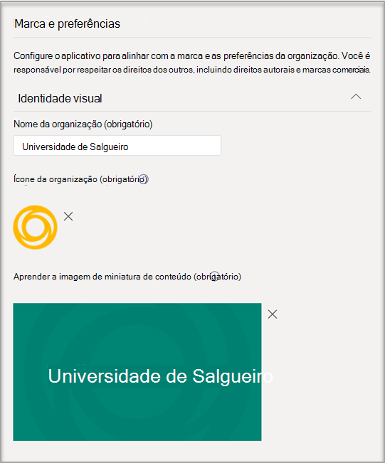
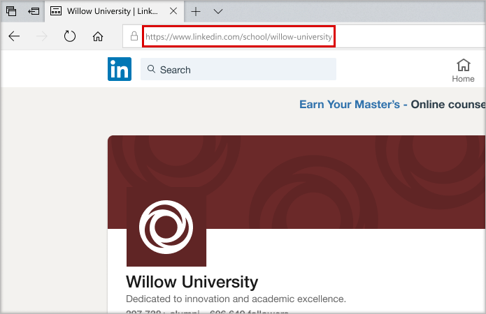

# Comprar, configurar e habilitar Coach de carreira para Microsoft Teams

Coach de carreira é um aplicativo Microsoft Teams para Educação desenvolvido pelo LinkedIn que fornece orientações personalizadas para que os alunos do ensino superior naveguem em sua jornada de carreira. Coach de carreira oferece às instituições educacionais uma solução de carreira unificada para que os alunos descubram seu caminho de carreira, cresçam habilidades do mundo real e criem sua rede em um só lugar.

## Idiomas com suporte

Coach de carreira está localizado nos seguintes idiomas:

- Chinês (Simplificado, China Do Continente)
- Chinês (Tradicional, Taiwan)
- Inglês (EUA)
- Inglês (Reino Unido)
- Francês (Canadá)
- Francês (França)
- Alemão (Deutschland)
- Japonês (Japão)
- Português (Brasil)
- Espanhol (Espanha)
- Espanhol (México)

Saiba mais sobre [Coach de carreira](https://aka.ms/career-coach).

> [!NOTE]
> Use as práticas recomendadas e dicas úteis neste guia para habilitar os recursos do Coach de carreira para alunos, professores e funcionários. Consulte o [artigo guia de planejamento](https://support.microsoft.com/office/c5d0b934-bfcf-4fe7-8a85-ba7bbb1b6ad4) rápido.

## Revisar os requisitos

Para habilitar Coach de carreira para sua instituição educacional, revise o que você precisa para fazer com que o aplicativo seja executado.

**Requisitos técnicos**

- Office 365 locatário com Azure Active Directory

- Microsoft Teams

- Conexões de conta do LinkedIn em Azure Active Directory

**Licenças**

- Docentes

- Alunos

> [!NOTE]
> Uma Coach de carreira de professores deve ser atribuída ao administrador de IT concluindo a configuração.

**Dados e arquivos de sua instituição educacional**

- Dados do catálogo de cursos

- Campos de estudo oferecidos

- Página do LinkedIn da instituição educacional

- Assinatura Learning campus do LinkedIn (preferencial)

## Comprar as Coach de carreira de Coach de carreira

Coach de carreira está disponível em todo o mundo (exceto a China e a Rússia) para instituições de ensino superior qualificadas como uma licença de complemento por meio de Inscrição para Soluções de Educação (EES), Provedores de Serviços de Nuvem (CSP) e Centro de administração do Microsoft 365 (web direct). Como aplicativo Microsoft Teams, os clientes devem ter Microsoft 365 A3/A5 ou Office 365 A1/A3/A5 para comprar a licença de Coach de carreira de complemento.

### Atribuir licenças de aplicativo aos usuários

Para obter instruções passo a passo, consulte [Atribuir licenças aos usuários](/microsoft-365/admin/manage/assign-licenses-to-users).

### Ativar conexões de conta do LinkedIn

Coach de carreira **requer** que os usuários da sua instituição educacional tenham a capacidade de conectar sua conta Microsoft 365 a sua conta do LinkedIn que é facilitada no Coach de carreira

1. Entre no Centro de administração do [Azure AD](https://aad.portal.azure.com/) com uma conta que é um administrador global da organização do Azure AD.

2. Selecione **Usuários**.

3. Na página **Usuários,** selecione **Configurações do usuário**.

4. Em conexões de conta **do LinkedIn,** permita que os usuários conectem suas contas para acessar suas conexões do LinkedIn em alguns aplicativos da Microsoft. Nenhum dado é compartilhado até que os usuários consentam em conectar suas contas.

   - Selecione **Sim** para habilitar o serviço para todos os usuários em sua instituição educacional

   - Selecione **Grupo selecionado** para habilitar o serviço apenas para um grupo de usuários selecionados em sua instituição educacional

   - Selecione **Não** para retirar o consentimento de todos os usuários em sua instituição educacional

Saiba como integrar [conexões de conta do LinkedIn Azure Active Directory](/azure/active-directory/enterprise-users/linkedin-integration)

## Configurar Coach de carreira no centro de Teams de administração

Usando as configurações de administrador no Microsoft Teams de administração, você pode configurar Coach de carreira para sua instituição educacional e habilita-la para os usuários.

**Coisas a considerar**

- As seções a seguir são necessárias para serem concluídas antes que Coach de carreira possam ser usadas - Marca e Preferências, LinkedIn
- CSVs para catálogo de cursos e campo de estudo têm formatos obrigatórios e tamanho máximo de 18 MB

- Se você estiver vendo "Coach de carreira está sendo configurada para você usar em breve" no aplicativo Coach de carreira as seções necessárias não foram concluídas.

- Em páginas de configurações com campos obrigatórios, se os campos não são concluídos, a página não será enviar
  - Os usuários não verão uma mensagem de aviso, a página simplesmente não enviará

## Acessar as configurações Coach de carreira aplicativos

Use a [página Gerenciar aplicativos](/microsoftteams/manage-apps) para exibir os Teams aplicativos no catálogo de aplicativos da sua instituição educacional.

1. Entre no centro de **administração Teams.**

2. Na navegação à esquerda, selecione Teams  >  **aplicativos Gerenciar aplicativos**.  

    > [!NOTE]
    > Você deve ser um administrador global ou Teams de serviço para acessar a página.

3. Pesquise ou **procure Coach de carreira**.  

4. Selecione **Coach de carreira** e selecione **Configurações.**  

    

### Configurar as configurações Coach de carreira aplicativos

Coach de carreira tem cinco categorias de configuração:

- [Marca e preferências](#brand-and-preferences)

- [Conexão LinkedIn](#linkedin-connection)

- [Catálogo de cursos](#course-catalog)

- [Campos de estudo](#fields-of-study)

- [Personalização](#customization)

> [!NOTE]
> Marca e preferências, configuração do LinkedIn,  catálogo de cursos e Campos de estudo são necessários para habilitar efetivamente o aplicativo para alunos, professores e funcionários.

#### Marca e preferências

De definir o nome, o logotipo e o idioma padrão da sua instituição educacional na página de configurações de marca e preferências.

> [!NOTE]
> Esta é uma seção necessária- Coach de carreira não pode ser habilitada sem a Marca e as preferências enviadas.

##### Ícone da instituição educacional

O ícone da instituição educacional é usado em todo o Coach de carreira para identificar conteúdo exclusivo para sua instituição educacional, recursos de catálogo de cursos em todo o aplicativo e na seção experiências do mundo real do painel. O ícone é melhor formatado como:

- Um PNG transparente
- Proporção de 1:1
- Tamanho máximo de 64 px x 64 px.

##### Miniatura da instituição educacional

O ícone da instituição educacional será usado para recursos de catálogo de cursos em todo o aplicativo quando uma imagem específica não estiver disponível para um curso. O ícone é melhor formatado como:

- Um PNG
- Proporção de 16:9
- Tamanho máximo de 360 px x 200 px.

#### Conexão LinkedIn

A configuração do LinkedIn conecta Coach de carreira com dados de ex-alunos públicos do LinkedIn.

> [!NOTE]
> Esta é uma seção necessária Coach de carreira não pode ser habilitada sem a conexão de página do LinkedIn verificada.

##### Adicionar e confirmar a página do LinkedIn

Determine a página do LinkedIn da instituição educacional. Encontre a página do LinkedIn pesquisando no LinkedIn ou conectando-se a um membro da equipe de serviços de carreira para determinar a página correta a ser usada.  
  
1. Entre no centro de **administração Teams.**

1. Selecione **Teams**  >  **aplicativos Gerenciar aplicativos**  >  **Coach de carreira**  >  **conexão LinkedIn**.

2. Encontre a página do LinkedIn pesquisando no LinkedIn e selecionando Filtro escolar. Ou conecte-se a um membro da equipe de serviços de carreira para determinar a página escolar correta do LinkedIn a ser usada. [Como identificar páginas do LinkedIn](https://www.linkedin.com/help/linkedin/answer/40133/differences-between-a-linkedin-page-for-a-school-and-company?lang=en)

    

3. Adicione a URL da página da escola do LinkedIn. A URL deve ser uma página de escola e não uma página da empresa e normalmente formatada como `https://www.linkedin.com/school/willow-university/` .

   

4. Selecione **Enviar**.

5. Se enviada com êxito, a página será atualizada para mostrar o **link Verificação** e **expiração do link Verificação.** O link de verificação expira após 30 dias.

     

6. Copie o link de verificação e compartilhe-o com a página super admin do LinkedIn da sua instituição educacional. Saiba mais sobre a função de super-administrador de página do LinkedIn na documentação [de administrador de página do LinkedIn.](https://www.linkedin.com/help/linkedin/answer/102672)

7. O super administrador de página do LinkedIn usará o link de verificação exclusivo para associar Coach de carreira com a página da sua escola. [Documentação adicional sobre a verificação de página do LinkedIn.](https://www.linkedin.com/help/linkedin/answer/102672)

> [!NOTE]
> A verificação pelo super administrador de página do LinkedIn é necessária para concluir a conexão linkedIn para Coach de carreira.

   

#### Catálogo de cursos

O catálogo de cursos representa os cursos e aulas oferecidos aos alunos pela sua instituição educacional.

> [!NOTE]
> Esta é uma seção necessária- Coach de carreira não pode ser habilitada sem um catálogo de cursos.

Esses cursos são usados dentro do aplicativo em duas áreas:

- Os cursos são retornados como parte dos recursos de aprendizagem.  

- Cursos e metadados de curso, como descrições, são usados para ajudar os alunos a identificar suas habilidades ao carregar uma transcrição.  

Para criar o catálogo de cursos, crie uma lista de todos os cursos ministrados em sua instituição educacional e carregue-o como um arquivo CSV. O aplicativo desenha do catálogo de cursos para identificar as habilidades de um aluno a partir de sua transcrição e sugerir cursos a fazer.

##### Formatação e esquema de documentos do catálogo de cursos

O documento precisa estar no formato CSV com um tamanho máximo de 18 MB. O documento deve conter o título do curso **de** campos necessários , **a ID do** curso e a URL do **curso.** Incluir os campos recomendados melhora a experiência dos alunos retornando melhores resultados de pesquisa e identificação de habilidades.

> [!NOTE]
> Comece com o [documento de catálogo de cursos]( https://aka.ms/career-coach/docs/it-admins/sample-catalog) de exemplo para começar.

A tabela a seguir mostra os itens a incluir no catálogo de cursos:

| Nome             | Status      | Tipo   | Descrição                                                                    |
|------------------|-------------|--------|--------------------------------------------------------------------------------|
| courseId         | Obrigatório    | string | Geralmente, a id do curso (normalmente mapeia para o que é gerado na transcrição). |
| title            | Obrigatório    | string | Geralmente o título do curso.                                                      |
| sourceLink       | Obrigatório    | URL    | Link do site para a página do curso.                                               |
| description      | Recomendado | string | Texto de introdução para o curso.                                              |
| idioma         | Recomendado | string | Idioma do curso. Use códigos de idioma padrão.                           |
| format           | Recomendado | string | Modo de ensino (online, vídeo, pessoalmente).                              |
| thumbnailLink    | Recomendado | URL    | Link em miniatura para a imagem do curso.                                            |
| thumbnailAltText | Recomendado | string | Texto alt de acessibilidade para a imagem                                           |
| educationLevel   | Recomendado | string | Nível de estudo, ex. Graduando/Graduando.                                       |
| tópicos           | Recomendado | string | Tópicos ou marcas associadas às habilidades que os cursos ministram.          |

##### Adicionar o catálogo de cursos

1. Entre no centro de **administração Teams.**

1. Selecione **Teams** &gt; **aplicativos Gerenciar aplicativos** &gt; **Coach de carreira** &gt; **Configurações** catálogo de &gt; **cursos.**  

2. Upload cursos no formato CSV com as colunas necessárias: courseId, title, sourceLink. Cada linha deve incluir dados para cada uma das colunas necessárias.

Incluir os campos recomendados melhora a experiência dos alunos retornando melhores resultados de pesquisa e identificação de habilidades.

4. Selecione **Enviar**.

   

#### Campos de estudo

Os campos de estudo são sinônimos de áreas de interesse principais, de nível acadêmico e de grau. Esses títulos são referenciados pelos alunos quando começam a usar o aplicativo e começam a configurar seu perfil personalizado.

> [!NOTE]
> Esta é uma seção necessária- Coach de carreira não pode ser habilitada sem uma lista de campos de estudo.

Adicione todos os campos de estudo disponíveis para alunos como Engenharia, Inglês, Negócios e assim por diante. A lista de campos permite que os alunos descubram campos de estudo que podem interesse a eles e adicionem sua área de foco ao perfil.

> [!NOTE]
> Comece com o [campo de exemplo do documento de](https://aka.ms/career-coach/docs/it-admins/sample-fieldsofstudy) estudo.

A tabela a seguir mostra os itens a incluir nos campos de estudo:

| Nome          | Status   | Tipo   | Descrição                    |
|---------------|----------|--------|--------------------------------|
| fieldsOfStudy | Obrigatório | string | O nome do campo de estudo |

##### Adicionar os campos de estudo

1. Entre no centro de **administração Teams.**
1. Selecione **Teams** &gt; **aplicativos Gerenciar aplicativos** &gt; **Coach de carreira** &gt; **Configurações** Campos de &gt; **estudo**.  

2. Upload campo de estudo no formato CSV.

3. Selecione **Enviar**.

#### Personalização

Coach de carreira pode ser personalizado para ser exclusivo da sua instituição educacional. A personalização dá suporte à adição de experiências ao painel. É recomendável adicionar links a placas de trabalho, eventos, escritório de serviços de carreira, eventos relacionados à carreira, clubes de alunos e qualquer outro recurso que ajude os alunos a obter experiência no mundo real.

##### Adicionar experiências personalizadas

1. Entre no centro de **administração Teams.**

1. Selecione **Teams** &gt; **aplicativos Gerenciar aplicativos** &gt; **Coach de carreira**  >  **Configurações** &gt; **Personalização.**

2. Adicione cada URL, um título e uma descrição curta.  
  
3. Selecione **Enviar**.

## Disponibilizar Coach de carreira para sua organização

Agora que Coach de carreira foi configurado para sua organização. Siga estas etapas para garantir que o Coach de carreira está disponível para a organização no Microsoft Teams.

### Habilitar o aplicativo

Depois de concluir a configuração, habilita o aplicativo para alunos e usuários licenciados para que eles tenham acesso a Coach de carreira.  
  
> [!NOTE]
> Você deve ter permissões de função de administrador global ou Teams de administrador.

1. Entre no centro de **administração Teams.**

1. Selecione **Teams** &gt; **aplicativos Gerenciar aplicativos** &gt; **Coach de carreira**.

2. Mover a alternância Status para **Permitido**.  

  > [!NOTE]
  > Permitido significa que o aplicativo está disponível para usuários em sua instituição educacional. Bloqueado significa que o aplicativo não está disponível para os alunos.

### Adicionar Coach de carreira como um aplicativo instalado

> [!NOTE]
> Esta etapa garante 1) que o Coach de carreira seja configurado corretamente para sua organização 2) que os alunos encontrem Coach de carreira.

1. Entre no centro de **administração Teams.**

2. Selecione **Teams políticas de instalação de** &gt;  &gt; *aplicativos Sua política*.

3. Em Aplicativos instalados, selecione Adicionar aplicativos.

4. No painel Adicionar aplicativos instalados, pesquise os aplicativos que você deseja instalar automaticamente para os usuários quando eles começarem a Teams. Você também pode filtrar aplicativos por política de permissão do aplicativo. Quando você escolher sua lista de aplicativos, selecione Adicionar.

### Fixar o aplicativo

Fixar Coach de carreira tornar o aplicativo mais acessível e visível para os alunos.

1. Entre no centro de **administração Teams.**

2. Selecione **Teams políticas de instalação de** &gt;  &gt; *aplicativos Sua política*.

3. Em **Aplicativos Fixados,** escolha **Adicionar aplicativos**.

4. Pesquise **Coach de carreira** e selecione **Adicionar**.

5. Escolha a ordem para que o aplicativo apareça e selecione **Salvar**.

> [!NOTE]
> Os alunos serão notificados Microsoft Teams que Coach de carreira foi fixado.

Referência [Gerenciar políticas de configuração de aplicativos na Microsoft](/microsoftteams/teams-app-setup-policies) para obter mais detalhes.

## Removendo seus dados de locatário

Os dados do locatário incluem informações carregadas ou geradas como parte da configuração do aplicativo. Para excluir todos os dados em um Coach de carreira locatário,  solicite que o administrador global do locatário abra um tíquete de suporte solicitando que os dados do locatário sejam excluídos permanentemente. Esteja ciente de que esse processo não é reversível. Depois que a remoção de dados for concluída, o aplicativo Coach de carreira retornará ao estado pré-configurado e não personalizado para todos os usuários e um administrador do Teams precisará configurar o aplicativo novamente para continuar a usá-lo.

O seguinte explica o processo de exclusão:

- Um tíquete de suporte deve ser arquivado por um administrador global do locatário informando claramente a solicitação para que os dados do locatário sejam excluídos permanentemente. **Não há capacidade de limitar o conjunto de dados ou a janela de tempo da exclusão.**

- Depois de arquivado, o tíquete de suporte será endereçado após uma semana para atender à política de retenção mínima da conformidade. Você pode cancelar a operação durante esse período.

- Após uma semana, a equipe Coach de carreira garante que todos os dados relacionados ao locatário serão excluídos. O suporte da Microsoft monitora o tíquete e o notificará depois que o processo de exclusão for concluído, em não mais de **30 dias.**

## Recursos

Os recursos a seguir ajudarão você a planejar seu Coach de carreira aplicativo.

- [Bem-vindo ao Microsoft Teams](Teams-overview.md)

- [Como implantar o Teams](get-started-with-teams-resources-for-org-wide-rollout.md?tabs=SmallBusiness)

- [Visão geral de equipes e canais no Microsoft Teams](teams-channels-overview.md)

- [Gerenciando aplicativos Microsoft Teams Admin Center](manage-apps.md)

- [Kit de Orientação Virtual Online](https://www.microsoft.com/education/remote-learning/virtual-orientation)

- [Limites e especificação de Teams canais](limits-specifications-teams.md)

- [Iniciando o treinamento de administrador para Microsoft Teams](ITAdmin-readiness.md)

- [Solução de problemas do Teams](/microsoftteams/troubleshoot/teams-welcome)

- [Gerenciar políticas de permissões de aplicativo no Microsoft Teams](teams-app-permission-policies.md)
