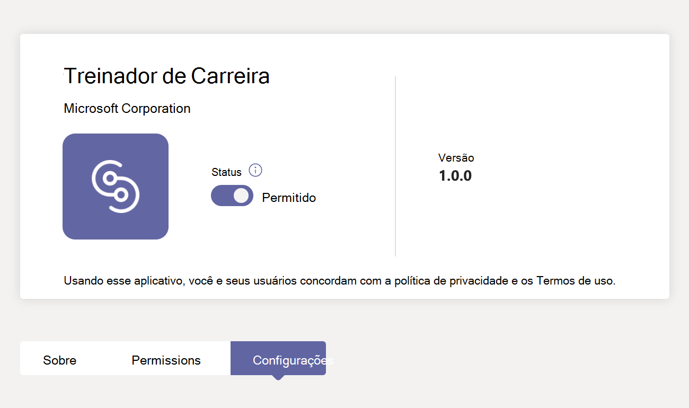
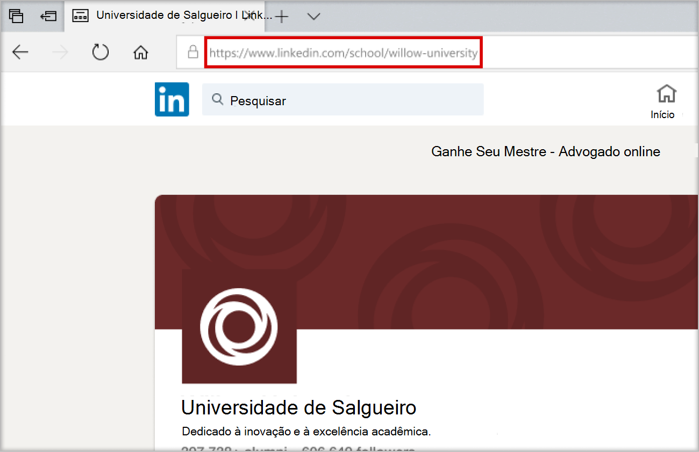
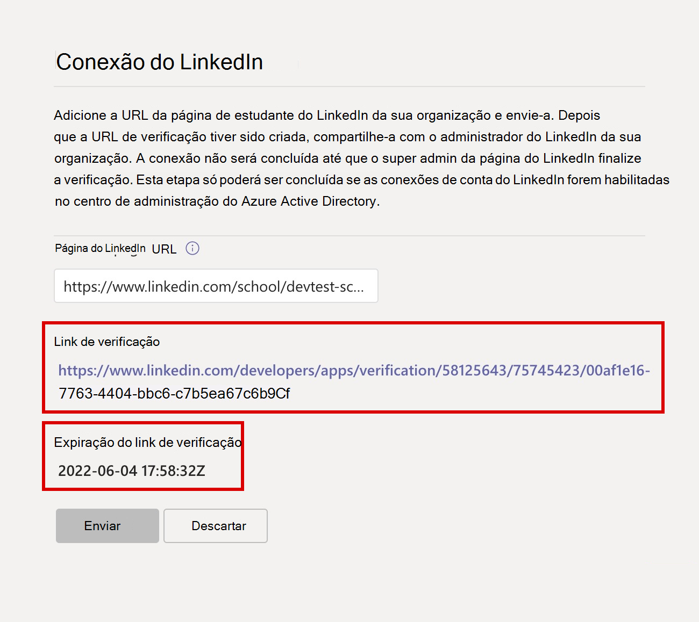

# Comprar, configurar e habilitar o Career Coach para o Microsoft Teams

O Career Coach é um Microsoft Teams para Educação desenvolvido pelo LinkedIn que fornece diretrizes personalizadas para que os alunos do ensino superior naveguem pela jornada de carreira. O Career Coach oferece às instituições de ensino uma solução de carreira unificada para que os alunos descubram seu caminho de carreira, desenvolvam habilidades do mundo real e criem sua rede em um só lugar.

## Idiomas com suporte

O Career Coach está localizado nos seguintes idiomas:

- Chinês (simplificado, China continente)
- Chinês (Tradicional, Taiwan)
- Inglês (EUA)
- Inglês (Reino Unido)
- Francês (Canadá)
- Francês (França)
- Alemão (Deutschland)
- Japonês (Japão)
- Português (Brasil)
- Espanhol (Espanha)
- Espanhol (México)

Saiba mais sobre o [Treinador de Carreiras](https://aka.ms/career-coach).

> [!TIP]
> Use as práticas recomendadas e dicas úteis neste guia para habilitar as funcionalidades do Career Coach para alunos, docentes e funcionários. Consulte o [artigo guia de planejamento](https://support.microsoft.com/office/c5d0b934-bfcf-4fe7-8a85-ba7bbb1b6ad4) rápido.

## Examinar os requisitos

Para habilitar o Career Coach para sua instituição educacional, examine o que você precisa para ter o Career Coach em funcionamento.

### Requisitos técnicos

- Office 365 locatário com o Azure Active Directory com conexões de conta do LinkedIn habilitadas.
- Microsoft Teams.
- Página da Escola do LinkedIn.

### Dados e arquivos de sua instituição educacional

- Logotipo e ativos gráficos da instituição educacional [no formato necessário](#brand-and-preferences).

- Dados do catálogo de cursos. [Exibir arquivo de exemplo](https://aka.ms/career-coach/docs/it-admins/sample-catalog) e [formato de documento](#course-catalog-document-format-and-schema).

- Lista de campos de estudo oferecidos. [Exibir arquivo de exemplo](https://aka.ms/career-coach/docs/it-admins/sample-fieldsofstudy).

- URL da página [do LinkedIn School da instituição educacional](https://www.linkedin.com/help/linkedin/answer/40133/differences-between-a-linkedin-page-for-a-school-and-company?lang=en).

- URL da política de privacidade da instituição educacional.

- A instituição de ensino vincula-se a recursos relacionados à carreira, como um site de serviços de carreira e postagem de trabalho de aluno (opcional).

## Lista de verificação de instalação

Na preparação para lançar o Career Coach para seu locatário, há várias funções de administrador que serão necessárias. Essas funções e permissões podem ser atribuídas a um indivíduo ou podem exigir colaboração com profissionais de TI em sua organização. Use este guia para ajudar a identificar os indivíduos necessários para concluir as tarefas necessárias.

Você pode verificar as funções atribuídas da sua conta visitando o Centro de administração do Microsoft 365 > [usuários](https://go.microsoft.com/fwlink/p/?linkid=834822) > usuários ativos > selecione seu nome de usuário para confirmar sua função.

Saiba mais sobre [as funções de administrador no Centro de administração do Microsoft 365](/microsoft-365/admin/add-users/about-admin-roles).

### [Centro de administração do Microsoft 365](https://go.microsoft.com/fwlink/p/?linkid=2024339)

Função: [Tarefas do Global Administrator](/azure/active-directory/roles/permissions-reference#global-administrator) Career Coach:

- [Comprar licenças](#purchase-career-coach-licenses)
- [Atribuir licenças](#assign-career-coach-licenses-to-users)

### [Centro de administração do Azure Active Directory](https://go.microsoft.com/fwlink/p/?linkid=2067268)

Função: [Tarefa de Treinador de](/azure/active-directory/roles/permissions-reference#global-administrator) Carreira de Administrador Global:

- [Ativar conexões de conta do LinkedIn](#turn-on-linkedin-account-connections)

### [Centro de administração do Teams](https://admin.teams.microsoft.com/dashboard)

Função: Tarefas [do Treinador de Carreira do](/azure/active-directory/roles/permissions-reference#teams-administrator) administrador do Teams:

- [Adicionar o Career Coach como um aplicativo instalado](#add-career-coach-as-an-installed-app)
- [Definir as configurações do aplicativo Career Coach](#configure-career-coach-settings)
  - [Marca e preferências](#brand-and-preferences)  - obrigatório
  - [Conexão do LinkedIn](#linkedin-connection)  - obrigatório
  - [Catálogo de cursos](#course-catalog)  - obrigatório
  - [Campos de estudo](#fields-of-study)  - obrigatório
  - [Personalização](#customization) – opcional
- [Políticas de instalação](#setup-policies-and-pin-the-app)
- [Fixar o aplicativo](#setup-policies-and-pin-the-app)

### Portal do desenvolvedor do LinkedIn

Função: [LinkedIn School Page Super Administração](https://www.linkedin.com/help/linkedin/answer/a541981) Career Coach:

- [Verificar a página da escola do LinkedIn](#verify-the-linkedin-school-page)

## Comprar licenças do Career Coach

### Tipos de licença

O Career Coach requer uma licença para acessar o aplicativo.

Há dois tipos de licença disponíveis.

- A **licença Student foi** projetada para os alunos.
- A **licença docente foi projetada** para docentes, funcionários e profissionais de TI envolvidos no apoio a alunos com o Career Coach.

> [!IMPORTANT]
> Uma licença do **Corpo Docente** do Career Coach deve ser atribuída ao administrador de TI que conclui a configuração.

### Comprar licenças

O Career Coach está disponível em todo o mundo (exceto China e Rússia) para instituições de ensino superior qualificadas como uma licença de complemento por meio do Registro para Soluções de Educação (EES), CSP (Provedores de Serviços de Nuvem) e Centro de administração do Microsoft 365 (web direct).

Como um aplicativo do Microsoft Teams, o locatário deve ter Microsoft 365 A3/A5 ou Office 365 A1/A3/A5 para comprar a licença do Career Coach de complemento. Licenças separadas são oferecidas para alunos e docentes.

### Inscrever-se para uma avaliação gratuita

Uma avaliação gratuita padrão de 90 dias está disponível para 25 alunos e 25 licenças de docentes/funcionários. Uma avaliação está disponível por locatário qualificado. As licenças de avaliação podem ser ativadas Centro de administração do Microsoft 365 locatários qualificados para comprar o Career Coach.

Para a ativação de avaliação, entre [no Centro de administração do Microsoft 365 > de cobrança > serviços de compra > pesquise por Career Coach](https://go.microsoft.com/fwlink/p/?linkid=868433) para encontrar a avaliação de licença  do aluno e a avaliação de licença [do corpo docente](https://signup.microsoft.com/signup?OfferId=6f6e7db5-b9ab-4baa-86be-f13d0ae6a2c8).

## Preparar-se para o Treinador de Carreira

### Ativar conexões de conta do LinkedIn

Há duas maneiras pelas quais as conexões de conta do LinkedIn são usadas pelo Career Coach.

- Para permitir que alunos, docentes e funcionários conectem sua conta do Microsoft 365 à sua conta do LinkedIn e enviem [convites do LinkedIn do Career Coach](https://support.microsoft.com/topic/career-coach-quick-start-guide-for-students-c419db47-9290-4961-9684-c3f86a9b3708#bkmk_connect_your_linkedin_account).
- Para ativar os recursos [Criar sua Rede](https://support.microsoft.com/topic/career-coach-quick-start-guide-for-students-c419db47-9290-4961-9684-c3f86a9b3708#bkmk_build_your_network) e [Explorar Carreiras](https://support.microsoft.com/topic/career-coach-quick-start-guide-for-students-c419db47-9290-4961-9684-c3f86a9b3708#bkmk_discover_your_career_path) usando dados de ex-alunos públicos do LinkedIn.

1. Entre no centro [Azure AD administrador com](https://go.microsoft.com/fwlink/p/?linkid=2067268) uma conta [de administrador global](#setup-checklist) para a Azure AD organização.

2. Selecione **Usuários**.

3. Na página **Usuários** , selecione **Configurações do usuário**.

4. **As conexões de conta do LinkedIn** devem ser definidas como **Sim** ou **Grupo Selecionado** para que o Career Coach seja configurado corretamente.

   - Selecione **Sim** para habilitar o serviço para todos os usuários em sua instituição de ensino.
   - Selecione **o grupo Selecionado** para habilitar o serviço apenas para um grupo de usuários selecionados em sua instituição de ensino.

Para obter mais informações, consulte [conexões de conta do LinkedIn no Azure Active Directory](/azure/active-directory/enterprise-users/linkedin-integration).

> [!NOTE]
> Nenhum dado é compartilhado sem o consentimento do usuário.

### Permitir aplicativos da Microsoft no Teams

O Career Coach é um aplicativo da Microsoft e, portanto, deve ser permitido nas políticas de permissão de aplicativo do Teams.

1. Entre no centro **[de administração do Teams](https://admin.teams.microsoft.com)**.

2. No painel de navegação esquerdo, selecione políticas **de permissão de aplicativos** > **[do](https://admin.teams.microsoft.com/policies/manage-apps)** Teams.

3. Selecione sua política preferida.
    1. Se você não tiver certeza de qual política usar, consulte a documentação de gerenciamento de Políticas do [Microsoft Teams](policy-packages-edu.md) ou use  o assistente de política de Educação para configurar uma política para o Microsoft Teams.

Saiba mais sobre como [configurar políticas de permissão](teams-app-permission-policies.md).

### Adicionar o Career Coach como um aplicativo instalado

Esta etapa garante que o Career Coach esteja configurado corretamente para sua organização e que os alunos localizem o Career Coach.

1. Entre no centro [de administração do Teams](https://go.microsoft.com/fwlink/p/?linkid=2066851).

2. Selecione **políticas de Instalação de aplicativos** > **do** Teams e selecione sua política preferencial.
    1. Se você não tiver certeza de qual política usar, consulte a documentação de gerenciamento de Políticas do [Microsoft Teams](policy-packages-edu.md) ou use  o assistente de política de Educação para configurar uma política para o Microsoft Teams.

3. Em **Aplicativos Instalados**, selecione  **+ Adicionar aplicativos**.

4. No painel **Adicionar aplicativos instalados** , pesquise os aplicativos que você deseja instalar automaticamente para os usuários quando eles iniciarem o Teams. Você também pode filtrar aplicativos por política de permissão de aplicativo.

5. Quando você tiver escolhido sua lista de aplicativos, selecione **Adicionar**.

6. Selecione  **Salvar** > **Confirmar**.

> [!NOTE]
> Editar ou atribuir uma política pode levar algumas horas para que as alterações entre em vigor. O Treinador de Carreira não estará disponível no Microsoft Teams até que as alterações sejam concluídas.

## Definir configurações do Career Coach

### Acessar as configurações do aplicativo Career Coach

Para definir as configurações do Career Coach e habilite-as para os usuários, você deve ser um administrador global ou administrador de serviços do Teams para acessar a página.

1. Entre no centro [de administração do Teams](https://go.microsoft.com/fwlink/p/?linkid=2066851).
2. No painel de navegação esquerdo, selecione Aplicativos **do Teams Gerenciar** > **aplicativos**.
3. Pesquise ou procure o **Career Coach**.
4. Selecione **Career Coach** e, em seguida **, Configurações**.

### Categorias de configuração do Career Coach

Para habilitar efetivamente o Career Coach para alunos, docentes e funcionários, as seguintes configurações são necessárias:

- [Marca e preferências](#brand-and-preferences)
- [Conexão do LinkedIn](#linkedin-connection)
- [Catálogo de cursos](#course-catalog)
- [Campos de estudo](#fields-of-study)

Você também pode definir [configurações opcionais de Personalização](#customization) .

> [!TIP]
> Navegue rapidamente de uma categoria para outra selecionando **o caminho do Career Coach** localizado na parte superior da página no formato `Manage apps\Career Coach\Setting label`.

### Marca e preferências

Personalize o Career Coach para corresponder à marca da sua instituição de ensino. Você é responsável por respeitar os direitos dos outros, incluindo direitos autorais e de marca registrada.

> [!IMPORTANT]
> Esta é uma seção obrigatória. O Career Coach não pode ser habilitado sem **marca e preferências** enviadas.

1. Entre no centro **[de administração do Teams](https://go.microsoft.com/fwlink/p/?linkid=2066851)**.

2. Selecione **Aplicativos do** >  Teams **Gerenciar aplicativos** >  > **Configurações do Career Coach** > **Editar marca e preferências**.

3. Em **Identidade Visual**, adicione o **nome da organização**.

4. Carregue o **ícone organização**. O ícone é usado em todo o Career Coach para identificar conteúdo exclusivo para sua instituição educacional, recursos do catálogo de cursos em todo o aplicativo e na seção experiências do mundo real do painel.

    O ícone é melhor formatado como:

    - Um PNG transparente
    - Taxa de proporção de 1:1
    - Tamanho máximo de 64 px x 64 px

5. Carregue a **imagem em miniatura do conteúdo do Learning**. A miniatura será usada para recursos de aprendizagem do catálogo de cursos em todo o aplicativo quando uma imagem específica não for especificada para um curso oferecido pela instituição de ensino.

    A miniatura é melhor formatada como:

    - Um PNG
    - Taxa de proporção de 16:9
    - Tamanho máximo de 360 px x 200 px

6. Adicione a **URL da política de privacidade da organização**. Se adicionada, a política de privacidade da instituição estará disponível para os alunos revisarem no Career Coach.

7. Selecione **Enviar**.

8. Para confirmar se as configurações foram enviadas com êxito, verifique o status de configuração do [Career Coach](#configuration-status) como **Concluído**.

### Conexão do LinkedIn

A configuração de conexão do LinkedIn conecta o Career Coach aos dados de ex-alunos públicos da Página da Escola do LinkedIn da sua instituição.

Esta etapa só poderá ser concluída se as [conexões de conta do LinkedIn forem habilitadas no Azure Active Directory](#turn-on-linkedin-account-connections). A configuração de conexão do LinkedIn [habilita os recursos Criar sua Rede](https://support.microsoft.com/topic/career-coach-quick-start-guide-for-students-c419db47-9290-4961-9684-c3f86a9b3708#bkmk_build_your_network) e [Explorar Carreiras](https://support.microsoft.com/topic/career-coach-quick-start-guide-for-students-c419db47-9290-4961-9684-c3f86a9b3708#bkmk_discover_your_career_path) .

> [!IMPORTANT]
> Esta é uma seção obrigatória. O Career Coach não pode ser habilitado sem a conexão da Página da Escola do LinkedIn verificada.

#### Adicionar a URL da Página da Escola do LinkedIn

O processo de adicionar a URL da Página da Escola do LinkedIn é tratado por um Administrador do Teams. A etapa subsequente da verificação da URL é concluída pelo administrador do LinkedIn School Page Super da instituição de ensino.

1. Entre no centro **[de administração do Teams](https://go.microsoft.com/fwlink/p/?linkid=2066851)**.

2. Selecione **aplicativos do Teams Para** > **gerenciar aplicativos** > **configurações do** Career **Coach** >  conexão  > **linkedIn**.

3. Selecione **Conectar ao LinkedIn**.

4. Localize a Página da Escola do LinkedIn da sua instituição pesquisando no LinkedIn e selecionando o **filtro** Escola. Ou conecte-se com um membro da equipe de marketing em sua instituição para determinar a Página da Escola do LinkedIn correta a ser usada. Para obter mais informações, [consulte Como identificar páginas do LinkedIn](https://www.linkedin.com/help/linkedin/answer/40133/differences-between-a-linkedin-page-for-a-school-and-company?lang=en).

    

5. Adicione a **URL da Página da Escola do LinkedIn**. A URL deve ser uma *página de escola*, não uma *página* da empresa e normalmente é formatada como `https://www.linkedin.com/school/willow-university/`.

   

6. Selecione **Enviar**.

7. Depois que **a URL da** Página da Escola do LinkedIn for enviada com êxito, a página de configurações será atualizada para mostrar o  **link** verificação e a  **expiração do link de verificação**. O link de verificação expira após 30 dias.

8. Copie o **link verificação** e compartilhe-o com o Super admin do LinkedIn School Page da instituição de ensino.

9. O administrador do LinkedIn School Page Super usará o link de verificação exclusivo para verificar a Página da Escola do [LinkedIn](#verify-the-linkedin-school-page) e associá-la ao Career Coach.

10. Para confirmar se a verificação e as configurações foram enviadas com êxito, verifique se o status de configuração do [Career Coach](#configuration-status) está marcado como **Concluído**.

#### Verificar a página da escola do LinkedIn

A verificação da Página da Escola do LinkedIn deve ser concluída pelo administrador do [LinkedIn School Page Super da instituição educacional](https://www.linkedin.com/help/linkedin/answer/a541981).

Você pode verificar as funções de administrador da sua conta do LinkedIn entrando no LinkedIn e visitando a Página da Escola do LinkedIn da instituição de ensino. Se sua conta receber uma função de Super admin, você verá o modo de exibição **Super admin** listado ao lado do nome da sua instituição educacional na página do LinkedIn. Se você não vir a marca de exibição **Super admin** , então você não é um Super admin para a página da sua escola.

1. Depois que **a URL da Página da Escola do LinkedIn** for enviada pelo administrador do Teams, a página mostrará o **link** verificação e a **expiração do link de verificação**. O link de verificação expira após 30 dias.

     

2. Copie o link de verificação e compartilhe-o com seu Administrador do LinkedIn School Page Super.

3. O Super admin da página do LinkedIn abrirá o link de verificação para associar o Career Coach à página da sua escola. Para obter mais informações, consulte [a documentação adicional sobre a verificação de página do LinkedIn](https://www.linkedin.com/help/linkedin/answer/102672).

4. Depois que a verificação for concluída, o administrador do Teams poderá exibir se as configurações foram enviadas com êxito verificando se o status de configuração do [Career Coach](#configuration-status) está marcado como **Concluído**.

   

### Catálogo de cursos

O catálogo de cursos registra os cursos e aulas oferecidos pela instituição de ensino.

O Orientador de Carreiras usa dados do catálogo de cursos para identificar as habilidades de um aluno de sua transcrição e sugerir cursos a serem ministrados.

> [!IMPORTANT]
> Esta é uma seção obrigatória. O Career Coach não pode ser habilitado sem um catálogo de cursos.

Esses cursos são usados no Career Coach em duas áreas:

- Os cursos são retornados como parte dos [recursos de aprendizado](https://support.microsoft.com/topic/career-coach-quick-start-guide-for-students-c419db47-9290-4961-9684-c3f86a9b3708#bkmk_grow_real_world_skills).  

- Os cursos e os metadados do curso, como títulos e descrições do curso, são usados para ajudar os alunos a identificar suas habilidades ao [carregar uma transcrição](https://support.microsoft.com/topic/career-coach-quick-start-guide-for-students-c419db47-9290-4961-9684-c3f86a9b3708#bkmk_Set_up_your_profile).

Para criar o catálogo de cursos, crie uma lista de todos os cursos ministrados em sua instituição de ensino e carregue-o como um arquivo CSV usando o formato e o esquema do documento do catálogo de [cursos](#course-catalog-document-format-and-schema).

> [!TIP]
> Comece com o documento [de catálogo de cursos de](https://aka.ms/career-coach/docs/it-admins/sample-catalog) exemplo para garantir a formatação adequada.Você também pode referenciar o [formato do documento](#course-catalog-document-format-and-schema) do catálogo de cursos e as seções de esquema para obter detalhes sobre os campos obrigatórios e recomendados.

#### Adicionar o catálogo de cursos

1. Entre no centro **[de administração do Teams](https://go.microsoft.com/fwlink/p/?linkid=2066851)**.

2. Selecione **aplicativos do** >  Teams **Gerenciar aplicativos >** **de Cursos** >  de **Treinamento de Carreira de** > **Pesquisa**.

3. Selecione **Carregar Catálogo de** Cursos > Carregar cursos no formato CSV com as colunas necessárias: courseId, title e sourceLink.
    1. Cada linha deve incluir dados para cada uma das colunas necessárias.
    1. *Incluir os campos recomendados melhora a experiência para os alunos retornando melhores resultados de pesquisa e identificação de habilidades.*

4. Uma visualização de uma seção do catálogo de cursos carregado será exibida para sua referência.

5. Selecione **Enviar** quando estiver pronto.

6. O [status do documento carregado é](#course-catalog-status) mostrado na página de configurações.

7. Para confirmar se as configurações foram enviadas com êxito, verifique se o status de configuração do [Career Coach](#configuration-status) está marcado como **Concluído**.

> [!TIP]
> Para carregar um novo arquivo, verifique se o último arquivo está limpo selecionando (X) para fechar a visualização do documento. Essa ação permitirá que o **botão Carregar** seja exibido novamente.

#### Formato e esquema do documento do catálogo de cursos

O documento precisa estar no formato CSV com um tamanho máximo de 18 MB. Arquivos grandes devem ser divididos em vários arquivos menores que incluem um máximo de 15.000 linhas para processamento bem-sucedido.

O documento deve conter os metadados de curso necessários: título **do** curso,  **ID do curso** e  **URL do curso**.

> [!TIP]
> Comece com o documento [de catálogo de cursos de]( https://aka.ms/career-coach/docs/it-admins/sample-catalog) exemplo para garantir a formatação adequada. *Incluir os campos recomendados melhora a experiência para os alunos retornando melhores resultados de pesquisa e identificação de habilidades.*

A tabela a seguir mostra os itens a serem incluídos no catálogo de cursos:

| Nome             | Status      | Tipo   | Descrição                                                                    |
|------------------|-------------|--------|--------------------------------------------------------------------------------|
| courseId         | Obrigatório    | String | A courseId é mapeada para o que é gerado na transcrição do aluno.             |
| Título            | Obrigatório    | String | O título do curso.                                                              |
| sourceLink       | Obrigatório    | URL    | Link do site para a página do curso para saber mais sobre o curso e o syllabus.   |
| Descrição      | Recomendado | String | Texto de introdução para o curso que descreve os objetivos de aprendizado.       |
| idioma         | Recomendado | String | Idioma do curso. Use códigos de idioma padrão.                           |
| Formato           | Recomendado | String | Modo de ensino (online, vídeo, pessoalmente).                                   |
| thumbnailLink    | Recomendado | URL    | Link em miniatura para a imagem do curso.                                            |
| thumbnailAltText | Recomendado | String | Texto Alt de acessibilidade para a imagem                                           |
| educationLevel   | Recomendado | String | Nível de estudo, por exemplo. Graduação/Pós-Graduação.                                       |
| Tópicos           | Recomendado | String | Tópicos ou marcas associadas às habilidades que os cursos ensinam.          |

### Status do catálogo de cursos

O status do catálogo de cursos é mostrado na página de configurações do catálogo de cursos depois que um documento é carregado, fornecendo detalhes do status de carregamento e processamento do documento.

Durante o processamento, o Career Coach analisará o documento em caso de duplicatas, normalizará e enriquecerá seu catálogo extraindo habilidades de títulos e descrições e o armazenará para uso na página do Learn e durante os carregamentos de transcrição do aluno para identificação de habilidades.

| Coluna           | Valor     | Descrição                                                                                        |
| ---------------- | --------- | -------------------------------------------------------------------------------------------------- |
| Tempo carregado    | Timestamp | Data e hora em que um administrador de TI carregou um documento.                                                     |
| Tempo concluído   | Timestamp | Data e hora em que o documento foi completamente processado.                                               |
| Cursos carregados | Inteiro   | Número de cursos encontrados no documento.                                                           |
| Status da ingestão | Pendente   | Documento na fila para processamento.                                                                  |
| Status da ingestão | Executando   | O documento está sendo processado no momento. Esse processo pode levar até 6 horas, dependendo do tamanho do documento. |
| Status da ingestão | Sucesso   | O processo de ingestão foi concluído e os cursos estarão disponíveis no Career Coach depois que todas as configurações necessárias forem definidas. |
| Status da ingestão | Falhou    | Verifique o formato do documento e recarregue.                                                           |
| Duplicatas       | Inteiro   | Número de cursos duplicados encontrados no documento.                                                 |

> [!NOTE]
> Se uma coluna no status do catálogo de cursos estiver em branco, o documento está sendo processado no momento e esses valores não estão disponíveis. Esse processo pode levar até 6 horas, dependendo do tamanho do catálogo. Depois que o documento for processado, os valores serão preenchidos. Você pode atualizar a página para verificar se há atualizações.

### Campos de estudo

Os campos de estudo são sinônimos das principais áreas de interesse, programas acadêmicos de graduação e graduação. Esses campos de estudo são referenciados pelos alunos quando começam a usar o Career Coach e começam a configurar seu perfil personalizado.

A lista de campos permite que os alunos descubram campos de estudo que possam interessa-los e adicionem seu foco acadêmico planejado ao seu perfil no Career Coach.

> [!IMPORTANT]
> Esta é uma seção obrigatória. O Treinador de Carreira não pode ser habilitado sem uma lista de campos de estudo.
>
> Adicionar todos os campos de estudo disponíveis para alunos como Engenharia, Inglês, Negócios e assim por diante

#### Adicionar os campos de estudo

1. Entre no centro **[de administração do Teams](https://go.microsoft.com/fwlink/p/?linkid=2066851)**.

2. Selecione **Os aplicativos do** >  Teams **Gerenciam aplicativos** > campos de **estudo** do **Search Career Coach** >  >  .

3. Selecione **Carregar** para carregar os campos do arquivo de estudo no formato CSV. Uma visualização dos campos do documento de estudo será exibida.

4. Selecione **Enviar**.

5. Para confirmar se as configurações foram enviadas com êxito, verifique se o status de configuração do [Career Coach](#configuration-status) está marcado como **Concluído**.

#### Campos de formato e esquema de documento de estudo

O documento precisa estar no formato CSV com um tamanho máximo de 18 MB. O documento deve conter os metadados necessários: **Nome do campo de estudo**.

A tabela a seguir mostra os itens a serem incluídos nos campos de estudo:

| Nome          | Status   | Tipo   | Descrição                    |
|---------------|----------|--------|--------------------------------|
| fieldsOfStudy | Obrigatório | String | O nome do campo de estudo |

### Personalização

A configuração de Personalização dá suporte à adição de oportunidades para obter experiências do mundo real ao painel que sua instituição educacional oferece aos alunos.

Os links recomendados para incluir são aqueles que ajudam os alunos a obter experiência no mundo real, como quadros de trabalho, eventos, escritório de serviços de carreira, eventos relacionados à carreira e clubes de alunos.

1. Entre no centro **[de administração do Teams](https://go.microsoft.com/fwlink/p/?linkid=2066851)**.

2. Selecione **Aplicativos do** >  Teams **Gerenciar aplicativos** > **Configurações do Treinador de** > **Carreira de Pesquisa**.

3. Selecione **Personalizar a experiência** > **+ Adicionar**

4. Adicione cada **título**, **URL e** **descrição da dica de informações** > Selecionar **Aplicar**.

5. Uma visualização das informações adicionadas será exibida.

6. Selecione **Enviar**.

## Status das configurações do Career Coach

A página de configurações do Career Coach no Centro de administração do Teams fornece um resumo do status das etapas incompletas, pendentes, concluídas e com falha para configurar o Career Coach.

A mensagem de status pode ajudá-lo a determinar se o Career Coach está configurado corretamente e pronto para ser lançado para seu locatário.

### Status da configuração

A seção de status de configuração da página de configurações do aplicativo exibirá o status em tempo real usando a legenda a seguir.

| Categoria                    | Status                                        | Descrição                                                 |
| --------------------------- | --------------------------------------------- | ----------------------------------------------------------- |
| Status de provisionamento de serviço | O Career Coach está inicializando seu locatário.     | O provisionamento de serviço ocorre automaticamente ao acessar a página de configurações do Career Coach. As alterações de configuração não serão aceitas até que a configuração inicial seja concluída. O tempo estimado para provisionamento de serviço é de até 15 minutos. |
| Status de provisionamento de serviço | O Treinador de Carreira está pronto para ser configurado.       | A página de configurações do Career Coach está pronta para o administrador de TI enviar configurações. |
| Marca e preferências       | Não iniciado                                   | As configurações precisam ser enviadas. |
| Marca e preferências       | Ausente: ícone de aprendizado                        | Carregue a imagem em miniatura de conteúdo de aprendizado ausente. |
| Marca e preferências       | Ausente: logotipo                                 | Carregue o ícone de organização ausente. |
| Marca e preferências       | Ausente: nome da instituição                     | Carregue o nome da organização ausente. |
| Marca e preferências       | Completa                                      | Nenhuma ação adicional é necessária. A configuração foi concluída. |
| Upload do catálogo de cursos       | Não iniciado                                   | O CSV do catálogo de cursos precisa ser enviado. |
| Upload do catálogo de cursos       | Ausente: um carregamento bem-sucedido do catálogo de cursos   | Verifique o status do catálogo de cursos para obter detalhes sobre o processamento do catálogo de cursos. |
| Upload do catálogo de cursos       | Completa                                      | Nenhuma ação adicional é necessária. A configuração foi concluída. |
| Conexão escolar do LinkedIn  | Não iniciado                                   | A URL da Página da Escola do LinkedIn precisa ser enviada. |
| Conexão escolar do LinkedIn  | Ausente: uma URL de página do LinkedIn School aprovada | Aguardando aprovação de verificação do Administrador do LinkedIn School Page Super. |
| Conexão escolar do LinkedIn  | Completa                                      | Nenhuma ação adicional é necessária. A configuração foi concluída. |
| Campos de carregamento de estudo      | Não iniciado                                   | O campo de estudo CSV precisa ser enviado. |
| Campos de carregamento de estudo      | Ausente: áreas de interesse                    | Verifique se o campo de carregamento do estudo foi bem-sucedido. |
| Campos de carregamento de estudo      | Completa                                      | Nenhuma ação adicional é necessária. A configuração foi concluída. |

> [!NOTE]
> Depois que todas as etapas necessárias forem marcadas como concluídas, o Career Coach poderá ser lançado com êxito para seu locatário.

## Disponibilizando o Career Coach para sua organização

Neste ponto, o Career Coach foi configurado para sua organização.

Em seguida, siga estas etapas para garantir que o Career Coach esteja disponível para sua organização no Microsoft Teams.

### Atribuir licenças do Career Coach aos usuários

Para obter instruções passo a passo, consulte [Atribuir licenças aos usuários](/microsoft-365/admin/manage/assign-licenses-to-users).

### Configurar políticas e fixar o aplicativo

Fixar o Career Coach o adicionará ao trilho esquerdo da janela do Microsoft Teams para torná-lo mais acessível e visível para os alunos. Se você preferir fixar o Career Coach para um subconjunto de seus usuários, será necessário implementar uma política de [instalação com esse](teams-app-setup-policies.md) grupo incluído.

1. Entre no centro **[de administração do Teams](https://go.microsoft.com/fwlink/p/?linkid=2066851)**.

2. Selecione **políticas de Instalação de aplicativos** > **do** Teams e selecione sua política preferencial.

    Se você não tiver certeza de qual política usar, consulte a documentação de gerenciamento de Políticas do [Microsoft Teams](policy-packages-edu.md) ou  use o assistente de política de Educação para configurar uma política para o Microsoft Teams.

3. Em **Aplicativos Fixados**, escolha **Adicionar aplicativos**.

4. Selecione sua política preferida em **Pesquisar com base nesta política de permissão de aplicativo**.

5. **Pesquise Career Coach** **em Pesquisar por nome** e selecione  **Adicionar** > **para** fechar o painel.

6. Escolha o pedido para que o aplicativo apareça e selecione **Confirmar**.

> [!NOTE]
> Os alunos serão notificados no Microsoft Teams de que o Career Coach foi fixado.

## Acessibilidade no Career Coach

O Career Coach tem a responsabilidade de criar uma experiência acessível para todos os usuários. O Career Coach está em conformidade com o WCAG 2.1 A, AA e AAA e adota todos os padrões globais de acessibilidade.

Os recursos de acessibilidade do Career Coach incluem:

- Uma estrutura de título lógico e indicadores de foco claro para dar suporte à navegação por mouse, teclado ou voz.
- Ignore os links para permitir que os usuários acessem recursos importantes mais rapidamente.
- Texto claro e conciso para tornar a leitura e compreensão do Career Coach simples para todos os usuários.
- Contraste de cores com modos escuro e alto contraste para necessidades e preferências diversificadas.
- Uma experiência de usuário de tamanho certo que é verificada em todos os formatos (PC, Mac, Android e iPhone) usando os Testadores Confiáveis [da Seção 508](https://www.dhs.gov/trusted-tester).

## Solução de problemas

### Dados de configuração necessários ausentes

Se você vir "O Career Coach está sendo configurado para uso em breve" na experiência do Career Coach, todos os dados de configuração necessários não **foram adicionados**.

As **seções a seguir devem ser concluídas antes** que o Career Coach possa ser usado:

- [Marca e preferências](#brand-and-preferences)
- [Conexão do LinkedIn](#linkedin-connection)
- [Catálogo de cursos](#course-catalog)
- [Campos de estudo](#fields-of-study)

Consulte o status [de configuração do Career Coach](#configuration-status) para ver quais configurações precisam ser concluídas.

### Formatação incorreta do catálogo de cursos ou campos de dados de estudo

Os CSVs para o catálogo de cursos e o campo de estudo têm formatos obrigatórios e um tamanho máximo de 18 MB.

Consulte o esquema do documento do [catálogo de cursos](#course-catalog-document-format-and-schema) do Career Coach e os campos De coach de carreira do esquema de documento de [estudo](#fields-of-study-document-format-and-schema) para garantir a configuração adequada.

Além disso, um arquivo de catálogo de cursos não deve ter mais de 15.000 linhas para garantir o processamento bem-sucedido.

### Campos ausentes nas páginas de configurações do Career Coach

As páginas de configurações do Career Coach têm campos obrigatórios. Se os campos necessários não forem concluídos, a página não enviará.

Talvez você não veja uma mensagem de aviso; a página não enviará.

O envio é bem-sucedido quando você vê uma faixa verde na parte superior da página.

### As alterações da política de instalação não foram concluídas

Se o Career Coach não estiver sendo exibido no Microsoft Teams para usuários, as alterações da política de configuração poderão ainda não ter efeito. O Career Coach não será instalado e fixado para usuários no Microsoft Teams até que as alterações da política de configuração entre em vigor. As alterações de política podem levar algumas horas para entrar em vigor.

No entanto, o Career Coach pode ser instalado diretamente da loja de aplicativos do Microsoft Teams.

- Se os usuários não puderem encontrar o Career Coach na loja de aplicativos do Microsoft Teams, examine as políticas de permissão do aplicativo e verifique se o Career Coach não é um aplicativo bloqueado.
- O Career Coach é um aplicativo da Microsoft e é uma prática recomendada permitir aplicativos da Microsoft por políticas de permissão. Saiba mais sobre como [configurar políticas de permissão](teams-app-permission-policies.md).

### A inicialização do Career Coach não foi concluída

Você pode encontrar o seguinte erro: "Não é possível recuperar as configurações do aplicativo. Tente novamente. Se você continuar com problemas, entre em contato com o atendimento ao cliente da Microsoft."

Verifique o **status de Provisionamento de Serviço** na página de configurações do Career Coach.

Se o locatário ainda estiver sendo inicializado, aguarde 15 minutos e tente novamente. Abra um tíquete de suporte se você ainda receber o erro.

## Recursos

Os recursos a seguir ajudarão você a planejar a implementação do Career Coach com o Microsoft Teams.

- [Guia de planejamento rápido do Treinador de Carreira](https://support.microsoft.com/topic/career-coach-quick-planning-guide-c5d0b934-bfcf-4fe7-8a85-ba7bbb1b6ad4)
- [Guia de início rápido do Treinador de Carreiras para alunos](https://support.microsoft.com/topic/career-coach-quick-start-guide-for-students-c419db47-9290-4961-9684-c3f86a9b3708)
- [Envolver os alunos com planos de aula do Career Coach](https://support.microsoft.com/topic/get-started-with-career-coach-goals-and-activities-086ce412-05de-4259-a9fd-c96471cef1b0?preview=true)
- [Bem-vindo ao Microsoft Teams](Teams-overview.md)
- [Como implantar o Teams](get-started-with-teams-resources-for-org-wide-rollout.md?tabs=SmallBusiness)
- [Visão geral de equipes e canais no Microsoft Teams](teams-channels-overview.md)
- [Gerenciando aplicativos no Centro de administração do Microsoft Teams](manage-apps.md)
- [Introdução ao treinamento de administrador para o Microsoft Teams](ITAdmin-readiness.md)
- [Solução de problemas do Teams](/microsoftteams/troubleshoot/teams-welcome)
- [Gerenciar políticas de permissões de aplicativo no Microsoft Teams](teams-app-permission-policies.md)
