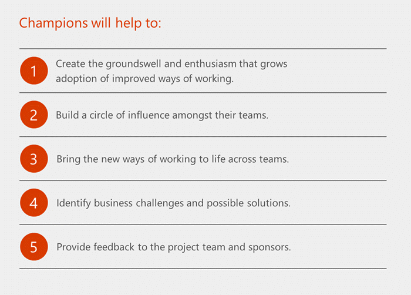

# Criar uma estratégia de gerenciamento de mudanças para o Microsoft Teams

Uma estratégia de gerenciamento de mudanças para a conscientização dos usuários finais e a adoção de novas tecnologias é fundamental para a distribuição bem-sucedida de qualquer nova tecnologia em uma organização. A conclusão com êxito desse esforço assegurará a adoção e a satisfação dos usuários da nova experiência.  As etapas identificadas abaixo podem ser alteradas, dependendo do tamanho da empresa. No entanto, é primordial assegurar uma comunicação contínua com os participantes, defensores, administradores de TI e usuários para implementar uma mudança bem-sucedida.  

Boas práticas de gerenciamento de mudanças para os Teams:

1.  Identifique os principais participantes, defensores e perfis de usuários

2.  Identifique e selecione os cenários comerciais

3.  Realize um piloto que inclua usuários comerciais, defensores e profissionais de TI.  

4.  Projete, lance e gerencie a campanha de adoção. Baixe o nosso [Kit de Sucesso do Cliente](./planning-workshop-practical-guide.md) para começar. Uma boa campanha de adoção, inclui:

    a.  Materiais de conscientização interna, como pôsteres, painéis digitais e eventos.

    b.  Informações de autoajuda e treinamentos em um só local

    c.  Um mecanismo de comentário definido

    d.  Medidas predefinidas de sucesso (adoção de solução, visualização dos principais materiais, presença em cursos)

4.  Crie um programa de defensores em conjunto com a implantação do serviço

5.  Oferecer um método de feedback padrão

6.  Mensurar e compartilhar o sucesso

7.  Ajustar suas mensagens e métodos baseados em feedback, repetir.

## Identifique os principais participantes, defensores e perfis de usuários

A primeira regra de uma adoção bem-sucedida é criar uma equipe dinâmica composta pelos principais participantes e pessoas certas capazes de motivar e produzir mudanças em outras. Uma estratégia de adoção bem-sucedida começa com uma equipe de indivíduos comprometidos que representam uma seção transversal da sua organização. As funções dos participantes incluem um patrocinador executivo, proprietários de serviços, profissionais de TI e defensores.

|Ícone  |Descrição  |
|---------|---------|
|     |Os **Patrocinadores executivos** são líderes importantes dentro da organização e a participação deles é essencial para direcionar a adoção pelos funcionários. Eles têm a maior influência na cultura da empresa e conseguem comunicar ativamente o valor e os benefícios de uma nova tecnologia e de um novo caminho.         |
|     |Os **proprietários de serviços** são responsáveis por garantir que as pessoas usem o serviço e obtenham valor dele. Definir proprietários de serviços em sua organização é importante para garantir que as metas de negócios definidas para o Microsoft 365 ou Office 365 sejam realizadas.         |
|     |Obter a aceitação de todos os usuários de uma organização é um desafio. **Os** campeões podem ajudar a aliviar esse desafio e desempenhar um papel importante na adoção do Microsoft 365 ou Office 365. Eles são experientes, comprometidos em promover seus conhecimentos e estão dispostos a oferecer coaching e assistência aos pares. Eles ajudam a traduzir o Microsoft 365 ou Office 365 na realidade de seu departamento ou equipe.         |

Recomendamos a realização de uma reunião regular dessas partes envolvidas para mantê-las atualizadas sobre o progresso do seu programa. Iniciar um "conselho de colaboração" para permitir comentários e discussões pode ser uma ferramenta útil, dependendo da cultura corporativa.

> [!TIP]
> As pessoas que podem ser os maiores obstáculos de mudança podem se tornar seus melhores aliados em uma implantação desse tipo. Recomendamos que você se envolva com esses membros da organização o quanto antes e com bastante frequência para ouvir suas preocupações e problemas. Muitas vezes, eles têm feedbacks valiosos que aumentarão o sucesso da sua campanha.

## Perfis de usuários

É igualmente importante compreender os tipos de usuários do seu ambiente. Você tem usuários trabalham muito externamente? Há alguns que estão constantemente em reuniões ou que fazem apresentações? Você sabe quais dos seus usuários têm mais dificuldades com as suas soluções de colaboração existentes? A segmentação da sua comunidade de usuários pode ajudar você a encontrar grupos que estão mais abertos para mudanças. Eles costumam ser os melhores alvos para os seus primeiros pilotos de negócios e o feedback deles costuma ser extremamente valioso.

Compreender o cotidiano na vida dos seus usuários ajudará você a priorizar seus resultados comerciais, projetar metas de adoção apropriadas para a sua implantação e manter o uso ao longo do tempo.

## Defensores

Identificar os indivíduos que podem se tornar seus defensores de colaboração lhe proporciona uma equipe de suporte avançada para a sua implementação. Crie uma comunidade, lhes fornecendo insights antecipados e feedback dos seus planos. Todos os investimentos que você fizer nessa comunidade, seja tempo, atenção ou recompensas serão devolvidos à sua implementação por meio de seu apoio e zelo.

Para saber como construir um programa de defensores, obtenha o [Programa de construção de defensores](https://go.microsoft.com/fwlink/?linkid=854665).

## Identifique e selecione os cenários comerciais

Após identificar os principais participantes e segmentos de usuários, será muito mais fácil identificar seus cenários comerciais. Seguem alguns exemplos de resultados comerciais:

-   Simplifique o processo de venda

-   Acelere a solução dos problemas dos clientes

-   Aumente a participação do funcionário

-   Diminua os ciclos de desenvolvimento de produto

O pessoal de vendas está com problemas de se coordenar para proporcionar uma excelente experiência? Você precisa ter uma coordenação melhor da entrega do seu produto ou serviço? E as experiências relacionadas com o Recursos Humanos (RH) para os seus próprios funcionários? Cada organização encontrará suas próprias prioridades. Recomendamos selecionar não mais do que três problemas para serem abordados nos seus pilotos iniciais e incluir usuários e profissionais comerciais destas organizações específicas. 

Também é aconselhável considerar os usuários que estão incorporados nesses cenários. Eles estão abertos a mudanças? Eles são usuários externos ou que trabalham nas suas instalações? Qual a proximidade deles com os patrocinadores executivos e defensores que lhes darão suporte? Eles têm alguma comunidade e métodos de comunicação existentes que você pode usar para zelar essa mudança?  

Os projetos de tecnologia se tornam um desafio quando pouca ou nenhuma atenção é dada às necessidades humanas de gerenciamento de mudanças. Ao seguir essas recomendações, você aumentará suas chances de sucesso!

## Projetar, lançar e gerenciar a adoção da sua campanha

Para os seus pilotos iniciais e para a sua distribuição final na empresa, suas comunicações internas devem ser uma prioridade. Elas incluem:

-   Materiais de conscientização interna, como pôsteres, sinalização digital e eventos.

-   Incorporar informações de autoajuda e treinamentos em um só local.

Para as suas fases pilotos, estes são as etapas mais básicas de sucesso:

-   Conduzir reuniões agendadas regulares com as partes envolvidas do seu projeto para tratar das atualizações.

-   Escolha um método de feedback para coletar informações das pessoas que estão participando do piloto. As empresas menores podem usar um canal público dentro do Teams para permitir que os usuários entrem e deem feedback. Em empresas maiores, sugerimos a criação de uma comunidade Yammer para oferecer suporte ao produto.  

-   Disponibilize a documentação de autoajuda, incluindo vídeos dos produtos.

-   Faça uma reunião inicial com os usuários do piloto para que eles se animem por estar participando. Criar um sentimento de comunidade com entusiasmo não pode ser subestimado.

Depois de ter trabalhado nas fases iniciais do piloto, as etapas acima podem ser expandidas para abranger toda a organização. Dependendo do porte, isso pode levar tempo e ser abordado em fases por região, perfil de usuário ou organização. Dentro desta escala maior, aumentar a distribuição aproveitando o talento profissional dos comunicadores da sua organização é extremamente útil. Recomendamos que esses indivíduos se envolvam o quanto antes e com bastante frequência conforme você utiliza os [materiais de adoção disponíveis](https://go.microsoft.com/fwlink/?linkid=854598) ou projete os seus próprios.

Se a sua empresa tiver um portal de intranet central para notícias, informações ou suporte, você pode utilizá-lo como um hub para obter informações sobre essa distribuição. Oferecer as informações, os treinamentos e as orientações por escrito de auto ajuda disponíveis permitirá que os usuários se integrem rapidamente no produto. Muitos usuários entrarão de cabeça assim que ele for disponibilizado e nós incentivamos isso. Também sabemos que cada pessoa aprende de uma forma diferente; então, ter um portal central de informações dará suporte a todos os estilos de aprendizagem dentro da sua organização.

Assim como acontece em qualquer campanha de comunicação e adoção, você desejará identificar suas medições de sucesso antecipadamente. Considere medições como:

-   Usuários ativos do produto

-   Número de visualizações das suas páginas da web informativas

-   Perguntas na sua comunidade de usuários

-   Número de visualizações dos seus vídeos de treinamento

-   Presença nos eventos de aprendizagem

## Mensure e compartilhe o sucesso

A equipe do projeto deve incluir administradores de TI da sua empresa. Esses indivíduos terão acesso aos relatórios de uso do Microsoft 365 ou Office 365 Microsoft Teams integrados à Centro de administração do Microsoft 365 experiência. Esta informação pode mostrar o uso do Microsoft Teams em sua empresa. Recomendamos também que você obtenha feedback diretamente dos usuários sobre sua experiência com o Teams e outras ideias que eles têm para uso. Compartilhar exemplos reais de sua própria empresa é muito importante para viabilizar uma mudança contínua ao longo do tempo na comunidade de usuários.  

Saiba mais sobre os relatórios de uso do Microsoft Teams Centro de administração do Microsoft 365 [relatórios de uso do Microsoft Teams no Centro de administração do Microsoft 365](/microsoftteams/teams-analytics-and-reports/user-activity-report).

> [!TIP]
> Use a equipe pública ou a comunidade Yammer para reunir informações de uso. Compartilhe-as usando a hashtag #TeamStories para uma fácil localização.  Compartilhe uma #TeamsStory por mês na intranet para destacar funcionários que estão abraçando a mudança para aumentar a produtividade e colaboração no seu ambiente.  

## Adoção contínua

Impulsionar a mudança em uma empresa é uma atividade contínua, não é um evento. A reunião inicial é só o começo da capacitação das pessoas para elas colaborarem de maneira mais efetiva. É importante planejar momentos nesta jornada que realçam seus sucessos, introduzam novos recursos e se conectem à sua estratégia geral de serviço do Microsoft 365 ou Office 365 , que seu departamento de TI criará. Assegurar-se de que os usuários estão envolvidos, em vez de sobrecarregados, reduzirá o cansaço provocado pelas mudanças e os auxiliará a abandonar os velhos hábitos, como anexos de e-mails, para abraçar algo novo, como armazenar documentos na nuvem.

Compartilhe suas perguntas sobre a adoção de serviços do Teams e do Microsoft 365 ou Office 365 na  comunidade de Adoção Da Condução no Microsoft Technical Community site. É sempre bom ouvir a sua opinião e ajudá-lo na jornada de adoção.
