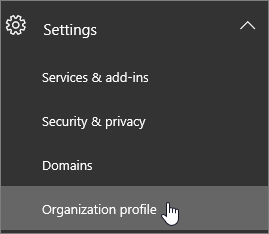

# Alterar o idioma padrão de saudações e emailsChange the default language for greetings and emails

Se você for um [administrador global,](https://support.office.com/article/da585eea-f576-4f55-a1e0-87090b6aaa9d)poderá configurar um Skype for Business para reproduzir sua saudação de caixa postal padrão em outro idioma.If you are a [global administrator](https://support.office.com/article/da585eea-f576-4f55-a1e0-87090b6aaa9d), you can set up Skype for Business to play its default voicemail greeting in another language. A saudação padrão do sistema é semelhante a: "Por favor, deixe uma mensagem para John Smith.The default system greeting is something like, "Please leave a message for John Smith. Grave sua mensagem após o sinal.After the tone, please record your message. Ao final da gravação, desligue ou pressione a tecla jogo da velha para ver mais opções".When you finish recording, hang up, or press the pound key for more options."
  
 **Primeiro, leia estas informações importantes:****First, read this important info:**
  
- **Os idiomas disponíveis são determinados pelo local da organização**.**The languages that are available to you are determined by the location of your organization**. Por exemplo, se a sua organização está nos Estados Unidos, você pode definir o idioma padrão como inglês ou espanhol.For example, if your organization is located in the United States, you can set the default language to English or Spanish. Se a sua organização está no Canadá, você pode escolher entre inglês e francês.If your organization is located in Canada, you can choose between English and French. Para uma lista de idiomas com suporte em Teams Skype for Business, consulte o seguinte:For a list of supported languages in Teams and Skype for Business, see the following:
  - [Microsoft Teams idiomas com suporteMicrosoft Teams supported languages](languages-for-voicemail-greetings-and-messages.md)
  - [Skype for Business idiomas com suporteSkype for Business supported languages](/skypeforbusiness/what-is-phone-system-in-office-365/phone-system-voicemail/languages-for-voicemail-greetings-and-messages)

- **Alterar idiomas para mensagens de caixa postal e mensagens de caixa postal de cada usuário.****Changing languages for individual user's voicemail greeting and voicemail messages.** Você pode alterar o idioma preferencial dos usuários, o que alterará o idioma de suas mensagens de caixa postal e de caixa postal enviadas para sua caixa de correio Outlook caixa de correio.You can change the preferred language for users, which will change the language of their voicemail greeting and voicemail messages sent to their Outlook mailbox. Para obter mais informações, [consulte How to set language and region settings for Microsoft 365 or Office 365](/office365/troubleshoot/access-management/set-language-and-region).For more information, see [How to set language and region settings for Microsoft 365 or Office 365](/office365/troubleshoot/access-management/set-language-and-region).

  > [!NOTE]
  > Depois de entrar, os usuários podem alterar seu próprio idioma de saudação por meio das configurações.Users can change their own greeting language through their settings after they sign in. Para obter mais informações, consulte [Change your display language and time zone in Microsoft 365 for Business](https://support.office.com/article/change-your-display-language-and-time-zone-in-microsoft-365-for-business-6f238bff-5252-441e-b32b-655d5d85d15b?ui=en-US&rs=en-US&ad=US)For more information, see [Change your display language and time zone in Microsoft 365 for Business](https://support.office.com/article/change-your-display-language-and-time-zone-in-microsoft-365-for-business-6f238bff-5252-441e-b32b-655d5d85d15b?ui=en-US&rs=en-US&ad=US)
  
- **Deseja gravar sua mensagem de caixa postal de saída?****Do you want to record your outgoing voicemail message?** Veja [Verificar a caixa postal e as opções do Skype for Business](https://support.office.com/article/2deea7f8-831f-4e85-a0d4-b34da55945a8).See [Check Skype for Business voicemail and options](https://support.office.com/article/2deea7f8-831f-4e85-a0d4-b34da55945a8). Para Microsoft Teams - Os usuários podem alterar suas configurações de caixa postal Teams [configurações do](https://support.office.com/article/manage-your-call-settings-in-teams-456cb611-3477-496f-b31a-6ab752a7595f) cliente da área de trabalhoFor Microsoft Teams - Users can change their voicemail settings from the [Teams desktop client settings](https://support.office.com/article/manage-your-call-settings-in-teams-456cb611-3477-496f-b31a-6ab752a7595f)

- **Deseja alterar o idioma do prompt de caixa postal?****Do you want to change the voicemail prompt language?** Para Skype for Business - [https://mysettings.lync.com/voicemail](https://mysettings.lync.com/voicemail) e escolha um novo idioma em Prompt **Language**.For Skype for Business -  [https://mysettings.lync.com/voicemail](https://mysettings.lync.com/voicemail) and choose a new language under **Prompt Language**. Para Microsoft Teams - Os usuários podem alterar sua saudação de caixa postal das [configurações Teams cliente da área de trabalho](https://support.office.com/article/manage-your-call-settings-in-teams-456cb611-3477-496f-b31a-6ab752a7595f)For Microsoft Teams - Users can change their voicemail greeting from the [Teams desktop client settings](https://support.office.com/article/manage-your-call-settings-in-teams-456cb611-3477-496f-b31a-6ab752a7595f)

## Alterar o idioma do sistema para todas as pessoas na organizaçãoChange the system language for everyone in your organization

1. Entre com sua [conta de administrador global](https://support.office.com/article/da585eea-f576-4f55-a1e0-87090b6aaa9d) em [https://portal.office.com/adminportal/home](https://portal.office.com/adminportal/home) .Sign in with your [global administrator](https://support.office.com/article/da585eea-f576-4f55-a1e0-87090b6aaa9d) account at [https://portal.office.com/adminportal/home](https://portal.office.com/adminportal/home).

2. No centro Microsoft 365 de administração, escolha **Configurações**  >  **Configurações**  >  **Perfil da Organização.**In the Microsoft 365 admin center, choose **Settings** > **Settings** > **Organization profile**.

     
  
3. Escolha **Editar**.Choose **Edit**.

    
  
4. Selecione um idioma na lista **Idioma preferencial** para todas as pessoas em sua organização.Select a language from the **Preferred language** list for everyone in your organization.

5. Escolha **Salvar**.Choose **Save**.

## Artigos relacionados para o administradorRelated articles for the admin

- [Sistema de Telefonia e Planos de ChamadasPhone System and Calling Plans](calling-plan-landing-page.md)

- [Configurar Planos de ChamadasSet up Calling Plans](set-up-calling-plans.md)

- [Planejar Sistema de Telefonia em Microsoft 365 ou Office 365 com conectividade PSTN local no Skype for Business ServerPlan Phone System in Microsoft 365 or Office 365 with on-premises PSTN connectivity in Skype for Business Server](/skypeforbusiness/skype-for-business-hybrid-solutions/plan-your-phone-system-cloud-pbx-solution/plan-phone-system-with-on-premises-pstn-connectivity)

## Tópicos relacionadosRelated topics

- [Alterar o idioma de exibição e o fuso horário no Microsoft 365 ou Office 365 para EmpresasChange your display language and time zone in Microsoft 365 or Office 365 for Business](https://support.office.com/article/Change-your-display-language-and-time-zone-in-Office-365-for-Business-6f238bff-5252-441e-b32b-655d5d85d15b)

- [Adicionar um idioma ou definir preferências de idioma no Office 2010 e posterior](https://support.office.com/article/Add-a-language-or-set-language-preferences-in-Office-663d9d94-ca99-4a0d-973e-7c4a6b8a827d)[Add a language or set language preferences in Office 2010 and later](https://support.office.com/article/Add-a-language-or-set-language-preferences-in-Office-663d9d94-ca99-4a0d-973e-7c4a6b8a827d))

- [Habilitar ou alterar o idioma de layout do tecladoEnable or change a keyboard layout language](https://support.office.com/article/Enable-or-change-a-keyboard-layout-language-1c2242c0-fe15-4bc3-99bc-535de6f4f258)
