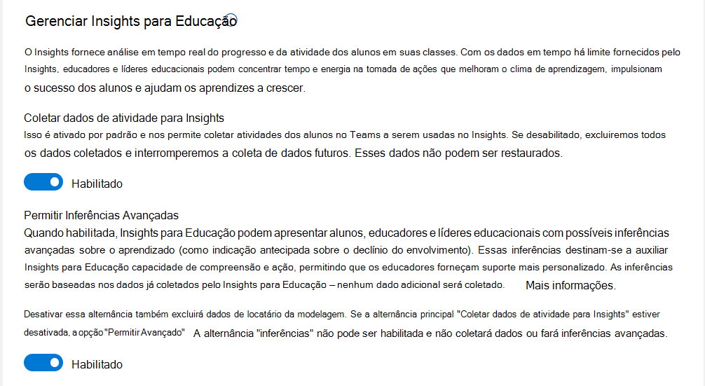

# Guia para o Administrador de TI sobre o Insights no Microsoft Teams para Educação

Este documento fornece as etapas necessárias para obter e executar o Insights para Educação no Microsoft Teams e ajudar educadores e gestores escolares a adotar a plataforma e usar com sucesso o aplicativo.

## Visão Geral

**Cada aluno tem experiências, habilidades e voz únicas.** 
**O Insights ajuda você a entender seus alunos e responder às suas necessidades.**

O insights fornece uma análise em tempo real do progresso e da atividade dos alunos dentro de suas classes. Com visualizações facilmente digeríveis, as comunidades escolares podem proativamente e facilmente acompanhar as experiências dos alunos. Os educadores e gestores escolares são apresentados com dados significativos e confiáveis para tomar decisões informadas a respeito de suas equipes de classe. Guiados por esses dados, os educadores têm as informações necessárias para garantir que as necessidades emocionais, sociais e acadêmicas de seus alunos estejam sendo atendidas.

As comunidades escolares podem canalizar seus esforços e obter um impacto mais significativo quando os educadores sabem quais estratégias funcionam para seus alunos. Com os dados oportunos fornecidos pelo Insights, os educadores e gestores escolares concentram tempo e energia na tomada de ações que melhorem o ambiente de aprendizagem, impulsionem o sucesso dos alunos e ajudam os alunos a prosperar.

## Quem usa o Insights?

### Educadores

Um educador é qualquer pessoa que possua uma turma de classe. Os educadores podem incluir professores, conferencistas e professores universitários.

Os educadores acessam o Insights em nível da classe. Eles veem a atividade dos alunos atribuídas para suas classes, mas não podem acessar dados de outras classes. O insights ajuda os educadores a entender e dar suporte aos seus alunos.

Não há pré-requisitos para usar o Insights, e os educadores apenas precisam adicionar o Insights à barra de aplicativos à esquerda ou como uma guia para cada uma de suas classes no Teams.

Educators are identified by faculty licenses. Educators must have a faculty license and be a class team owner to see the data in Insights.

### Gestores escolares

Gestores escolares são todas aquelas funções na instituição que precisão de uma visão organizacional para entender o compromisso estudantil, progresso, bem-estar, etc. Os educadores também podem ser líderes educacionais quando possuem uma equipe de classe e precisam mais do que visualizar suas classes, como um coordenador pedagógico.

Os gestores escolares podem incluir diretores acadêmicos, chefes de departamento, inspetores, diretores de escola, professores-gestores, conselheiros, coordenadores pedagógicos, diretores de programas, assistentes sociais e psicólogos.

Os gestores escolares têm uma visão organizacional que depende das permissões atribuídas pelo Administrador de TI. Por exemplo, os inspetores podem ver todas as escolas que acessam. Em contraste, um diretor ou um supervisor escolar só vê os níveis de notas e classes de sua escola.

Supondo que um supervisor também leciona, eles são considerados tanto um educador quanto um gestor escolar e podem acessar ambas as versões do Insights (para educadores e gestores escolares). Aqui, o Insights ajuda os gestores escolares a dar suporte a professores e alunos.
No nível organizacional, o administrador de TI precisa conectar o sistema de informações dos alunos e atribuir permissões a cada função para acessar as escolas ou departamentos relevantes a eles.

Os gestores escolares são identificados pelas licenças do corpo docente, e também precisam de *permissões explícitas* do administrador global de TI para visualizar os relatórios do Insights de sua organização.

> [!NOTE]
> **Em relação aos alunos:**
>
> O Insights coleta dados sobre a atividade dos alunos no Teams.
>
> Os alunos são membros de uma equipe de classe dentro do Teams. Eles são identificados por sua licença e **não têm acesso** ao aplicativo ou guia Insights (mesmo que sejam o proprietário de equipe).

## Onde os usuários encontram o Insights?

Educadores e gestores escolares têm diferentes maneiras de acessar o Insights.

### Educadores

Educadores podem usar estes dois métodos:

- [Aplicativo pessoal](https://support.microsoft.com/office/747fd8d9-00b0-43e6-bacc-a1bf030b1867) - uma visão geral de todas as turmas ativas está disponível na barra de aplicativos à esquerda do Teams, com a capacidade de fazer drill down para dados de classe.
- [Guias](https://support.microsoft.com/office/1386d1b4-3641-4a23-9b9c-0c6c774c2b6c) - Insights para classes específicas que possuem estão disponíveis em uma guia no menu superior de navegação de uma equipe de classe. Esta guia permite que o educador acesse diretamente os dados relevantes quando estiver na classe do Teams para ver os dados no contexto da classe.

O Insights revela os dados de atividade de todos os canais de uma equipe de classe, mas só podem ser adicionados como uma guia para canais públicos. A guia reflete a atividade de todos na equipe de classe que não são proprietários (incluindo educadores que não são proprietários da equipe de classe).

In both views, an educator can access class data. Using the personal app, the educator needs to drill down to the class level, whereas the tab provides direct access to class data.

No nível da classe, se um educador possui uma equipe de classe, o Insights está disponível sem a necessidade de qualquer outra ação por parte do Administrador de TI.

### Gestores escolares

Os líderes de educação podem usar o Insights como um [aplicativo pessoal](https://support.microsoft.com/office/8738d1b1-4e1c-49bd-9e8d-b5292474c347) disponível na barra de aplicativos esquerda do Teams.

No nível organizacional, o administrador de TI precisa conectar o sistema de informações dos alunos e atribuir permissões a cada função para acessar as escolas ou departamentos relevantes a eles.

Por exemplo, um diretor vê apenas as classes na sua escola ou o chefe de um departamento vê apenas as classes do departamento.
Os dados dos alunos são agregados em nível de classe, departamento, escola e distrito, e fornecemos Insights para cada nível (com base na permissão de cada usuário). Tanto educadores quanto gestores escolares podem ampliar e ver os dados individuais de alunos.

**Para adicionar o aplicativo Insights no Teams:**

- Selecione "**...**" na barra de aplicativos.
- Pesquise por **Insights** e selecione-o.
- Uma tela de descrição será aberta. Selecione **Adicionar**.

  :::image type="content" source="media/insights-add-personal-app.png" alt-text="Adicionar Insights ao Teams.":::

- Selecione com o botão direito do mouse no ícone do Insights e selecione **Fixar**.

  :::image type="content" source="media/insights-pin-app.png" alt-text="Fixar o aplicativo Insights.":::

> [!TIP]
> Você também pode localizar o aplicativo Insights por meio deste link: [https://aka.ms/addInsights](https://aka.ms/addInsights)

## Quando o Insights é utilizado?

Insights supports learning communities throughout **the learning cycle**. With real-time metrics across multiple dimensions, Insights supports a continuous cycle of identification, reflection, discussion, and taking action amongst members of the school community.

- **Identificar** como e quando os alunos interagem com educadores, materiais didáticos e seus colegas, e como eles realizam as tarefas.
- **Refletir** sobre como as entradas dão suporte ao sucesso dos alunos, determinam as áreas de crescimento e onde a assistência é necessária.
- **Discutir** os resultados com os alunos e a comunidade escolar para fortalecer as relações, estabelecer metas, fazer uma autoavaliação, estimular a colaboração e melhorar os resultados.
- **Tomar Medidas** para desenvolver intervenções, fornecer comentários sobre áreas de crescimento, modificar estratégias de ensino e identificar o suporte adicional necessário.

:::image type="content" source="media/insights-learning-cycle.png" alt-text="O Insights oferece suporte às comunidades de aprendizagem durante o ciclo de aprendizagem.":::

## Como o Insights funciona?

O Insights produz análises avançadas para ajudar os educadores a oferecer melhores resultados de aprendizagem. Ele faz isto analisando a atividade dos alunos no Teams e, opcionalmente, usando os dados do Sistema de Informações do Aluno (SIS) que você fornece para ajudar a contextualizar e agrupar essa atividade.

Antes de começar a implantar o Insights para sua instituição, dê uma rápida olhada como o Insights funciona, no nosso compromisso com a ética de dados, e no licenciamento necessário.

### Coleta de dados

Os dados são coletados para o Insights das atividades dos alunos e educadores no Teams.

O Insights *não* exibe dados sobre os educadores. A análise dos dados fornece ideias acionáveis para auxiliar no ensino e na aprendizagem.

Atualmente, os dados são coletados das seguintes áreas nas equipes de classe:

|Componente do Teams|Dados coletados|
|---|---|
|**Atribuições**|Abrir, entregar e avaliar as tarefas.|
|**Compromisso do canal**|Visitar um canal, criar uma postagem, responder e curtir uma postagem (não incluindo o conteúdo do chat).|
|**Arquivos**|Carregar, baixar, acessar, modificar, comentar e compartilhar um arquivo (não incluindo o conteúdo do arquivo).|
|**Caderno do OneNote**|Edição de uma página ou seção em um bloco de notas (não incluindo o conteúdo da página).|
|**Reuniões**|Participação (não incluindo o conteúdo da reunião).|
|**[Progresso da Leitura](https://support.microsoft.com/topic/e71705a2-a79a-4d7e-bcef-a1e0aa336017)**|Taxa de precisão, palavras mais desafiadoras e palavras por minuto.|
|**[Refletir](reflect.md)**|Check-ins (incluindo valores).|
|**Coach de Carreira**|O aluno fornecem uma especialização (campo de estudo) e ano de graduação, bem como suas atividades no aplicativo Coach de carreira, incluindo: habilidades, interesse de habilidades, interesses de carreira, interesses de aprendizagem e atividades relacionadas à carreira.|

> [!NOTE]
> Most of the collected data shows up in Insights within a few minutes. Attendance in class meetings (meetings associated with one of the class channels) appears a few hours after the end of the meeting, usually up to 24 hours later.

> [!NOTE]
> Data collected in Education Insights is kept until either the IT Admin turns off the [Education Analytics toggle](#turn-sds-for-insights-on-or-off) or the Office subscription for the tenant ends. Turning off specific features in Teams does not delete historic data.

### Privacidade e segurança

O Insights para Educação, como parte do Microsoft 365, atende aos regulamentos nacionais, regionais e específicos do setor para coleta e uso de dados, incluindo [GDPR](/compliance/regulatory/gdpr) e a [Lei de Privacidade e Direitos Educacionais da Família (FERPA)](/compliance/regulatory/offering-ferpa) que protege a privacidade dos registros educacionais dos alunos.

Os dados pertencem à instituição, e a Microsoft somente os coleta e os armazena. Os funcionários da Microsoft não podem acessar os dados ou vê-los, exceto conforme permitido pela conformidade de uma forma auditada para manter o serviço, como a recuperação de dados.

> [!TIP]
>
> - Visite a [Central de Confiabilidade da Microsoft](https://www.microsoft.com/trust-center) para saber mais sobre como a Microsoft protege seus dados.
> - Visite as [ofertas de conformidade da Microsoft](/compliance/regulatory/offering-home) para saber como o Microsoft 365 ajuda sua instituição a atender aos padrões de conformidade regulatória.

### Desempenho e confiabilidade

O Insights é projetado para lidar com um grande volume de dados coletados do Teams com ótimo desempenho e confiabilidade. Não podemos garantir 100% de disponibilidade, mas nos esforçamos para estar disponíveis o mais próximo possível desse objetivo.

O processo de coleta de dados ocorre em servidores separados para a instalação da guia Insights no Teams. A guia Insights ou o aplicativo pessoal não afeta o desempenho do aplicativo ou a largura de banda da rede para educadores e alunos que utilizam o restante da funcionalidade do Teams.

> [!TIP]
> Para mais detalhes, leia [Ajuda para situações de baixa largura de banda para o Teams para Educação](edu-remote-low-bandwidth.md).

### Armazenamento de dados

O Insights está atualmente implantado na Europa e nos Estados Unidos. Os dados para usuários baseados na Europa são armazenados em servidores na Europa. Os dados para usuários baseados na Austrália e nos Estados Unidos são armazenados em servidores nos Estados Unidos. Os dados para usuários fora da Europa, Austrália ou Estados Unidos, serão armazenados em uma de nossas regiões geográficas.

### Usando dados de forma ética

Estamos empenhados em utilizar os dados de forma responsável e ética. O Insights segue nossos princípios da Microsoft para Dados Responsáveis e IA. Isto significa que somos transparentes sobre como os dados são utilizados, e colocamos os interesses dos educadores e alunos em primeiro lugar.  Utilizamos os mais altos padrões de segurança e privacidade, monitoramos a confiabilidade e precisão contínuas, e asseguramos a conformidade contínua para sua instituição.

A Microsoft compilou o Insights a partir do zero para garantir a proteção de dados. Estamos cientes da confidencialidade potencial de como esses dados podem ser utilizados, e nos preocupamos com seus dados e com a privacidade dos indivíduos.

#### Dados de apoio à aprendizagem

O Insights dá destaque ao aprendizado e ao envolvimento digital dos alunos. Os dados apoiam o aprendizado e mostram o nível de envolvimento do aluno na plataforma digital de aprendizado. Enquanto você possa detalhar até o nível individual para atividades de classe, a Microsoft **não atribui nenhum valor positivo ou negativo** atribuído a estas ações. O propósito dos dados coletados é apoiar alunos e educadores a alcançar seu melhor.

Os educadores conhecem e compreendem melhor seus alunos. As informações apresentadas no Insights estão lá para ajudá-los a **fornecer suporte aos alunos** em um cenário de aprendizagem digital. Ele replica os insights disponíveis em uma experiência pessoal. Por exemplo, suponha que um aluno não esteve estado ativo durante um período específico ou não concluiu todas as suas tarefas da semana passada dentro do prazo. Os dados são apresentados ao educador para fornecer os incentivos corretos ou para verificar o aluno. Continua sendo responsabilidade do educador interagir com o aluno, ou com a família ou responsáveis do aluno, ​​para determinar o motivo subjacente de qualquer atividade ou inatividade detectada.

O Insights foi projetado para apoiar tanto alunos quanto educadores no ambiente digital de aprendizagem. O Insights **não captura diretamente dados sobre educadores**. Além dos dados individuais dos alunos, ele fornece agregações de atividades e resultados do aluno para um educador específico para permitir que os gestores escolares deem suporte aos alunos e educadores.

### Licenciamento

Para acessar o Insights, os usuários devem ter uma licença do corpo docente A1, A3 ou A5 para o Microsoft 365.

*Insights para Educação Premium* é uma atualização paga que fornece aos líderes de educação uma exibição de nível organizacional dos dados do Insights para Educação e acesso expandido a exibições de dados históricos para educadores. As instituições educacionais qualificadas podem adquirir uma licença de complemento *Insights para Educação Premium* por meio de Inscrição para Soluções Educacionais (EES), Provedores de Serviços de Nuvem (CSP) e Centro de administração do Microsoft 365 (web direct).

O complemento Insights para Educação Premium estará disponível para organizações com base na compra de licenças para todos os alunos digitalmente ativos no locatário.

## Integração do Sistema de Informações do Aluno (SIS)

Quanto mais dados forem introduzidos no Insights, melhor os educadores podem dar suporte aos seus alunos e os gestores escolares podem dar suporte aos educadores.

Para fornecer o Insights no nível da organização, devemos usar o [School Data Sync (SDS)](/SchoolDataSync) para nos conectarmos ao Sistema de Informações do Aluno (SIS) de forma que o Insights tenha estrutura hierárquica do sistema educacional mapeada corretamente.

A visualização do Insights no nível de classe como o educador de classe *não* requer isto porque usamos as permissões e a estrutura de classe do Teams.

Para saber mais, leia [**Sincronizar dados do Sistema de Informações do Aluno (SIS) com Insights para Educação**](education-insights-sis-data-sync.md).

## Gerenciar permissões

As an IT admin you can provide permissions for education leaders, district leaders, school principals, head teachers, counselors, heads of learning areas, program directors, social workers, and psychologists. Educators are *automatically* given permission when they own a class team.

Para saber mais, leia [**Gerenciar acesso do usuário ao Education Insights**](education-insights-manage-access.md).

## Gerenciar a política de instalação

Como um administrador de TI, você pode usar a política de configuração do aplicativo para instalar o Insights por padrão para seus educadores e líderes quando eles iniciam o Teams. Com a política de instalação, você pode personalizar o Teams para destacar o Insights e fixá-lo na barra de aplicativos.

Se os educadores quiserem acesso direto a cada classe, eles podem instalar manualmente a guia Insights na parte superior do menu de navegação. Esta guia permite que o educador acesse diretamente os dados relevantes quando estiver na classe do Teams para ver os dados no contexto da classe.

In both views, an educator can access class data. Using the personal app, the educator needs to drill down to the class level, whereas the tab provides direct access to class data.

> [!TIP]
> Para mais detalhes, leia [Políticas do Teams e Pacotes de Políticas para Educação](./policy-packages-edu.md).

## Incentivar a adoção de Insights

Estimule sua instituição de ensino a usar o Insights.

Sinta-se à vontade para distribuir o seguinte material para seus **educadores**:

- Consulte a [página de suporte do Insights](https://support.microsoft.com/office/27b56255-90c0-47aa-bac3-1c9f50157181) para obter mais ajuda.
- Comece a utilizar rapidamente – [obtenha o Insights 1-pager em PDF](https://aka.ms/insights/start).
- Leia o [guia completo em PDF](https://aka.ms/insights/guide).
- Assista [tutoriais passo a passo](https://aka.ms/insights/resources) sobre como usar o Insights.
- Treine-se com o [curso gratuito Insights](https://aka.ms/insights/course) no Microsoft Educator Center
- E por último, confira [este blog](https://techcommunity.microsoft.com/t5/education-blog/6-ways-to-be-insight-ful-and-support-student-engagement/ba-p/1903091) dedicado ao Insights.

Material para **líderes educacionais**:

- [Página de suporte do Insights para organizações de educação.](https://support.microsoft.com/office/8738d1b1-4e1c-49bd-9e8d-b5292474c347)

### Ativar e desativar Insights

Por padrão, o Insights é ativado, o que permite que a análise das atividades dos alunos no Teams seja usada no Insights. Você pode recusar o Insights. Nesse caso, *excluímos todos os dados coletados* para o Insights e paramos de coletar dados futuros. Se você ativar novamente o Insights, iniciaremos a coleta de dados a partir do momento em que eles forem reabilitar.

Há dois lugares em que você pode controlar o *Insights para Educação*. Ambas as opções têm o mesmo resultado. Para clientes que tenham feito a transição do *SDS (Clássico)* para o *SDS para provisionamento*, somente a opção de cliente do Teams está disponível.

#### Ativar e desativar o Insights do centro de administração do SDS

1. Abra o [Centro de Administração do SDS](https://sds.microsoft.com/).
1. Acesse **Configurações** > **Gerenciar Insights para Educação**.
1. Ajuste a alternância **Coletar dados de atividade para Insights** para ativar ou desativar.

#### Ativar e desativar o Insights do cliente do Teams

1. Se você não tiver o aplicativo pessoal fixado *Insights para Educação*, siga [estas instruções](class-insights.md#education-leaders) para adicioná-lo.
1. Com uma conta de administrador do Microsoft 365, abra a página de **configurações do Administrador** usando o ícone de reticências localizado no canto superior direito do *Insights para Educação*.
1. Ajuste a alternância **Coletar dados de atividade para Insights** para ativar ou desativar.

> [!NOTE]
> Se você tiver desativado o Insights, os dados coletados serão excluídos. Os dados excluídos na desativação não podem ser restaurados posteriormente, mesmo se o Insights for reativado.

### Habilitar e desabilitar inferências avançadas no Insights

Quando a alternância **Permitir inferências avançadas** para o Education Insights está ativada, o Education Insights pode apresentar aos alunos, educadores e líderes educacionais inferências avançadas sobre aprendizado (como avisos de engajamento). Essas inferências permitem que os educadores forneçam suporte mais personalizado aos alunos. A alternância também controla o uso de dados de locatário para modelagem.

Ativar essa alternância não coletará nenhum dado adicional além dos dados já coletados pelo Insights para Educação.

Há dois locais em que você pode controlar *Inferências avançadas*. Ambas as opções têm o mesmo resultado. Para clientes que tenham feito a transição do *SDS (Clássico)* para o *SDS para provisionamento*, somente a opção de cliente do Teams está disponível.  

#### Ativar e desativar Inferências avançadas do centro de administração do SDS

1. Abra o [centro de administração do SDS](https://sds.microsoft.com/).
1. Acesse **Configurações** > **Gerenciar Insights para Educação**.
1. Ajuste a alternância **Permitir inferências avançadas** para ativada ou desativada.

#### Ativar e desativar Inferências avançadas do cliente do Teams

1. Se você não tiver o aplicativo pessoal fixado *Insights para Educação*, siga [estas instruções](class-insights.md#education-leaders) para adicioná-lo.
1. Com uma conta de administrador do Microsoft 365, abra a página de **configurações do Administrador** usando o ícone de reticências localizado no canto superior direito do *Insights para Educação*.
1. Ajuste a alternância **Permitir inferências avançadas** para ativada ou desativada.

> [!NOTE]
> Esse botão de alternância depende da alternância **Coletar dados de atividade para Insights**. Desabilitar **Coletar dados de atividade para Insights** também desativará a alternância **Permitir inferências avançadas**.

### Ativar ou desativar o SDS para Insights

O School Data Sync (SDS) ajuda a automatizar a importação e sincronização de dados do Sistema de Informações do Aluno (SIS) com o Teams.

A utilização do Insights *não* requer o uso do SDS. No entanto, você pode optar por recusar o Insights a qualquer momento.

- Para desativar o uso do Insights do School Data Sync, siga as instruções em [Desativando o SDS para Insights](/schooldatasync/how-to-deploy-sds-for-insights#disabling-sds-for-insights).

- Para ativá-lo novamente, siga as instruções em [Como implantar o SDS para o Insights](/schooldatasync/how-to-deploy-sds-for-insights).

### Como excluir dados do usuário do Insights para Educação

O Insights armazena atividades de alunos e educadores realizadas no Microsoft Teams para Educação.

Há dois tipos de dados coletados pelo Insights:

- **Dados combinados** – dados gerados como parte das atividades de aprendizagem de classe.
- **Dados não combinados (privados)** – dados coletados pela atividade dos alunos no Teams para Educação que não fazem parte da atividade de aprendizagem de classe.

Os dados completos coletados pelo Insights estão listados [aqui](class-insights.md#data-collection).

Para fornecer completude e integridade dos dados de períodos anteriores para educadores e gestores escolares, por padrão, o Insights não exclui automaticamente os dados do serviço quando as contas de usuário de um aluno ou educador são encerradas. O administrador de IT da organização pode solicitar a exclusão manual de dados de um usuário (educador ou aluno), seguindo as seguintes etapas:

- Abra um [tíquete de suporte](https://aka.ms/edusupport). O tíquete de suporte deve declarar claramente a solicitação de uma operação GDPR Delete DSR e conter a ID de objeto de usuário a ser excluída.
Não é possível limitar o conjunto de dados ou a janela de tempo da exclusão.
- Na solicitação, o Administrador de IT deve dizer claramente o tipo de dados desse usuário que precisa ser excluído, usando as seguintes opções:
  - Todos os dados (combinados e privados)
  - Todos os dados privados
  - Somente dados do Coach de carreira
- Uma vez arquivado, o tíquete de suporte aguarda na fila por uma semana para atender à política de retenção mínima de conformidade. Você tem a oportunidade de cancelar a operação durante esse período.
- Após uma semana, a equipe do Insights para Educação garante que todos os dados relacionados à ID de usuário do tipo específico, conforme descrito acima, serão excluídos do serviço. O suporte da Microsoft monitora o tíquete e o notificará assim que o processo de exclusão estiver concluído, no máximo em 28 dias

## Solução de problemas

### Por que minha instituição não vê nenhum dado no Insights?

Se for um *novo* locatário e você *nunca* viu dados no Insights, verifique se seu locatário está **verificado como locatário educacional** para acessar o Insights. Entre em contato com seu gerente da conta Microsoft e peça-lhe para verificar se o locatário está configurado corretamente.

Se você não tem um gerente de conta, abra um tíquete. Acesse o [Centro de administração do Microsoft 365](https://admin.microsoft.com/AdminPortal/) >  **Suporte** > **Nova Solicitação de Serviço**.  No título do tíquete, escreva: "Preciso de ajuda com a verificação educacional".

Além disso, verifique se a coleta de dados para Insights está ativada. Enquanto estiver ativado por padrão, o Administrador de TI pode tê-lo desativado e, portanto, excluído todos os dados mantidos pelo Insights.

Para verificar isso, abra o [Centro de Administração do SDS](https://sds.microsoft.com) e vá para **Configurações** > **Gerenciar Insights de Educação**. Verifique o status de 'Coletar dados para insights'.

If it's turned off, turn it back on.  Insights starts to collect data, but it may take up to 24 hours to see it in the reports.

### Por que os educadores não conseguem ver os dados da reunião?

Demora até 24 horas para ver os dados da reunião nos relatórios do Insights. Portanto, verifique se passou tempo suficiente.

Além disso, verifique se os alunos não [participaram da reunião de classe sem uma conta do Teams](https://support.microsoft.com/office/c6efc38f-4e03-4e79-b28f-e65a4c039508). Em tal cenário, a atividade do aluno não é coletada.

> [!TIP]
> For those educators who want to track student attendance, you can recommend sending a message during the meeting asking students to reply. This registers their attendance within a few minutes.

> [!NOTE]
> Se a sua pergunta ainda não foi respondida, [abra um tíquete de suporte](https://aka.ms/edusupport). Inclua as capturas de tela relevantes que representam o problema e a data em que ocorreu. Adicione quaisquer novos dados que você acha que podem nos ajudar a resolver o problema.

### Quais licenças preciso para ativar o Insights para Educação Premium?

Para que o Insights para Educação Premium seja habilitado na sua organização, o locatário deve comprar as licenças com base no número de alunos digitalmente ativos no locatário da organização. Ou seja, para todos os alunos que usam uma classe do Teams como parte de seus trabalhos escolares para atividades como reuniões, comunicação, chat, tarefas, edição de arquivos, Caderno ou Refletir.
