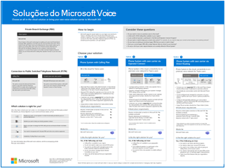

# Planejar sua solução de voz do Teams

Este artigo ajuda você a decidir qual solução de voz da Microsoft é ideal para sua organização. Depois de decidir, o artigo fornece um roteiro para o conteúdo que permitirá que você implemente a solução escolhida.

Talvez você queira a solução mais simples sistema de telefonia&mdash;com Plano de Chamadas. Essa opção é a solução toda na nuvem da Microsoft que fornece funcionalidade PBX (Private Branch Exchange) e chamadas para a PSTN (Rede Telefônica Pública Comunada), conforme mostrado no diagrama a seguir. Com essa solução, a Microsoft é sua operadora PSTN.

Se você responder sim ao seguinte, o Sistema de Telefonia com Plano de Chamada será a solução certa para você:

- O Plano de Chamadas está disponível em sua região.
- Você não precisa manter sua operadora PSTN atual.
- Você deseja usar o acesso gerenciado pela Microsoft ao PSTN.

No entanto, sua situação pode ser mais complexa. Por exemplo, você pode ter escritórios em locais em que o Plano de Chamadas não está disponível. Ou talvez você precise de uma solução de combinação que dê suporte a uma implantação complexa e multi-nacional, com requisitos diferentes para diferentes localizações geográficas. A Microsoft dá suporte a uma combinação de soluções:

- Sistema de Telefonia com Plano de Chamadas
- Sistema de Telefonia com sua própria operadora PSTN com Conexão de Operador
- Sistema de Telefonia com sua própria operadora móvel PSTN com o Teams Phone Mobile 
- Sistema de Telefonia com sua própria operadora PSTN com Roteamento Direto
- Uma solução de combinação que usa o Sistema de Telefonia com Plano de Chamada, Sistema de Telefonia com Conexão de Operador e/ou Sistema de Telefonia com Roteamento Direto

Para obter um resumo visual de todas as opções de solução de voz, consulte o cartaz de soluções de voz.

   [PDF](https://download.microsoft.com/download/4/3/5/435cd4e9-ca56-4fd1-acb6-d1fda7952320/microsoft-voice-solutions.pdf)  [Visio](https://download.microsoft.com/download/7/5/c/75c13012-e20c-48bd-a6dd-ea49d1a3420d/microsoft-voice-solutions.vsdx) 
 

>[!NOTE]
>Se você for uma empresa de pequeno a médio porte (300 ou menos pessoas), a Microsoft agora agrupa o Sistema de Telefonia com um Plano de Chamadas Domésticas. Para obter mais informações, consulte [as diretrizes](/microsoftteams/business-voice/whats-business-voice) do Sistema de Telefonia para pequenas e médias empresas para ajudá-lo a planejar, configurar e gerenciar sua solução de voz.

## O que você precisa ler?

**Obrigatório para todos.** Algumas das seções neste artigo pertencem a todas as organizações. Por exemplo, todos devem ler sobre o Sistema de Telefonia e entender as opções para se conectar à PSTN (Rede Telefônica Pública Comunada).

| Obrigatório para todos | Descrição |
| :------------|:-------|
| [**Sistema de Telefonia**](#phone-system) | Tecnologia da Microsoft para habilitar o controle de chamadas e recursos de PBX (Private Branch Exchange) na nuvem do Microsoft 365 com o Microsoft Teams. |
| [**Opções de conectividade PSTN (Rede Telefônica Pública Comunada)**](#public-switched-telephone-network-connectivity-options) | Escolha a Microsoft como operadora de telefonia ou conecte sua própria operadora de telefonia ao Microsoft Teams usando o Operator Connect ou o Roteamento Direto. Combinadas com o Sistema de Telefonia, as opções de conectividade PSTN permitem que os usuários façam chamadas telefônicas em todo o mundo.|

**Dependendo de seus requisitos.** Algumas das seções neste artigo e artigos relacionados são pertinentes dependendo da implantação e dos requisitos existentes. Por exemplo, o Location-Based roteamento é necessário apenas para clientes de Roteamento Direto em localizações geográficas que não permitem o desvio de chamada tarifada.

Considere qual dessas outras configurações você pode precisar:

| Dependendo de seus requisitos | Descrição |
| :------------|:-------|
| [**Gerenciamento de números de telefone**](pstn-connectivity.md#phone-number-management) | Como obter e gerenciar números de telefone difere dependendo da opção de conectividade PSTN. Leia esta seção se você precisar obter números de telefone, transferir números existentes, obter números de serviço e assim por diante. |
| [**Roteamento de chamadas e planos de discagem**](pstn-connectivity.md#call-routing-and-dial-plans) | Como configurar e gerenciar planos de discagem que convertem números de telefone discados em um formato alternativo (normalmente formato E.164) para autorização de chamada e roteamento de chamadas. Leia esta seção se você precisar entender o que são planos de discagem e se precisa especificar planos de discagem para sua organização.|
| [**Chamada de emergência**](pstn-connectivity.md#emergency-calling) | Como gerenciar e configurar chamadas de emergência diferem dependendo da opção de conectividade PSTN. Leia esta seção se você precisar entender como gerenciar chamadas de emergência para sua organização. |
| [**Roteamento baseado em localização para roteamento direto**](pstn-connectivity.md#location-based-routing-for-direct-routing) |Como usar o Location-Based (LBR) para restringir o bypass de chamada tarifada para usuários do Microsoft Teams com base em sua localização geográfica. Leia esta seção se sua organização estiver usando o Roteamento Direto em um local que não permita o bypass de chamada tarifada.
| [**Topologia de rede para recursos de voz na nuvem**](pstn-connectivity.md#network-topology-for-voice-features) | Se sua organização estiver implantando Location-Based lbr (roteamento direto) para roteamento direto ou chamadas de emergência dinâmicas, você deverá definir as configurações de rede para esses recursos no Microsoft Teams. Leia esta seção se você estiver implementando LBR para Roteamento Direto ou se estiver implementando chamadas de emergência dinâmicas com Plano de Chamada ou Roteamento Direto. |
| [**Migrar sua solução de voz existente**](#migrate-your-existing-voice-solution-to-teams) | O que você precisa pensar ao migrar sua solução de voz para o Teams.  Leia esta seção se você estiver migrando de uma solução de voz existente para o Teams. 

> [!Important]
> Este artigo se concentra em soluções de voz com o Microsoft Teams. Devido à desativação do Skype for Business Online em 31 de julho de 2021, a conectividade PSTN&mdash;entre seu ambiente local, seja por meio do Skype for Business Server ou do Cloud Connector Edition&mdash;e do Skype for Business Online, não tem mais suporte. Este artigo apresenta soluções de voz do Teams e como você pode conectar sua rede de telefonia local, se necessário, ao Teams usando o Operator Connect ou o Roteamento Direto.

## Sistema de Telefonia

O Sistema de Telefonia é a tecnologia da Microsoft para habilitar o controle de chamadas e recursos de PBX (Private Branch Exchange) na nuvem do Microsoft 365 com o Microsoft Teams.

O Sistema de Telefonia funciona com clientes do Teams e dispositivos certificados. O Sistema de Telefonia permite que você substitua seu sistema PBX existente por um conjunto de recursos fornecidos diretamente do Microsoft 365. 

As chamadas entre usuários em sua organização, independentemente da área geográfica, são tratadas internamente no Sistema de Telefonia. Essas chamadas internas nunca vão para a Rede Telefônica Pública Comunada (PSTN), portanto, sua empresa evita encargos de longa distância.

Este artigo apresenta os seguintes recursos e funcionalidades do Sistema de Telefonia e as decisões de implantação que você precisará considerar:

- [Atendedores automáticos e filas de chamadas](#auto-attendants-and-call-queues)
- [Caixa Postal da Nuvem](#cloud-voicemail)
- [Identidade de chamada](#calling-identity)

Para obter informações sobre todos os recursos do Sistema de Telefonia e como configurar o Sistema de Telefonia, consulte os seguintes artigos:

- [Veja o que você obtém com o Sistema de Telefonia](here-s-what-you-get-with-phone-system.md)
- [Configurar o Sistema de telefonia da sua organização](setting-up-your-phone-system.md) 
  Descreve como comprar e atribuir licenças do Sistema de Telefonia, gerenciar números de telefone e configurar créditos de comunicação para números de chamada gratuita. 

Para obter informações sobre como gerenciar dispositivos com suporte, [consulte Gerenciar seus dispositivos no Microsoft Teams e](devices/device-management.md) [no Teams Marketplace](https://www.microsoft.com/microsoft-365/microsoft-teams/across-devices?ms.url=officecomteamsdevices&rtc=1).

### Atendedores automáticos e filas de chamadas

Os atendedores automáticos permitem que você configure opções de menu para rotear chamadas com base na entrada do chamador. As filas de chamadas estão aguardando áreas para chamadores. Usados juntos, os atendedores automáticos e as filas de chamadas podem rotear facilmente os chamadores para a pessoa ou o departamento apropriado em sua organização.

Para obter informações sobre atendedores automáticos e filas de chamadas, consulte os seguintes artigos:

- [Planejar atendedores automáticos do Teams e filas de chamadas](plan-auto-attendant-call-queue.md)
- [Configurar um atendedor automático](create-a-phone-system-auto-attendant.md)
- [Criar uma fila de chamadas](create-a-phone-system-call-queue.md) 
- [Estudo de caso da Contoso: Atendedores automáticos e filas de chamadas](voice-case-study-call-queues.md) 
  Descreve como uma empresa fictícia multi-nacional, a Contoso, implementou atendedores automáticos e filas de chamadas para sua solução de voz.

### Caixa Postal na Nuvem

Caixa postal na Nuvem, da plataforma de serviços de Caixa Postal do Azure, dá suporte apenas a depósitos de caixa postal para caixas de correio do Exchange. Ele não dá suporte a sistemas de email de terceiros. 

A Caixa Postal na Nuvem inclui transcrição da mensagem de voz que, por padrão, está habilitada para todos os usuários da organização. Suas necessidades de negócios podem exigir que você desabilite a transcrição de caixa postal para usuários específicos ou para todos em toda a organização.

Caixa postal na Nuvem é configurado e provisionado automaticamente para usuários do Teams.  

Para obter mais informações sobre Caixa postal na Nuvem e sua configuração, consulte os seguintes artigos:

- [Configurar a Caixa postal na nuvem](set-up-phone-system-voicemail.md)
- [Definir políticas de caixa postal em sua organização](manage-voicemail-policies.md)

### Identidade de chamada

Por padrão, todas as chamadas de saída usam o número de telefone atribuído como identidade de chamada (ID do chamador). O destinatário da chamada pode identificar o autor da chamada rapidamente e decidir se deseja aceitar ou rejeitar a chamada. Para obter informações sobre como configurar a ID do chamador ou para alterar ou bloquear a ID do chamador, consulte Definir [a ID do chamador para um usuário](set-the-caller-id-for-a-user.md). 

## Opções de conectividade de Rede Telefônica Pública Comunada

O Sistema de Telefonia fornece funcionalidades PBX completas para sua organização. No entanto, para permitir que os usuários façam chamadas fora da sua organização, você precisa conectar o Sistema de Telefonia à Rede Telefônica Pública Comunada (PSTN). Para conectar o Sistema de Telefonia ao PSTN, você pode escolher uma das seguintes opções:

- [**Sistema de Telefonia com Plano de Chamadas**](pstn-connectivity.md#phone-system-with-calling-plan). Uma solução totalmente na nuvem com a Microsoft como sua operadora PSTN.

- [**Sistema de Telefonia com sua própria operadora PSTN usando o Operator Connect**](operator-connect-plan.md). Com o Operator Connect, se o operador existente participar do programa Microsoft Operator Connect, ele poderá gerenciar o serviço para trazer chamadas PSTN para o Teams. 

- [**Sistema de Telefonia com sua própria operadora móvel PSTN usando o Teams Phone Mobile**](operator-connect-mobile-plan.md). Com o Teams Phone Mobile, se sua operadora existente participar do programa Telefonia do Microsoft Teams Mobile, ela poderá gerenciar o serviço para usar números de telefone celular habilitados para SIM com o Teams. 

- [**Sistema de Telefonia com sua própria operadora PSTN usando o Roteamento**](pstn-connectivity.md#phone-system-with-direct-routing) Direto para conectar seu ambiente local ao Teams.

Você pode escolher uma combinação de opções, que permite criar uma solução para um ambiente complexo ou gerenciar uma migração de várias etapas. Você lerá mais sobre a migração mais tarde.

A maioria dos recursos do Sistema de Telefonia é a mesma, independentemente da opção de conectividade PSTN que você escolher. No entanto, há algumas diferenças na funcionalidade que afetam a forma como você configura determinados recursos do Sistema de Telefonia, como roteamento de chamadas e chamadas de emergência. Para obter mais informações sobre opções de conectividade PSTN e considerações de configuração, consulte [opções de conectividade PSTN](pstn-connectivity.md).

## Migrar sua solução de voz existente para o Teams

> [!NOTE]
> Para obter diretrizes sobre como planejar uma solução de voz do Teams como parte de seu plano geral para atualizar para o Teams do Skype for Business Server, consulte considerações sobre [PSTN](upgrade-to-teams-on-prem-pstn-considerations.md) para atualizar para o Teams Skype for Business no local.

Para uma organização que está atualizando para o Teams, o objetivo final é mover todos os usuários para o modo TeamsOnly. O uso do Sistema de Telefonia só tem suporte quando o usuário está no modo TeamsOnly. Se você precisar de informações básicas sobre como atualizar para o Teams, comece aqui:

- [Introdução à atualização para o Microsoft Teams](upgrade-start-here.md)
- [Sobre a estrutura de atualização](upgrade-framework.md)
- [Estratégias de atualização para administradores de TI](upgrade-to-teams-on-prem-implement.md)

Ao migrar sua solução de voz, há quatro cenários de chamada possíveis ao migrar para o modo TeamsOnly:

- [**Um usuário do Skype for Business Online, com um Plano de Chamadas da Microsoft**](upgrade-to-teams-on-prem-pstn-considerations.md#from-skype-for-business-online-with-microsoft-calling-plans). Após a atualização, esse usuário continuará a ter um Plano de Chamadas da Microsoft.

- **[Um usuário do Skype for Business Online,](upgrade-to-teams-on-prem-pstn-considerations.md#from-skype-for-business-online-with-on-premises-voice)** com funcionalidade de voz local por meio Skype for Business local ou Cloud Connector Edition. A atualização do usuário para o Teams precisa ser coordenada com a migração do usuário para o Roteamento Direto para garantir que o usuário do TeamsOnly tenha funcionalidade PSTN.

- **[Um usuário Skype for Business local](upgrade-to-teams-on-prem-pstn-considerations.md#from-skype-for-business-server-on-premises-with-enterprise-voice-to-direct-routing) com o Enterprise Voice,** que se mudará para online e manterá a conectividade PSTN local. Migrar esse usuário para o Teams requer mover a conta de Skype for Business local do usuário para a nuvem e coordenar essa movimentação com a migração do usuário para o Roteamento Direto. 

- **[Um usuário no Skype for Business local com o Enterprise Voice](upgrade-to-teams-on-prem-pstn-considerations.md#from-skype-for-business-server-on-premises-with-enterprise-voice-to-microsoft-calling-plan), que será migrado para online e usando um plano de Chamada da Microsoft**.  Migrar esse usuário para o Teams requer mover a conta de Skype for Business local do usuário para a nuvem e coordenar essa movimentação com A) a porta do número de telefone desse usuário para um Plano de Chamada da Microsoft ou B) atribuindo um novo número de assinante de regiões disponíveis.

Para obter mais informações sobre como implementar sua migração de voz para cada um desses cenários, consulte os seguintes artigos:

- [Considerações sobre PSTN ao atualizar para o Teams – para administradores de TI](upgrade-to-teams-on-prem-pstn-considerations.md)

- [Estudo de caso de migração de voz da Contoso](voice-case-study-overview.md) 
  O estudo de caso descreve como uma empresa multinacional fictícia, Contoso, implementou uma solução de voz do Teams para sua organização. Ele contém os seguintes artigos:

  - [Plano de atualização do Teams](voice-case-study-migration-plan.md)
  - [Opções de conectividade PSTN e Sistema de Telefonia](voice-case-study-phone-system.md)
  - [Implementação de roteamento baseado em localização](voice-case-study-location-based-routing.md)
  - [Chamada de emergência](voice-case-study-emergency-calling.md)
  - [Atendedores automáticos e filas de chamadas](voice-case-study-call-queues.md)
  - [Audioconferência](voice-case-study-audio-conferencing.md)
