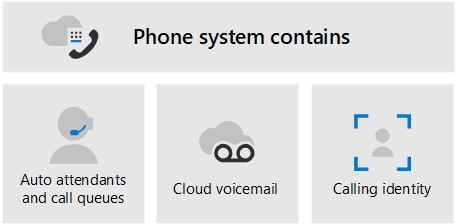

# Planejar sua solução Teams voz

Este artigo ajuda você a decidir qual solução de voz da Microsoft é ideal para sua organização. Depois que você decidir, o artigo fornece um roteiro para o conteúdo que permitirá implementar sua solução escolhida.

Talvez você queira a solução mais&mdash; simples Sistema de Telefonia com Plano de Chamada. Essa opção é a solução all-in-the-cloud da Microsoft que fornece a funcionalidade de PbX (Private Branch Exchange) e chamadas para a PSTN (Rede Telefônica Pública Comutado), conforme mostrado no diagrama a seguir. Com essa solução, a Microsoft é sua operadora PSTN.

Se você responder sim ao seguinte, Sistema de Telefonia com Plano de Chamada é a solução certa para você:

- O Plano de Chamada está disponível em sua região.
- Você não precisa manter sua operadora PSTN atual.
- Você deseja usar o acesso gerenciado pela Microsoft à PSTN.

No entanto, sua situação pode ser mais complexa. Por exemplo, você pode ter escritórios em locais onde o Plano de Chamada não está disponível. Ou você pode precisar de uma solução de combinação que suporte uma implantação complexa e multi-nacional, com requisitos diferentes para locais geográficos diferentes. A Microsoft oferece suporte a uma combinação de soluções:

- Sistema de Telefonia com Plano de Chamada
- Sistema de Telefonia com sua própria operadora PSTN com operador Conexão
- Sistema de Telefonia com sua própria operadora PSTN com Roteamento Direto
- Uma solução de combinação que usa Sistema de Telefonia com Plano de Chamadas, Sistema de Telefonia com Conexão operador e/ou Sistema de Telefonia com Roteamento Direto

>[!NOTE]
>Se você for uma pequena ou média empresa (300 ou menos pessoas), a Microsoft agora agrupa Sistema de Telefonia com um Plano de Chamada Doméstica. Para obter mais informações, [consulte Sistema de Telefonia orientações](/microsoftteams/business-voice/whats-business-voice) para pequenas e médias empresas para ajudá-lo a planejar, configurar e gerenciar sua solução de voz.

## O que você precisa ler?

**Obrigatório para todos.** Algumas das seções deste artigo pertencem a todas as organizações. Por exemplo, todos devem ler sobre Sistema de Telefonia e entender as opções para se conectar à PSTN (Rede Telefônica Pública Comucionária).

| Obrigatório para todos | Descrição |
| :------------|:-------|
| [**Sistema de Telefonia**](#phone-system) | A tecnologia da Microsoft para habilenciar o controle de chamada e recursos de Exchange de filial privada (PBX) na nuvem Microsoft 365 com Microsoft Teams. |
| [**Opções de conectividade PSTN (Rede Telefônica Pública Comucionária)**](#public-switched-telephone-network-connectivity-options) | Escolha a Microsoft como sua operadora de telefonia ou conecte sua própria operadora de telefonia Microsoft Teams usando o Operador Conexão ou Roteamento Direto. Combinado com Sistema de Telefonia, as opções de conectividade PSTN permitem que os usuários façam chamadas telefônicas em todo o mundo.|

**Dependendo de seus requisitos.** Algumas das seções neste e artigos relacionados são pertinentes, dependendo da implantação e dos requisitos existentes. Por exemplo, Location-Based roteamento só é necessário para clientes de Roteamento Direto em locais geográficos que não permitem o desvio de tarifa.

Considere qual dessas outras configurações você pode precisar:

| Dependendo de seus requisitos | Descrição |
| :------------|:-------|
| [**Telefone gerenciamento de números**](pstn-connectivity.md#phone-number-management) | Como obter e gerenciar números de telefone difere dependendo da sua opção de conectividade PSTN. Leia esta seção se precisar obter números de telefone, transferir números existentes, obter números de serviço e assim por diante. |
| [**Roteamento de chamadas e planos de discagem**](pstn-connectivity.md#call-routing-and-dial-plans) | Como configurar e gerenciar planos de discagem que traduzem números de telefone discados em um formato alternativo (normalmente formato E.164) para autorização de chamada e roteamento de chamadas. Leia esta seção se você precisar entender quais são os planos de discagem e se precisa especificar planos de discagem para sua organização.|
| [**Chamada de emergência**](pstn-connectivity.md#emergency-calling) | Como gerenciar e configurar a chamada de emergência difere dependendo da sua opção de conectividade PSTN. Leia esta seção se precisar entender como gerenciar a chamada de emergência para sua organização. |
| [**Roteamento baseado em local para roteamento direto**](pstn-connectivity.md#location-based-routing-for-direct-routing) |Como usar Location-Based roteamento (LBR) para restringir o desvio de chamada Microsoft Teams usuários com base em sua localização geográfica. Leia esta seção se sua organização estiver usando Roteamento Direto em um local que não permita o desvio de tarifa.
| [**Topologia de rede para recursos de voz na nuvem**](pstn-connectivity.md#network-topology-for-voice-features) | Se sua organização estiver implantando Location-Based roteamento (LBR) para Roteamento Direto ou chamada de emergência dinâmica, você deve definir as configurações de rede para esses recursos Microsoft Teams. Leia esta seção se você estiver implementando LBR para Roteamento Direto ou se estiver implementando chamadas de emergência dinâmicas com Plano de Chamadas ou Roteamento Direto. |
| [**Migrar sua solução de voz existente**](#migrate-your-existing-voice-solution-to-teams) | O que você precisa pensar ao migrar sua solução de voz para Teams.  Leia esta seção se você estiver migrando de uma solução de voz existente para Teams. 

> [!Important]
> Este artigo se concentra em soluções de voz com Microsoft Teams. Devido à aposentadoria do Skype for Business Online em 31 de julho de 2021, a conectividade PSTN&mdash; entre seu ambiente local por meio do Skype for Business Server ou do Cloud Connector Edition&mdash; e do Skype for Business Online não é mais suportada. Este artigo apresenta Teams soluções de voz e como você pode conectar sua rede de telefonia local, se necessário, Teams usando o Operador Conexão ou Roteamento Direto.

## Sistema de Telefonia

Sistema de Telefonia é a tecnologia da Microsoft para habilenciar o controle de chamada e recursos de PBX (Private Branch Exchange) na nuvem Microsoft 365 com Microsoft Teams.

Sistema de Telefonia funciona com clientes Teams e dispositivos certificados. Sistema de Telefonia permite que você substitua seu sistema PBX existente por um conjunto de recursos diretamente entregues do Microsoft 365. 

As chamadas entre usuários em sua organização, independentemente da área geográfica, são tratadas internamente dentro Sistema de Telefonia. Essas chamadas internas nunca vão para a PSTN (Rede Telefônica Pública Comucionária), portanto, sua empresa evita cobranças de longa distância.

Este artigo apresenta os seguintes Sistema de Telefonia principais recursos e funcionalidades e as decisões de implantação que você precisará considerar:

- [Atendedores automáticos e filas de chamadas](#auto-attendants-and-call-queues)
- [Caixa Postal da Nuvem](#cloud-voicemail)
- [Identidade de chamada](#calling-identity)

Para obter informações sobre todos os Sistema de Telefonia e como configurar o Sistema de Telefonia, consulte os seguintes artigos:

- [Veja o que você obtém com o Sistema de Telefonia](here-s-what-you-get-with-phone-system.md)
- [Configurar o Sistema de telefonia da sua organização](setting-up-your-phone-system.md) 
  Descreve como comprar e atribuir Sistema de Telefonia licenças, gerenciar números de telefone e configurar créditos de comunicação para números de chamada gratuita. 

Para obter informações sobre como gerenciar dispositivos com suporte, consulte [Manage your devices in Microsoft Teams](devices/device-management.md) and [Teams Marketplace](https://www.microsoft.com/microsoft-365/microsoft-teams/across-devices?ms.url=officecomteamsdevices&rtc=1).

### Atendimentos automáticos e filas de chamada

Os atendentes automáticos permitem configurar opções de menu para rotear chamadas com base na entrada do chamador. Filas de chamada são áreas de espera para chamadores. Usados em conjunto, os atendimentos automáticos e filas de chamada podem roteá-los facilmente para a pessoa ou departamento apropriado em sua organização.

Para obter informações sobre os atendimentos automáticos e filas de chamada, consulte os seguintes artigos:

- [Planejar Teams atendimentos automáticos e filas de chamada](plan-auto-attendant-call-queue.md)
- [Configurar um atendimento automático](create-a-phone-system-auto-attendant.md)
- [Criar uma fila de chamadas](create-a-phone-system-call-queue.md) 
- [Estudo de caso da Contoso: Atendimentos automáticos e filas de chamada](voice-case-study-call-queues.md) 
  Descreve como uma corporação multinacional fictícia, Contoso, implementou atendimentos automáticos e filas de chamadas para sua solução de voz.

### Caixa Postal na Nuvem

Caixa postal na Nuvem, alimentado pelos serviços de Caixa Postal do Azure, oferece suporte a depósitos de caixa postal para Exchange caixas de correio somente. Ele não dá suporte a sistemas de email de terceiros. 

A Caixa Postal na Nuvem inclui transcrição da mensagem de voz que, por padrão, está habilitada para todos os usuários da organização. Suas necessidades de negócios podem exigir que você desabilite a transcrição de caixa postal para usuários específicos ou para todos em toda a organização.

Caixa postal na Nuvem é automaticamente configurada e provisionada para Teams usuários.  

Para obter mais informações sobre Caixa postal na Nuvem e sua configuração, consulte os seguintes artigos:

- [Configurar a Caixa postal na nuvem](set-up-phone-system-voicemail.md)
- [Definir políticas de caixa postal em sua organização](manage-voicemail-policies.md)

### Identidade de chamada

Por padrão, todas as chamadas de saída usam o número de telefone atribuído como identidade de chamada (ID do chamador). O destinatário da chamada pode identificar o autor da chamada rapidamente e decidir se deseja aceitar ou rejeitar a chamada. Para obter informações sobre como configurar a ID do chamador ou para alterar ou bloquear a ID do chamador, consulte [Definir a ID do chamador para um usuário](set-the-caller-id-for-a-user.md). 

## Opções de conectividade de Rede Telefônica Pública Comutado

Sistema de Telefonia fornece recursos pbx completos para sua organização. No entanto, para permitir que os usuários façam chamadas fora da sua organização, você precisa se conectar Sistema de Telefonia a Rede Telefônica Pública Comutado (PSTN). Para conectar Sistema de Telefonia ao PSTN, você pode escolher uma das seguintes opções:

- [**Sistema de Telefonia com Plano de Chamada**](pstn-connectivity.md#phone-system-with-calling-plan). Uma solução completa na nuvem com a Microsoft como operadora PSTN.

- [**Sistema de Telefonia com sua própria operadora PSTN usando o operador Conexão**](operator-connect-plan.md). Com o Conexão operador, se o operador existente for um participantes do programa de Conexão do Microsoft Operator, eles poderão gerenciar o serviço para trazer a chamada PSTN para Teams. Para obter informações sobre os benefícios e requisitos do operador Conexão, consulte [Plan Operator Conexão](operator-connect-plan.md).

- [**Sistema de Telefonia com sua própria operadora PSTN**](pstn-connectivity.md#phone-system-with-direct-routing) usando o Roteamento Direto para conectar seu ambiente local a Teams.

Você pode escolher uma combinação de opções, que permite projetar uma solução para um ambiente complexo ou gerenciar uma migração em várias etapas. Você lerá mais sobre migração mais tarde.

A maioria Sistema de Telefonia recursos são os mesmos, independentemente da opção de conectividade PSTN escolhida. No entanto, há algumas diferenças na funcionalidade que afetam a forma como você configura determinados recursos Sistema de Telefonia, como roteamento de chamadas e chamadas de emergência. Para obter mais informações sobre opções de conectividade PSTN e considerações de configuração, consulte [Opções de conectividade PSTN](pstn-connectivity.md).

## Migre sua solução de voz existente para Teams

> [!NOTE]
> Para obter orientações sobre como planejar uma solução de voz Teams como parte do seu plano geral de atualização para Teams do Skype for Business Server, consulte Considerações da [PSTN](upgrade-to-teams-on-prem-pstn-considerations.md) para atualizar para o Teams do Skype for Business local.

Para uma organização que está atualizando para Teams, o objetivo final é mover todos os usuários para o modo TeamsOnly. O Sistema de Telefonia só é suportado quando o usuário está no modo TeamsOnly. Se você precisar de informações básicas sobre como atualizar para Teams, comece aqui:

- [Introdução à atualização para o Microsoft Teams](upgrade-start-here.md)
- [Sobre a estrutura de atualização](upgrade-framework.md)
- [Estratégias de atualização para administradores de IT](upgrade-to-teams-on-prem-implement.md)

Ao migrar sua solução de voz, há quatro cenários de chamadas possíveis ao migrar para o modo TeamsOnly:

- [**Um usuário no Skype for Business Online, com um Plano de Chamada da Microsoft**](upgrade-to-teams-on-prem-pstn-considerations.md#from-skype-for-business-online-with-microsoft-calling-plans). Após a atualização, esse usuário continuará a ter um Plano de Chamada da Microsoft.

- **[Um usuário no Skype for Business Online,](upgrade-to-teams-on-prem-pstn-considerations.md#from-skype-for-business-online-with-on-premises-voice)** com funcionalidade de voz local por meio Skype for Business local ou Cloud Connector Edition. A atualização do usuário para Teams precisa ser coordenada com a migração do usuário para Roteamento Direto para garantir que o usuário teamsOnly tenha funcionalidade PSTN.

- **[Um usuário em Skype for Business local](upgrade-to-teams-on-prem-pstn-considerations.md#from-skype-for-business-server-on-premises-with-enterprise-voice-to-direct-routing)** com Enterprise Voice, que estará mudando para online e mantendo a conectividade PSTN local. Migrar esse usuário para Teams requer mover a conta de Skype for Business local do usuário para a nuvem e coordenar essa movimentação com a migração do usuário para Roteamento Direto. 

- **[Um usuário em Skype for Business local](upgrade-to-teams-on-prem-pstn-considerations.md#from-skype-for-business-server-on-premises-with-enterprise-voice-to-microsoft-calling-plan) com Enterprise Voice, que estará mudando para online e usando um plano de Chamada da Microsoft**.  Migrar esse usuário para Teams requer mover a conta de Skype for Business local do usuário para a nuvem e coordenar essa movimentação com A) a porta do número de telefone desse usuário para um Plano de Chamadas da Microsoft ou B) atribuindo um novo número de assinante de regiões disponíveis.

Para obter mais informações sobre como implementar sua migração de voz para cada um desses cenários, consulte os seguintes artigos:

- [Considerações do PSTN ao atualizar para Teams — para administradores de IT](upgrade-to-teams-on-prem-pstn-considerations.md)

- [Estudo de caso de migração de voz contoso](voice-case-study-overview.md) 
  O estudo de caso descreve como uma empresa multi-nacional fictícia, Contoso, implementou uma solução Teams voz para sua organização. Ele contém os seguintes artigos:

  - [Teams plano de atualização](voice-case-study-migration-plan.md)
  - [Sistema de Telefonia e opções de conectividade PSTN](voice-case-study-phone-system.md)
  - [Implementação de Roteamento Baseado em Local](voice-case-study-location-based-routing.md)
  - [Chamada de emergência](voice-case-study-emergency-calling.md)
  - [Atendedores automáticos e filas de chamadas](voice-case-study-call-queues.md)
  - [Audioconferência](voice-case-study-audio-conferencing.md)
