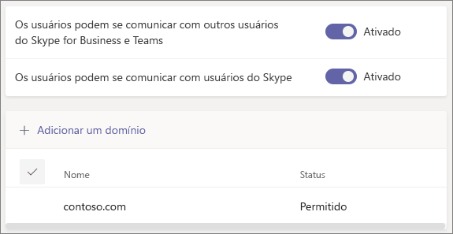

# Use o acesso para convidado e o acesso externo para colaborar com pessoas de fora da sua organização

Quando você precisa se comunicar e colaborar com pessoas de fora da sua organização, o Microsoft Teams tem duas opções:

- **Acesso externo** - Um tipo de federação que permite aos usuários encontrar, fazer chamadas e conversar com pessoas de outras organizações. Essas pessoas não podem ser adicionadas a equipes, a menos que sejam convidadas como convidados.
- **Acesso de convidado** - O acesso ao convidado permite que você convide pessoas de fora da sua organização para se juntar a uma equipe. Pessoas convidadas recebem uma conta de convidado no Azure Active Directory.

Observe que o Teams permite que você convide pessoas de fora da sua organização para reuniões. Isso não requer que o acesso externo ou de convidado seja configurado.

## Acesso externo (federação)

Configure o acesso externo se precisar localizar, fazer uma chamada, bater um papo e marcar reuniões com pessoas de fora da sua organização que usam o Teams, Skype for Business (online ou local) ou o Skype. 

Por padrão, o acesso externo é habilitado para todos os domínios. Você pode restringir o acesso externo permitindo ou bloqueando domínios específicos, ou desligando-o.

Para configurar o acesso externo, consulte [Gerenciar acesso externo](manage-external-access.md). 

>[!NOTE]
>As licenças gratuitas do Microsoft Teams não oferecem suporte a acesso externo.

## Acesso de convidados

Utilize o acesso de convidado para adicionar uma pessoa de fora da sua organização a uma equipe, onde ela pode bater papo, fazer uma chamada, se encontrar e colaborar em arquivos. Um convidado pode receber quase todos os mesmos recursos do Teams que um membro nativo da equipe.

Os convidados são adicionados ao Azure Active Directory da sua organização como usuários B2B e devem se conectar ao Teams usando sua conta de convidado. Isso significa que eles podem precisar sair da própria organização para entrar na sua.

Para configurar o acesso de convidado para o Teams, consulte [Colaborar com convidados em uma equipe ](/microsoft-365/solutions/collaborate-as-team).

## Comparar o acesso externo e de convidados

As tabelas a seguir mostram as diferenças entre o uso de acesso externo (federação) e convidados. Em ambos os casos, pessoas de fora da sua organização são identificadas para os seus usuários como sendo externas.

### Coisas que seus usuários podem fazer

| Os usuários podem | Usuários de acesso externo | Convidados |
|---------|-----------------------|--------------------|
| Converse com alguém em outra organização | Sim | Sim |
| Faça uma chamada para alguém em outra organização | Sim | Sim |
| Veja se alguém de outra organização está disponível para uma chamada ou bate-papo | Sim | Sim1 |
| Procurar por pessoas em outras organizações | Sim2 | Não |
| Compartilhe arquivos | Não | Sim |
| Veja a mensagem de ausência do escritório de alguém em outra organização | Não | Sim |
| Bloquear alguém em outra organização  | Não | Sim |
| Usar @menções | Sim3 | Sim |

### Coisas que podem ser feitas por pessoas de fora da sua organização

| Pessoas fora da sua organização podem | Usuários de acesso externo | Convidados |
|---------|-----------------------|--------------------|
| Recursos de acesso do Teams | Não | Sim |
| Seja adicionado a um bate-papo em grupo | Sim | Sim |
| Seja convidado para uma reunião | Sim | Sim |
| Fazer chamadas privadas | Sim | Sim5 |
| Exibir o número de telefone dos participantes da reunião discada | Não4 | Sim |
| Utilizar vídeo IP | Sim | Sim5 |
| Utilizar o compartilhamento de tela | Sim3 | Sim5 |
| Utilize o reunir agora | Não | Sim5 |
| Editar mensagens enviadas | Sim3 | Sim5 |
| Apagar mensagens enviadas | Sim3 | Sim5 |
| Usar Giphy em conversas | Sim3 | Sim5 |
| Usar memes em conversas | Sim3 | Sim5 |
| Usar figurinhas em conversas | Sim3 | Sim5 |
| A presença é exibida | Sim | Sim |
| Usar @menções | Sim3 | Sim |

 

1 Desde que o usuário tenha sido adicionado como convidado e esteja conectado com a conta de convidado. 
2 Apenas por endereço de email ou de protocolo SIP. 
3 Suporte para bate-papo 1:1 Somente usuários do Teams para o Teams a partir de duas organizações diferentes.  
4 Por padrão, os participantes externos não podem ver os números de telefone dos participantes discados. Se você quiser manter a privacidade desses números de telefone, selecione **Tons** para o **tipo de anúncio de entrada/saída** (isso impede que os números sejam lidos pelas equipes). Para saber mais, leia [Ativar ou desativar anúncios de entrada e saída das reuniões no Microsoft Teams](turn-on-or-off-entry-and-exit-announcements-for-meetings-in-teams.md).  
5 Permitido por padrão, mas pode ser desativado pela administração do Teams

## Tópicos relacionados

[Acesso externo ao Teams](manage-external-access.md)

[Acesso de convidados ao Teams](guest-access.md)
