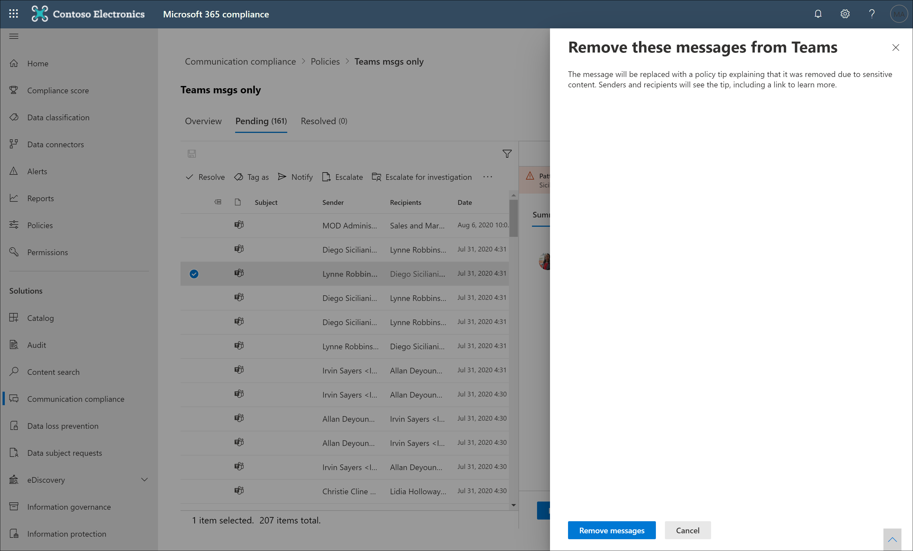

# Conformidade de comunicação com Microsoft Teams

A conformidade de comunicação é uma solução de risco interna no Microsoft 365 que ajuda a minimizar os riscos de comunicação, ajudando você a detectar, capturar e agir em mensagens inadequadas em sua organização.

Para Microsoft Teams, a conformidade de  comunicação ajuda a identificar os seguintes tipos de conteúdo inadequado em canais Teams, canais Teams privados ou em chats em grupo e 1:1:

- Idioma ofensivo, profano e assediante
- Imagens de adulto, racy e gory
- Compartilhamento de informações confidenciais

Para obter mais informações sobre a conformidade de comunicação e como configurar políticas para sua organização, consulte Conformidade de comunicação [em Microsoft 365](/microsoft-365/compliance/communication-compliance).

## Como usar a conformidade de comunicação Microsoft Teams

A conformidade e a Microsoft Teams de comunicação são fortemente integradas e podem ajudar a minimizar os riscos de comunicação em sua organização. Depois de configurar suas primeiras políticas de conformidade de comunicação, você poderá gerenciar ativamente mensagens inadequadas Microsoft Teams conteúdo e mensagens que são sinalizadas automaticamente em alertas.

### Introdução

Começar com a conformidade de comunicação no  Microsoft Teams começa com o planejamento e a criação de políticas pré-definidas ou personalizadas para identificar atividades de usuário inadequadas em canais Teams ou em 1:1 e grupos. Lembre-se de que você precisará [configurar](/microsoft-365/compliance/communication-compliance-configure) algumas permissões e pré-requisitos básicos como parte do processo de configuração.

Teams administradores podem configurar políticas de conformidade de comunicação nos seguintes níveis:

- **Nível do** usuário: as políticas nesse nível se aplicam a um usuário Teams usuário individual ou podem ser aplicadas a todos os usuários Teams em sua organização. Essas políticas abrangem mensagens que esses usuários podem enviar em chats de grupo ou 1:1. As comunicações de chat para os usuários são monitoradas automaticamente em todos os Microsoft Teams onde os usuários são membros.
- **Teams nível:** as políticas nesse nível se aplicam a um canal Microsoft Teams, incluindo um canal Privado. Essas políticas abrangem mensagens enviadas somente Teams canal.

### Agir em mensagens inadequadas em Microsoft Teams

Depois de configurar suas políticas e receber alertas de conformidade de comunicação para mensagens Microsoft Teams, é hora de os revisadores de conformidade em sua organização tomarem medidas sobre essas mensagens. Os revisadores podem ajudar a proteger sua organização, revisando alertas de conformidade de comunicação e removendo mensagens sinalizadas da exibição Microsoft Teams.

Mensagens e conteúdo removidos são substituídos por notificações para os visualizadores explicando que a mensagem ou conteúdo foi removido e qual política é aplicável à remoção. O remetente da mensagem ou conteúdo removido também é notificado do status de remoção e fornecido com o conteúdo da mensagem original para contexto relacionado à sua remoção. O remetente também pode exibir a condição de política específica que se aplica à remoção da mensagem.

Exemplo de dica de política vista pelo remetente:

Exemplo de notificação de condição de política vista pelo remetente:

Exemplo de dica de política vista pelo destinatário:

