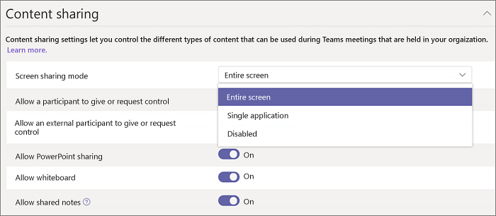

# Configurar o compartilhamento da área de trabalho no Microsoft Teams

O compartilhamento da área de trabalho permite que os usuários apresentem uma tela ou aplicativo durante uma reunião ou bate-papo. Os administradores podem configurar o compartilhamento de tela no Microsoft Teams para permitir que os usuários compartilhem uma tela inteira, um aplicativo ou um arquivo. Você pode permitir que os usuários deem ou solicitem controle, permitam o compartilhamento do PowerPoint, adicionem um quadro branco e permitam anotações compartilhadas. Você também pode configurar se usuários anônimos ou externos podem solicitar o controle da tela compartilhada. Os participantes externos nas reuniões das Teams podem ser categorizados da seguinte maneira:

- Usuário anônimo
- Usuários convidados
- Usuário B2B
- Usuário federado

Para configurar o compartilhamento de tela, crie uma nova política de reuniões e a atribua aos usuários que quer gerenciar.

**No [Centro de administração do Microsoft Teams](https://admin.teams.microsoft.com/)**

1. Clique em **Reuniões** > **Políticas de reuniões**.

    

2. Na página **Políticas de reunião,** selecione **Adicionar**.

    

3. Atribua um título exclusivo à sua política e insira uma breve descrição.

4. Em **Compartilhamento de conteúdo**, escolha um **Modo de compartilhamento de tela** da lista suspensa:

   - **Tela inteira** – permite que os usuários compartilhem toda a área de trabalho.
   - **Aplicativo único** – permite que os usuários limitem o compartilhamento de tela a um único aplicativo ativo.
   - **Desabilitado** – desativa o compartilhamento de tela.

    

  > [!Note]
  > Você não precisa habilitar a política de chamada para que os usuários usem o compartilhamento de tela do chat. No entanto, o áudio deles é desligado até que eles mesmos se desmuterem. Além disso, o usuário que compartilha a tela pode clicar em **Adicionar Áudio** para habilitar o áudio. Se a política de chamada estiver desabilitada, os usuários não poderão adicionar áudio ao compartilhamento de tela de uma sessão de chat.

5. Ative ou desative as seguintes configurações:

    - **Permitir que um participante dê ou solicite** controle – permite que os membros da equipe dêm ou solicitem controle da área de trabalho ou do aplicativo do apresentador.
    - **Permitir que um participante externo dê ou solicite controle** – essa é uma política por usuário. Se uma organização tiver esse conjunto para um usuário, não controla o que os participantes externos podem fazer, independentemente do que o organizador da reunião definiu. Esse parâmetro controla se os participantes externos podem receber ou solicitar controle da tela de compartilhamento do participante, dependendo do que o participante do compartilhamento definiu dentro das políticas da sua organização.
    - **Permitir o compartilhamento do PowerPoint** - permite que os usuários criem reuniões que permitem que as apresentações do PowerPoint sejam carregadas e compartilhadas.
    - **Permitir quadro de comunicações** – permite que os usuários compartilhem um quadro de comunicações.
    - **Permitir anotações compartilhadas** – permite que os usuários façam anotações compartilhadas.

6. Clique em **Salvar**.

## Use o PowerShell para configurar a área de trabalho compartilhada

Você também pode usar o cmdlet [Set-CsTeamsMeetingPolicy](/powershell/module/skype/set-csteamsmeetingpolicy?view=skype-ps) para controlar o compartilhamento da área de trabalho. Use os seguintes parâmetros:

- Descrição
- ScreenSharingMode
- AllowPrivateCalling
- AllowParticipantGiveRequestControl
- AllowExternalParticipantGiveRequestControl
- AllowPowerPointSharing
- AllowWhiteboard
- AllowSharedNotes

[Saiba mais sobre como usar o cmdlet csTeamsMeetingPolicy](/powershell/module/skype/set-csteamsmeetingpolicy?view=skype-ps).