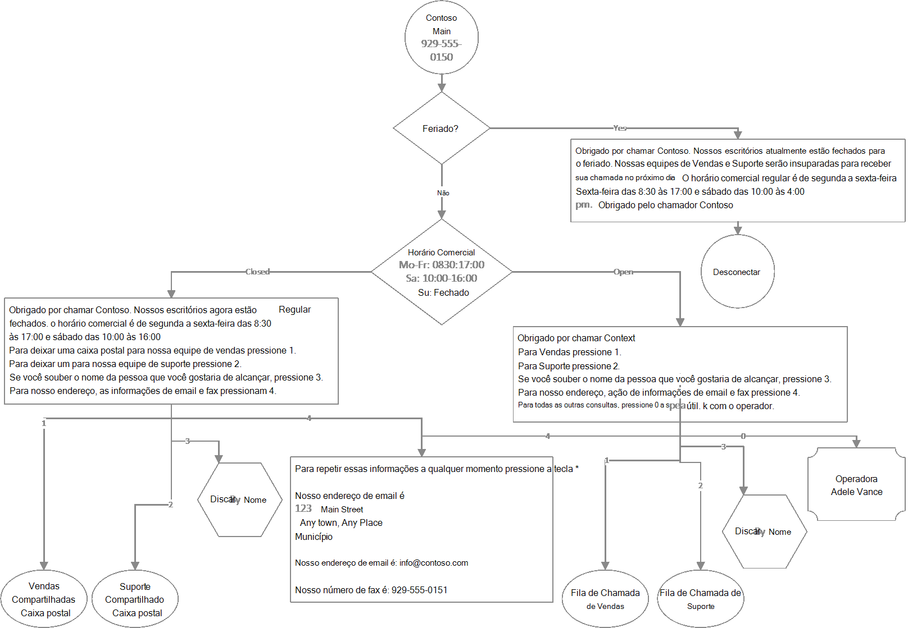

# <a name="create-an-auto-attendant-via-cmdlets"></a>Criar um atendimento automático por meio de cmdlets

## <a name="assumptions"></a>Suposições
1)  O PowerShell está instalado em seu computador
- Configurar seu computador para [Windows PowerShell](/SkypeForBusiness/set-up-your-computer-for-windows-powershell/set-up-your-computer-for-windows-powershell)
- Módulo MSTeams Instalado ````  (Install-Module -Name MicrosoftTeams -Force -AllowClobber) ````
- Módulo MSOnline instalado ```` Install-Module -Name MSOnline -Force -AllowClobber ````
2)  Você tem direitos de administração de locatários
3)  Você comprou Microsoft Teams Telefone
4)  As filas de chamada mencionadas abaixo já foram configuradas após o guia [Criando Filas de Chamada com cmdlets do PowerShell](create-a-phone-system-call-queue-via-cmdlets.md) .
                                                                                               
Observação: alguns dos cmdlets referenciados abaixo podem fazer parte da versão de Visualização Pública do módulo Teams PowerShell.  Para obter mais informações, [consulte Install Teams public preview do PowerShell](teams-powershell-install.md) e consulte [Microsoft Teams Notas de versão do PowerShell](teams-powershell-release-notes.md).

Os usuários que já têm o módulo MicrosoftTeams ````Update-Module MicrosoftTeams```` instalado devem garantir que a versão mais atualizada seja instalada.

## <a name="scenario"></a>Cenário

O seguinte fluxo de chamada de atendimento automático será criado:



Informações adicionais de configuração:

- Atendedor Automático: Contso Main
- - Operador: Adele Vance
- - Habilitar entradas de voz: off
- - Pesquisa de Diretório: Nenhuma
- - Feriados:
- - - 1º de janeiro de 2022
- - - 24 de dezembro de 2022
- - - 25 de dezembro de 2022

- Atendedor Automático: Contoso Dial By Name
- - Operador: Adele Vance
- - Fuso horário: UTC
- - Idioma: Inglês DOS EUA
- - Habilitar entradas de voz: ativado
- - Saudação: Nenhum
- - Menu: TTS, "Por favor, diga ou insira o nome da pessoa que você gostaria de alcançar. Para retornar ao menu anterior pressione 9"
- - Pesquisa de Diretório: Discar por Nome
- - Escopo de discagem: membros & suporte de vendas

## <a name="login"></a>Login
Você será solicitado a inserir suas credenciais Teams administrador.
```
$credential = Get-Credential
Connect-MicrosoftTeams -Credential $credential
Connect-MsolService -Credential $credential
````

## <a name="get-operator-information"></a>Obter informações do operador
````
$operatorID = (Get-CsOnlineUser -Identity “sip:adele@contoso.com”).ObjectID

$operatorEntity = New-CsAutoAttendantCallableEntity -Identity $operatorID -Type User
````

## <a name="dial-by-name-auto-attendant---resource-account-creation"></a>Discar por nome Atendedor Automático - Criação de conta de recurso
Observação: Criar conta de recurso aqui para que ela possa ser referenciada no principal atendimento automático.  O atendimento automático dial by name real será criado posteriormente.

### <a name="get-license-types"></a>Obter tipos de licença
````
Get-MsolAccountSku
````

### <a name="create-and-assign-resource-account"></a>Criar e atribuir Conta de Recurso
Observação: Telefone número não obrigatório aqui, pois a fila de chamada está na frente terminada por um Atendedor Automático
- ApplicationID
- - Atendedor Automático: ce933385-9390-45d1-9512-c8d228074e07
- - Fila de Chamada: 11cd3e2e-fccb-42ad-ad00-878b93575e07
````
New-CsOnlineApplicationInstance -UserPrincipalName ContosoDialByNameAA-RA@contoso.com -DisplayName "Contoso Dial By Name AA" -ApplicationID "ce933385-9390-45d1-9512-c8d228074e07"

Set-MsolUser -UserPrincipalName "ContosoDialByNameAA-RA@contoso.com" -UsageLocation US

Set-MsolUserLicense -UserPrincipalName “ContosoDialByNameAA-RA@contoso.com” -AddLicenses "contoso:PHONESYSTEM_VIRTUALUSER"

$dialByNameApplicationInstanceID = (Get-CsOnlineUser "ContosoDialByNameAA-RA@contoso.com").ObjectID
````

## <a name="contoso-main-menu-auto-attendant"></a>Menu Principal contoso Atendedor Automático
### <a name="create-holiday-schedules"></a>Criar agendamentos de feriados
````
$dtr = New-CsOnlineDateTimeRange -Start "24/12/2022" -End "25/12/2022"

$christmasSchedule = New-CsOnlineSchedule -Name "Christmas" -FixedSchedule -DateTimeRanges @($dtr)

$dtr = New-CsOnlineDateTimeRange -Start "01/01/2022" -End "02/01/2022"

$newyearSchedule = New-CsOnlineSchedule -Name "New Year" -FixedSchedule -DateTimeRanges @($dtr)
````

### <a name="create-address-fax-and-email-information-prompt"></a>Create Address, FAX, and Email Information Prompt
````
$addressPrompt = New-CsAutoAttendantPrompt -TextToSpeechPrompt "To repeat this information at any time press the * key. Our mailing address is: 123 Main Street, Any town, Any Place, County. Our email address is: info@contoso.com. Our fax number is: 929-555-0151"
````

### <a name="create-holiday-prompts-and-menu-options"></a>Criar prompts de feriado e opções de menu
````
$christmasGreetingPrompt = New-CsAutoAttendantPrompt -TextToSpeechPrompt "Thank you for calling Contoso. Our offices ae currently closed for the Christmas holiday. Our Sales and Support teams will be happy to take your call on the next business day. Regular business hours are Monday through Friday from 8:30 am to 5:00 pm and Saturday from 10:00 am to 4:00 pm eastern time. Thank you for calling Contso."

$christmasMenuOption = New-CsAutoAttendantMenuOption -Action DisconnectCall -DtmfResponse Automatic

$christmasMenu = New-CsAutoAttendantMenu -Name "Christmas Menu" -MenuOptions @($christmasMenuOption)

$christmasCallFlow = New-CsAutoAttendantCallFlow -Name "Christmas" -Greetings @($christmasGreetingPrompt) -Menu $christmasMenu

$christmasCallHandlingAssociation = New-CsAutoAttendantCallHandlingAssociation -Type Holiday -ScheduleId $christmasSchedule.Id -CallFlowId $christmasCallFlow.Id

$newyearGreetingPrompt = New-CsAutoAttendantPrompt -TextToSpeechPrompt "Thank you for calling Contoso. Our offices ae currently closed for the New Year’s holiday. Our Sales and Support teams will be happy to take your call on the next business day. Regular business hours are Monday through Friday from 8:30 am to 5:00 pm and Saturday from 10:00 am to 4:00 pm eastern time. Thank you for calling Contso."

$newyearMenuOption = New-CsAutoAttendantMenuOption -Action DisconnectCall -DtmfResponse Automatic

$newyearMenu = New-CsAutoAttendantMenu -Name "New Year Menu" -MenuOptions @($newyearMenuOption)

$newyearCallFlow = New-CsAutoAttendantCallFlow -Name "New Year" -Greetings @($newyearGreetingPrompt) -Menu $newyearMenu

$newyearCallHandlingAssociation = New-CsAutoAttendantCallHandlingAssociation -Type Holiday -ScheduleId $newyearSchedule.Id -CallFlowId $newyearCallFlow.Id
````

### <a name="create-after-hours-schedules"></a>Criar agendamentos após o horário
````
$timerangeMoFr = New-CsOnlineTimeRange -Start 08:30 -end 17:00

$timerangeSa = New-CsOnlineTimeRange -Start 10:00 -end 16:00

$afterHoursSchedule = New-CsOnlineSchedule -Name "After Hours Schedule" -WeeklyRecurrentSchedule -MondayHours @($timerangeMoFr) -TuesdayHours @($timerangeMoFr) -WednesdayHours @($timerangeMoFr) -ThursdayHours @($timerangeMoFr) -FridayHours @($timerangeMoFr) -SaturdayHours @($timerangeSa) -Complement
````

### <a name="create-after-hours-prompts-and-menu-options"></a>Criar prompts e opções de menu após o horário
````
$afterHoursGreetingPrompt = New-CsAutoAttendantPrompt -TextToSpeechPrompt "Thank you for calling Contoso. Our offices are now closed. Regular business hours are Monday through Friday from 8:30 am to 5:00 pm and Saturday from 10:00 am to 4:00 pm eastern time."

$afterHoursMenuPrompt = New-CsAutoAttendantPrompt -TextToSpeechPrompt “To leave a voicemail for our sales team press 1.To leave a message for our support team press 2.If you know the name of the person you would like to reach, press 3.For our address, email and fax information press 4.”

$afterHoursMenuOption1Target = (Get-Team -displayname "Sales").GroupID

$afterHoursMenuOption1Entity = New-CsAutoAttendantCallableEntity -Identity $afterHoursMenuOption1Target -Type SharedVoiceMail -EnableTranscription -EnableSharedVoicemailSystemPromptSuppression

$afterHoursMenuOption1 = New-CsAutoAttendantMenuOption -Action TransferCallToTarget -DtmfResponse Tone1 -CallTarget $afterHoursMenuOption1Entity

$afterHoursMenuOption2Target = (Get-Team -displayname "Support").GroupID

$afterHoursMenuOption2Entity = New-CsAutoAttendantCallableEntity -Identity $afterHoursMenuOption2Target -Type SharedVoicemail -EnableTranscription -EnableSharedVoicemailSystemPromptSuppression

$afterHoursMenuOption2 = New-CsAutoAttendantMenuOption -Action TransferCallToTarget -DtmfResponse Tone2 -CallTarget $afterHoursMenuOption2Entity

$dialbynameAAOption3Target = (Get-CsOnlineUser -Identity “ContosoDialByNameAA-RA@contso.com”).ObjectID

$dialbynameAAMenuOption3Entity = New-CsAutoAttendantCallableEntity -Identity $dialbynameAAOption3Target -Type applicationendpoint

$dialbynameAAMenuOption3 = New-CsAutoAttendantMenuOption -Action TransferCallToTarget -DtmfResponse Tone3 -CallTarget $dialbynameAAMenuOption3Entity

$afterHoursMenuOption4 = New-CsAutoAttendantMenuOption -Action Announcement -DtmfResponse Tone4 -Prompt $addressPrompt
````

### <a name="create-after-hours-menu-and-call-flow"></a>Criar Menu Após Horas e Chamar Flow
````
$afterHoursMenu = New-CsAutoAttendantMenu -Name "After Hours Menu" -MenuOptions @($afterHoursMenuOption1, $afterHoursMenuOption2, $dialbynameAAMenuOption3, $afterHoursMenuOption4) -Prompt $afterHoursMenuPrompt

$afterHoursCallFlow = New-CsAutoAttendantCallFlow -Name "After Hours Call Flow" -Greetings @($afterHoursGreetingPrompt) -Menu $afterHoursMenu

$afterHoursCallHandlingAssociation = New-CsAutoAttendantCallHandlingAssociation -Type AfterHours -ScheduleId $afterHoursSchedule.Id -CallFlowId $afterHoursCallFlow.Id
````

### <a name="create-open-hours-prompts-and-menu-options"></a>Criar prompts de horário aberto e opções de menu
````
$openHoursGreetingPrompt = New-CsAutoAttendantPrompt -TextToSpeechPrompt " Thank you for calling Contoso."

$openHoursMenuPrompt = New-CsAutoAttendantPrompt -TextToSpeechPrompt “For Sales press 1. For Support press 2. If you know the name of the person you would like to reach, press 3. For our address, email and fax information, press 4. For all other inquiries press 0 to speak with the operator.”

$openHoursMenuOption1Target = (Get-CsOnlineUser "Sales-RA@contoso.com").ObjectID

$openHoursMenuOption1Entity = New-CsAutoAttendantCallableEntity -Identity $openHoursMenuOption1Target -Type applicationendpoint

$openHoursMenuOption1 = New-CsAutoAttendantMenuOption -Action TransferCallToTarget -DtmfResponse Tone1 -CallTarget $openHoursMenuOption1Entity

$openHoursMenuOption2Target = (Get-CsOnlineUser "Support-RA@contoso.com").ObjectID

$openHoursMenuOption2Entity = New-CsAutoAttendantCallableEntity -Identity $openHoursMenuOption2Target -Type applicationendpoint

$openHoursMenuOption2 = New-CsAutoAttendantMenuOption -Action TransferCallToTarget -DtmfResponse Tone2 -CallTarget $openHoursMenuOption2Entity

$openHoursMenuOption4 = New-CsAutoAttendantMenuOption -Action Announcement -DtmfResponse Tone4 -Prompt $addressPrompt

$openHoursMenuOption0 = New-CsAutoAttendantMenuOption -Action TransferCallToOperator -DtmfResponse Tone0
````

### <a name="create-open-hours-menu"></a>Criar Menu De Horas Abertas
````
$openHoursMenu = New-CsAutoAttendantMenu -Name "Open Hours Menu" -MenuOptions @($openHoursMenuOption1, $openHoursMenuOption2, $dialbynameAAMenuOption3, $openHoursMenuOption4, $openHoursMenuOption0) -Prompt $openHoursMenuPrompt

$openHoursCallFlow = New-CsAutoAttendantCallFlow -Name "Open Hours Call Flow" -Greetings @($openHoursGreetingPrompt) -Menu $openHoursMenu
````

### <a name="create-auto-attendant"></a>Criar Atendedor Automático
````
$autoAttendant = New-CsAutoAttendant -Name “Contoso Main” -DefaultCallFlow $openHoursCallFlow -CallFlows @($afterHoursCallFlow, $christmasCallFlow, $newyearCallFlow) -CallHandlingAssociations @($afterHoursCallHandlingAssociation, $christmasCallHandlingAssociation, $newyearCallHandlingAssociation) -LanguageId “en-US” -TimeZoneId “Eastern Standard Time” -Operator $operatorEntity
````

### <a name="get-license-types"></a>Obter tipos de licença
````
Get-MsolAccountSku
````

### <a name="create-and-assign-resource-account"></a>Criar e atribuir Conta de Recurso
- ApplicationID
- - Atendedor Automático: ce933385-9390-45d1-9512-c8d228074e07
- - Fila de Chamada: 11cd3e2e-fccb-42ad-ad00-878b93575e07
````
New-CsOnlineApplicationInstance -UserPrincipalName ContosoMainAA-RA@contoso.com -DisplayName "Contoso Main AA" -ApplicationID "ce933385-9390-45d1-9512-c8d228074e07"

Set-MsolUser -UserPrincipalName "ContosoMainAA-RA@contoso.com" -UsageLocation US

Set-MsolUserLicense -UserPrincipalName “ContosoMainAA-RA@contoso.com” -AddLicenses "contoso:PHONESYSTEM_VIRTUALUSER"

$applicationInstanceID = (Get-CsOnlineUser "ContosoMainAA-RA@contoso.com").ObjectID

$autoAttendantID = (Get-CsAutoAttendant -NameFilter "Contoso Main").Identity

New-CsOnlineApplicationInstanceAssociation -Identities @($applicationInstanceID) -ConfigurationID $autoAttendantID -ConfigurationType AutoAttendant
````

### <a name="get-list-of-unassigned-service-numbers"></a>Obter lista de números de serviço não atribuídos
````
Get-CsOnlineTelephoneNumber -IsNotAssigned -InventoryType Service
````

#### <a name="assign-available-phone-number"></a>Atribuir número de telefone disponível
Observação: o local de uso atribuído ao número de telefone deve corresponder ao local de uso atribuído à Conta de Recursos.

````
Set-CsPhoneNumberAssignment -Identity ContosoMainAA-RA@contoso.com -PhoneNumber +{spare number from output of above command} -PhoneNumberType CallingPlan
````

## <a name="dial-by-name-auto-attendant---completion"></a>Discar por nome Atendedor Automático - Conclusão
### <a name="create-dial-scope"></a>Criar escopo de discagem
````
$salesGroupID = Find-CsGroup -SearchQuery "Sales" | % { $_.Id }

$supportGroupID = Find-CsGroup -SearchQuery "Support" | % { $_.Id }

$dialScope = New-CsAutoAttendantDialScope -GroupScope -GroupIds @($salesGroupID, $supportGroupID)
````

### <a name="create-prompts-and-menu-options"></a>Criar prompts e opções de menu
````
$dialByNameMenuPrompt = New-CsAutoAttendantPrompt -TextToSpeechPrompt "Please say or enter the name of the person you would like to reach. To return to the previous menu press 9”

$dialByNameMenuOption9Target = (Get-CsOnlineUser "ContosoMainAA-RA@contoso.com").ObjectID

$dialByNameMenuOption9Entity = New-CsAutoAttendantCallableEntity -Identity $dialByNameMenuOption9Target -Type applicationendpoint

$dialByNameMenuOption9 = New-CsAutoAttendantMenuOption -Action TransferCallToTarget -DtmfResponse Tone9 -CallTarget $dialByNameMenuOption9Entity

$dialByNameMenu = New-CsAutoAttendantMenu -Name "Contoso Dial By Name AA" -MenuOptions @($dialByNameMenuOption9) -Prompt $dialByNameMenuPrompt

$dialByNameMenu = New-CsAutoAttendantMenu -Name "Contoso Dial By Name AA" -MenuOptions @($dialByNameMenuOption9) -Prompt $dialByNameMenuPrompt -EnableDialByName -DirectorySearchMethod ByName

$dialByNameCallFlow = New-CsAutoAttendantCallFlow -Name "Contoso Dial By Name Call Flow" -Menu $dialByNameMenu

$dialByNameAutoAttendant = New-CsAutoAttendant -Name “Contoso Dial By Name” -DefaultCallFlow $dialByNameCallFlow -LanguageId “en-US” -TimeZoneId “UTC” -Operator $operatorEntity -EnableVoiceResponse -InclusionScope $dialScope
````

### <a name="assign-resource-account"></a>Atribuir conta de recurso
````
New-CsOnlineApplicationInstanceAssociation -Identities @($dialByNameApplicationInstanceID) -ConfigurationID $dialByNameAutoAttendant.Id -ConfigurationType AutoAttendant
````
