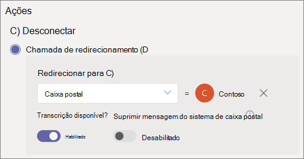

# Configurar um atendimento automático

Os atendentes automáticos permitem que as pessoas liguem para sua organização e naveguem por um sistema de menus para falar com o departamento certo, fila de chamada, pessoa ou operador. Você pode criar assistentes automáticos para sua organização com o Microsoft Teams de administração ou com o PowerShell.

> [!TIP]
> Este artigo é para grandes organizações. Se sua organização for uma pequena empresa, leia [Configurar um atendimento automático - tutorial de pequenas](/microsoftteams/business-voice/create-a-phone-system-auto-attendant-smb) empresas.

Leia Plan for Teams auto attendants and [call queues](plan-auto-attendant-call-queue.md)  e siga as etapas de início antes de seguir os procedimentos neste artigo.

Os atendimentos automáticos podem direcionar chamadas, com base na entrada dos chamadores, para um dos seguintes destinos: 

- **Operador** - o operador definido para o atendimento automático. Definir um operador é opcional. O operador pode ser definido como qualquer um dos outros destinos nesta lista.
- **Pessoa na organização** - uma pessoa em sua organização que pode receber chamadas de voz. Essa pessoa pode ser um usuário online ou um usuário hospedado no local usando Skype for Business Server.
- **Aplicativo de voz** - outro atendimento automático ou uma fila de chamadas. (Escolha a conta de recurso associada ao atendimento automático ou fila de chamada ao escolher esse destino.)
- **Caixa** postal - a caixa de correio de voz associada a um grupo Microsoft 365 que você especificar. Você pode escolher se deseja transcrições de caixa postal e o "Por favor, deixe uma mensagem após o tom". prompt do sistema.
- **Número de telefone externo** - qualquer número de telefone. (Consulte [detalhes técnicos de transferência externa](create-a-phone-system-auto-attendant.md#external-phone-number-transfers---technical-details)).
- **Comunicado (Arquivo de áudio)** - Reproduzir um arquivo de áudio. Uma mensagem de anúncio gravada que você carrega salva como áudio em . WAV, .MP3 ou . Formato WMA. A gravação não pode ser maior do que 5 MB. O sistema reproduz o comunicado e retorna ao menu de atendimento automático.
- **Comunicado (Digitado)** - Digite uma mensagem. Texto que você deseja que o sistema leia. Você pode inserir até 1000 caracteres. O sistema reproduz o comunicado e retorna ao menu de atendimento automático.

Você será solicitado a escolher uma dessas opções em vários estágios ao configurar um atendimento automático.

Para configurar um atendimento automático, no centro de administração Teams, **expanda Voz,** selecione **Assistentes automáticos** e selecione **Adicionar**.

## Demonstração de vídeo

Este vídeo mostra um exemplo básico de como criar um assistente automático no Teams.

> [!VIDEO https://www.microsoft.com/videoplayer/embed/RWEnCG?autoplay=false]

## Informações gerais

1. Digite um nome para o atendimento automático na caixa na parte superior.

2. Para designar um operador, especifique o destino das chamadas para o operador. Essa designação é opcional (mas recomendada). De definir **a opção** Operador para permitir que os chamadores saiam dos menus e fale com uma pessoa designada.

3. Especifique o fuso horário desse atendimento automático. O fuso horário é usado para calcular o horário comercial se você criar um fluxo de chamada [separado para o horário.](#call-flow-for-after-hours)

4. [Especifique um idioma com suporte](create-a-phone-system-auto-attendant-languages.md) para esse atendimento automático. Esse é o idioma que será usado para prompts de voz gerados pelo sistema.

5. Escolha se deseja habilitar entradas de voz. Quando habilitada, o nome de cada opção de menu se torna uma palavra-chave de reconhecimento de fala. Por exemplo, os chamadores podem dizer "Um" para selecionar a opção de menu mapeada para a tecla 1 ou podem dizer "Vendas" para selecionar a opção de menu chamada "Vendas".

   > [!NOTE]
   > Se você escolher um idioma na Etapa 4 que não suporte entradas de voz, essa opção será desabilitada.

6. Selecione **Próximo**.

## Fluxo de chamada

Escolha se deseja reproduzir uma saudação quando o atendente automático atender uma chamada.

Se você selecionar **Reproduzir um arquivo de** áudio, poderá usar o botão de arquivo **Upload** para carregar uma mensagem de saudação gravada salva como áudio em . WAV, .MP3 ou . Formato WMA. A gravação não pode ser maior do que 5 MB.

Se você selecionar **Digitar uma mensagem de** saudação, o sistema lerá o texto que você digitar (até 1000 caracteres) quando o atende automaticamente atender a uma chamada.

Escolha como você deseja rotear a chamada.

Se você selecionar **Desconectar,** o atendimento automático desligará a chamada.

Se você selecionar **Redirecionar chamada,** poderá escolher um dos destinos de roteamento de chamadas.

Se você selecionar Opções de menu  Reproduzir, poderá  optar por Reproduzir um arquivo de áudio ou Digitar uma mensagem de saudação e escolher entre opções de **menu** e pesquisa de diretório.

### Opções de menu

Para opções de discagem, atribua as teclas de 0 a 9 no teclado do telefone a um dos destinos de roteamento de chamadas. (As chaves \* (asterisco) e (libra) são reservados \# pelo sistema e não podem ser reatribuídos. Pressionar uma dessas teclas repetirá o menu atual.)

> [!NOTE]
> A tecla # só é ressarçada para o atendimento automático mais recente. Depois que o limite for cruzado para um novo atendimento automático, a tecla #não poderá levá-lo para o anterior.

Os mapeamentos de chaves não têm que ser contínuos. É possível criar um menu com as teclas 0, 1 e 3 mapeadas para opções, enquanto a tecla número 2 não é usada.

Recomendamos o mapeamento da chave zero para o operador se você configurou uma. Se o operador não estiver definido como nenhuma chave, o comando de voz "Operator" também será desabilitado.

Para cada opção de menu, especifique as seguintes configurações:

- **Tecla de** discagem - a chave no teclado do telefone para acessar essa opção. Se as entradas de voz estão disponíveis, os chamadores também podem dizer esse número para acessar a opção.

- **Comando de** voz - define o comando de voz que um chamador pode dar para acessar essa opção, se as entradas de voz estão habilitadas. Ele pode conter várias palavras como "Atendimento ao Cliente" ou "Operações e Motivos". Por exemplo, o chamador pode pressionar 2, dizer "dois" ou dizer "Vendas" para selecionar a opção mapeada para as duas teclas. Este texto também é renderizado por texto em fala para o prompt de confirmação do serviço, que pode ser algo como "Transferir sua chamada para vendas".

- **Redirecionar para** - o destino de roteamento de chamadas usado quando os chamadores escolhem essa opção. Se você estiver redirecionando para um atendimento automático ou fila de chamada, escolha a conta de recurso associada a ela.

### Pesquisa de diretório

Se você atribuir chaves de discagem a destinos, recomendamos que você escolha **Nenhuma** para **pesquisa de diretório.** Se um chamador tentar discar um nome ou extensão usando chaves atribuídas a destinos específicos, ele poderá ser roteado inesperadamente para um destino antes de concluir a inserção do nome ou extensão. Recomendamos que você crie um atendimento automático separado para pesquisa de diretório e tenha seu link principal de atendimento automático com uma chave de discagem.

Se você não atribuiu chaves de discagem, escolha uma opção para pesquisa **de diretório.**

**Discar por nome** - Se você habilitar essa opção, os chamadores poderão dizer o nome do usuário ou digitá-lo no teclado do telefone. Qualquer usuário online ou qualquer usuário hospedado no local usando Skype for Business Server, é um usuário qualificado e pode ser encontrado com Dial por nome. (Você pode definir quem é e não está incluído no diretório na página [de](#dial-scope) escopo discar.)

**Discar por extensão** - Se você habilitar essa opção, os chamadores poderão se conectar aos usuários em sua organização discando sua extensão de telefone. Qualquer usuário online ou qualquer usuário hospedado no local usando o Skype for Business Server, é um usuário qualificado e pode ser encontrado com **Dial por extensão.** (Você pode definir quem é e não está incluído no diretório na página [de](#dial-scope) escopo discar.)

Os usuários que você deseja disponibilizar para Discagem por Extensão precisam ter uma extensão especificada como parte de um dos seguintes atributos de telefones definidos no Active Directory ou no Azure Active Directory (Consulte Adicionar usuários [individualmente](/microsoft-365/admin/add-users/add-users) ou em massa para obter mais informações.)

- OfficePhone
- HomePhone
- Mobile/MobilePhone
- PhoneNumber/PhoneNumber
- OtherTelephone

O formato necessário para inserir a extensão no campo número de telefone do usuário pode ser um dos seguintes formatos:

- *+\<phone number>;ext=\<extension>*
- *+\<phone number>x\<extension>*
- *x\<extension>*

- Exemplo 1: Set-MsolUser -UserPrincipalName usern@domain.com -Phonenumber "+15555555678;ext=5678"
- Exemplo 2: Set-MsolUser -UserPrincipalName usern@domain.com -Phonenumber "+15555555678x5678"
- Exemplo 3: Set-MsolUser -UserPrincipalName usern@domain.com -Phonenumber "x5678"

Você pode definir a extensão [no](https://admin.microsoft.com/) Centro de administração do Microsoft 365 ou no Azure Active Directory [de administração.](https://aad.portal.azure.com) Pode levar até 12 horas antes que as alterações sejam disponibilizadas para os atendimentos automáticos e filas de chamada.

> [!NOTE]
> Se você quiser usar os recursos  **Discar** por nome e Discar por extensão, você pode atribuir uma chave de discagem no seu atendimento automático principal para alcançar um atendimento automático habilitado para Discagem **pelo nome**. Nesse atendimento automático, você pode atribuir a tecla 1 (que não tem letras associadas a ela) para alcançar o atendimento automático **Discar** por extensão.

Depois de selecionar uma opção **de pesquisa diretório,** selecione **Próximo**.

## Fluxo de chamada para depois do horário

O horário comercial pode ser definido para cada atendimento automático. Se os horários comerciais não forem definidos, todos os dias e todas as horas do dia serão considerados horários comerciais, porque um cronograma 24/7 é definido por padrão. O horário comercial pode ser definido com pausas no tempo durante o dia e todas as horas que não estão definidas como horário comercial são consideradas após o horário. Você pode definir diferentes opções de tratamento de chamadas de entrada e saudações para o pós-horário.

Dependendo de como você configurou seus atendimentos automáticos e filas de chamadas, talvez seja necessário especificar apenas o roteamento de chamadas após o horário para os atendimentos automáticos com números de telefone diretos.

Se você quiser roteamento de chamadas separado para chamadores após o horário, especifique seu horário comercial para cada dia. Selecione **Adicionar novo horário** para especificar vários conjuntos de horas para um determinado dia, por exemplo, para especificar uma pausa de almoço.

Depois de especificar seu horário comercial, escolha suas opções de roteamento de chamadas para o horário de expediente. As mesmas opções estão disponíveis para o roteamento de chamadas de horário comercial especificado acima.

Selecione **Próximo** quando terminar.

## Fluxos de chamada durante feriados

O seu atendimento automático pode ter um fluxo de chamada para cada Feriado que [você definiu](set-up-holidays-in-teams.md). Você pode adicionar até 20 feriados agendados para cada atendedor automático.

1. Na página Configurações de chamada de feriado, selecione **Adicionar**.

2. Digite um nome para essa configuração de feriado.

3. No menu **suspenso Feriado,** escolha o feriado que você deseja usar.

4. Escolha o tipo de saudação que você deseja usar.

    

5. Escolha se deseja **desconectar ou** **redirecionar** a chamada.

6. Se você optou por redirecionar, escolha o destino de roteamento de chamadas para a chamada.

7. Selecione **Salvar**.

Repita o procedimento conforme necessário para cada feriado adicional.

Quando você adicionou todos os feriados, selecione **Próximo**.

## Escopo de discagem

O *escopo de* discagem define quais usuários estão disponíveis no diretório quando um chamador usa discagem por nome ou discagem por extensão. O padrão de **Todos os usuários online** inclui todos os usuários em sua organização que são usuários online ou hospedados no local usando Skype for Business Server.

Você pode incluir ou excluir  usuários específicos  selecionando Grupo de usuários personalizado em **Incluir** ou Excluir e escolher um ou mais grupos de Microsoft 365, listas de distribuição ou grupos de segurança. Por exemplo, talvez você queira excluir executivos em sua organização do diretório de discagem. (Se um usuário estiver em ambas as listas, ele será excluído do diretório.)

> [!NOTE]
> Pode levar até 36 horas para que um novo usuário tenha seu nome listado no diretório.

Quando terminar de definir o escopo de discagem, selecione **Próximo**.

## Contas de recursos

Todos os atendentes automáticos devem ter uma conta de recurso associada.  Os atendentes automáticos de primeiro nível precisarão de pelo menos uma conta de recurso que tenha um número de serviço associado. Se desejar, você pode atribuir várias contas de recurso a um atendimento automático, cada uma com um número de serviço separado.

Para adicionar uma conta de recurso, selecione **Adicionar conta** e procure a conta que você deseja adicionar. Selecione **Adicionar** e, em seguida, selecione **Adicionar**.

Quando terminar de adicionar contas de recurso, selecione **Enviar** para concluir a configuração do atendimento automático.

Consulte [Gerenciar Teams de recursos para](manage-resource-accounts.md) obter mais informações.

## Transferências de número de telefone externo - detalhes técnicos

Consulte os [Pré-requisitos](plan-auto-attendant-call-queue.md#prerequisites) para permitir que os atendimentos automáticos transfira chamadas externamente.  Além disso:

- Para uma conta  de recurso  com uma licença de Plano de Chamada ou um número Conexão operador, o número de telefone de transferência externa deve ser inserido no formato E.164 (+[código do país][código de área][número de telefone]).

- Para uma conta de recurso com uma política Microsoft Teams Telefone de roteamento de voz online de licença e roteamento de voz direta, o formato de número de telefone de transferência externa depende das configurações do Controlador de Borda de Sessão [(SBC).](direct-routing-connect-the-sbc.md)

O número de telefone de saída exibido é determinado da seguinte forma:

  - Para números de plano de chamada e Conexão operador, o número de telefone do chamador original é exibido.
  - Para números de Roteamento Direto, o número enviado é baseado na configuração P-Asserted-Identity (PAI) no SBC, da seguinte forma:
    - Se definido como Desabilitado, o número de telefone do chamador original será exibido. Essa é a configuração padrão e recomendada.
    - Se definido como Habilitado, o número de telefone da conta de recurso será exibido.

Em um Skype for Business híbrido, para transferir uma chamada de atendimento automático para a PSTN, crie um novo usuário local com encaminhamento de chamada definido para o número PSTN. O usuário deve estar habilitado para Enterprise Voice e ter uma política de voz atribuída. Para saber mais, confira [Transferência de chamada de atendimento automático para PSTN](/SkypeForBusiness/plan/exchange-unified-messaging-online-migration-support#auto-attendant-call-transfer-to-pstn).

## Cmdlets de atendedores automáticos

Windows PowerShell permite que você crie e gerencie os atendimentos automáticos por meio da linha de comando de forma em lotes ou programáticas.

Os cmdlets a seguir permitem gerenciar os atendimentos automáticos:

- [New-CsAutoAttendant](/powershell/module/skype/new-csautoattendant)  
- [Get-CsAutoAttendant](/powershell/module/skype/get-csautoattendant)
- [Set-CsAutoAttendant](/powershell/module/skype/set-csautoattendant)
- [Update-CsAutoAttendant](/powershell/module/skype/update-csautoattendant)
- [Remove-CsAutoAttendant](/powershell/module/skype/remove-csautoattendant)
- [New-CsOnlineTimeRange](/powershell/module/skype/new-csonlinetimerange)
- [New-CsOnlineDateTimeRange](/powershell/module/skype/new-csonlinedatetimerange)
- [New-CsOnlineSchedule](/powershell/module/skype/New-CsOnlineSchedule)
- [Get-CsAutoAttendantHolidays](/powershell/module/skype/get-csautoattendantholidays)
- [Import-CsAutoAttendantHolidays](/powershell/module/skype/import-csautoattendantholidays)
- [Export-CsAutoAttendantHolidays](/powershell/module/skype/export-csautoattendantholidays)
- [New-CsAutoAttendantDialScope](/powershell/module/skype/New-CsAutoAttendantDialScope)
- [New-CsAutoAttendantPrompt](/powershell/module/skype/New-CsAutoAttendantPrompt)
- [New-CsAutoAttendantCallableEntity](/powershell/module/skype/New-CsAutoAttendantCallableEntity)
- [New-CsAutoAttendantMenuOption](/powershell/module/skype/New-CsAutoAttendantMenuOption)
- [New-CsAutoAttendantMenu](/powershell/module/skype/new-csautoattendantmenu)
- [New-CsAutoAttendantCallFlow](/powershell/module/skype/New-CsAutoAttendantCallFlow)
- [New-CsAutoAttendantCallHandlingAssociation](/powershell/module/skype/New-CsAutoAttendantCallHandlingAssociation)
- [Get-CsAutoAttendantStatus](/powershell/module/skype/Get-CsAutoAttendantStatus)
- [Get-CsAutoAttendantTenantInformation](/powershell/module/skype/Get-CsAutoAttendantTenantInformation)

Os cmdlets adicionais a seguir também são necessários para gerenciar os usuários, contas de recursos, licenças de Microsoft Teams Telefone, números de telefone, arquivos de áudio e idioma com suporte que serão usados com filas de chamada:

Usuários/Teams

- Usuários
- - [Get-CsOnlineUser](/powershell/module/skype/Get-CsOnlineUser)

- Teams: 
- - [Get-Team](/powershell/module/teams/Get-Team)

Contas de recursos:

- [New-CsOnlineApplicationInstance](/powershell/module/skype/New-CsOnlineApplicationInstance)
- [Find-CsOnlineApplicationInstance](/powershell/module/skype/Find-CsOnlineApplicationInstance)
- [Get-CsOnlineApplicationInstance](/powershell/module/skype/Get-CsOnlineApplicationInstance)
- [Set-CsOnlineApplicationInstance](/powershell/module/skype/Set-CsOnlineApplicationInstance)
- [New-CsOnlineApplicationInstanceAssociation](/powershell/module/skype/New-CsOnlineApplicationInstanceAssociation)
- [Get-CsOnlineApplicationInstanceAssociation](/powershell/module/skype/Get-CsOnlineApplicationInstanceAssociation)
- [Remove-CsOnlineApplicationInstanceAssociation](/powershell/module/skype/Remove-CsOnlineApplicationInstanceAssociation)
- [Get-CsOnlineApplicationInstanceAssociationStatus](/powershell/module/skype/Get-CsOnlineApplicationInstanceAssociationStatus)

Licenças Teams Telefone virtuais:

- [Get-MsolAccountSku](/powershell/module/msonline/get-msolaccountsku)
- [Set-MsolUserLicense](/powershell/module/msonline/set-msoluserlicense)

Telefone número:

- [Get-CsOnlineTelephoneNumber](/powershell/module/skype/Get-CsOnlineTelephoneNumber)
- [Set-CsPhoneNumberAssignment](/powershell/module/teams/Set-CsPhoneNumberAssignment)

Arquivos de áudio

- [Get-CsOnlineAudioFile](/powershell/module/skype/Get-CsOnlineAudioFile)
- [Import-CsOnlineAudioFile](/powershell/module/skype/Import-CsOnlineAudioFile)
- [Export-CsOnlineAudioFile](/powershell/module/skype/Export-CsOnlineAudioFile)
- [Remove-CsOnlineAudioFile](/powershell/module/skype/Remove-CsOnlineAudioFile)

Idiomas de suporte e fusos horário

- [Get-CsAutoAttendantSupportedLanguage](/powershell/module/skype/Get-CsAutoAttendantSupportedLanguage)
- [Get-CsAutoAttendantSupportedTimeZone](/powershell/module/skype/Get-CsAutoAttendantSupportedTimeZone)

Para ver um guia passo a passo sobre como criar assistentes automáticos com o PowerShell, consulte [Creating Auto Attendants with PowerShell cmdlets](create-a-phone-system-auto-attendant-via-cmdlets.md)

## Atendedor Automático Ferramenta de Diagnóstico

Se você for um administrador, poderá usar a seguinte ferramenta de diagnóstico para validar se um atendimento automático pode receber chamadas:

1. Selecione **Executar testes** abaixo, o que preencherá o diagnóstico no Centro de Administração do Microsoft 365. 

   > [!div class="nextstepaction"]
   > [Executar testes: Teams Atendedor Automático](https://aka.ms/TeamsAADiag)

2. No painel de diagnóstico Executar, insira a Conta de Recurso no campo Nome de Usuário ou **Email** e selecione **Executar Testes**.

3. Os testes identificarão configurações de conta de recurso, política ou locatário que estão impedindo o atendimento automático de receber chamadas e fornecerão etapas para corrigir quaisquer problemas identificados.

## Tópicos relacionados

[Veja o que você obter com Teams Telefone](./here-s-what-you-get-with-phone-system.md)

[Obter números de telefone de serviço](./getting-service-phone-numbers.md)

[Disponibilidade de Audioconferência e Planos de Chamadas por país e região](./country-and-region-availability-for-audio-conferencing-and-calling-plans/country-and-region-availability-for-audio-conferencing-and-calling-plans.md)

[Uma introdução ao Windows PowerShell e ao Skype for Business Online](/SkypeForBusiness/set-up-your-computer-for-windows-powershell/set-up-your-computer-for-windows-powershell)
