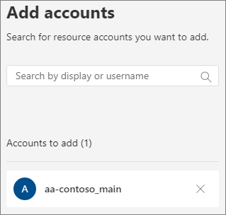

# Configurar um assistente automático

Os participantes automáticos permitem que as pessoas liguem para sua organização e naveguem por um sistema de menus para falar com o departamento correto, fila de chamada, pessoa ou operador. Você pode criar assistentes automáticos para sua organização com o Centro de administração do Microsoft Teams ou com o PowerShell.

Certifique-se de que você leu o Plano para  os participantes automáticos do Teams e as [filas](plan-auto-attendant-call-queue.md) de chamada e seguiu as etapas de início antes de seguir os procedimentos neste artigo.

Os atenderes automáticos podem direcionar chamadas, com base na entrada dos chamadores, para um dos seguintes destinos: 

- **Pessoa na organização** - uma pessoa em sua organização que pode receber chamadas de voz. Pode ser um usuário online ou um usuário hospedado localmente usando o Skype for Business Server.
- **Aplicativo de voz** – outro atendimento automático ou uma fila de chamadas. (Escolha a conta de recurso associada ao atendimento automático ou fila de chamada ao escolher este destino.)
- **Número de telefone externo** – qualquer número de telefone. (Veja detalhes [técnicos da transferência externa).](create-a-phone-system-auto-attendant.md#external-phone-number-transfers---technical-details)
- **Caixa** postal : a caixa postal associada a um grupo do Microsoft 365 especificado por você.
- **Operador** – o operador definido para o atendimento automático. Definir um operador é opcional. O operador pode ser definido como qualquer um dos outros destinos nesta lista.

Você será solicitado a escolher uma dessas opções em vários estágios enquanto configura um assistente automático.

Para configurar um atendimento automático, no Centro de administração do Teams, expanda o **Voice,** clique em **Assistentes Automáticos** e, em seguida, clique em **Adicionar.**

## Informações gerais

1. Digite um nome para o assistente automático na caixa na parte superior.

2. Se você quiser designar um operador, especifique o destino das chamadas para o operador. Isso é opcional (mas recomendado). Você pode definir a **opção** Operador para permitir que os chamadores saiam dos menus e fale com uma pessoa designada.

3. Especifique o fuso horário desse assistente automático. O fuso horário é usado para calcular o horário comercial se você criar um fluxo de chamada [separado para o horário de expediente.](#call-flow-for-after-hours)

4. [Especifique um idioma com suporte](create-a-phone-system-auto-attendant-languages.md) para esse assistente automático. Esse é o idioma que será usado para prompts de voz gerados pelo sistema.

5. Escolha se deseja habilitar entradas de voz. Quando habilitado, o nome de cada opção de menu se tornará uma palavra-chave de reconhecimento de fala. Por exemplo, os chamadores podem dizer "Um" para selecionar a opção de menu mapeada para a tecla 1 ou podem dizer "Vendas" para selecionar a opção de menu chamada "Vendas".

> [!NOTE]
> Se você escolher um idioma na Etapa 4 que não dá suporte a entradas de voz, essa opção será desabilitada.

6. Click **Next**.

## Fluxo de chamada

Escolha se você deseja reproduzir uma saudação quando o atendente automático atender uma chamada.

Se você selecionar **Reproduzir um arquivo de áudio,** poderá usar o **botão** Carregar arquivo para carregar uma mensagem de saudação gravada salva como áudio. Wav. MP3 ou . Formato WMA. A gravação pode ter no máximo 5 MB.

Se você selecionar **Digitar** uma mensagem de saudação, o sistema lerá o texto que você digitar (até 1.000 caracteres) quando o atendente automático atender uma chamada.

Escolha como você deseja encaminhar a chamada.

Se você selecionar **Desconectar,** o atendimento automático desligará a chamada.

Se você selecionar **Redirecionar chamada,** poderá escolher um dos destinos de roteamento de chamadas.

Se você selecionar as opções do  menu Reproduzir, poderá optar por Reproduzir um arquivo de áudio ou Digitar em uma mensagem de saudação e escolher entre as opções de **menu** e **a** pesquisa de diretório.

### Opções de menu

Para opções de discagem, você pode atribuir as teclas de 0 a 9 no teclado de telefone a um dos destinos de roteamento de chamada. (As teclas \* (Repetir) e \# (Voltar) são reservados pelo sistema e não podem ser reatribuídos.)

Os mapeamentos de teclas não devem ser contínuos. É possível, por exemplo, criar um menu com as teclas 0, 1 e 3 mapeadas para opções, enquanto a tecla 2 não é usada.

Recomendamos mapear a tecla 0 para o operador se você tiver configurado uma. Se o operador não estiver definido como chave, o comando de voz "Operador" também será desabilitado.

Para cada opção de menu, especifique o seguinte:

- **Tecla de** discagem – a chave no teclado de telefone para acessar essa opção. Se as entradas de voz estão disponíveis, os chamadores também podem dizer esse número para acessar a opção.

- **Comando de** voz – define o comando de voz que um chamador pode dar para acessar essa opção, se as entradas de voz estão habilitadas. Ele pode conter várias palavras, como "Atendimento ao Cliente" ou "Operações e Bases". Por exemplo, o chamador pode pressionar 2, dizer "dois" ou dizer "Vendas" para selecionar a opção mapeada para a tecla 2. Esse texto também é renderizado por texto em fala para o prompt de confirmação do serviço, que pode ser algo como "Transferindo sua chamada para vendas".

- **Redirecionar para** – o destino de roteamento de chamada usado quando os chamadores escolhem essa opção. Se você estiver redirecionando para um atendimento automático ou fila de chamada, escolha a conta de recurso associada a ela.

### Pesquisa de diretório

Se você atribuir teclas de discagem a destinos, recomendamos que você escolha **Nenhuma** para **pesquisa de diretório.** Se um chamador tentar discar um nome ou extensão usando teclas atribuídas a destinos específicos, ele poderá ser roteado inesperadamente para um destino antes de terminar de inserir o nome ou a extensão. Recomendamos que você crie um assistente automático separado para pesquisa de diretório e tenha o link do seu principal assistente automático para ele por meio de uma tecla de discagem.

Se você não atribuiu teclas de discagem, escolha uma opção para a **pesquisa de diretório.**

**Discar por nome** – Se você habilitar essa opção, os chamadores poderão dizer o nome do usuário ou digitá-lo no teclado do telefone. Qualquer usuário online ou qualquer usuário hospedado localmente usando o Skype for Business Server é um usuário qualificado e pode ser encontrado com o Dial por nome. (Você pode definir quem é e não está incluído no diretório na página de escopo [do Discar.)](#dial-scope)

**Discar por extensão** – Se você habilitar essa opção, os chamadores poderão se conectar aos usuários em sua organização discando a extensão do telefone. Qualquer usuário online ou qualquer usuário hospedado localmente usando o Skype for Business Server é um usuário qualificado e pode ser encontrado com o **Dial por extensão.** (Você pode definir quem é e não está incluído no diretório na página de escopo [do Discar.)](#dial-scope)

Os usuários que você deseja disponibilizar para Discar por Extensão precisam ter uma extensão especificada como parte de um dos seguintes atributos de telefone definidos no Active Directory ou no Azure Active Directory (consulte Adicionar usuários [individualmente](https://docs.microsoft.com/microsoft-365/admin/add-users/add-users) ou em massa para obter mais informações.)

- OfficePhone
- Homephone
- Celular/Celular
- Número De Telefone/Número De Telefone
- OtherTelephone

O formato necessário para inserir a extensão no campo de número de telefone do usuário é:

- *+\<phone number>;ext=\<extension>*
- *+\<phone number>X\<extension>*
- *X\<extension>*

- Exemplo 1: Set-MsolUser -UserPrincipalName usern@domain.com -Phonenumber "+1555555678;ext=5678"
- Exemplo 2: Set-MsolUser -UserPrincipalName usern@domain.com -Phonenumber "+1555555678x5678"
- Exemplo 3: Set-MsolUser -UserPrincipalName usern@domain.com -Phonenumber "x5678"

Você pode definir a extensão no Centro de administração do [Microsoft 365](https://admin.microsoft.com/) ou no Centro de administração do [Azure Active Directory.](https://aad.portal.azure.com) Pode levar até 12 horas até que as alterações sejam disponibilizadas para os atendimentos automáticos e filas de chamada.

> [!NOTE]
> Se quiser usar os  recursos Discar por nome e Discar por extensão, você pode atribuir uma tecla de discagem no seu atendimento automático principal para chegar a um assistente automático habilitado para Discar **por nome.**  Nesse atendimento automático, você pode atribuir a tecla 1 (que não tem letras associadas a ela) para chegar ao atendimento automático **discar** por extensão.

Depois de selecionar uma opção de pesquisa **de** diretório, clique em **Próximo.**

## Fluxo de chamada para horas extras

O horário comercial pode ser definido para cada atendimento automático. Se os horários comerciais não forem definidos, todos os dias e todas as horas do dia serão considerados horários comerciais, porque um cronograma 24/7 é definido por padrão. Os horários comerciais podem ser definidos com quebras de tempo durante o dia, e todas as horas que não são definidas como horários comerciais são consideradas horas extras. Você pode definir diferentes opções de tratamento de chamadas de entrada e saudações para o horário de expediente.

Dependendo de como você configurou seus atenderes automáticos e filas de chamadas, talvez você só precise especificar o roteamento de chamadas após o expediente para os atender automaticamente com números de telefone diretos.

Se você quiser roteamento de chamadas separado para chamadores de horas extras, especifique seu horário comercial para cada dia. Clique **em Adicionar novo horário** para especificar vários conjuntos de horas para um determinado dia, por exemplo, para especificar uma pausa para o almoço.

Depois de especificar seu horário comercial, escolha as opções de roteamento de chamadas para horas extras. As mesmas opções estão disponíveis para o roteamento de chamadas de horário comercial especificado acima.

Clique **em** Próxima quando terminar.

## Fluxos de chamada durante feriados

O seu chamador automático pode ter um fluxo de chamada para cada [Feriado que você tiver definido.](set-up-holidays-in-teams.md) Você pode adicionar até 20 feriados agendados para cada atendedor automático.

1. Na página de configurações de chamada de fim de ano, clique em **Adicionar.**

2. Digite um nome para essa configuração de feriado.

3. Na lista **de** feriados, escolha o feriado que você deseja usar.

4. Escolha o tipo de saudação que você deseja usar.

    

5. Escolha se você deseja **desconectar** **ou redirecionar** a chamada.

6. Se você optar por redirecionar, escolha o destino de roteamento de chamadas para a chamada.

7. Clique em **Salvar**.

Repita o procedimento conforme necessário para cada feriado adicional.

Quando você adicionar todos os feriados, clique em **Próximo.**

## Escopo de discagem

O *escopo de* discagem define quais usuários estão disponíveis no diretório quando um chamador usa discagem por nome ou discagem por extensão. O padrão de **Todos os usuários online** inclui todos os usuários da sua organização que são usuários online ou hospedados localmente usando o Skype for Business Server.

Você pode incluir ou excluir  usuários específicos  selecionando o grupo de usuários personalizado em Incluir ou Excluir e escolhendo um ou mais grupos, listas de distribuição ou grupos de segurança do Microsoft 365.  Por exemplo, talvez você queira excluir executivos de sua organização do diretório de discagem. (Se um usuário estiver em ambas as listas, ele será excluído do diretório.)

> [!NOTE]
> Pode levar até 36 horas para que um novo usuário tenha seu nome listado no diretório.

Quando terminar de definir o escopo de discagem, clique em **Próximo.**

## Contas de recursos

Todos os participantes automáticos devem ter uma conta de recurso associada.  Os participantes automáticos de primeiro nível precisarão de pelo menos uma conta de recurso que tenha um número de serviço associado. Se desejar, você pode atribuir várias contas de recurso a um atendimento automático, cada uma com um número de serviço separado.

Para adicionar uma conta de recurso, clique **em Adicionar conta** e pesquise a conta que você deseja adicionar. Clique **em Adicionar** e, em seguida, clique em **Adicionar.**

Quando terminar de adicionar contas de serviço, clique em **Enviar.** Isso conclui a configuração do atendimento automático.

## Transferências de número de telefone externo – detalhes técnicos

Consulte os [Pré-requisitos](plan-auto-attendant-call-queue.md#prerequisites) para permitir que os atenderes automáticos transfira chamadas externamente.  Além disso:

- Para uma conta  de recurso com um número de Plano de Chamada, o número de telefone de transferência externa deve ser inserido no formato E.164 (+[código do país][código de área][número de telefone]).

- Para uma conta de recurso com um número de Roteamento Direto, o formato de número de telefone de transferência externa depende das configurações do Controlador de Borda de Sessão [(SBC).](direct-routing-connect-the-sbc.md)

O número de telefone de saída exibido é determinado da seguinte forma:

  - Para números do Plano de Chamada, o número de telefone do chamador original é exibido.
  - Para números de Roteamento Direto, o número enviado baseia-se na configuração pai (identidade de P) no SBC, da seguinte forma:
    - Se definido como Desabilitado, o número de telefone do chamador original será exibido. Essa é a configuração padrão e recomendada.
    - Se definido como Habilitado, o número de telefone da conta de recurso será exibido.

Em um ambiente híbrido do Skype for Business, para transferir uma chamada de atendimento automático para o PSTN, crie um novo usuário local com o encaminhamento de chamadas definido para o número PSTN. O usuário deve estar habilitado para o Enterprise Voice e ter uma política de voz atribuída. Para saber mais, confira [a transferência de chamada do atendimento automático para pSTN.](https://docs.microsoft.com/SkypeForBusiness/plan/exchange-unified-messaging-online-migration-support#auto-attendant-call-transfer-to-pstn)

### Criar um assistente automático com o PowerShell

Você também pode usar o PowerShell para criar e configurar os participantes automáticos. Aqui estão os cmdlets necessários para gerenciar um atendimento automático:

- [New-CsAutoAttendant](https://docs.microsoft.com/powershell/module/skype/new-csautoattendant)  
- [Set-CsAutoAttendant](https://docs.microsoft.com/powershell/module/skype/set-csautoattendant)
- [Get-CsAutoAttendant](https://docs.microsoft.com/powershell/module/skype/get-csautoattendant)
- [Get-CsAutoAttendantHolidays](https://docs.microsoft.com/powershell/module/skype/get-csautoattendantholidays)
- [Remove-CsAutoAttendant](https://docs.microsoft.com/powershell/module/skype/remove-csautoattendant)
- [New-CsAutoAttendantMenu](https://docs.microsoft.com/powershell/module/skype/new-csautoattendantmenu)
- [New-CsOnlineAudioFile](https://docs.microsoft.com/powershell/module/skype/new-CsOnlineAudioFile)
- [New-CsAutoAttendantCallFlow](https://docs.microsoft.com/powershell/module/skype/New-CsAutoAttendantCallFlow)
- [Export-CsAutoAttendantHolidays](https://docs.microsoft.com/powershell/module/skype/export-csorganizationalautoattendantholidays)
- [New-CsOnlineTimeRange](https://docs.microsoft.com/powershell/module/skype/new-csonlinetimerange)
- [New-CsOnlineDateTimeRange](https://docs.microsoft.com/powershell/module/skype/new-csonlinedatetimerange)
- [New-CsOnlineSchedule](https://docs.microsoft.com/powershell/module/skype/New-CsOnlineSchedule)
- [Get-CsAutoAttendantSupportedTimeZone](https://docs.microsoft.com/powershell/module/skype/Get-CsAutoAttendantSupportedTimeZone)
- [New-CsAutoAttendantCallHandlingAssociation](https://docs.microsoft.com/powershell/module/skype/New-CsAutoAttendantCallHandlingAssociation)
- [Get-CsAutoAttendantSupportedLanguage](https://docs.microsoft.com/powershell/module/skype/Get-CsAutoAttendantSupportedLanguage)
- [Import-CsAutoAttendantHolidays](https://docs.microsoft.com/powershell/module/skype/import-csautoattendantholidays)
- [New-CsAutoAttendantCallableEntity](https://docs.microsoft.com/powershell/module/skype/New-CsAutoAttendantCallableEntity)

## Tópicos relacionados

[Veja o que você obtém com o Sistema de Telefonia](/MicrosoftTeams/here-s-what-you-get-with-phone-system)

[Obter números de telefone de serviço](/microsoftteams/getting-service-phone-numbers)

[Disponibilidade de Audioconferência e Planos de Chamadas por país e região](/microsoftteams/country-and-region-availability-for-audio-conferencing-and-calling-plans/country-and-region-availability-for-audio-conferencing-and-calling-plans)

[Uma introdução ao Windows PowerShell e ao Skype for Business Online](/SkypeForBusiness/set-up-your-computer-for-windows-powershell/set-up-your-computer-for-windows-powershell)
