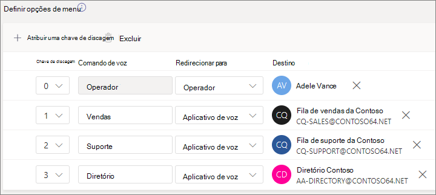
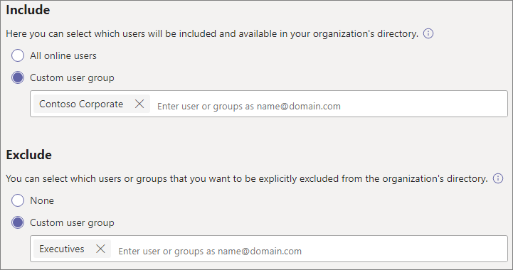

# Configurar um atendimento automáticoSet up an auto attendant

Os atendentes automáticos permitem que as pessoas liguem para sua organização e naveguem por um sistema de menus para falar com o departamento certo, fila de chamada, pessoa ou operador.Auto attendants let people call your organization and navigate a menu system to speak to the right department, call queue, person, or an operator. Você pode criar assistentes automáticos para sua organização com o centro de administração do Microsoft Teams ou com o PowerShell.You can create auto attendants for your organization with the Microsoft Teams admin center, or with PowerShell.

Certifique-se de ter lido [Plan for Teams auto attendants](plan-auto-attendant-call-queue.md) and call queues and followed the getting started [steps](plan-auto-attendant-call-queue.md#getting-started) before you follow the procedures in this article.Be sure you have read [Plan for Teams auto attendants and call queues](plan-auto-attendant-call-queue.md) and followed the [getting started steps](plan-auto-attendant-call-queue.md#getting-started) before you follow the procedures in this article.

Os atendimentos automáticos podem direcionar chamadas, com base na entrada dos chamadores, para um dos seguintes destinos: Auto attendants can direct calls, based on callers' input, to one of the following destinations: 

- **Operador** - o operador definido para o atendimento automático.**Operator** - the operator defined for the auto attendant. Definir um operador é opcional.Defining an operator is optional. O operador pode ser definido como qualquer um dos outros destinos nesta lista.The operator can be defined as any of the other destinations in this list.
- **Pessoa na organização** - uma pessoa em sua organização que pode receber chamadas de voz.**Person in the organization** - a person in your organization who can receive voice calls. Pode ser um usuário online ou um usuário hospedado no local usando o Skype for Business Server.This can be an online user or a user hosted on-premises using Skype for Business Server.
- **Aplicativo de voz** - outro atendimento automático ou uma fila de chamadas.**Voice app** - another auto attendant or a call queue. (Escolha a conta de recurso associada ao atendimento automático ou fila de chamada ao escolher esse destino.)(Choose the resource account associated with the auto attendant or call queue when choosing this destination.)
- **Caixa** postal - a caixa de correio de voz associada a um grupo do Microsoft 365 especificado.**Voicemail** - the voice mailbox associated with a Microsoft 365 group that you specify.
- **Número de telefone externo** - qualquer número de telefone.**External phone number** - any phone number. (Consulte [detalhes técnicos de transferência externa](create-a-phone-system-auto-attendant.md#external-phone-number-transfers---technical-details)).(See [external transfer technical details](create-a-phone-system-auto-attendant.md#external-phone-number-transfers---technical-details)).
- **Comunicado** - Reproduzir um arquivo de áudio.**Announcement** - Play an audio file. Uma mensagem de anúncio gravada que você carrega salva como áudio em . WAV, . MP3 ou . Formato WMA.A recorded announcement message you upload that's saved as audio in .WAV, .MP3, or .WMA format. A gravação não pode ser maior do que 5 MB.The recording can be no larger than 5 MB. O sistema reproduz o comunicado e retorna ao menu de atendimento automático.The system plays the announcement, and then returns to the auto attendant menu.
- **Comunicado** - Digite uma mensagem.**Announcement** - Type in a message. Texto que você deseja que o sistema leia.Text you want the system to read. Você pode inserir até 1000 caracteres.You can enter up to 1000 characters. O sistema reproduz o comunicado e retorna ao menu de atendimento automático.The system plays the announcement, and then returns to the auto attendant menu.

Você será solicitado a escolher uma dessas opções em vários estágios ao configurar um atendimento automático.You'll be prompted to choose one of these options at various stages as you set up an auto attendant.

Para configurar um atendimento automático, no Centro de administração do Teams, **expanda Voz,** selecione **Atendimento automático** e selecione **Adicionar**.To set up an auto attendant, in the Teams admin center, expand **Voice**, select **Auto attendants**, and then select **Add**.

## Informações geraisGeneral info

1. Digite um nome para o atendimento automático na caixa na parte superior.Type a name for the auto attendant in the box at the top.

2. Se você quiser designar um operador, especifique o destino das chamadas para o operador.If you want to designate an operator, specify the destination for calls to the operator. Isso é opcional (mas recomendado).This is optional (but recommended). Você pode definir a **opção Operador** para permitir que os chamadores possam sair dos menus e falar com uma pessoa designada.You can set the **Operator** option to allow callers to break out of the menus and speak to a designated person.

3. Especifique o fuso horário desse atendimento automático.Specify the time zone for this auto attendant. O fuso horário é usado para calcular o horário comercial se você criar um fluxo de chamada [separado para o horário.](#call-flow-for-after-hours)The time zone is used for calculating business hours if you [create a separate call flow for after hours](#call-flow-for-after-hours).

4. [Especifique um idioma com suporte](create-a-phone-system-auto-attendant-languages.md) para esse atendimento automático.Specify a [supported language](create-a-phone-system-auto-attendant-languages.md) for this auto attendant. Esse é o idioma que será usado para prompts de voz gerados pelo sistema.This is the language that will be used for system-generated voice prompts.

5. Escolha se deseja habilitar entradas de voz.Choose if you want to enable voice inputs. Quando habilitada, o nome de cada opção de menu se torna uma palavra-chave de reconhecimento de fala.When enabled, the name of every menu option becomes a speech-recognition keyword. Por exemplo, os chamadores podem dizer "Um" para selecionar a opção de menu mapeada para a tecla 1 ou podem dizer "Vendas" para selecionar a opção de menu chamada "Vendas".For example, callers can say "One" to select the menu option mapped to key 1, or they can say "Sales" to select the menu option named "Sales."

> [!NOTE]
> Se você escolher um idioma na Etapa 4 que não suporte entradas de voz, essa opção será desabilitada.If you choose a language in Step 4 that doesn't support voice inputs this option will be disabled.

6. Selecione **Próximo**.Select **Next**.

## Fluxo de chamadaCall flow

Escolha se deseja reproduzir uma saudação quando o atendente automático atender uma chamada.Choose if you want to play a greeting when the auto attendant answers a call.

Se você selecionar **Reproduzir um arquivo de áudio,** poderá usar o botão **Carregar** arquivo para carregar uma mensagem de saudação gravada salva como áudio em . WAV, . MP3 ou . Formato WMA.If you select **Play an audio file** you can use the **Upload file** button to upload a recorded greeting message saved as audio in .WAV, .MP3, or .WMA format. A gravação não pode ser maior do que 5 MB.The recording can be no larger than 5 MB.

Se você selecionar **Digitar uma** mensagem de saudação, o sistema lerá o texto que você digitará (até 1000 caracteres) quando o atendemento automático atender a uma chamada.If you select **Type a greeting message** the system will read the text you the text that you type (up to 1000 characters) when the auto attendant answers a call.

Escolha como você deseja rotear a chamada.Choose how you want to route the call.

Se você selecionar **Desconectar,** o atendimento automático desligará a chamada.If you select **Disconnect**, the auto attendant will hang up the call.

Se você selecionar **Redirecionar chamada**, poderá escolher um dos destinos de roteamento de chamadas.If you select **Redirect call**, you can choose one of the call routing destinations.

Se você selecionar Opções de menu  Reproduzir, poderá  optar por Reproduzir um arquivo de áudio ou Digitar uma mensagem de saudação e escolher entre opções de **menu** e pesquisa de diretório.If you select **Play menu options**, you can choose to **Play an audio file** or **Type in a greeting message** and then choose between menu options and directory search.

### Opções de menuMenu options

Para opções de discagem, você pode atribuir as teclas de 0 a 9 no teclado telefônico a um dos destinos de roteamento de chamadas.For dialing options, you can assign the 0-9 keys on the telephone keypad to one of the call routing destinations. (As chaves \* (Repetir) e \# (Voltar) são reservados pelo sistema e não podem ser reatribuídos.)(The keys \* (Repeat) and \# (Back) are reserved by the system and can't be reassigned.)

Os mapeamentos de chaves não têm que ser contínuos.Key mappings don't have to be continuous. É possível, por exemplo, criar um menu com as teclas 0, 1 e 3 mapeadas para opções, enquanto as duas chaves não são usadas.It is possible, for example, to create a menu with keys 0, 1, and 3 mapped to options, while the two key isn't used.

Recomendamos mapear a chave zero para o operador se você configurou uma.We recommend mapping the zero key to the operator if you have configured one. Se o operador não estiver definido como nenhuma chave, o comando de voz "Operator" também será desabilitado.If the operator isn't set to any key, the voice command "Operator" is also disabled.

Para cada opção de menu, especifique as seguintes configurações:For each menu option, specify the following settings:

- **Tecla de** discagem - a chave no teclado do telefone para acessar essa opção.**Dial key** - the key on the telephone keypad to access this option. Se as entradas de voz estão disponíveis, os chamadores também podem dizer esse número para acessar a opção.If voice inputs are available, callers can also say this number to access the option.

- **Comando de** voz - define o comando de voz que um chamador pode dar para acessar essa opção, se as entradas de voz estão habilitadas.**Voice command** - defines the voice command that a caller can give to access this option, if voice inputs are enabled. Ele pode conter várias palavras como "Atendimento ao Cliente" ou "Operações e Motivos".It can contain multiple words like "Customer Service" or "Operations and Grounds." Por exemplo, o chamador pode pressionar 2, dizer "dois" ou dizer "Vendas" para selecionar a opção mapeada para as duas teclas.For example, the caller can press 2, say "two," or say "Sales" to select the option mapped to the two key. Este texto também é renderizado por texto em fala para o prompt de confirmação do serviço, que pode ser algo como "Transferir sua chamada para vendas".This text is also rendered by text to speech for the service confirmation prompt, which might be something like "Transferring your call to sales."

- **Redirecionar para** - o destino de roteamento de chamadas usado quando os chamadores escolhem essa opção.**Redirect to** - the call routing destination used when callers choose this option. Se você estiver redirecionando para um atendimento automático ou fila de chamada, escolha a conta de recurso associada a ela.If you are redirecting to an auto attendant or call queue, choose the resource account associated with it.

### Pesquisa de diretórioDirectory search

Se você atribuir chaves de discagem a destinos, recomendamos que você escolha **Nenhuma** para **pesquisa de diretório.**If you assign dial keys to destinations, we recommend that you choose **None** for **Directory search**. Se um chamador tentar discar um nome ou extensão usando chaves atribuídas a destinos específicos, ele poderá ser roteado inesperadamente para um destino antes de concluir a inserção do nome ou extensão.If a caller attempts to dial a name or extension using keys that are assigned to specific destinations, they may be unexpectedly routed to a destination before they finish entering the name or extension. Recomendamos que você crie um atendimento automático separado para pesquisa de diretório e tenha seu link principal de atendimento automático para ele por meio de uma chave de discagem.We recommend that you create a separate auto attendant for directory search and have your main auto attendant link to it via a dial key.

Se você não atribuiu chaves de discagem, escolha uma opção para pesquisa **de diretório.**If you didn't assign dial keys, then choose an option for **Directory search**.

**Discar por nome** - Se você habilitar essa opção, os chamadores poderão dizer o nome do usuário ou digitá-lo no teclado do telefone.**Dial by name** - If you enable this option, callers can say the user's name or type it on the telephone keypad. Qualquer usuário online ou qualquer usuário hospedado no local usando o Skype for Business Server, é um usuário qualificado e pode ser encontrado com Dial por nome.Any online user or any user hosted on-premises using Skype for Business Server, is an eligible user and can be found with Dial by name. (Você pode definir quem é e não está incluído no diretório na página [de](#dial-scope) escopo discar.)(You can set who is and is not included in the directory on the [Dial scope](#dial-scope) page.)

**Discar por extensão** - Se você habilitar essa opção, os chamadores poderão se conectar aos usuários em sua organização discando sua extensão de telefone.**Dial by extension** - If you enable this option, callers can connect with users in your organization by dialing their phone extension. Qualquer usuário online ou qualquer usuário hospedado no local usando o Skype for Business Server, é um usuário qualificado e pode ser encontrado com **Dial por extensão.**Any online user or any user hosted on-premises using Skype for Business Server, is an eligible user and can be found with **Dial by extension**. (Você pode definir quem é e não está incluído no diretório na página [de](#dial-scope) escopo discar.)(You can set who is and is not included in the directory on the [Dial scope](#dial-scope) page.)

Os usuários que você deseja disponibilizar para o Dial By Extension precisam ter uma extensão especificada como parte de um dos seguintes atributos de telefones definidos no Active Directory ou no Azure Active Directory (Consulte Adicionar usuários [individualmente](https://docs.microsoft.com/microsoft-365/admin/add-users/add-users) ou em massa para obter mais informações.)Users you wish to make available for Dial By Extension need to have an extension specified as part of one of the following phones attributes defined in Active Directory or Azure Active Directory (See [Add users individually or in bulk](https://docs.microsoft.com/microsoft-365/admin/add-users/add-users) for more information.)

- OfficePhoneOfficePhone
- HomePhoneHomePhone
- Mobile/MobilePhoneMobile/MobilePhone
- PhoneNumber/PhoneNumberTelephoneNumber/PhoneNumber
- OtherTelephoneOtherTelephone

O formato necessário para inserir a extensão no campo número de telefone do usuário é:The required format to enter the extension in the user phone number field is either:

- *+\<phone number>;ext=\<extension>**+\<phone number>;ext=\<extension>*
- *+\<phone number>x\<extension>**+\<phone number>x\<extension>*
- *x\<extension>**x\<extension>*

- Exemplo 1: Set-MsolUser -UserPrincipalName usern@domain.com -Phonenumber "+15555555678;ext=5678"Example 1: Set-MsolUser -UserPrincipalName usern@domain.com -Phonenumber "+15555555678;ext=5678"
- Exemplo 2: Set-MsolUser -UserPrincipalName usern@domain.com -Phonenumber "+15555555678x5678"Example 2: Set-MsolUser -UserPrincipalName usern@domain.com -Phonenumber "+15555555678x5678"
- Exemplo 3: Set-MsolUser -UserPrincipalName usern@domain.com -Phonenumber "x5678"Example 3: Set-MsolUser -UserPrincipalName usern@domain.com -Phonenumber "x5678"

Você pode definir a extensão no centro de administração do [Microsoft 365](https://admin.microsoft.com/) ou no centro de administração [do Azure Active Directory.](https://aad.portal.azure.com)You can set the extension in the [Microsoft 365 admin center](https://admin.microsoft.com/) or the [Azure Active Directory admin center](https://aad.portal.azure.com). Pode levar até 12 horas antes que as alterações sejam disponibilizadas para os atendimentos automáticos e filas de chamada.It can take up to 12 hours before changes are available to auto attendants and call queues.

> [!NOTE]
> Se você quiser usar os recursos  **Discar** por nome e Discar por extensão, você pode atribuir uma chave de discagem no seu atendimento automático principal para alcançar um atendimento automático habilitado para Discagem **pelo nome**.If you want to use both the **Dial by name** and **Dial by extension** features, you can assign a dial key on your main auto attendant to reach an auto attendant enabled for **Dial by name**. Nesse atendimento automático, você pode atribuir a tecla 1 (que não tem letras associadas a ela) para alcançar o atendimento automático **Discar** por extensão.Within that auto attendant, you can assign the 1 key (which has no letters associated with it) to reach the **Dial by extension** auto attendant.

Depois de selecionar uma opção **de pesquisa diretório,** selecione **Próximo**.Once you have selected a **Directory search** option, select **Next**.

## Fluxo de chamada para depois do horárioCall flow for after hours

O horário comercial pode ser definido para cada atendimento automático.Business hours can be set for each auto attendant. Se os horários comerciais não forem definidos, todos os dias e todas as horas do dia serão considerados horários comerciais, porque um cronograma 24/7 é definido por padrão.If business hours aren't set, all days and all hours in the day are considered business hours because a 24/7 schedule is set by default. O horário comercial pode ser definido com pausas no tempo durante o dia e todas as horas que não estão definidas como horário comercial são consideradas após o horário.Business hours can be set with breaks in time during the day, and all of the hours that are not set as business hours are considered after-hours. Você pode definir diferentes opções de tratamento de chamadas de entrada e saudações para o pós-horário.You can set different incoming call-handling options and greetings for after-hours.

Dependendo de como você configurou seus atendimentos automáticos e filas de chamadas, talvez seja necessário especificar apenas o roteamento de chamadas após o horário para os atendimentos automáticos com números de telefone diretos.Depending on how you have configured your auto attendants and call queues, you may only need to specify after-hours call routing for auto attendants with direct phone numbers.

Se você quiser roteamento de chamadas separado para chamadores após o horário, especifique seu horário comercial para cada dia.If you want separate call routing for after-hours callers, then specify your business hours for each day. Selecione **Adicionar novo horário** para especificar vários conjuntos de horas para um determinado dia, por exemplo, para especificar uma pausa de almoço.Select **Add new time** to specify multiple sets of hours for a given day, for example, to specify a lunch break.

Depois de especificar seu horário comercial, escolha suas opções de roteamento de chamadas para o horário de expediente.Once you've specified your business hours, then choose your call routing options for after hours. As mesmas opções estão disponíveis para o roteamento de chamadas de horário comercial especificado acima.The same options are available as for the business hours call routing that you specified above.

Selecione **Próximo** quando terminar.Select **Next** when you're done.

## Fluxos de chamada durante feriadosCall flows during holidays

O seu atendimento automático pode ter um fluxo de chamada para cada Feriado que [você definiu](set-up-holidays-in-teams.md).Your auto attendant can have a call flow for each [Holiday you've set up](set-up-holidays-in-teams.md). Você pode adicionar até 20 feriados agendados para cada atendedor automático.You can add up to 20 scheduled holidays to each auto attendant.

1. Na página Configurações de chamada de feriado, selecione **Adicionar**.On the Holiday call settings page, select **Add**.

2. Digite um nome para essa configuração de feriado.Type a name for this holiday setting.

3. No menu **suspenso Feriado,** escolha o feriado que você deseja usar.From the **Holiday** dropdown, choose the holiday that you want to use.

4. Escolha o tipo de saudação que você deseja usar.Choose the type of greeting that you want to use.

    

5. Escolha se deseja **desconectar ou** **redirecionar** a chamada.Choose if you want to **Disconnect** or **Redirect** the call.

6. Se você optou por redirecionar, escolha o destino de roteamento de chamadas para a chamada.If you chose to redirect, choose the call routing destination for the call.

7. Selecione **Salvar**.Select **Save**.

Repita o procedimento conforme necessário para cada feriado adicional.Repeat the procedure as needed for each additional holiday.

Quando você adicionou todos os feriados, selecione **Próximo**.When you've added all your holidays, select **Next**.

## Escopo de discagemDial scope

O *escopo de* discagem define quais usuários estão disponíveis no diretório quando um chamador usa discagem por nome ou discagem por extensão.The *dial scope* defines which users are available in the directory when a caller uses dial-by-name or dial-by-extension. O padrão de **Todos os usuários online** inclui todos os usuários em sua organização que são usuários online ou hospedados no local usando o Skype for Business Server.The default of **All online users** includes all users in your organization that are Online users or hosted on-premises using Skype for Business Server.

Você pode incluir ou excluir  usuários específicos selecionando Grupo de usuários personalizado em **Incluir** ou **Excluir** e escolher um ou mais grupos, listas de distribuição ou grupos de segurança do Microsoft 365.You can include or exclude specific users by selecting **Custom user group** under **Include** or **Exclude** and choosing one or more Microsoft 365 groups, distribution lists, or security groups. Por exemplo, talvez você queira excluir executivos em sua organização do diretório de discagem.For example, you might want to exclude executives in your organization from the dialing directory. (Se um usuário estiver em ambas as listas, ele será excluído do diretório.)(If a user is in both lists, they will be excluded from the directory.)

> [!NOTE]
> Pode levar até 36 horas para que um novo usuário tenha seu nome listado no diretório.It might take up to 36 hours for a new user to have their name listed in the directory.

Quando terminar de definir o escopo de discagem, selecione **Próximo**.When you're done setting the dial scope, select **Next**.

## Contas de recursosResource accounts

Todos os atendentes automáticos devem ter uma conta de recurso associada.All auto attendants must have an associated resource account.  Os atendentes automáticos de primeiro nível precisarão de pelo menos uma conta de recurso que tenha um número de serviço associado.First-level auto attendants will need at least one resource account that has an associated service number. Se desejar, você pode atribuir várias contas de recurso a um atendimento automático, cada uma com um número de serviço separado.If you wish, you can assign several resource accounts to an auto attendant, each with a separate service number.

Para adicionar uma conta de recurso, selecione **Adicionar conta** e procure a conta que você deseja adicionar.To add a resource account, select **Add account** and search for the account that you want to add. Selecione **Adicionar** e, em seguida, selecione **Adicionar**.Select **Add**, and then select **Add**.

Quando terminar de adicionar contas de serviço, selecione **Enviar** para concluir a configuração do atendimento automático.When you have finished adding service accounts, select **Submit** to complete auto attendant configuration.

## Transferências de número de telefone externo - detalhes técnicosExternal phone number transfers - technical details

Consulte os [Pré-requisitos](plan-auto-attendant-call-queue.md#prerequisites) para permitir que os atendimentos automáticos transfira chamadas externamente.Refer to the [Prerequisites](plan-auto-attendant-call-queue.md#prerequisites) in order to allow auto attendants to transfer calls externally.  Além disso:In addition:

- Para uma conta  de recurso com um número do Plano de Chamadas, o número de telefone de transferência externa deve ser inserido no formato E.164 (+[código do país][código de área][número de telefone]).For a resource account with a [Calling Plan](calling-plans-for-office-365.md) number, the external transfer phone number must be entered in E.164 format (+[country code][area code][phone number]).

- Para uma conta de recurso com um número de Roteamento Direto, o formato de número de telefone de transferência externa depende das configurações do Controlador de Borda de Sessão [(SBC).](direct-routing-connect-the-sbc.md)For a resource account with a Direct Routing number, the external transfer phone number format is dependent on the [Session Border Controller (SBC)](direct-routing-connect-the-sbc.md) settings.

O número de telefone de saída exibido é determinado da seguinte forma:The outbound phone number that's displayed is determined as follows:

  - Para números do Plano de Chamadas, o número de telefone do chamador original é exibido.For Calling Plan numbers, the original caller's phone number is displayed.
  - Para números de Roteamento Direto, o número enviado é baseado na configuração P-Asserted-Identity (PAI) no SBC, da seguinte forma:For Direct Routing numbers, the number sent is based on the P-Asserted-Identity (PAI) setting on the SBC, as follows:
    - Se definido como Desabilitado, o número de telefone do chamador original será exibido.If set to Disabled, the original caller's phone number is displayed. Essa é a configuração padrão e recomendada.This is the default and recommended setting.
    - Se definido como Habilitado, o número de telefone da conta de recurso será exibido.If set to Enabled, the resource account phone number is displayed.

Em um ambiente híbrido do Skype for Business, para transferir uma chamada de atendimento automático para a PSTN, crie um novo usuário local com encaminhamento de chamada definido para o número PSTN.In a Skype for Business hybrid environment, to transfer an auto attendant call to the PSTN, create a new on-premises user with call forwarding set to the PSTN number. O usuário deve estar habilitado para Enterprise Voice e ter uma política de voz atribuída.The user must be enabled for Enterprise Voice and have a voice policy assigned. Para saber mais, confira [Transferência de chamada de atendimento automático para PSTN](https://docs.microsoft.com/SkypeForBusiness/plan/exchange-unified-messaging-online-migration-support#auto-attendant-call-transfer-to-pstn).To learn more, see [Auto attendant call transfer to PSTN](https://docs.microsoft.com/SkypeForBusiness/plan/exchange-unified-messaging-online-migration-support#auto-attendant-call-transfer-to-pstn).

### Criar um atendimento automático com o PowerShellCreate an auto attendant with PowerShell

Você também pode usar o PowerShell para criar e configurar os atendimentos automáticos.You can also use PowerShell to create and set up auto attendants. Aqui estão os cmdlets que você precisa para gerenciar um atendimento automático:Here are the cmdlets that you need to manage an auto attendant:

- [New-CsAutoAttendantNew-CsAutoAttendant](https://docs.microsoft.com/powershell/module/skype/new-csautoattendant)  
- [Set-CsAutoAttendantSet-CsAutoAttendant](https://docs.microsoft.com/powershell/module/skype/set-csautoattendant)
- [Get-CsAutoAttendantGet-CsAutoAttendant](https://docs.microsoft.com/powershell/module/skype/get-csautoattendant)
- [Get-CsAutoAttendantHolidaysGet-CsAutoAttendantHolidays](https://docs.microsoft.com/powershell/module/skype/get-csautoattendantholidays)
- [Remove-CsAutoAttendantRemove-CsAutoAttendant](https://docs.microsoft.com/powershell/module/skype/remove-csautoattendant)
- [New-CsAutoAttendantMenuNew-CsAutoAttendantMenu](https://docs.microsoft.com/powershell/module/skype/new-csautoattendantmenu)
- [New-CsOnlineAudioFileNew-CsOnlineAudioFile](https://docs.microsoft.com/powershell/module/skype/new-CsOnlineAudioFile)
- [New-CsAutoAttendantCallFlowNew-CsAutoAttendantCallFlow](https://docs.microsoft.com/powershell/module/skype/New-CsAutoAttendantCallFlow)
- [Export-CsAutoAttendantHolidaysExport-CsAutoAttendantHolidays](https://docs.microsoft.com/powershell/module/skype/export-csorganizationalautoattendantholidays)
- [New-CsOnlineTimeRangeNew-CsOnlineTimeRange](https://docs.microsoft.com/powershell/module/skype/new-csonlinetimerange)
- [New-CsOnlineDateTimeRangeNew-CsOnlineDateTimeRange](https://docs.microsoft.com/powershell/module/skype/new-csonlinedatetimerange)
- [New-CsOnlineScheduleNew-CsOnlineSchedule](https://docs.microsoft.com/powershell/module/skype/New-CsOnlineSchedule)
- [Get-CsAutoAttendantSupportedTimeZoneGet-CsAutoAttendantSupportedTimeZone](https://docs.microsoft.com/powershell/module/skype/Get-CsAutoAttendantSupportedTimeZone)
- [New-CsAutoAttendantCallHandlingAssociationNew-CsAutoAttendantCallHandlingAssociation](https://docs.microsoft.com/powershell/module/skype/New-CsAutoAttendantCallHandlingAssociation)
- [Get-CsAutoAttendantSupportedLanguageGet-CsAutoAttendantSupportedLanguage](https://docs.microsoft.com/powershell/module/skype/Get-CsAutoAttendantSupportedLanguage)
- [Import-CsAutoAttendantHolidaysImport-CsAutoAttendantHolidays](https://docs.microsoft.com/powershell/module/skype/import-csautoattendantholidays)
- [New-CsAutoAttendantCallableEntityNew-CsAutoAttendantCallableEntity](https://docs.microsoft.com/powershell/module/skype/New-CsAutoAttendantCallableEntity)

## Tópicos relacionadosRelated topics

[Veja o que você obtém com o Sistema de TelefoniaHere's what you get with Phone System](/MicrosoftTeams/here-s-what-you-get-with-phone-system)

[Obter números de telefone de serviçoGetting service phone numbers](/microsoftteams/getting-service-phone-numbers)

[Disponibilidade de Audioconferência e Planos de Chamadas por país e regiãoCountry and region availability for Audio Conferencing and Calling Plans](/microsoftteams/country-and-region-availability-for-audio-conferencing-and-calling-plans/country-and-region-availability-for-audio-conferencing-and-calling-plans)

[Uma introdução ao Windows PowerShell e ao Skype for Business OnlineAn introduction to Windows PowerShell and Skype for Business Online](/SkypeForBusiness/set-up-your-computer-for-windows-powershell/set-up-your-computer-for-windows-powershell)
