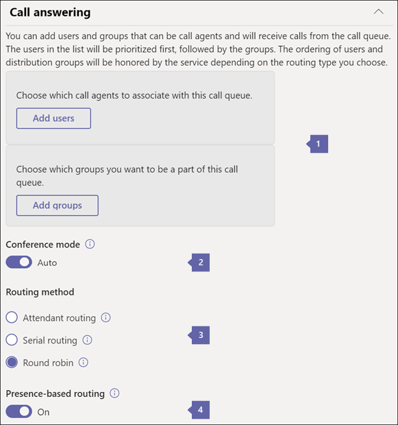

# <a name="create-a-cloud-call-queue"></a><span data-ttu-id="bc26c-103">Criar uma fila de chamada do Cloud</span><span class="sxs-lookup"><span data-stu-id="bc26c-103">Create a Cloud call queue</span></span>

<span data-ttu-id="bc26c-104">As filas de chamadas na nuvem podem fornecer:</span><span class="sxs-lookup"><span data-stu-id="bc26c-104">Cloud call queues can provide:</span></span>

- <span data-ttu-id="bc26c-105">Uma mensagem de saudação.</span><span class="sxs-lookup"><span data-stu-id="bc26c-105">A greeting message.</span></span>

- <span data-ttu-id="bc26c-106">Música enquanto as pessoas estão aguardando a espera.</span><span class="sxs-lookup"><span data-stu-id="bc26c-106">Music while people are waiting on hold.</span></span>

- <span data-ttu-id="bc26c-107">Redirecionar chamadas para agentes de chamada em listas de distribuição habilitadas por email e grupos de segurança.</span><span class="sxs-lookup"><span data-stu-id="bc26c-107">Redirecting calls to call agents in mail-enabled distribution lists and security groups.</span></span>

- <span data-ttu-id="bc26c-108">Configuração de parâmetros diferentes, como tamanho máximo da fila, tempo limite e opções de tratamento de chamadas.</span><span class="sxs-lookup"><span data-stu-id="bc26c-108">Setting different parameters such as queue maximum size, timeout, and call handling options.</span></span>

- <span data-ttu-id="bc26c-109">Caixa postal compartilhada para chamadores deixar uma mensagem para uma organização.</span><span class="sxs-lookup"><span data-stu-id="bc26c-109">Shared voicemail for callers to leave a message for an organization.</span></span>

<span data-ttu-id="bc26c-110">Você não associa diretamente um número de telefone a uma fila de chamadas, em vez disso, o número de telefone está associado a uma [conta do recurso](manage-resource-accounts.md).</span><span class="sxs-lookup"><span data-stu-id="bc26c-110">You don't directly associate a phone number to a call queue, instead the phone number is associated to a [resource account](manage-resource-accounts.md).</span></span> <span data-ttu-id="bc26c-111">Uma fila de chamadas pode ser discada diretamente ou acessada por uma seleção em um atendedor automático.</span><span class="sxs-lookup"><span data-stu-id="bc26c-111">A call queue can be dialed directly or accessed by a selection on an auto attendant.</span></span>

<span data-ttu-id="bc26c-112">O chamador ouve música enquanto ela está em espera, e a chamada se conecta aos agentes de chamada em ordem *primeiro a entrar, primeiro a sair* (FIFO).</span><span class="sxs-lookup"><span data-stu-id="bc26c-112">The caller hears music while they are on hold, and the call connects to the call agents in *First In, First Out* (FIFO) order.</span></span>

<span data-ttu-id="bc26c-113">Todas as chamadas na fila são enviadas aos agentes por um dos seguintes métodos:</span><span class="sxs-lookup"><span data-stu-id="bc26c-113">All calls in the queue are sent to agents by one of the following methods:</span></span>

- <span data-ttu-id="bc26c-114">Com o roteamento de atendedor, a primeira chamada na fila toca todos os agentes ao mesmo tempo.</span><span class="sxs-lookup"><span data-stu-id="bc26c-114">With attendant routing, the first call in the queue rings all agents at the same time.</span></span>

- <span data-ttu-id="bc26c-115">Com o roteamento serial, a primeira chamada na fila toca todos os agentes de chamada um por vez.</span><span class="sxs-lookup"><span data-stu-id="bc26c-115">With serial routing, the first call in the queue rings all call agents one by one.</span></span>

- <span data-ttu-id="bc26c-116">Com roteamento de ociosidade mais longo, o agente de chamada cujo tempo está ocioso o tempo mais longo recebe a próxima chamada disponível.</span><span class="sxs-lookup"><span data-stu-id="bc26c-116">With longest idle routing, the call agent whose has been idle the longest time receives the next available call.</span></span> <span data-ttu-id="bc26c-117">O tempo ocioso é definido como o período de tempo durante o qual o estado de presença de um agente de chamada é definido como **disponível** ou **ausente** (se for menor que 10 minutos), no momento da chamada.</span><span class="sxs-lookup"><span data-stu-id="bc26c-117">The idle time is defined as the length of time a call agent's presence state is set to **Available** or **Away** (if less than 10 minutes), at the time of the call.</span></span> <span data-ttu-id="bc26c-118">Se a presença de um agente de chamada estiver **ausente** por mais de 10 minutos, o cronômetro de ociosidade será redefinido.</span><span class="sxs-lookup"><span data-stu-id="bc26c-118">If a call agent's presence is **Away** for more than 10 minutes, the idle timer resets.</span></span>

- <span data-ttu-id="bc26c-119">Com o rodízio, o roteamento de chamadas recebidas é balanceado para que cada agente de chamadas obtenha o mesmo número de chamadas da fila.</span><span class="sxs-lookup"><span data-stu-id="bc26c-119">With round robin, routing of incoming calls is balanced so that each call agent gets the same number of calls from the queue.</span></span>

<span data-ttu-id="bc26c-120">Você pode definir as opções de gerenciamento de chamadas, como consentimento de agente/recusa, roteamento baseado em presença, tempo de espera de chamada e opções de tempo limite de chamada com qualquer um dos métodos acima.</span><span class="sxs-lookup"><span data-stu-id="bc26c-120">You can set call handling options, such as agent opt-in/opt-out, presence-based routing, call wait time, and call time-out options with any of the above methods.</span></span>

<span data-ttu-id="bc26c-121">Apenas uma notificação de chamada de entrada (para a chamada no início da fila) ao mesmo tempo vai para os agentes de chamada.</span><span class="sxs-lookup"><span data-stu-id="bc26c-121">Only one incoming call notification (for the call at the head of the queue) at a time goes to the call agents.</span></span> <span data-ttu-id="bc26c-122">Depois que um agente aceitar a chamada, a próxima chamada de entrada na fila começará a tocar nos agentes de chamadas.</span><span class="sxs-lookup"><span data-stu-id="bc26c-122">After a call agent accepts the call, the next incoming call in the queue will start ringing call agents.</span></span>

> [!NOTE]
> <span data-ttu-id="bc26c-123">Este artigo se aplica ao Microsoft Teams e ao Skype for Business online.</span><span class="sxs-lookup"><span data-stu-id="bc26c-123">This article applies to both Microsoft Teams and Skype for Business Online.</span></span>

## <a name="step-1--get-started"></a><span data-ttu-id="bc26c-124">Etapa 1-Introdução</span><span class="sxs-lookup"><span data-stu-id="bc26c-124">Step 1 — Get started</span></span>

<span data-ttu-id="bc26c-125">Para começar a usar filas de chamadas, é importante lembrar-se de algumas coisas:</span><span class="sxs-lookup"><span data-stu-id="bc26c-125">To get started using call queues, it's important to remember a few things:</span></span>

- <span data-ttu-id="bc26c-126">Uma fila de chamadas é necessária para ter uma conta de recurso associada.</span><span class="sxs-lookup"><span data-stu-id="bc26c-126">A call queue is required to have an associated resource account.</span></span> <span data-ttu-id="bc26c-127">Consulte [gerenciar contas de recursos no Teams](manage-resource-accounts.md) para obter detalhes sobre contas de recursos.</span><span class="sxs-lookup"><span data-stu-id="bc26c-127">See [Manage resource accounts in Teams](manage-resource-accounts.md) for details on resource accounts.</span></span>

- <span data-ttu-id="bc26c-128">Ao atribuir um número de telefone a uma conta de recurso, agora você pode usar a [licença de usuário virtual](teams-add-on-licensing/virtual-user.md)de sistema telefônico sem custo.</span><span class="sxs-lookup"><span data-stu-id="bc26c-128">When you assign a phone number to a resource account, you can now use the cost-free Phone System [Virtual User license](teams-add-on-licensing/virtual-user.md).</span></span> <span data-ttu-id="bc26c-129">O sistema telefônico permite números de telefone no nível organizacional para uso com serviços de atendedor automático de baixo custo e fila de chamadas.</span><span class="sxs-lookup"><span data-stu-id="bc26c-129">Phone System allows phone numbers at the organizational level for use with low-cost auto attendant and call queue services.</span></span>

  > [!NOTE]
  > <span data-ttu-id="bc26c-130">Os números do serviço de roteamento direto para filas de chamadas têm suporte somente para usuários e agentes do Microsoft Teams.</span><span class="sxs-lookup"><span data-stu-id="bc26c-130">Direct Routing service numbers for call queues are supported for Microsoft Teams users and agents only.</span></span>

  > [!NOTE]
  > <span data-ttu-id="bc26c-131">Para redirecionar chamadas para pessoas em sua organização que estão online, elas devem ter uma licença do **sistema de telefonia** e estar habilitadas para o Enterprise Voice ou ter planos de chamada do Microsoft 365 ou do Office 365.</span><span class="sxs-lookup"><span data-stu-id="bc26c-131">To redirect calls to people in your organization who are online, they must have a **Phone System** license and be enabled for Enterprise Voice or have Microsoft 365 or Office 365 Calling Plans.</span></span> <span data-ttu-id="bc26c-132">Consulte [atribuir licenças de Complementos do Microsoft Teams](teams-add-on-licensing/assign-teams-add-on-licenses.md).</span><span class="sxs-lookup"><span data-stu-id="bc26c-132">See [Assign Microsoft Teams add-on licenses](teams-add-on-licensing/assign-teams-add-on-licenses.md).</span></span> <span data-ttu-id="bc26c-133">Para habilitá-las para o Enterprise Voice, você pode usar o Windows PowerShell.</span><span class="sxs-lookup"><span data-stu-id="bc26c-133">To enable them for Enterprise Voice, you can use Windows PowerShell.</span></span> <span data-ttu-id="bc26c-134">Por exemplo, execute: ' Set-CsUser-Identity "Amos Marble"-EnterpriseVoiceEnabled $true.</span><span class="sxs-lookup"><span data-stu-id="bc26c-134">For example, run: \`Set-CsUser -identity "Amos Marble" -EnterpriseVoiceEnabled $true.</span></span>

- <span data-ttu-id="bc26c-135">Para saber mais sobre planos de chamada, consulte [sistema telefônico e planos de chamada](calling-plan-landing-page.md) e [planos de chamada para o Microsoft 365 ou o Office 365](calling-plans-for-office-365.md).</span><span class="sxs-lookup"><span data-stu-id="bc26c-135">To learn more about Calling Plans, see [Phone System and Calling Plans](calling-plan-landing-page.md) and [Calling Plans for Microsoft 365 or Office 365](calling-plans-for-office-365.md).</span></span>

- <span data-ttu-id="bc26c-136">Você só pode atribuir filas de chamadas em nuvem e números de telefone de serviço de chamada gratuita que você recebeu no **centro de administração do Microsoft Teams** ou transferido de outro provedor de serviços.</span><span class="sxs-lookup"><span data-stu-id="bc26c-136">You can only assign Cloud call queues toll and toll-free service phone numbers that you got in the **Microsoft Teams admin center** or transferred from another service provider.</span></span> <span data-ttu-id="bc26c-137">Créditos de comunicações são necessários para números de serviço de chamada gratuita.</span><span class="sxs-lookup"><span data-stu-id="bc26c-137">Communications Credits are required for toll-free service numbers.</span></span>

    > [!NOTE]
    > <span data-ttu-id="bc26c-138">Os números de telefone do usuário (assinante) não podem ser atribuídos a filas de chamadas-somente números de telefone de serviço de chamada tarifada ou de chamada gratuita podem ser usados.</span><span class="sxs-lookup"><span data-stu-id="bc26c-138">User (subscriber) phone numbers can't be assigned to call queues - only service toll or toll-free phone numbers can be used.</span></span>

- <span data-ttu-id="bc26c-139">Os seguintes clientes têm suporte para agentes de chamada associados a uma fila de chamadas em nuvem:</span><span class="sxs-lookup"><span data-stu-id="bc26c-139">The following clients are supported for call agents associated to a Cloud call queue:</span></span>

  - <span data-ttu-id="bc26c-140">Cliente de área de trabalho do Skype for Business 2016 (versões de 32 bits e de 64 bits)</span><span class="sxs-lookup"><span data-stu-id="bc26c-140">Skype for Business desktop client 2016 (32-bit and 64-bit versions)</span></span>
  - <span data-ttu-id="bc26c-141">Lync desktop cliente 2013 (versões de 32 bits e de 64 bits)</span><span class="sxs-lookup"><span data-stu-id="bc26c-141">Lync desktop client 2013 (32-bit and 64-bit versions)</span></span>
  - <span data-ttu-id="bc26c-142">Todos os modelos de telefone IP com suporte para Microsoft Teams.</span><span class="sxs-lookup"><span data-stu-id="bc26c-142">All IP phone models supported for Microsoft Teams.</span></span> <span data-ttu-id="bc26c-143">Consulte [Obter telefones para o Skype for Business Online](/skypeforbusiness/what-is-phone-system-in-office-365/getting-phones-for-skype-for-business-online/getting-phones-for-skype-for-business-online).</span><span class="sxs-lookup"><span data-stu-id="bc26c-143">See [Getting phones for Skype for Business Online](/skypeforbusiness/what-is-phone-system-in-office-365/getting-phones-for-skype-for-business-online/getting-phones-for-skype-for-business-online).</span></span>
  - <span data-ttu-id="bc26c-144">Cliente Skype for Business para Mac (versão 16.8.196 e posterior)</span><span class="sxs-lookup"><span data-stu-id="bc26c-144">Mac Skype for Business Client (version 16.8.196 and later)</span></span>
  - <span data-ttu-id="bc26c-145">Cliente Skype for Business Android (versão 6.16.0.9 e posterior)</span><span class="sxs-lookup"><span data-stu-id="bc26c-145">Android Skype for Business Client (version 6.16.0.9 and later)</span></span>
  - <span data-ttu-id="bc26c-146">Cliente Skype for Business (versão 6.16.0 e posterior) do iPhone</span><span class="sxs-lookup"><span data-stu-id="bc26c-146">iPhone Skype for Business Client (version 6.16.0 and later)</span></span>
  - <span data-ttu-id="bc26c-147">Cliente Skype for Business para iPad (versão 6.16.0 e posterior)</span><span class="sxs-lookup"><span data-stu-id="bc26c-147">iPad Skype for Business Client (version 6.16.0 and later)</span></span>
  - <span data-ttu-id="bc26c-148">Microsoft Teams Windows Client (versões de 32 bits e 64 bits)</span><span class="sxs-lookup"><span data-stu-id="bc26c-148">Microsoft Teams Windows client (32-bit and 64-bit versions)</span></span>
  - <span data-ttu-id="bc26c-149">Cliente Mac do Microsoft Teams</span><span class="sxs-lookup"><span data-stu-id="bc26c-149">Microsoft Teams Mac client</span></span>
  - <span data-ttu-id="bc26c-150">Aplicativo iPhone do Microsoft Teams</span><span class="sxs-lookup"><span data-stu-id="bc26c-150">Microsoft Teams iPhone app</span></span>
  - <span data-ttu-id="bc26c-151">Aplicativo Android do Microsoft Teams</span><span class="sxs-lookup"><span data-stu-id="bc26c-151">Microsoft Teams Android app</span></span>

    > [!NOTE]
    > <span data-ttu-id="bc26c-152">As filas de chamadas atribuídas a um número de roteamento direto não dão suporte a clientes Skype for Business, clientes do Lync ou telefones IP do Skype for Business como agentes.</span><span class="sxs-lookup"><span data-stu-id="bc26c-152">Call queues that are assigned a direct routing number don't support Skype for Business clients, Lync clients, or Skype for Business IP Phones as agents.</span></span>

## <a name="step-2--get-or-transfer-toll-or-toll-free-service-phone-numbers"></a><span data-ttu-id="bc26c-153">Etapa 2: obter ou transferir números de telefone de serviço de chamada tarifada ou gratuita</span><span class="sxs-lookup"><span data-stu-id="bc26c-153">Step 2 — Get or transfer toll or toll-free service phone numbers</span></span>

<span data-ttu-id="bc26c-154">Antes de criar e configurar suas filas de chamadas, você precisa obter ou transferir seus números de serviço de chamada tarifada ou chamada gratuitas existentes.</span><span class="sxs-lookup"><span data-stu-id="bc26c-154">Before you can create and set up your call queues, you need to get or transfer your existing toll or toll-free service numbers.</span></span> <span data-ttu-id="bc26c-155">Para obter seus números de serviço, consulte [obtendo números de telefone de serviço](getting-service-phone-numbers.md) ou se você quiser transferir um número de serviço existente, consulte [transferir números de telefone para o Microsoft Teams](phone-number-calling-plans/transfer-phone-numbers-to-teams.md).</span><span class="sxs-lookup"><span data-stu-id="bc26c-155">To get your service numbers, see [Getting service phone numbers](getting-service-phone-numbers.md) or if you want to transfer an existing service number, see [Transfer phone numbers to Teams](phone-number-calling-plans/transfer-phone-numbers-to-teams.md).</span></span> <span data-ttu-id="bc26c-156">Depois de obter os números de telefone de serviço de chamada tarifada ou gratuita, eles aparecerão nos números de telefone de voz do **centro de administração do Microsoft Teams**  >  **Voice**  >  **Phone numbers**.</span><span class="sxs-lookup"><span data-stu-id="bc26c-156">After you get the toll or toll-free service phone numbers, they will show up in **Microsoft Teams admin center** > **Voice** > **Phone numbers**.</span></span> <span data-ttu-id="bc26c-157">Números de chamada gratuita serão listados com um **tipo** de serviço de número **: gratuito**.</span><span class="sxs-lookup"><span data-stu-id="bc26c-157">Toll free numbers will be listed with a **Number type** of **Service — Toll-Free**.</span></span>

> [!NOTE]
> <span data-ttu-id="bc26c-158">Se você estiver fora dos Estados Unidos, não poderá usar o centro de administração do Microsoft Teams para obter números de serviço.</span><span class="sxs-lookup"><span data-stu-id="bc26c-158">If you are outside the United States, you can't use the Microsoft Teams admin center to get service numbers.</span></span> <span data-ttu-id="bc26c-159">Vá para [gerenciar números de telefone de sua organização](manage-phone-numbers-for-your-organization/manage-phone-numbers-for-your-organization.md) em vez de ver como fazer isso de fora dos Estados Unidos.</span><span class="sxs-lookup"><span data-stu-id="bc26c-159">Go to [Manage phone numbers for your organization](manage-phone-numbers-for-your-organization/manage-phone-numbers-for-your-organization.md) instead to see how to do it from the outside of the United States.</span></span>

<span data-ttu-id="bc26c-160">Ao configurar vários atendedores automáticos, você normalmente atribuiria um número de telefone à conta principal do recurso do atendedor automático.</span><span class="sxs-lookup"><span data-stu-id="bc26c-160">When you set up multiple auto attendants, you would usually assign a phone number to the main auto attendant's resource account.</span></span> <span data-ttu-id="bc26c-161">As contas de recursos associadas a atendedores automáticos aninhados ou filas de chamadas geralmente não são necessárias para números de telefone.</span><span class="sxs-lookup"><span data-stu-id="bc26c-161">Resource accounts associated to nested auto attendants or call queues often don't need phone numbers.</span></span> <span data-ttu-id="bc26c-162">Esse atendedor automático pode direcionar os chamadores para suas filas de chamadas ou atendedores automáticos aninhados, mesmo que eles não tenham um número de telefone.</span><span class="sxs-lookup"><span data-stu-id="bc26c-162">That auto attendant can direct callers to your call queues or nested auto attendants even if they don't have a phone number.</span></span> <span data-ttu-id="bc26c-163">Nessas situações, você pode criar todos os atendedores automáticos e filas de chamadas em seu sistema sem atribuir opções de discagem e, em seguida, editar as configurações mais tarde.</span><span class="sxs-lookup"><span data-stu-id="bc26c-163">In those situations, you can create all auto attendants and call queues in your system without assigning dialpad options, and then edit the settings later.</span></span> <span data-ttu-id="bc26c-164">Uma fila de chamadas ou atendedor automático deve existir para defini-lo como uma opção de menu.</span><span class="sxs-lookup"><span data-stu-id="bc26c-164">A call queue or auto attendant must exist to set it as a menu option.</span></span>

## <a name="step-3--create-a-call-queue"></a><span data-ttu-id="bc26c-165">Etapa 3 — criar uma fila de chamadas</span><span class="sxs-lookup"><span data-stu-id="bc26c-165">Step 3 — Create a call queue</span></span>

[!INCLUDE [updating-admin-interfaces](includes/updating-admin-interfaces.md)]

> [!IMPORTANT]
> <span data-ttu-id="bc26c-166">Todas as filas de chamadas são necessárias para ter uma [conta de recurso](manage-resource-accounts.md)associada.</span><span class="sxs-lookup"><span data-stu-id="bc26c-166">Every call queue is required to have an associated [resource account](manage-resource-accounts.md).</span></span> <span data-ttu-id="bc26c-167">Você deve criar a conta do recurso primeiro, então você pode associá-la à fila de chamadas.</span><span class="sxs-lookup"><span data-stu-id="bc26c-167">You must create the resource account first, then you can associate it to the call queue.</span></span>

### <a name="use-the-microsoft-teams-admin-center"></a><span data-ttu-id="bc26c-168">Usar o centro de administração do Microsoft Teams</span><span class="sxs-lookup"><span data-stu-id="bc26c-168">Use the Microsoft Teams admin center</span></span>

<span data-ttu-id="bc26c-169">No **centro de administração do Microsoft Teams**, **Voice**  >  **filas de chamadas**de voz e clique em **+ Adicionar novo**:</span><span class="sxs-lookup"><span data-stu-id="bc26c-169">In the **Microsoft Teams admin center**, **Voice** > **Call queues**, then click **+ Add new**:</span></span>

### <a name="set-the-display-name-and-resource-account"></a><span data-ttu-id="bc26c-170">Definir o nome para exibição e a conta do recurso</span><span class="sxs-lookup"><span data-stu-id="bc26c-170">Set the display name and resource account</span></span>


* * *

<span data-ttu-id="bc26c-172">
 **Name** digite um nome de exibição descritivo para a fila de chamadas.</span><span class="sxs-lookup"><span data-stu-id="bc26c-172">
**Name** Enter a descriptive display name for the call queue.</span></span> <span data-ttu-id="bc26c-173">Esse nome é necessário e pode conter até 64 caracteres, incluindo espaços.</span><span class="sxs-lookup"><span data-stu-id="bc26c-173">This name is required and can contain up to 64 characters, including spaces.</span></span>

 <span data-ttu-id="bc26c-174">Esse nome será exibido na notificação para a chamada recebida.</span><span class="sxs-lookup"><span data-stu-id="bc26c-174">This name is displayed in the notification for the incoming call.</span></span>

* * *

<span data-ttu-id="bc26c-175">
 **Adicionar contas** selecione uma conta de recurso.</span><span class="sxs-lookup"><span data-stu-id="bc26c-175">
**Add Accounts** Select a resource account.</span></span> <span data-ttu-id="bc26c-176">Todas as filas de chamadas são necessárias para ter uma conta de recurso.</span><span class="sxs-lookup"><span data-stu-id="bc26c-176">All call queues are required to have a resource account.</span></span> <span data-ttu-id="bc26c-177">Não é necessário ter contas de recursos para ter um número de telefone de chamada tarifada ou gratuita do serviço.</span><span class="sxs-lookup"><span data-stu-id="bc26c-177">Resource accounts aren't required to have a service toll or toll-free phone number.</span></span>

<span data-ttu-id="bc26c-178">Se não houver lista, obtenha números de serviço e atribua-os a uma conta de recurso antes de criar a fila de chamadas, conforme descrito anteriormente.</span><span class="sxs-lookup"><span data-stu-id="bc26c-178">If there aren't any listed,  get service numbers and assign them to a Resource account before you create the call queue, as described earlier.</span></span> <span data-ttu-id="bc26c-179">Para obter seus números de serviço, consulte [obtendo números de telefone de serviço](getting-service-phone-numbers.md).</span><span class="sxs-lookup"><span data-stu-id="bc26c-179">To get your service numbers, see [Getting service phone numbers](getting-service-phone-numbers.md).</span></span> <span data-ttu-id="bc26c-180">Consulte [gerenciar contas de recursos no Teams](manage-resource-accounts.md) para obter informações específicas sobre como atribuir um número de telefone.</span><span class="sxs-lookup"><span data-stu-id="bc26c-180">See [Manage resource accounts in Teams](manage-resource-accounts.md) for specifics on how to assign a phone number.</span></span>

> [!NOTE]
> <span data-ttu-id="bc26c-181">Se você quiser ou precisar atribuir um **domínio** , ele será atribuído à conta do recurso para a fila de chamadas.</span><span class="sxs-lookup"><span data-stu-id="bc26c-181">If you want or need to assign a **Domain** you would  assign it to the resource account for the call queue.</span></span>

### <a name="set-the-greeting-and-music-played-while-on-hold"></a><span data-ttu-id="bc26c-182">Definir a saudação e a música jogadas enquanto em espera</span><span class="sxs-lookup"><span data-stu-id="bc26c-182">Set the greeting and music played while on hold</span></span>


* * *

<span data-ttu-id="bc26c-184">
 **saudação** da saudação opcional para as pessoas que chamam o número da fila de chamadas.</span><span class="sxs-lookup"><span data-stu-id="bc26c-184">
**Greeting** the optional greeting played for people who call the call queue number.</span></span>

<span data-ttu-id="bc26c-185">Você pode carregar um arquivo de áudio (formatos. wav,. mp3 ou. WMA).</span><span class="sxs-lookup"><span data-stu-id="bc26c-185">You can upload an audio file (.wav, .mp3, or .wma formats).</span></span>

<span data-ttu-id="bc26c-186">
 **em espera** , você pode usar a música padrão em espera fornecida com a fila de chamadas.</span><span class="sxs-lookup"><span data-stu-id="bc26c-186">
**Music on hold** You can use the default Music on Hold provided with the call queue.</span></span> <span data-ttu-id="bc26c-187">Você também pode carregar um arquivo de áudio nos formatos. wav, MP3 ou. WMA para usar como sua música personalizada em espera.</span><span class="sxs-lookup"><span data-stu-id="bc26c-187">You can also upload an audio file in .wav, mp3, or .wma formats to use as your custom Music on hold.</span></span>

* * *

### <a name="select-the-call-answering-options"></a><span data-ttu-id="bc26c-188">Selecionar as opções de atendimento de chamada</span><span class="sxs-lookup"><span data-stu-id="bc26c-188">Select the call answering options</span></span>



<span data-ttu-id="bc26c-190">
 **agentes e grupos** para adicionar agentes individuais diretamente, sem adicioná-los a um grupo, clique em **Adicionar usuários**.</span><span class="sxs-lookup"><span data-stu-id="bc26c-190">
**Call agents and groups** To add individual agents directly, without adding them to a group, click **Add users**.</span></span> <span data-ttu-id="bc26c-191">Coloque agentes individuais na ordem em que você deseja que eles recebam a chamada.</span><span class="sxs-lookup"><span data-stu-id="bc26c-191">Put individual agents in the order in which you want them to receive the call.</span></span> <span data-ttu-id="bc26c-192">Você pode adicionar até 20 agentes individuais (para adicionar mais de 20, colocá-los em um grupo).</span><span class="sxs-lookup"><span data-stu-id="bc26c-192">You can add up to 20 individual agents (to add more than 20, put them in a group).</span></span>

<span data-ttu-id="bc26c-193">As chamadas são roteadas primeiro para agentes individuais e depois para os agentes em grupos.</span><span class="sxs-lookup"><span data-stu-id="bc26c-193">Calls are routed first to individual agents, then to the agents in groups.</span></span> 

<span data-ttu-id="bc26c-194">Você pode selecionar até 200 agentes de chamada que pertencem a qualquer uma das seguintes listas de endereçamento ou grupos:</span><span class="sxs-lookup"><span data-stu-id="bc26c-194">You can select up to 200 call agents who belong to any of the following mailing lists or groups:</span></span>

- <span data-ttu-id="bc26c-195">Grupo do Microsoft 365</span><span class="sxs-lookup"><span data-stu-id="bc26c-195">Microsoft 365 group</span></span>
- <span data-ttu-id="bc26c-196">Grupo de segurança</span><span class="sxs-lookup"><span data-stu-id="bc26c-196">Security group</span></span>
- <span data-ttu-id="bc26c-197">Lista de distribuição</span><span class="sxs-lookup"><span data-stu-id="bc26c-197">Distribution list</span></span>

<span data-ttu-id="bc26c-198">Os agentes de chamada selecionados devem ser um dos seguintes:</span><span class="sxs-lookup"><span data-stu-id="bc26c-198">Call agents selected must be one of the following:</span></span> 

- <span data-ttu-id="bc26c-199">Usuários online com uma licença do sistema telefônico e Enterprise Voice habilitadas</span><span class="sxs-lookup"><span data-stu-id="bc26c-199">Online users with a Phone System license and Enterprise Voice enabled</span></span>
- <span data-ttu-id="bc26c-200">Usuários online com um plano de chamada</span><span class="sxs-lookup"><span data-stu-id="bc26c-200">Online users with a Calling Plan</span></span>
- <span data-ttu-id="bc26c-201">Usuários locais do Skype for Business Server</span><span class="sxs-lookup"><span data-stu-id="bc26c-201">On-premises Skype for Business Server users</span></span>

  > [!NOTE]
  > <span data-ttu-id="bc26c-202">Isso também se aplica se você quiser redirecionar chamadas para as pessoas em sua organização que estão online.</span><span class="sxs-lookup"><span data-stu-id="bc26c-202">This also applies if you want to redirect calls to people in your organization who are online.</span></span> <span data-ttu-id="bc26c-203">Esses indivíduos devem ter uma licença do sistema telefônico e o Enterprise Voice habilitados *ou* ter um plano de chamadas.</span><span class="sxs-lookup"><span data-stu-id="bc26c-203">These individuals must have a Phone System license and Enterprise Voice enabled *or* have a Calling Plan.</span></span> <span data-ttu-id="bc26c-204">Para obter mais informações, consulte [atribuir licenças do Skype for Business](https://docs.microsoft.com/skypeforbusiness/skype-for-business-and-microsoft-teams-add-on-licensing/assign-skype-for-business-and-microsoft-teams-licenses), [atribuir licenças do Microsoft Teams](https://docs.microsoft.com/microsoftteams/teams-add-on-licensing/assign-teams-add-on-licenses)ou [qual plano de chamada é ideal para você?](https://docs.microsoft.com/microsoftteams/calling-plan-landing-page)</span><span class="sxs-lookup"><span data-stu-id="bc26c-204">For more information, see [Assign Skype for Business licenses](https://docs.microsoft.com/skypeforbusiness/skype-for-business-and-microsoft-teams-add-on-licensing/assign-skype-for-business-and-microsoft-teams-licenses), [Assign Microsoft Teams licenses](https://docs.microsoft.com/microsoftteams/teams-add-on-licensing/assign-teams-add-on-licenses), or [Which Calling Plan is right for you?](https://docs.microsoft.com/microsoftteams/calling-plan-landing-page)</span></span>

   <span data-ttu-id="bc26c-205">Para habilitar um agente para Enterprise Voice, você pode usar o Windows PowerShell.</span><span class="sxs-lookup"><span data-stu-id="bc26c-205">To enable an agent for Enterprise Voice, you can use Windows PowerShell.</span></span> <span data-ttu-id="bc26c-206">Por exemplo, execute: `Set-CsUser -identity "Amos Marble" -EnterpriseVoiceEnabled $true`</span><span class="sxs-lookup"><span data-stu-id="bc26c-206">For example, run: `Set-CsUser -identity "Amos Marble" -EnterpriseVoiceEnabled $true`</span></span>

- <span data-ttu-id="bc26c-207">Usuários com uma licença do sistema telefônico ou um plano de chamadas que são adicionados a um grupo do Microsoft 365, uma lista de distribuição habilitada para email ou um grupo de segurança.</span><span class="sxs-lookup"><span data-stu-id="bc26c-207">Users with a Phone System license or a Calling Plan that are added to a Microsoft 365 Group, a mail-enabled distribution list, or a security group.</span></span> <span data-ttu-id="bc26c-208">Quando você adiciona um agente em uma lista de distribuição ou um grupo de segurança como um agente de fila de chamada, pode levar até três horas para que a primeira chamada seja recebida.</span><span class="sxs-lookup"><span data-stu-id="bc26c-208">When you add an agent in a distribution list or a security group as a call queue agent, it can take up to three hours for the first call to arrive.</span></span> <span data-ttu-id="bc26c-209">Uma lista de distribuição ou um grupo de segurança recém-criado pode levar até 48 horas para se tornar disponível para ser usado com filas de chamadas.</span><span class="sxs-lookup"><span data-stu-id="bc26c-209">A newly created distribution list or security group might take up to 48 hours to become available to be used with call queues.</span></span> <span data-ttu-id="bc26c-210">Os grupos do Microsoft 365 recém criados estão disponíveis quase que imediatamente.</span><span class="sxs-lookup"><span data-stu-id="bc26c-210">Newly created Microsoft 365 Groups are available almost immediately.</span></span>

- <span data-ttu-id="bc26c-211">Se seus agentes estiverem usando o aplicativo Microsoft Teams para chamadas da fila de chamadas, eles precisarão estar no modo TeamsOnly.</span><span class="sxs-lookup"><span data-stu-id="bc26c-211">If your agents are using the Microsoft Teams app for call queue calls, they need to be in TeamsOnly mode.</span></span>

<span data-ttu-id="bc26c-212">
 **modo de conferência** reduz significativamente o tempo necessário para que o chamador seja conectado a um agente, após o agente aceitar a chamada.</span><span class="sxs-lookup"><span data-stu-id="bc26c-212">
**Conference mode** Conference mode significantly reduces the amount of time it takes for a caller to be connected to an agent, after the agent accepts the call.</span></span> <span data-ttu-id="bc26c-213">Se você tiver mais de uma fila de chamadas, poderá habilitar o modo de conferência em algumas ou todas as suas filas de chamadas; habilitar ou desabilitar o modo de conferência em uma fila de chamadas não afeta nenhuma outra fila de chamadas.</span><span class="sxs-lookup"><span data-stu-id="bc26c-213">If you have more than one call queue, you can enable conference mode on some or all of your call queues; enabling or disabling conference mode on one call queue doesn't impact any other call queues.</span></span>

<span data-ttu-id="bc26c-214">O modo de conferência está desabilitado por padrão, mas pode ser habilitado a qualquer momento se os seguintes requisitos forem atendidos:</span><span class="sxs-lookup"><span data-stu-id="bc26c-214">Conference mode is disabled by default but can be enabled at any time if the following requirements are met:</span></span>

- <span data-ttu-id="bc26c-215">Os agentes adicionados à fila de chamadas precisam usar um dos seguintes clientes:</span><span class="sxs-lookup"><span data-stu-id="bc26c-215">Agents added to the call queue need to use one of the following clients:</span></span>

  - <span data-ttu-id="bc26c-216">A versão mais recente do cliente de desktop do Microsoft Teams, do aplicativo Android ou do aplicativo iOS</span><span class="sxs-lookup"><span data-stu-id="bc26c-216">The latest version of the Microsoft Teams desktop client, Android app, or iOS app</span></span>
  - <span data-ttu-id="bc26c-217">Microsoft Teams Phone versão 1449/1.0.94.2020051601 ou posterior</span><span class="sxs-lookup"><span data-stu-id="bc26c-217">Microsoft Teams phone version 1449/1.0.94.2020051601 or later</span></span>
  
- <span data-ttu-id="bc26c-218">Contas de equipe dos agentes devem ser definidas para o modo somente de equipes</span><span class="sxs-lookup"><span data-stu-id="bc26c-218">Agents' Teams accounts need to be set to Teams-only mode</span></span>

> [!IMPORTANT]
> <span data-ttu-id="bc26c-219">Se os requisitos do agente acima não forem atendidos e o modo de conferência estiver habilitado em uma fila de chamadas, os agentes que não atendem aos requisitos não serão incluídos na lista de circulação de chamadas.</span><span class="sxs-lookup"><span data-stu-id="bc26c-219">If the agent requirements above aren't met and conference mode is enabled on a call queue, agents who don't meet the requirements aren't included in the call routing list.</span></span> <span data-ttu-id="bc26c-220">Os agentes que não estão na lista de circulação de chamadas não recebem chamadas.</span><span class="sxs-lookup"><span data-stu-id="bc26c-220">Agents who aren't in the call routing list won't receive calls.</span></span> <span data-ttu-id="bc26c-221">Se você tiver agentes que não atendem aos requisitos de agente acima, não habilite o modo de conferência na fila de chamadas.</span><span class="sxs-lookup"><span data-stu-id="bc26c-221">If you have agents who don't meet the agent requirements above, don't enable conference mode on the call queue.</span></span>

<span data-ttu-id="bc26c-222">Depois que o modo de conferência estiver habilitado em uma fila de chamadas, as chamadas serão beneficiadas do tempo de conexão mais rápido se forem recebidas por meio de um dos seguintes métodos:</span><span class="sxs-lookup"><span data-stu-id="bc26c-222">After conference mode is enabled on a call queue, calls will benefit from the faster connection time if they're received via one of the following methods:</span></span>

- <span data-ttu-id="bc26c-223">Chamadas de VoIP de outro cliente de desktop do Microsoft Teams</span><span class="sxs-lookup"><span data-stu-id="bc26c-223">VoIP calls from another Microsoft Teams desktop client</span></span>
- <span data-ttu-id="bc26c-224">Chamadas PSTN de plano de chamada</span><span class="sxs-lookup"><span data-stu-id="bc26c-224">Calling Plan PSTN calls</span></span>
- <span data-ttu-id="bc26c-225">Chamadas PSTN de roteamento direto</span><span class="sxs-lookup"><span data-stu-id="bc26c-225">Direct Routing PSTN calls</span></span>

<span data-ttu-id="bc26c-226">A maioria das chamadas é recebida por meio de um dos métodos listados acima.</span><span class="sxs-lookup"><span data-stu-id="bc26c-226">The majority of calls are received via one of the methods listed above.</span></span> <span data-ttu-id="bc26c-227">Se uma chamada for recebida por meio de outro método (como uma chamada de VoIP de um cliente Skype for Business), a chamada ainda será adicionada à fila de chamadas, mas não se beneficiará do tempo de conexão mais rápido.</span><span class="sxs-lookup"><span data-stu-id="bc26c-227">If a call is received via another method (such as a VoIP call from a Skype for Business client), the call will still be added to the call queue, however, it won't benefit from the faster connection time.</span></span>

> [!NOTE]
> <span data-ttu-id="bc26c-228">Ocupado em ocupado não é compatível com o modo de conferência.</span><span class="sxs-lookup"><span data-stu-id="bc26c-228">Busy on Busy is not supported by conference mode.</span></span> <span data-ttu-id="bc26c-229">Os agentes em chamadas de fila de não chamada ainda poderão ser apresentados com uma chamada na fila de chamadas se o roteamento baseado em presença não estiver habilitado.</span><span class="sxs-lookup"><span data-stu-id="bc26c-229">Agents on non-call queue calls may still be presented with a call queue call if presence-based routing is not enabled.</span></span>


<span data-ttu-id="bc26c-230">
 **Routing method** você pode escolher **atendedor**, **serial**, **Idle mais longo**ou **rodízio** como método de distribuição.</span><span class="sxs-lookup"><span data-stu-id="bc26c-230">
**Routing method** You can choose either **Attendant**, **Serial**, **Longest idle**, or **Round Robin** as the distribution method.</span></span> <span data-ttu-id="bc26c-231">Todas as filas de chamadas novas e existentes têm roteamento de atendedor selecionado por padrão.</span><span class="sxs-lookup"><span data-stu-id="bc26c-231">All new and existing call queues have attendant routing selected by default.</span></span> <span data-ttu-id="bc26c-232">Quando o roteamento do atendente é usado, a primeira chamada na fila toca em todos os agentes de chamada ao mesmo tempo.</span><span class="sxs-lookup"><span data-stu-id="bc26c-232">When attendant routing is used, the first call in the queue rings all call agents at the same time.</span></span> <span data-ttu-id="bc26c-233">O primeiro agente de chamadas para atender a chamada recebe a chamada.</span><span class="sxs-lookup"><span data-stu-id="bc26c-233">The first call agent to pick up the call gets the call.</span></span>

- <span data-ttu-id="bc26c-234">O **Roteamento de atendedor** faz com que a primeira chamada na fila toque em todos os agentes de chamada ao mesmo tempo.</span><span class="sxs-lookup"><span data-stu-id="bc26c-234">**Attendant routing** causes the first call in the queue to ring all call agents at the same time.</span></span> <span data-ttu-id="bc26c-235">O primeiro agente de chamadas para atender a chamada recebe a chamada.</span><span class="sxs-lookup"><span data-stu-id="bc26c-235">The first call agent to pick up the call gets the call.</span></span>
- <span data-ttu-id="bc26c-236">**Roteamento serial** as chamadas recebidas entram em contato com todos os agentes de chamada, um por um, do início da lista de agentes de chamadas.</span><span class="sxs-lookup"><span data-stu-id="bc26c-236">**Serial routing** incoming calls ring all call agents one by one, from the beginning of the call agent list.</span></span> <span data-ttu-id="bc26c-237">Os agentes não podem ser solicitados na lista agente de chamadas.</span><span class="sxs-lookup"><span data-stu-id="bc26c-237">Agents can't be ordered within the call agent list.</span></span> <span data-ttu-id="bc26c-238">Se um agente ignorar ou não atender a chamada, a chamada tocará no próximo agente e experimentará todos os agentes até que ele seja retirado ou expirado.</span><span class="sxs-lookup"><span data-stu-id="bc26c-238">If an agent dismisses or does not pick up a call, the call will ring the next agent and will try all agents until it is picked up or times out.</span></span>
- <span data-ttu-id="bc26c-239">As rotas **ociosas mais longas** a próxima chamada disponível para o agente de chamadas, cujo tempo está ocioso o mais longo.</span><span class="sxs-lookup"><span data-stu-id="bc26c-239">**Longest idle** routes the next available call to the call agent whose has been idle the longest time.</span></span> <span data-ttu-id="bc26c-240">O tempo ocioso é definido como o período de tempo durante o qual o estado de presença de um agente de chamada é definido como **disponível** ou **ausente** (se for menor que 10 minutos), no momento da chamada.</span><span class="sxs-lookup"><span data-stu-id="bc26c-240">The idle time is defined as the length of time a call agent's presence state is set to **Available** or **Away** (if less than 10 minutes), at the time of the call.</span></span> <span data-ttu-id="bc26c-241">Se a presença de um agente de chamada estiver definida como **ausente** por mais de 10 minutos, o cronômetro de ociosidade será redefinido.</span><span class="sxs-lookup"><span data-stu-id="bc26c-241">If a call agent's presence is set to **Away** for more than 10 minutes, the idle timer resets.</span></span> <span data-ttu-id="bc26c-242">Os Estados de presença de usuários são consultados a cada minuto.</span><span class="sxs-lookup"><span data-stu-id="bc26c-242">Presence states of users are queried every minute.</span></span>

    <span data-ttu-id="bc26c-243">É importante saber que habilitar essa configuração força o **roteamento baseado em presença** a ser habilitado também.</span><span class="sxs-lookup"><span data-stu-id="bc26c-243">It's important to know that enabling this setting forces **Presence-based routing** to also be enabled.</span></span>

    > [!IMPORTANT]
    > <span data-ttu-id="bc26c-244">Os agentes que usam o cliente Skype for Business não receberão chamadas quando a configuração ociosa mais longa estiver habilitada.</span><span class="sxs-lookup"><span data-stu-id="bc26c-244">Agents who use the Skype for Business client won't receive calls when the longest idle setting is enabled.</span></span> <span data-ttu-id="bc26c-245">Se você tiver agentes que usam o Skype ou o negócio, não habilite essa configuração.</span><span class="sxs-lookup"><span data-stu-id="bc26c-245">If you have agents who use Skype or Business, don't enable this setting.</span></span>
- <span data-ttu-id="bc26c-246">O direcionamento de **rodízio** equilibra a circulação de chamadas de entrada para que cada agente de chamadas obtenha o mesmo número de chamadas da fila.</span><span class="sxs-lookup"><span data-stu-id="bc26c-246">**Round robin** balances routing of incoming calls so that each call agent gets the same number of calls from the queue.</span></span> <span data-ttu-id="bc26c-247">Isso pode ser desejável em um ambiente de vendas de entrada para garantir uma oportunidade igual entre todos os agentes de chamadas.</span><span class="sxs-lookup"><span data-stu-id="bc26c-247">This may be desirable in an inbound sales environment to assure equal opportunity among all the call agents.</span></span>

<span data-ttu-id="bc26c-248">
 **Presence-based routing** que usa o status de disponibilidade dos agentes de chamada para determinar se um agente deve ser incluído na lista de roteamento de chamadas para o método de roteamento selecionado.</span><span class="sxs-lookup"><span data-stu-id="bc26c-248">
**Presence-based routing** Presence-based routing uses the availability status of call agents to determine whether an agent should be included in the call routing list for the selected routing method.</span></span> <span data-ttu-id="bc26c-249">Os agentes de chamada cujo status de disponibilidade está definido como **disponível** estão incluídos na lista de circulação de chamadas e podem receber chamadas.</span><span class="sxs-lookup"><span data-stu-id="bc26c-249">Call agents whose availability status is set to **Available** are included in the call routing list and can receive calls.</span></span> <span data-ttu-id="bc26c-250">Os agentes cujo status de disponibilidade é definido como qualquer outro status serão excluídos da lista de roteamento de chamadas e não receberão chamadas até que seu status de disponibilidade mude novamente para **disponível**.</span><span class="sxs-lookup"><span data-stu-id="bc26c-250">Agents whose availability status is set to any other status are excluded from the call routing list and won't receive calls until their availability status changes back to **Available**.</span></span>  

<span data-ttu-id="bc26c-251">Você pode habilitar o roteamento de chamadas baseado em presença com qualquer um dos métodos de roteamento.</span><span class="sxs-lookup"><span data-stu-id="bc26c-251">You can enable presence-based call routing with any of the routing methods.</span></span>

<span data-ttu-id="bc26c-252">Se um agente optar por não receber chamadas, ele não será incluído na lista de roteamento de chamadas, independentemente do seu status de disponibilidade definido como.</span><span class="sxs-lookup"><span data-stu-id="bc26c-252">If an agent opts out of getting calls, they won't be included in the call routing list regardless of what their availability status is set to.</span></span> 

> [!IMPORTANT]
> <span data-ttu-id="bc26c-253">Os agentes que usam o cliente Skype for Business não são incluídos na lista de roteamento de chamadas quando o roteamento baseado em presença está habilitado, independentemente de seu status de disponibilidade.</span><span class="sxs-lookup"><span data-stu-id="bc26c-253">Agents who use the Skype for Business client aren't included in the call routing list when presence-based routing is enabled, regardless of their availability status.</span></span> <span data-ttu-id="bc26c-254">Os agentes que não estão na lista de circulação de chamadas não recebem chamadas.</span><span class="sxs-lookup"><span data-stu-id="bc26c-254">Agents who aren't in the call routing list won't receive calls.</span></span> <span data-ttu-id="bc26c-255">Se você tiver agentes que usam o Skype for Business, não habilite o encaminhamento de chamadas baseado em presença.</span><span class="sxs-lookup"><span data-stu-id="bc26c-255">If you have agents who use Skype for Business, don't enable presence-based call routing.</span></span>

> [!IMPORTANT]
> <span data-ttu-id="bc26c-256">Nas filas de chamadas de alto volume, as configurações recomendadas são:</span><span class="sxs-lookup"><span data-stu-id="bc26c-256">For high volume calls queues the recommended settings are:</span></span>
>
> <span data-ttu-id="bc26c-257">Modo de conferência: automático</span><span class="sxs-lookup"><span data-stu-id="bc26c-257">Conference mode: Auto</span></span><br>
> <span data-ttu-id="bc26c-258">Método de roteamento: roteamento de atendedor</span><span class="sxs-lookup"><span data-stu-id="bc26c-258">Routing method: Attendant routing</span></span><br>
> <span data-ttu-id="bc26c-259">Roteamento baseado em presença: ativado</span><span class="sxs-lookup"><span data-stu-id="bc26c-259">Presence-based routing: On</span></span><br>
> <span data-ttu-id="bc26c-260">Tempo de alerta do agente: 20 segundos</span><span class="sxs-lookup"><span data-stu-id="bc26c-260">Agent alert time: 20 seconds</span></span>


### <a name="select-an-agent-opt-out-option"></a><span data-ttu-id="bc26c-261">Selecionar uma opção de cancelamento de agente</span><span class="sxs-lookup"><span data-stu-id="bc26c-261">Select an agent opt-out option</span></span>


* * *

<span data-ttu-id="bc26c-263">
 **pode cancelar a entrada de chamadas** que você pode optar por permitir que os agentes da fila de chamada optem por fazer chamadas de uma fila específica habilitando essa opção.</span><span class="sxs-lookup"><span data-stu-id="bc26c-263">
**Agent can opt out of getting calls** You can choose to allow call queue agents to opt-out of taking calls from a particular queue by enabling this option.</span></span>

<span data-ttu-id="bc26c-264">Habilitar essa opção permite que todos os agentes nesta fila sejam iniciados ou parem de receber chamadas desta fila de chamadas.</span><span class="sxs-lookup"><span data-stu-id="bc26c-264">Enabling this option allows all agents in this queue to start or stop receiving calls from this call queue at will.</span></span> <span data-ttu-id="bc26c-265">Você pode revogar o privilégio de cancelamento de agente a qualquer momento desmarcando a caixa de seleção, fazendo com que os agentes se tornem automaticamente para esta fila de novo (a configuração padrão para todos os agentes).</span><span class="sxs-lookup"><span data-stu-id="bc26c-265">You can revoke the agent opt-out privilege at any time by clearing the check box, causing agents to become automatically opted in for this queue again (the default setting for all agents).</span></span>

<span data-ttu-id="bc26c-266">Para acessar a opção de recusa, os agentes podem:</span><span class="sxs-lookup"><span data-stu-id="bc26c-266">To access the opt-out option, agents can:</span></span>

 1. <span data-ttu-id="bc26c-267">Abra **as opções** no cliente do Skype for Business da área de trabalho.</span><span class="sxs-lookup"><span data-stu-id="bc26c-267">Open **Options** in their desktop Skype for Business client.</span></span>
 2. <span data-ttu-id="bc26c-268">Na guia **encaminhamento de chamadas** , clique no link **Editar configurações online** .</span><span class="sxs-lookup"><span data-stu-id="bc26c-268">On the **Call Forwarding** tab, click the **Edit settings online** link.</span></span>
 3. <span data-ttu-id="bc26c-269">Na página Configurações do usuário, clique em **filas de chamadas**e desmarque as caixas de seleção para recusar as filas.</span><span class="sxs-lookup"><span data-stu-id="bc26c-269">On the user settings page, click **Call Queues**, and then clear the check boxes to opt-out of queues.</span></span>

    > [!NOTE]
    > <span data-ttu-id="bc26c-270">Os agentes que usam aplicativos ou pontos de extremidade diferentes da área de trabalho do Skype for Business podem acessar a opção de cancelamento no portal de configurações do usuário [https://aka.ms/cqsettings](https://aka.ms/cqsettings) .</span><span class="sxs-lookup"><span data-stu-id="bc26c-270">Agents using apps or endpoints other than Skype for Business Desktop can access the opt-out option from the user settings portal [https://aka.ms/cqsettings](https://aka.ms/cqsettings).</span></span>
    >
    > <span data-ttu-id="bc26c-271">Se os agentes estiverem em clientes da área de trabalho do Microsoft Teams, eles poderão se recusar usando as configurações de chamada.</span><span class="sxs-lookup"><span data-stu-id="bc26c-271">If the agents are in Microsoft Teams desktop clients, then they can opt-out by using the Call Settings.</span></span> 

<span data-ttu-id="bc26c-272">
 **alerta** anterior do agente de captura de tela</span><span class="sxs-lookup"><span data-stu-id="bc26c-272">
**Agent Alert setting**</span></span>

<span data-ttu-id="bc26c-273">Isso define a duração de um agente sendo notificado sobre uma chamada antes que os métodos de roteamento serial ou Round Robin se movam para o próximo agente.</span><span class="sxs-lookup"><span data-stu-id="bc26c-273">This defines the duration of an agent being notified of a call before the Serial or Round Robin routing methods move to the next agent.</span></span>

<span data-ttu-id="bc26c-274">A configuração padrão é 30 segundos, mas pode ser definida por até 3 minutos.</span><span class="sxs-lookup"><span data-stu-id="bc26c-274">The default setting is 30 seconds, but it can be set for up to 3 minutes.</span></span>

* * *

### <a name="set-the-call-overflow-and-timeout-handling-options"></a><span data-ttu-id="bc26c-275">Configurar o estouro de chamadas e as opções de controle de tempo limite</span><span class="sxs-lookup"><span data-stu-id="bc26c-275">Set the call overflow and timeout handling options</span></span>


* * *

<span data-ttu-id="bc26c-277">
 **chamadas máximas na fila** usam essa configuração para definir o máximo de chamadas que podem esperar na fila ao mesmo tempo.</span><span class="sxs-lookup"><span data-stu-id="bc26c-277">
**Maximum calls in the queue** Use this to set the maximum calls that can wait in the queue at the same time.</span></span> <span data-ttu-id="bc26c-278">O padrão é 50, mas pode variar de 0 a 200.</span><span class="sxs-lookup"><span data-stu-id="bc26c-278">The default is 50, but it can range from 0 to 200.</span></span> <span data-ttu-id="bc26c-279">Quando esse limite for atingido, a chamada será manipulada da maneira que você definiu **quando a configuração número máximo de chamadas for atingida** abaixo.</span><span class="sxs-lookup"><span data-stu-id="bc26c-279">When this limit is reached, the call is handled in the way you set on the **When the maximum number of calls is reached** setting below.</span></span>

* * *

<span data-ttu-id="bc26c-280">
 **quando o número máximo de chamadas é atingido** quando a fila de chamadas atinge seu tamanho máximo (definido usando o **máximo de chamadas na configuração de fila** ), você pode escolher o que acontece com as novas chamadas de entrada.</span><span class="sxs-lookup"><span data-stu-id="bc26c-280">
**When the maximum number of calls is reached** When the call queue reaches its maximum size (set using the **Maximum calls in the queue** setting), you can choose what happens to new incoming calls.</span></span>

- <span data-ttu-id="bc26c-281">**Desconectar** A chamada está desconectada.</span><span class="sxs-lookup"><span data-stu-id="bc26c-281">**Disconnect** The call is disconnected.</span></span>

- <span data-ttu-id="bc26c-282">**Redirecionar para** Ao escolher essa opção, selecione uma das seguintes opções:</span><span class="sxs-lookup"><span data-stu-id="bc26c-282">**Redirect to** When you choose this, select one of the following:</span></span>

  - <span data-ttu-id="bc26c-283">**Pessoa na organização** Um usuário online com uma licença do sistema de telefonia e está habilitado para o Enterprise Voice ou tem um plano de chamadas.</span><span class="sxs-lookup"><span data-stu-id="bc26c-283">**Person in organization** An online user with a Phone System license and is enabled for Enterprise Voice or has a Calling Plan.</span></span>

  - <span data-ttu-id="bc26c-284">**Aplicativo de voz** Selecione o nome de uma conta de recurso associada a uma fila de chamadas ou atendedor automático que já foi criado.</span><span class="sxs-lookup"><span data-stu-id="bc26c-284">**Voice app** Select the name of a resource account associated to either a call queue or auto attendant that has already been created.</span></span>

  - <span data-ttu-id="bc26c-285">**Número de telefone externo** Escolha esta imagem para transferir o chamador para um número de telefone externo que você especificar.</span><span class="sxs-lookup"><span data-stu-id="bc26c-285">**External phone number** Choose this to transfer the caller to an external phone number that you specify.</span></span> <span data-ttu-id="bc26c-286">Observe o seguinte:</span><span class="sxs-lookup"><span data-stu-id="bc26c-286">Note the following:</span></span>

    - <span data-ttu-id="bc26c-287">A conta do recurso associada ao aplicativo que faz a transferência PSTN deve ter um número de telefone e receber uma licença do sistema de telefonia virtual.</span><span class="sxs-lookup"><span data-stu-id="bc26c-287">The resource account associated with the application making the PSTN transfer out must have a phone number and be assigned a Virtual Phone System license.</span></span> <span data-ttu-id="bc26c-288">Não há suporte para licenças do sistema telefônico.</span><span class="sxs-lookup"><span data-stu-id="bc26c-288">Phone System licenses aren't supported.</span></span> <span data-ttu-id="bc26c-289">Além disso, a conta do recurso deve ter um dos seguintes:</span><span class="sxs-lookup"><span data-stu-id="bc26c-289">Additionally, the resource account must have one of the following:</span></span>
        - <span data-ttu-id="bc26c-290">Para uma conta de recurso com um número de plano de chamada, atribua uma licença de [plano de chamada](calling-plans-for-office-365.md) .</span><span class="sxs-lookup"><span data-stu-id="bc26c-290">For a resource account with a Calling Plan number, assign a [Calling Plan](calling-plans-for-office-365.md) license.</span></span>
        - <span data-ttu-id="bc26c-291">Para uma conta de recurso com um número de roteamento direto, atribua uma [política de roteamento de voz online](manage-voice-routing-policies.md).</span><span class="sxs-lookup"><span data-stu-id="bc26c-291">For a resource account with a Direct Routing number, assign an [online voice routing policy](manage-voice-routing-policies.md).</span></span>
    - <span data-ttu-id="bc26c-292">O número de telefone de saída exibido é determinado da seguinte maneira:</span><span class="sxs-lookup"><span data-stu-id="bc26c-292">The outbound phone number that's displayed is determined as follows:</span></span>
        - <span data-ttu-id="bc26c-293">Para números de plano de chamada, o número de telefone do chamador original é exibido.</span><span class="sxs-lookup"><span data-stu-id="bc26c-293">For Calling Plan numbers, the original caller's phone number is displayed.</span></span>
        - <span data-ttu-id="bc26c-294">Para números de roteamento direto, o número enviado é baseado na configuração P-Assertd-Identity (PAI) no SBC, da seguinte maneira:</span><span class="sxs-lookup"><span data-stu-id="bc26c-294">For Direct Routing numbers, the number sent is based on the P-Asserted-Identity (PAI) setting on the SBC, as follows:</span></span>
            - <span data-ttu-id="bc26c-295">Se definido como Disabled, o número de telefone do chamador original será exibido.</span><span class="sxs-lookup"><span data-stu-id="bc26c-295">If set to Disabled, the original caller's phone number is displayed.</span></span> <span data-ttu-id="bc26c-296">Esta é a configuração padrão e recomendada.</span><span class="sxs-lookup"><span data-stu-id="bc26c-296">This is the default and recommended setting.</span></span>
            - <span data-ttu-id="bc26c-297">Se definido como habilitado, o número de telefone da conta do recurso será exibido.</span><span class="sxs-lookup"><span data-stu-id="bc26c-297">If set to Enabled, the resource account phone number is displayed.</span></span>
    - <span data-ttu-id="bc26c-298">Não há suporte para transferências entre troncos de plano de chamada e troncos diretos de roteamento.</span><span class="sxs-lookup"><span data-stu-id="bc26c-298">Transfers between Calling Plan trunks and Direct Routing trunks aren't supported.</span></span>
    
  - <span data-ttu-id="bc26c-299">**Correio de voz** Selecione o grupo do Microsoft 365 que contém os usuários em sua organização que precisam acessar o correio de voz recebido por esta fila de chamadas e, em seguida, selecione uma das seguintes opções:</span><span class="sxs-lookup"><span data-stu-id="bc26c-299">**Voicemail** Select the Microsoft 365 group that contains the users in your organization that need to access voicemail received by this call queue, and then select one of the following:</span></span>
      - <span data-ttu-id="bc26c-300">**Reproduzir um arquivo de áudio** Se você escolher essa opção, selecione **carregar arquivo** para carregar uma mensagem de saudação gravada.</span><span class="sxs-lookup"><span data-stu-id="bc26c-300">**Play an audio file** If you choose this option, select **Upload file** to upload a recorded greeting message.</span></span> <span data-ttu-id="bc26c-301">A gravação não pode ter mais de 5 MB.</span><span class="sxs-lookup"><span data-stu-id="bc26c-301">The recording can be no larger than 5 MB.</span></span> 
      - <span data-ttu-id="bc26c-302">**Digite uma mensagem de saudação** Se você escolher essa opção, insira o texto que deseja que o sistema Leia (até 1000 caracteres).</span><span class="sxs-lookup"><span data-stu-id="bc26c-302">**Type in a greeting message** If you choose this option, enter text you want the system to read (up to 1000 characters).</span></span> <span data-ttu-id="bc26c-303">Por exemplo, você pode digitar "Desculpe que não podemos fazer sua chamada neste momento.</span><span class="sxs-lookup"><span data-stu-id="bc26c-303">For example, you can type "Sorry that we can't take your call at this time.</span></span> <span data-ttu-id="bc26c-304">Deixe seu nome, número de telefone e motivo para a sua chamada após o sinal de bipe. "</span><span class="sxs-lookup"><span data-stu-id="bc26c-304">Please leave your name, phone number, and reason for your call after the beep."</span></span>

      <span data-ttu-id="bc26c-305">Ative a transcrição se quiser habilitar a transcrição de voz para texto de mensagens de voz.</span><span class="sxs-lookup"><span data-stu-id="bc26c-305">Turn on transcription if you want to enable voice-to-text transcription of voicemail messages.</span></span>

      <span data-ttu-id="bc26c-306">As mensagens de correio de voz são enviadas para o grupo do Microsoft 365 que você especificar.</span><span class="sxs-lookup"><span data-stu-id="bc26c-306">Voicemail messages are sent to the Microsoft 365 group you specify.</span></span> <span data-ttu-id="bc26c-307">Para acessar mensagens de correio de voz, os membros do grupo podem abri-los navegando para o grupo no Outlook.</span><span class="sxs-lookup"><span data-stu-id="bc26c-307">To access voicemail messages, members of the group can open them by navigating to the group in Outlook.</span></span>

* * *

<span data-ttu-id="bc26c-308">
 **: tempo de espera máximo** você também pode decidir quanto tempo uma chamada pode ficar em espera na fila antes de expirar e precisar ser redirecionada ou desconectada.</span><span class="sxs-lookup"><span data-stu-id="bc26c-308">
**Call Timeout: maximum wait time** You can also decide how much time a call can be on hold in the queue before it times out and needs to be redirected or disconnected.</span></span> <span data-ttu-id="bc26c-309">O local em que é redirecionado é baseado em como você define a configuração **quando uma chamada atinge o tempo limite** .</span><span class="sxs-lookup"><span data-stu-id="bc26c-309">Where it is redirected is based on how you set the **When a call times out** setting.</span></span> <span data-ttu-id="bc26c-310">Você pode definir uma hora de 0 a 45 minutos.</span><span class="sxs-lookup"><span data-stu-id="bc26c-310">You can set a time from 0 to 45 minutes.</span></span>

<span data-ttu-id="bc26c-311">O valor de tempo limite pode ser definido em segundos, em intervalos de 15 segundos.</span><span class="sxs-lookup"><span data-stu-id="bc26c-311">The timeout value can be set in seconds, at 15-second intervals.</span></span> <span data-ttu-id="bc26c-312">Isso permite que você manipule o fluxo de chamadas com granularidade mais fina.</span><span class="sxs-lookup"><span data-stu-id="bc26c-312">This allows you to manipulate the call flow with finer granularity.</span></span> <span data-ttu-id="bc26c-313">Por exemplo, você pode especificar que as chamadas não atendidas por um agente dentro de 30 segundos vão para um atendedor automático de pesquisa de diretório.</span><span class="sxs-lookup"><span data-stu-id="bc26c-313">For example, you could specify that any calls that are not answered by an agent within 30 seconds go to a Directory Search auto attendant.</span></span>

<span data-ttu-id="bc26c-314">
 **quando a chamada atinge o tempo limite** quando a chamada atinge o limite que você definiu no **tempo em que uma chamada pode esperar na configuração da fila** , você pode escolher o que acontecerá com a chamada:</span><span class="sxs-lookup"><span data-stu-id="bc26c-314">
**When call times out** When the call reaches the limit you set on the **How long a call can wait in the queue** setting, you can choose what happens to the call:</span></span>

- <span data-ttu-id="bc26c-315">**Desconectar** A chamada está desconectada.</span><span class="sxs-lookup"><span data-stu-id="bc26c-315">**Disconnect** The call is disconnected.</span></span>

- <span data-ttu-id="bc26c-316">**Redirecionar esta chamada para** Ao escolher esta opção, você tem estas opções:</span><span class="sxs-lookup"><span data-stu-id="bc26c-316">**Redirect this call to** When you choose this, you have these options:</span></span>

  - <span data-ttu-id="bc26c-317">**Pessoa na organização** Um usuário online com uma licença do sistema de telefonia e habilitado para o Enterprise Voice ou ter planos de chamada.</span><span class="sxs-lookup"><span data-stu-id="bc26c-317">**Person in organization** An online user with a Phone System license and enabled for Enterprise Voice or have Calling Plans.</span></span>

  - <span data-ttu-id="bc26c-318">**Aplicativo de voz** Selecione o nome de uma conta de recurso associada a uma fila de chamadas ou atendedor automático que você já criou.</span><span class="sxs-lookup"><span data-stu-id="bc26c-318">**Voice app** Select the name of a resource account associated with either a call queue or auto attendant that you already created.</span></span>

  - <span data-ttu-id="bc26c-319">**Número de telefone externo** Escolha esta imagem para transferir o chamador para um número de telefone externo que você especificar.</span><span class="sxs-lookup"><span data-stu-id="bc26c-319">**External phone number** Choose this to transfer the caller to an external phone number that you specify.</span></span> <span data-ttu-id="bc26c-320">Observe o seguinte:</span><span class="sxs-lookup"><span data-stu-id="bc26c-320">Note the following:</span></span>

    - <span data-ttu-id="bc26c-321">A conta do recurso associada ao aplicativo que faz a transferência PSTN deve ter um número de telefone e receber uma licença do sistema de telefonia virtual.</span><span class="sxs-lookup"><span data-stu-id="bc26c-321">The resource account associated with the application making the PSTN transfer out must have a phone number and be assigned a Virtual Phone System license.</span></span> <span data-ttu-id="bc26c-322">Não há suporte para licenças do sistema telefônico.</span><span class="sxs-lookup"><span data-stu-id="bc26c-322">Phone System licenses aren't supported.</span></span> <span data-ttu-id="bc26c-323">Além disso, a conta do recurso deve ter um dos seguintes:</span><span class="sxs-lookup"><span data-stu-id="bc26c-323">Additionally, the resource account must have one of the following:</span></span>
        - <span data-ttu-id="bc26c-324">Para uma conta de recurso com um número de plano de chamada, atribua uma licença de [plano de chamada](calling-plans-for-office-365.md) .</span><span class="sxs-lookup"><span data-stu-id="bc26c-324">For a resource account with a Calling Plan number, assign a [Calling Plan](calling-plans-for-office-365.md) license.</span></span>
        - <span data-ttu-id="bc26c-325">Para uma conta de recurso com um número de roteamento direto, atribua uma [política de roteamento de voz online](manage-voice-routing-policies.md).</span><span class="sxs-lookup"><span data-stu-id="bc26c-325">For a resource account with a Direct Routing number, assign an [online voice routing policy](manage-voice-routing-policies.md).</span></span>
    - <span data-ttu-id="bc26c-326">O número de telefone de saída exibido é determinado da seguinte maneira:</span><span class="sxs-lookup"><span data-stu-id="bc26c-326">The outbound phone number that's displayed is determined as follows:</span></span>
        - <span data-ttu-id="bc26c-327">Para números de plano de chamada, o número de telefone do chamador original é exibido.</span><span class="sxs-lookup"><span data-stu-id="bc26c-327">For Calling Plan numbers, the original caller's phone number is displayed.</span></span>
        - <span data-ttu-id="bc26c-328">Para números de roteamento direto, o número enviado é baseado na configuração P-Assertd-Identity (PAI) no SBC, da seguinte maneira:</span><span class="sxs-lookup"><span data-stu-id="bc26c-328">For Direct Routing numbers, the number sent is based on the P-Asserted-Identity (PAI) setting on the SBC, as follows:</span></span>
            - <span data-ttu-id="bc26c-329">Se definido como Disabled, o número de telefone do chamador original será exibido.</span><span class="sxs-lookup"><span data-stu-id="bc26c-329">If set to Disabled, the original caller's phone number is displayed.</span></span> <span data-ttu-id="bc26c-330">Esta é a configuração padrão e recomendada.</span><span class="sxs-lookup"><span data-stu-id="bc26c-330">This is the default and recommended setting.</span></span>
            - <span data-ttu-id="bc26c-331">Se definido como habilitado, o número de telefone da conta do recurso será exibido.</span><span class="sxs-lookup"><span data-stu-id="bc26c-331">If set to Enabled, the resource account phone number is displayed.</span></span>
    - <span data-ttu-id="bc26c-332">Não há suporte para transferências entre troncos de plano de chamada e troncos diretos de roteamento.</span><span class="sxs-lookup"><span data-stu-id="bc26c-332">Transfers between Calling Plan trunks and Direct Routing trunks aren't supported.</span></span>
    - <span data-ttu-id="bc26c-333">**Correio de voz** Selecione o grupo do Microsoft 365 que contém os usuários em sua organização que precisam acessar o correio de voz recebido por esta fila de chamadas e, em seguida, selecione uma das seguintes opções:</span><span class="sxs-lookup"><span data-stu-id="bc26c-333">**Voicemail** Select the Microsoft 365 group that contains the users in your organization that need to access voicemail received by this call queue, and then select one of the following:</span></span>
      - <span data-ttu-id="bc26c-334">**Reproduzir um arquivo de áudio** Se você escolher essa opção, selecione **carregar arquivo** para carregar uma mensagem de saudação gravada.</span><span class="sxs-lookup"><span data-stu-id="bc26c-334">**Play an audio file** If you choose this option, select **Upload file** to upload a recorded greeting message.</span></span> <span data-ttu-id="bc26c-335">A gravação não pode ter mais de 5 MB.</span><span class="sxs-lookup"><span data-stu-id="bc26c-335">The recording can be no larger than 5 MB.</span></span>
      
      - <span data-ttu-id="bc26c-336">**Digite uma mensagem de saudação** Se você escolher essa opção, insira o texto que deseja que o sistema Leia (até 1000 caracteres).</span><span class="sxs-lookup"><span data-stu-id="bc26c-336">**Type in a greeting message** If you choose this option, enter text you want the system to read (up to 1000 characters).</span></span> <span data-ttu-id="bc26c-337">Por exemplo, você pode digitar "Desculpe que não podemos fazer sua chamada neste momento.</span><span class="sxs-lookup"><span data-stu-id="bc26c-337">For example, you can type "Sorry that we can't take your call at this time.</span></span> <span data-ttu-id="bc26c-338">Deixe seu nome, número de telefone e motivo para a sua chamada após o sinal de bipe. "</span><span class="sxs-lookup"><span data-stu-id="bc26c-338">Please leave your name, phone number, and reason for your call after the beep."</span></span>

      <span data-ttu-id="bc26c-339">Ative a transcrição se quiser habilitar a transcrição de voz para texto de mensagens de voz.</span><span class="sxs-lookup"><span data-stu-id="bc26c-339">Turn on transcription if you want to enable voice-to-text transcription of voicemail messages.</span></span>

      <span data-ttu-id="bc26c-340">As mensagens de correio de voz são enviadas para o grupo do Microsoft 365 que você especificar.</span><span class="sxs-lookup"><span data-stu-id="bc26c-340">Voicemail messages are sent to the Microsoft 365 group you specify.</span></span> <span data-ttu-id="bc26c-341">Para acessar mensagens de correio de voz, os membros do grupo podem abri-los navegando para o grupo no Outlook.</span><span class="sxs-lookup"><span data-stu-id="bc26c-341">To access voicemail messages, members of the group can open them by navigating to the group in Outlook.</span></span>

## <a name="change-caller-id-for-outbound-calls"></a><span data-ttu-id="bc26c-342">Alterar a identificação de chamada para chamadas de saída</span><span class="sxs-lookup"><span data-stu-id="bc26c-342">Change Caller ID for outbound calls</span></span>

<span data-ttu-id="bc26c-343">Para proteger a identidade de um agente de chamada, altere a identificação de chamadas para chamadas de saída para uma fila de chamadas, atendedor automático ou qualquer número de serviço com o cmdlet **New-CsCallingLineIdentity** , como no exemplo a seguir:</span><span class="sxs-lookup"><span data-stu-id="bc26c-343">To protect a call agent's identity, change their caller ID for outbound calls to a call queue, auto attendant, or any service number with the **New-CsCallingLineIdentity** cmdlet as in the following example:</span></span>

```powershell
New-CsCallingLineIdentity -Identity "UKSalesQueue" -CallingIdSubstitute "Service" -ServiceNumber 14258828080 -EnableUserOverride $False -Verbose
```

<span data-ttu-id="bc26c-344">Em seguida, aplique a política ao usuário com o cmdlet **Grant-CallingLineIdentity** como no exemplo a seguir:</span><span class="sxs-lookup"><span data-stu-id="bc26c-344">Then apply the policy to the user with the **Grant-CallingLineIdentity** cmdlet as in the following example:</span></span> 

```powershell
Grant-CsCallingLineIdentity -PolicyName UKSalesQueue -Identity "AmosMarble@contoso.com"
```

<span data-ttu-id="bc26c-345">Para obter mais informações, consulte [como a identificação de chamadas pode ser usada em sua organização](/microsoftteams/how-can-caller-id-be-used-in-your-organization).</span><span class="sxs-lookup"><span data-stu-id="bc26c-345">For more information, see [How can caller ID be used in your organization](/microsoftteams/how-can-caller-id-be-used-in-your-organization).</span></span>

## <a name="call-queue-cmdlets"></a><span data-ttu-id="bc26c-346">Cmdlets da fila de chamadas</span><span class="sxs-lookup"><span data-stu-id="bc26c-346">Call queue cmdlets</span></span>

<span data-ttu-id="bc26c-347">Você também pode usar o Windows PowerShell para criar e configurar filas de chamadas.</span><span class="sxs-lookup"><span data-stu-id="bc26c-347">You can also use Windows PowerShell to create and set up call queues.</span></span> <span data-ttu-id="bc26c-348">Estes são os cmdlets que você usa para gerenciar uma fila de chamadas.</span><span class="sxs-lookup"><span data-stu-id="bc26c-348">Here are the cmdlets that you use to manage a call queue.</span></span>

- [<span data-ttu-id="bc26c-349">New-CsCallQueue</span><span class="sxs-lookup"><span data-stu-id="bc26c-349">New-CsCallQueue</span></span>](https://docs.microsoft.com/powershell/module/skype/new-CsCallQueue?view=skype-ps)

- [<span data-ttu-id="bc26c-350">Set-CsCallQueue</span><span class="sxs-lookup"><span data-stu-id="bc26c-350">Set-CsCallQueue</span></span>](https://docs.microsoft.com/powershell/module/skype/set-CsCallQueue?view=skype-ps)

- [<span data-ttu-id="bc26c-351">Get-CsCallQueue</span><span class="sxs-lookup"><span data-stu-id="bc26c-351">Get-CsCallQueue</span></span>](https://docs.microsoft.com/powershell/module/skype/get-CsCallQueue?view=skype-ps)

- [<span data-ttu-id="bc26c-352">Remove-CsCallQueue</span><span class="sxs-lookup"><span data-stu-id="bc26c-352">Remove-CsCallQueue</span></span>](https://docs.microsoft.com/powershell/module/skype/remove-CsCallQueue?view=skype-ps)

### <a name="more-about-windows-powershell"></a><span data-ttu-id="bc26c-353">Mais sobre o Windows PowerShell</span><span class="sxs-lookup"><span data-stu-id="bc26c-353">More about Windows PowerShell</span></span>

- <span data-ttu-id="bc26c-354">O Windows PowerShell gerencia os usuários e o que eles podem ou não fazer.</span><span class="sxs-lookup"><span data-stu-id="bc26c-354">Windows PowerShell is all about managing users and what users are allowed or not allowed to do.</span></span> <span data-ttu-id="bc26c-355">Com o Windows PowerShell, você pode gerenciar o Microsoft 365 ou o Office 365 e o Microsoft Teams com um único ponto de administração.</span><span class="sxs-lookup"><span data-stu-id="bc26c-355">With Windows PowerShell, you can manage Microsoft 365 or Office 365 and Microsoft Teams with a single point of administration.</span></span> <span data-ttu-id="bc26c-356">Isso pode simplificar o seu trabalho diário, quando você tem várias tarefas para fazer.</span><span class="sxs-lookup"><span data-stu-id="bc26c-356">It can simplify your daily work, when you have multiple tasks to do.</span></span> <span data-ttu-id="bc26c-357">Para começar a trabalhar com o Windows PowerShell, confira estes tópicos:</span><span class="sxs-lookup"><span data-stu-id="bc26c-357">To get started with Windows PowerShell, see these topics:</span></span>

  - [<span data-ttu-id="bc26c-358">Uma introdução ao Windows PowerShell e ao Skype for Business Online</span><span class="sxs-lookup"><span data-stu-id="bc26c-358">An introduction to Windows PowerShell and Skype for Business Online</span></span>](/SkypeForBusiness/set-up-your-computer-for-windows-powershell/set-up-your-computer-for-windows-powershell)

  - [<span data-ttu-id="bc26c-359">Por que você precisa usar o PowerShell do Office 365</span><span class="sxs-lookup"><span data-stu-id="bc26c-359">Why you need to use Office 365 PowerShell</span></span>](https://docs.microsoft.com/office365/enterprise/powershell/why-you-need-to-use-office-365-powershell)

- <span data-ttu-id="bc26c-360">O Windows PowerShell tem muitas vantagens em velocidade, simplicidade e produtividade sobre o centro de administração do Microsoft Teams quando você faz alterações para muitos usuários de uma só vez.</span><span class="sxs-lookup"><span data-stu-id="bc26c-360">Windows PowerShell has many advantages in speed, simplicity, and productivity over the Microsoft Teams admin center when you make changes for many users at once.</span></span> <span data-ttu-id="bc26c-361">Saiba mais sobre essas vantagens nos seguintes tópicos:</span><span class="sxs-lookup"><span data-stu-id="bc26c-361">Learn about these advantages in the following topics:</span></span>

  - [<span data-ttu-id="bc26c-362">Gerenciar o Microsoft 365 ou o Office 365 com o Windows PowerShell</span><span class="sxs-lookup"><span data-stu-id="bc26c-362">Manage Microsoft 365 or Office 365 with Windows PowerShell</span></span>](https://docs.microsoft.com/office365/enterprise/powershell/manage-office-365-with-office-365-powershell)

  - [<span data-ttu-id="bc26c-363">Configurar seu computador para o Windows PowerShell</span><span class="sxs-lookup"><span data-stu-id="bc26c-363">Set up your computer for Windows PowerShell</span></span>](https://docs.microsoft.com/SkypeForBusiness/set-up-your-computer-for-windows-powershell/set-up-your-computer-for-windows-powershell)

## <a name="related-topics"></a><span data-ttu-id="bc26c-364">Tópicos relacionados</span><span class="sxs-lookup"><span data-stu-id="bc26c-364">Related topics</span></span>

[<span data-ttu-id="bc26c-365">Veja o que você obtém com o Sistema de Telefonia</span><span class="sxs-lookup"><span data-stu-id="bc26c-365">Here's what you get with Phone System</span></span>](here-s-what-you-get-with-phone-system.md)

[<span data-ttu-id="bc26c-366">Obter números de telefone de serviço</span><span class="sxs-lookup"><span data-stu-id="bc26c-366">Getting service phone numbers</span></span>](getting-service-phone-numbers.md)

[<span data-ttu-id="bc26c-367">Disponibilidade de Audioconferência e Planos de Chamadas por país e região</span><span class="sxs-lookup"><span data-stu-id="bc26c-367">Country and region availability for Audio Conferencing and Calling Plans</span></span>](country-and-region-availability-for-audio-conferencing-and-calling-plans/country-and-region-availability-for-audio-conferencing-and-calling-plans.md)

[<span data-ttu-id="bc26c-368">New-CsOnlineApplicationInstance</span><span class="sxs-lookup"><span data-stu-id="bc26c-368">New-CsOnlineApplicationInstance</span></span>](https://docs.microsoft.com/powershell/module/skype/new-csonlineapplicationinstance?view=skype-ps)
