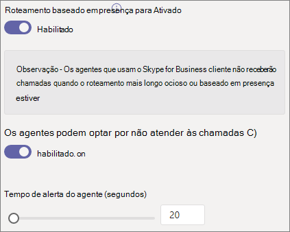

# Criar uma fila de chamadas

As filas de chamadas fornecem um método de roteamento de chamadas para as pessoas da organização que podem ajudar com um problema ou pergunta específica. As chamadas são distribuídas uma por vez para as pessoas na fila (que são conhecidas como *agentes*). 

> [!TIP]
> Este artigo é para grandes organizações. Se sua organização for uma pequena empresa, leia [Criar uma fila de chamadas – tutorial de pequenas](/microsoftteams/business-voice/create-a-phone-system-call-queue-smb) empresas.

As filas de chamada fornecem:

- Uma mensagem de saudação

- Música enquanto as pessoas estão aguardando em espera em uma fila

- Roteamento de *chamadas – na ordem* FIFO (primeiro a entrar, primeiro a sair) – aos agentes

- Opções de tratamento para estouro de fila e tempo limite

Antes de seguir os procedimentos deste artigo, certifique-se de ter lido o Plano para Teams atendedores [automáticos e filas](plan-auto-attendant-call-queue.md) de chamadas e seguiu as etapas [de introdução](plan-auto-attendant-call-queue.md#getting-started).

**Consulte a matriz [de compatibilidade de recursos da fila de](#call-queue-feature-compatibility) chamadas abaixo para obter mais informações.**

## Criar a fila de chamadas

Para configurar uma fila de chamadas, no Centro de administração do Teams, expanda **Voz**, clique em **Filas de chamadas** e, em seguida, clique em **Adicionar**.

Digite um nome para a fila de chamadas.

## Contas de recursos

Clique em **Adicionar contas**, procure a conta de recurso que você deseja usar com a fila de chamadas, clique em **Adicionar** e, em seguida, clique em **Adicionar**. (Os agentes verão o nome da conta de recurso quando receberem uma chamada de entrada.)

Para obter mais informações, consulte [Gerenciar Teams de recursos](manage-resource-accounts.md).

## ID do Chamador Dinâmico

**Disponível para usuários Teams de área de trabalho de chamada colaborativa/canal Teams usuários móveis com filas de chamadas padrão**

Você pode atribuir números de identificação de chamadas de saída para os agentes especificando uma ou mais contas de recurso com um número de telefone. Os agentes podem selecionar qual número de ID do chamador de saída usar com cada chamada de saída que fizerem. Dentro do Aplicativo de Chamadas, os agentes podem usar o número da Fila de Chamadas (CQ) /Atendedor Automático (AA) ou seu próprio DID (Direct InWard Dial) pessoal.

Clique **em** Adicionar, pesquise as contas de recursos que você deseja permitir que os agentes usem para fins de ID de chamada ao fazer chamadas de saída, clique em Adicionar **e, em** seguida, clique em **Adicionar**.

**Filas de Chamadas Padrão**

Para Teams usuários da área de trabalho e filas de chamadas padrão, considere definir a ID do chamador para os membros da fila de chamadas para o número de serviço da fila de chamadas ou atendedor automático apropriado. Para obter mais informações, consulte [Gerenciar políticas de ID do chamador Microsoft Teams](caller-id-policies.md).

> [!NOTE]
> A conta de recurso usada para fins de ID de chamada deve ter uma licença Telefonia do Microsoft Teams usuário virtual do sistema e uma das seguintes atribuídas:
>
> - Uma licença do Plano de Chamadas e um número de telefone atribuído
> - Um Conexão do operador de telefone atribuído
> - Uma política de roteamento de voz online (atribuição de número de telefone é opcional ao usar o Roteamento Direto)

## Linguagem

Escolha um [idioma com suporte](create-a-phone-system-call-queue-languages.md). Esse idioma será usado para comandos de voz gerados pelo sistema e para a transcrição da caixa postal (se habilitados).

## Saudações e música de espera na fila

Especifique se você deseja reproduzir uma saudação aos chamadores quando eles chegarem na fila. Carregue um arquivo MP3, WAV ou WMA contendo a saudação que deseja reproduzir. A gravação carregada não pode ser maior do que 5 MB.

O Teams fornece música padrão aos chamadores enquanto eles estão em espera em uma fila. A música padrão fornecida nas filas de chamadas do Teams é livre de royalties pagáveis pela organização. Se você quiser reproduzir um arquivo de áudio específico, escolha **Reproduzir um arquivo de áudio** e carregue um arquivo MP3, WAV ou WMA.

> [!NOTE]
> Você é responsável por limpar e proteger independentemente todos os direitos e permissões necessários para usar qualquer arquivo de música ou áudio com seu serviço Microsoft Teams, que pode incluir propriedade intelectual e outros direitos em qualquer música, efeitos sonoros, áudio, marcas, nomes e outros conteúdos no arquivo de áudio de todos os proprietários de direitos relevantes, que podem incluir artistas, atores,  artistas, músicos, compositores, compositores, gravadoras, editores de música, sindicatos, grêmio, sociedades de direitos, organizações de gestão coletiva e quaisquer outras partes que têm, controlam ou licenciam os direitos autorais de música, efeitos sonoros, áudio e outros direitos de propriedade intelectual.

## Agentes de chamada

Examine os [pré-requisitos para adicionar agentes a uma fila de chamadas](plan-auto-attendant-call-queue.md#prerequisites).

##### Teams canal

Você pode adicionar até 200 agentes por meio de um Teams canal. Você deve ser um membro da equipe ou o criador ou proprietário do canal para adicionar um canal à fila.

Se você quiser usar [um canal Teams para](https://support.microsoft.com/office/9f07dabe-91c6-4a9b-a545-8ffdddd2504e) gerenciar a fila, selecione a opção Escolher uma **equipe** e clique em **Adicionar um canal**. Pesquise a equipe que você deseja usar, selecione-a e clique em **Adicionar**. Selecione o canal que você deseja usar (há suporte apenas para canais padrão) e clique em **Aplicar**. 

Os seguintes clientes têm suporte ao usar um canal Teams para filas de chamadas: 

  - Microsoft Teams Windows cliente
  - Cliente Microsoft Teams para Mac

> [!NOTE]
> Se você usar essa opção, poderá levar até 24 horas para que a fila de chamadas esteja totalmente operacional.
>
> Se houver mais de 200 membros na equipe, somente os primeiros 200 membros, em ordem alfabética, serão adicionados como agentes à fila de chamadas.

##### Usuários e grupos

Você pode adicionar até 20 agentes individualmente e até 200 agentes por meio de grupos.

Se você quiser adicionar usuários ou grupos individuais à fila, selecione **Escolher usuários e grupos**. 

Para adicionar um usuário à fila, clique em **Adicionar usuários**, procure o usuário, clique em **Adicionar** e, em seguida, clique em **Adicionar**.

Para adicionar um grupo à fila, clique em **Adicionar grupos**, procure o grupo, clique em **Adicionar** e, em seguida, clique em **Adicionar**. Use listas de distribuição, grupos de segurança, grupos do Microsoft 365 ou equipes do Microsoft Teams.

> [!NOTE]
> Os novos usuários adicionados a um grupo podem levar até oito horas para receberem a sua primeira chamada.
>
> Se houver mais de 200 membros no grupo, somente os primeiros 200 membros, em ordem alfabética, serão adicionados como agentes à fila de chamadas.

## Roteamento de chamadas

**O modo** de conferência reduz o tempo necessário para que um chamador seja conectado a um agente depois que o agente aceita a chamada. Para que o modo de conferência funcione, os agentes na fila de chamada devem usar um dos seguintes clientes:

  - A versão mais recente do cliente de área de trabalho do Microsoft Teams, do aplicativo Android ou do aplicativo iOS
  - Telefonia do Microsoft Teams versão 1449/1.0.94.2020051601 ou posterior
  
As contas Teams agentes devem ser definidas para o modo TeamsOnly. Os agentes que não atendem aos requisitos não são incluídos na lista de roteamento de chamadas. Recomendamos habilitar o modo de conferência para suas filas de chamadas se os agentes estão usando clientes compatíveis.

> [!NOTE]
> Não há suporte para o modo de conferência se as chamadas telefônicas forem roteadas para a fila de um gateway de Roteamento Direto habilitado para Roteamento Baseado em Localização.
>
> O modo de conferência será necessário Teams os usuários precisarem consultar/transferir chamadas com filas de chamadas.

> [!TIP]
> Definir **o modo de conferência** **como Ativado** é a configuração recomendada.

O **método de roteamento** determina a ordem na qual os agentes recebem chamadas da fila. Escolha uma destas opções:

- O **Roteamento de atendedor** chama todos os agentes na fila ao mesmo tempo. O primeiro agente de chamada que atender recebe a chamada.

- O **Roteamento em série** chama todos os agentes de chamada, um por um, na ordem especificada na **lista de agentes de chamada**. Se um agente ignorar ou não atender uma chamada, a chamada chamará o próximo agente. Isso se repetirá até que a chamada seja selecionada ou o tempo limite seja expirado.

- O **Round robin** equilibra o roteamento das chamadas de entrada para que cada agente de chamada receba o mesmo número de chamadas da fila. Esse método de roteamento pode ser desejável em um ambiente de vendas de entrada para garantir a oportunidade igual entre todos os agentes de chamada.

- O **Ocioso por mais tempo** encaminha cada chamada para o agente que está ocioso há mais tempo. Um agente será considerado ocioso se o estado de presença estiver Disponível. Agentes cujo estado de presença não está disponível não estarão qualificados para receber chamadas até que alterem sua presença para Disponível. 

> [!TIP]
> Definir **o Método de Roteamento** **como Round robin** ou **Ocioso mais** longo é a configuração recomendada.

> [!NOTE]
> Se [a gravação de](teams-recording-policy.md) conformidade estiver habilitada nos agentes, não há suporte para  a combinação do modo **conferência** e do roteamento do Atendedor. Se você precisar usar o modo **conferência**, selecione **Roteamento Serial**, **Round robin** ou **Mais Longo ocioso** como o método **de roteamento**. Se você precisar usar o **roteamento do Atendedor**, defina **o modo de conferência** como **Desativado**.
> 
> Ao usar **o mais longo ocioso** e quando houver menos chamadas na fila do que os agentes disponíveis, somente os dois primeiros agentes ociosos mais longos serão apresentados com chamadas da fila.
> 
> Ao usar **o mais** longo ocioso, pode haver ocasiões em que um agente recebe uma chamada da fila logo após ficar indisponível ou um pequeno atraso ao receber uma chamada da fila depois de se tornar disponível.
> 
> A apresentação de chamada da Fila de Chamadas para agentes pode entrar em conflito com restrições de Roteamento Baseado em Localização. Nesse caso, o agente receberá uma notificação do sistema de chamada, mas não poderá atender à chamada. Essa condição continuará até que outro agente esteja disponível para atender a chamada, o chamador desligue ou a condição de tempo limite da fila de chamadas ocorra.  

O **Roteamento baseado em presença** usa o status de disponibilidade dos agentes de chamada para determinar se um agente deve ser incluído na lista de roteamento de chamadas para o método de roteamento selecionado. Os agentes de chamada cujo status de disponibilidade está definido como **Disponível**, estão incluídos na lista de roteamento de chamadas e podem receber chamadas. Os agentes cujo status de disponibilidade está definido com qualquer outro status, são excluídos da lista de roteamento de chamadas e não receberão chamadas até que seu status de disponibilidade volte para **Disponível**. 

Habilite o roteamento de chamadas baseado em presença com qualquer um dos métodos de roteamento.

Se um agente optar por não receber chamadas, ele não será incluído na lista de roteamento de chamadas, independentemente do status de disponibilidade definido. 

> [!NOTE]
> Quando **o ocioso** mais longo é selecionado como o método de roteamento, o roteamento baseado em presença é necessário e habilitado automaticamente, embora a  alternância de roteamento baseado em presença esteja desativada e esmaeciada.
>
> Se o roteamento baseado em presença não estiver habilitado e houver várias chamadas na fila, o sistema apresentará essas chamadas simultaneamente aos agentes, independentemente do status de presença. Essa ação resultará em várias notificações de chamada aos agentes, especialmente se alguns agentes não atenderem à chamada inicial apresentada a eles.
>
> Ao usar o **roteamento** baseado em presença, pode haver ocasiões em que um agente recebe uma chamada da fila logo após ficar indisponível ou um pequeno atraso ao receber uma chamada da fila depois de se tornar disponível.
> 
> Os agentes que usam o cliente do Skype for Business não são incluídos na lista de roteamento de chamadas quando o roteamento baseado em presença está habilitado. Se você tiver agentes que usam o Skype for Business, não habilite o roteamento de chamadas baseado em presença.

> [!TIP]
> Definir **o roteamento baseado em presença** **como Ativado** é a configuração recomendada.

O **Tempo de alerta do agente** especifica por quanto tempo o telefone de um agente tocará antes que a fila redirecione a chamada para o próximo agente.

> [!TIP]
> Definir **o tempo de alerta do Agente** **como 20 segundos** é a configuração recomendada.

> [!NOTE]
> A [configuração de tratamento de tempo limite](#call-timeout-handling) de chamada tem prioridade sobre o tempo de alerta do agente. Se o tempo máximo de fila configurado para manipulação de tempo limite de chamada tiver sido atingido, a chamada será retirada dos agentes, mesmo que o limite de tempo de alerta do agente não tenha sido atingido.

## Administração de estouro de chamadas

O **Número máximo de chamadas na fila** especifica o número máximo de chamadas que podem esperar na fila a qualquer momento. O padrão é 50, mas pode variar de 0 a 200. Quando o limite é atingido, a chamada é tratada como especificado pela configuração **Quando é atingido o número máximo de chamadas**.

Você pode optar por desconectar a chamada ou redirecioná-la para qualquer um dos destinos de roteamento de chamadas. Por exemplo, você pode pedir ao chamador que deixe uma mensagem de voz para os agentes na fila. Para transferências externas, consulte [Pré-requisitos](plan-auto-attendant-call-queue.md#prerequisites) e as [transferências](create-a-phone-system-auto-attendant.md#external-phone-number-transfers---technical-details) de número de telefone externo – detalhes técnicos para formatação de número.

> [!NOTE]
> Se o número máximo de chamadas for definido como 0, a mensagem de saudação não será reproduzida.
>
> Ao redirecionar para a caixa postal compartilhada, certifique-se de permitir que as pessoas de fora dessa organização enviem **emails** para essa equipe habilitada para a equipe/grupo no centro de Administração Microsoft 365.

## Administração de tempo limite de chamada

**Tempo limite de chamada: o tempo máximo de espera** especifica o tempo máximo que uma chamada pode estar em espera na fila antes de ser redirecionada ou desconectada. É possível especificar um valor de 0 segundos a 45 minutos.

Você pode optar por desconectar a chamada ou redirecioná-la para um dos destinos de roteamento de chamadas. Por exemplo, você pode pedir ao chamador que deixe uma mensagem de voz para os agentes na fila. Para transferências externas, consulte [Pré-requisitos](plan-auto-attendant-call-queue.md#prerequisites) e as [transferências](create-a-phone-system-auto-attendant.md#external-phone-number-transfers---technical-details) de número de telefone externo - detalhes técnicos para formatação de número.

> [!NOTE]
> Ao redirecionar para a caixa postal compartilhada, certifique-se de permitir que as pessoas de fora dessa organização enviem **emails** para essa equipe habilitada para a equipe/grupo no centro de Administração Microsoft 365.

Quando você tiver selecionado as opções de tempo limite de chamada, clique em **Salvar**.

## Resumo das configurações recomendadas da fila de chamadas

As seguintes configurações são recomendadas:

- **Modo de conferência** como **Ativado**
- **Método de roteamento** para **Round robin** ou **Ocioso por mais tempo**
- **Roteamento baseado em presença** para **Ativado**
- **Tempo de alerta do agente:** para **20 segundos**

## Compatibilidade de recursos da fila de chamadas

|Recurso                          |Teams Desktop1 |Teams Web | Teams Mobile2 |Lync |Telefones IP | Filas de Chamadas Padrão |Filas de Chamadas Baseadas em Canal | Comentário |
|:--------------------------------|:------------------------:|:--------:|:--------------:|:---:|:--------:|:--------------------:|:------------------------:|:--------|
|**Métodos de roteamento de agente**        |                          |          |                |     |          |                      |                          |   |
|`Attendant Routing`              |Y                         |Y         |Y               |Y    |Y         |Y                     |Y                         |*Padrão*     |
|`Longest Idle`3       |Y                         |Y         |Y               |N    |Y         |Y                     |Y                         |*Recomendado* |
|`Round Robin`                    |Y                         |Y         |Y               |Y    |Y         |Y                     |Y                         |*Recomendado* |
|`Serial`                         |Y                         |Y         |Y               |Y    |Y         |Y4         |Y4             |   |
|**Opções de roteamento de agente**        |                          |          |                |     |          |                      |                          |   |
|`Presence Based Routing`3|Y                      |Y         |Y               |N    |Y         |Y                     |Y                         |*Recomendado* |
|`Agents can Opt-out`               |Y                       |Y         |Y               |Y7|Y7|Y          |Y                         |*Padrão*     |
|**Modos de transferência**               |                          |          |                |     |          |                      |                          |   |
|`Conference Mode`5    |Y                         |Y         |Y               |N    |Y6|Y                  |Y                         |*Recomendado* |
|`Transfer Mode`                  |Y                         |Y         |Y               |Y    |Y         |Y                     |Y                         |*Padrão*              |
|**Chamada colaborativa**        |                          |          |                |     |          |                      |                          |   |
|`Channel Based Queues`             |Y                       |N         |N               |N    |N         |n/a                   |Y8             |   |
|**ID do chamador dinâmico**            |                          |          |                |     |          |                      |                          |   |
|`Standard call queue`            |N                         |N         |Y               |N    |N         |Y                     |n/a                       |   |
|`Channel based call queue`       |Y                         |n/a       |n/a             |n/a  |n/a       |n/a                   |Y                         |   |
|**Métodos de conectividade PSTN**    |                          |          |                |     |          |                      |                          |Consulte a Observação 9   |
|`Calling Plans`                  |Y                         |Y         |Y               |Y    |Y         |Y                     |Y                         |   |
|`Direct Routing`                 |Y                         |Y         |Y               |N    |N         |Y                     |Y                         |   |
|`Operator Connect`               |Y                         |Y         |Y               |     |          |Y                     |Y                         |   |
|**Diversos**                |                          |          |                |     |          |                      |                          |   |
|`Call toast shows Resource Account Name` |Y                 |N         |Y               |Y    |          |Y                     |Y                         |              |

Observações:
1. Microsoft Teams Windows cliente, Microsoft Teams Mac, Microsoft Teams na Infraestrutura de Área de Trabalho Virtualizada.
2. Microsoft Teams iPhone aplicativo, Microsoft Teams Android aplicativo.
3. Selecionar o idle mais longo para o método de roteamento de agente habilitará automaticamente o roteamento baseado em presença.
4. Só é possível definir a ordem ao adicionar usuários individuais como parte das filas de chamadas padrão. Quando uma lista de distribuição ou Teams canal é usada, a ordem será alfabética.
5. Não há suporte para o modo de conferência se as chamadas telefônicas forem roteadas para a fila de um gateway de Roteamento Direto habilitado para Roteamento Baseado em Localização.
6. Telefonia do Microsoft Teams apenas.
7. Por meio da página Configurações Portal do Usuário em https://aka.ms/vmsettings.
8. Há suporte apenas para canais públicos.
9. Atendedores Automáticos e Filas de Chamadas não podem transferir chamadas entre métodos de conectividade PSTN.

## Clientes com suporte

Os clientes a seguir têm suporte para agentes de chamada em uma fila de chamada:

  - Cliente de área de trabalho do Skype for Business 2016 (versões 32-bit e 64-bit)
  - Cliente de área de trabalho do Lync 2013 (versões 32-bit e 64-bit)
  - Todos os modelos de telefone IP com suporte para o Microsoft Teams. Confira [Obter telefones para o Skype for Business Online](/skypeforbusiness/what-is-phone-system-in-office-365/getting-phones-for-skype-for-business-online/getting-phones-for-skype-for-business-online).
  - Cliente Skype for Business para Mac (versão 16.8.196 e posterior)
  - Cliente Skype for Business para Android (versão 6.16.0.9 e posterior)
  - Cliente Skype for Business para iPhone (versão 6.16.0 e posterior)
  - Cliente Skype for Business para iPad (versão 6.16.0 e posterior)
  - Cliente Microsoft Teams para Windows (versões 32-bit e 64-bit)
  - Cliente Microsoft Teams para Mac
  - Microsoft Teams [Virtualized Desktop Infrastructure](/microsoftteams/teams-for-vdi) (Windows Virtual Desktop, Citrix e VMware)
  - Aplicativo Microsoft Teams para iPhone
  - Aplicativo Microsoft Teams para Android

    > [!NOTE]
    > As filas de chamadas que recebem um número de Roteamento Direto não dão suporte Skype for Business clientes, clientes Lync ou telefones IP Skype for Business como agentes. O Teams cliente tem suporte apenas com um modo de [coexistência do TeamsOnly](/microsoftteams/setting-your-coexistence-and-upgrade-settings).

## Cmdlets de fila de chamada

Windows PowerShell permite criar e gerenciar filas de chamadas por meio da linha de comando de maneira programática ou em lote.

Os cmdlets a seguir permitem que você gerencie uma fila de chamadas:

- [New-CsCallQueue](/powershell/module/skype/New-CsCallQueue)
- [Get-CsCallQueue](/powershell/module/skype/Get-CsCallQueue)
- [Set-CsCallQueue](/powershell/module/skype/Set-CsCallQueue)
- [Remove-CsCallQueue](/powershell/module/skype/Remove-CsCallQueue)

Os seguintes cmdlets adicionais também são necessários para gerenciar os usuários, contas de recursos, licenças do Telefonia do Microsoft Teams, números de telefone, arquivos de áudio e idioma com suporte que serão usados com filas de chamadas:

Usuários/Teams

- Usuários
- - [Get-CsOnlineUser](/powershell/module/skype/Get-CsOnlineUser)

- Teams: 
- - [Get-Team](/powershell/module/teams/Get-Team)
- - [Get-TeamChannel](/powershell/module/teams/Get-TeamChannel)

Contas de recursos:

- [New-CsOnlineApplicationInstance](/powershell/module/skype/New-CsOnlineApplicationInstance)
- [Find-CsOnlineApplicationInstance](/powershell/module/skype/Find-CsOnlineApplicationInstance)
- [Get-CsOnlineApplicationInstance](/powershell/module/skype/Get-CsOnlineApplicationInstance)
- [Set-CsOnlineApplicationInstance](/powershell/module/skype/Set-CsOnlineApplicationInstance)
- [New-CsOnlineApplicationInstanceAssociation](/powershell/module/skype/New-CsOnlineApplicationInstanceAssociation)
- [Get-CsOnlineApplicationInstanceAssociation](/powershell/module/skype/Get-CsOnlineApplicationInstanceAssociation)
- [Remove-CsOnlineApplicationInstanceAssociation](/powershell/module/skype/Remove-CsOnlineApplicationInstanceAssociation)
- [Get-CsOnlineApplicationInstanceAssociationStatus](/powershell/module/skype/Get-CsOnlineApplicationInstanceAssociationStatus)

Licenças Teams Telefone virtual:

- [Get-MsolAccountSku](/powershell/module/msonline/get-msolaccountsku)
- [Set-MsolUserLicense](/powershell/module/msonline/set-msoluserlicense)

Telefone atribuição de número:

- [Get-CsOnlineTelephoneNumber](/powershell/module/skype/Get-CsOnlineTelephoneNumber)
- [Set-CsPhoneNumberAssignment](/powershell/module/teams/Set-csphonenumberassignment)

Arquivos de Áudio

- [Get-CsOnlineAudioFile](/powershell/module/skype/Get-CsOnlineAudioFile)
- [Import-CsOnlineAudioFile](/powershell/module/skype/Import-CsOnlineAudioFile)
- [Export-CsOnlineAudioFile](/powershell/module/skype/Export-CsOnlineAudioFile)
- [Remove-CsOnlineAudioFile](/powershell/module/skype/Remove-CsOnlineAudioFile)

Listas de idiomas de suporte

- [Get-CsAutoAttendantSupportedLanguage](/powershell/module/skype/Get-CsAutoAttendantSupportedLanguage)

Para obter um guia passo a passo para criar filas de chamadas com o PowerShell, consulte [Criando filas de chamadas com cmdlets do PowerShell](create-a-phone-system-call-queue-via-cmdlets.md)

## Ferramenta de Diagnóstico de Fila de Chamadas

Se você for um administrador, poderá usar a seguinte ferramenta de diagnóstico para validar se uma fila de chamadas é capaz de receber chamadas:

1. Selecione **Executar testes** abaixo, o que preencherá o diagnóstico no Centro de Administração do Microsoft 365. 

   > [!div class="nextstepaction"]
   > [Executar testes: Teams fila de chamadas](https://aka.ms/TeamsCallQueueDiag)

2. No painel Executar diagnóstico, insira a Conta de Recurso no campo Nome de Usuário ou **Email** e selecione **Executar Testes**.

3. Os testes retornarão as melhores próximas etapas para lidar com as configurações de locatário, política e conta de recurso para validar se a fila de chamadas é capaz de receber chamadas.

## Tópicos relacionados

[Veja o que você obtém com Telefonia do Microsoft Teams](here-s-what-you-get-with-phone-system.md)

[Obter números de telefone de serviço](getting-service-phone-numbers.md)

[Disponibilidade de Audioconferência e Planos de Chamadas por país e região](country-and-region-availability-for-audio-conferencing-and-calling-plans/country-and-region-availability-for-audio-conferencing-and-calling-plans.md)
