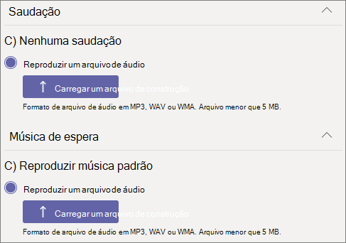

# Criar uma fila de chamadas

As filas de chamadas fornecem um método de roteamento de chamadas para as pessoas da organização que podem ajudar com um problema ou pergunta específica. As chamadas são distribuídas uma por vez para as pessoas na fila (que são conhecidas como *agentes*). 

> [!TIP]
> Este artigo é para grandes organizações. Se sua organização for uma pequena empresa, leia Criar uma fila [de chamada - tutorial de pequenas](/microsoftteams/business-voice/create-a-phone-system-call-queue-smb) empresas.

As filas de chamada fornecem:

- Uma mensagem de saudação.

- Música enquanto as pessoas estão em espera em uma fila.

- Roteamento de chamadas, na ordem *Primeiro a Entrar, Primeiro a Sair* (PEPS), para os agentes.

- Opções de administração para estouro da fila e tempo limite.

Leia Plan for Teams auto attendants and [call queues](plan-auto-attendant-call-queue.md)  e siga as etapas de início antes de seguir os procedimentos neste artigo.

## Demonstração de vídeo

Este vídeo mostra um exemplo básico de como criar uma fila de chamada no Teams.

> [!VIDEO https://www.microsoft.com/videoplayer/embed/RWCF23?autoplay=false]

## Criar a fila de chamada

Para configurar uma fila de chamadas, no Centro de administração do Teams, expanda **Voz**, clique em **Filas de chamadas** e, em seguida, clique em **Adicionar**.

Digite um nome para a fila de chamadas.

## Contas de recursos

Clique em **Adicionar contas**, procure a conta de recurso que você deseja usar com a fila de chamadas, clique em **Adicionar** e, em seguida, clique em **Adicionar**. (Os agentes verão o nome da conta de recurso quando receberem uma chamada de entrada.)

Para obter mais informações, consulte [Manage Teams resource accounts](manage-resource-accounts.md).

### Atribuir ID de chamada

Se você planeja usar um canal Teams para seus agentes de chamada, pode atribuir um número de ID do chamador de saída para os agentes especificando uma ou mais contas de recurso com um número de telefone.

Clique **em** Adicionar , pesquise as contas de recurso que você deseja permitir que os agentes para fins de ID de chamada ao fazer chamadas de saída, clique em Adicionar **e** em **Adicionar**.

Se você não estiver usando um canal Teams para controlar a associação de agentes, considere definir diretamente a ID do chamador para membros da fila de chamada para o número de serviço da fila de chamada ou o atendimento automático apropriado. Para obter mais informações, consulte [Manage caller ID policies in Microsoft Teams](caller-id-policies.md).

> [!NOTE]
> A conta de recurso usada para fins de ID de chamada deve ter uma Microsoft Teams Sistema de Telefonia de usuário virtual e uma das seguintes atribuídas:
>
> - Uma licença do Plano de Chamadas e um número de telefone atribuído
> - Um número de Conexão operador atribuído
> - Uma política de roteamento de voz online (atribuição de número de telefone é opcional ao usar Roteamento Direto)

## Linguagem

Escolha um [idioma com suporte](create-a-phone-system-call-queue-languages.md). Esse idioma será usado para comandos de voz gerados pelo sistema e para a transcrição da caixa postal (se habilitados).

## Saudações e música de espera na fila

Especifique se você deseja reproduzir uma saudação aos chamadores quando eles chegarem na fila. Carregue um arquivo MP3, WAV ou WMA contendo a saudação que deseja reproduzir. A gravação carregada não pode ser maior do que 5 MB.

O Teams fornece música padrão aos chamadores enquanto eles estão em espera em uma fila. A música padrão fornecida nas filas de chamadas do Teams é livre de royalties pagáveis pela organização. Se você quiser reproduzir um arquivo de áudio específico, escolha **Reproduzir um arquivo de áudio** e carregue um arquivo MP3, WAV ou WMA.

> [!NOTE]
> Você é responsável por limpar e proteger independentemente todos os direitos e permissões necessários para usar qualquer arquivo de música ou áudio com seu serviço Microsoft Teams, que pode incluir propriedade intelectual e outros direitos em qualquer música, efeitos sonoros, áudio, marcas, nomes e outros conteúdos no arquivo de áudio de todos os proprietários de direitos relevantes, que podem incluir artistas, atores,  executores, musicistas, compositores, rótulos de gravação, editores de música, sindicatos, guildas, sociedades de direitos, organizações de gerenciamento coletivo e quaisquer outras partes que têm, controlam ou licenciam os direitos autorais de música, efeitos sonoros, áudio e outros direitos de propriedade intelectual.

## Agentes de chamada

Revise os [pré-requisitos para adicionar agentes a uma fila de chamada.](plan-auto-attendant-call-queue.md#prerequisites)

##### Teams canal

Você pode adicionar até 200 agentes por meio de um Teams canal. Você deve ser membro da equipe ou criador ou proprietário do canal para adicionar um canal à fila.

Se você quiser usar [um canal Teams para gerenciar](https://support.microsoft.com/office/9f07dabe-91c6-4a9b-a545-8ffdddd2504e)a fila, selecione a opção Escolher uma **equipe** e clique em Adicionar **um canal**. Pesquise a equipe que você deseja usar, selecione-a e clique em **Adicionar**. Selecione o canal que você deseja usar (somente canais padrão são suportados) e clique em **Aplicar**. 

Os seguintes clientes são suportados ao usar um canal Teams para filas de chamada: 

  - Microsoft Teams Windows cliente
  - Cliente Microsoft Teams para Mac

> [!NOTE]
> Se você usar essa opção, pode levar até 24 horas para que a fila de chamada seja totalmente operacional.

##### Usuários e grupos

Você pode adicionar até 20 agentes individualmente e até 200 agentes por meio de grupos.

Se você quiser adicionar usuários ou grupos individuais à fila, selecione a **opção Escolher usuários e grupos.** 

Para adicionar um usuário à fila, clique em **Adicionar usuários**, procure o usuário, clique em **Adicionar** e, em seguida, clique em **Adicionar**.

Para adicionar um grupo à fila, clique em **Adicionar grupos**, procure o grupo, clique em **Adicionar** e, em seguida, clique em **Adicionar**. Use listas de distribuição, grupos de segurança, grupos do Microsoft 365 ou equipes do Microsoft Teams.

> [!NOTE]
> Os novos usuários adicionados a um grupo podem levar até oito horas para receberem a sua primeira chamada.

## Roteamento de chamadas

O **Modo de conferência** reduz significativamente o tempo necessário para que um chamador seja conectado a um agente, depois que o agente aceita a chamada. Para que o modo de conferência funcione, os agentes na fila de chamada devem usar um dos seguintes clientes:

  - A versão mais recente do cliente de área de trabalho do Microsoft Teams, do aplicativo Android ou do aplicativo iOS
  - Microsoft Teams Telefone versão 1449/1.0.94.2020051601 ou posterior
  
As contas Teams dos agentes devem ser definidas Teams modo somente para agentes. Os agentes que não atendem aos requisitos não são incluídos na lista de roteamento de chamadas. É recomendável habilitar o modo de conferência para suas filas de chamadas se todos os agentes estiverem usando clientes compatíveis.

> [!NOTE]
> O modo de conferência não será suportado se as chamadas telefônicas são roteadas para a fila de um gateway de Roteamento Direto habilitado para Roteamento Baseado em Local.

> [!TIP]
> Definir **o modo de conferência** como **On** é a configuração recomendada.

O **método de roteamento** determina a ordem na qual os agentes recebem chamadas da fila. Escolha uma destas opções:

- O **Roteamento de atendedor** chama todos os agentes na fila ao mesmo tempo. O primeiro agente de chamada que atender recebe a chamada.

- O **Roteamento em série** chama todos os agentes de chamada, um por um, na ordem especificada na **lista de agentes de chamada**. Se um agente ignora ou não atende uma chamada, ela tocará para o próximo agente e tentará com todos os agentes até que seja atendida ou atinja o tempo limite.

- O **Round robin** equilibra o roteamento das chamadas de entrada para que cada agente de chamada receba o mesmo número de chamadas da fila. Isso pode ser desejável em um ambiente de vendas de entrada para garantir igualdade de oportunidades entre todos os agentes de chamada.

- O **Ocioso por mais tempo** encaminha cada chamada para o agente que está ocioso há mais tempo. Um agente é considerado ocioso se seu estado de presença estiver Disponível. Agentes cujo estado de presença não está Disponível não estarão qualificados para receber chamadas até que alterem sua presença para Disponível. 

> [!TIP]
> Definir **o Método de Roteamento** como Round **robin** ou **Longest idle** é a configuração recomendada.

> [!NOTE]
> Se [a gravação de](teams-recording-policy.md) conformidade estiver habilitada  nos agentes, não há suporte para a combinação do modo **de** conferência e do roteamento do Attendant. Se você precisar usar o modo **de** conferência, selecione **Roteamento Serial,** **Round robin** ou **Longest ocioso** como o **método Routing**. Se você precisar usar o **roteamento de atendentes,** de definir **o modo de conferência** como **Off**.
> 
> Ao usar **o mais** longo ocioso, pode haver momentos em que um agente recebe uma chamada da fila logo após ficar indisponível ou se há um pequeno atraso no recebimento de uma chamada da fila após a disponibilização.

O **Roteamento baseado em presença** usa o status de disponibilidade dos agentes de chamada para determinar se um agente deve ser incluído na lista de roteamento de chamadas para o método de roteamento selecionado. Os agentes de chamada cujo status de disponibilidade está definido como **Disponível**, estão incluídos na lista de roteamento de chamadas e podem receber chamadas. Os agentes cujo status de disponibilidade está definido com qualquer outro status, são excluídos da lista de roteamento de chamadas e não receberão chamadas até que seu status de disponibilidade volte para **Disponível**. 

Habilite o roteamento de chamadas baseado em presença com qualquer um dos métodos de roteamento.

Se um agente optar por não receber chamadas, ele não será incluído na lista de roteamento de chamadas, independentemente do status de disponibilidade definido. 

> [!NOTE]
> Quando **ocioso** mais longo é selecionado como o método de roteamento, o roteamento  baseado em presença é necessário e automaticamente habilitado, mesmo que a alternância de roteamento baseada em presença seja desligada e acinzenada.
>
> Se o roteamento baseado em presença não for habilitado e houver várias chamadas na fila, o sistema apresentará essas chamadas simultaneamente aos agentes, independentemente do status de presença. Isso resultará em várias notificações de chamada aos agentes, particularmente se alguns agentes não atenderem à chamada inicial apresentada.
> 
> Os agentes que usam o cliente do Skype for Business não são incluídos na lista de roteamento de chamadas quando o roteamento baseado em presença está habilitado. Se você tiver agentes que usam o Skype for Business, não habilite o roteamento de chamadas baseado em presença.

> [!TIP]
> Definir **roteamento baseado em presença** como **On** é a configuração recomendada.

O **Tempo de alerta do agente** especifica por quanto tempo o telefone de um agente tocará antes que a fila redirecione a chamada para o próximo agente.

> [!TIP]
> Definir **o tempo de alerta do Agente** como **20 segundos** é a configuração recomendada.

## Administração de estouro de chamadas

O **Número máximo de chamadas na fila** especifica o número máximo de chamadas que podem esperar na fila a qualquer momento. O padrão é 50, mas pode variar de 0 a 200. Quando o limite é atingido, a chamada é tratada como especificado pela configuração **Quando é atingido o número máximo de chamadas**.

Você pode optar por desconectar a chamada ou redirecioná-la para qualquer um dos destinos de roteamento de chamadas. Por exemplo, você pode pedir ao chamador que deixe uma mensagem de voz para os agentes na fila. Para transferências externas, consulte [Prerequisites](plan-auto-attendant-call-queue.md#prerequisites) and the [external phone number transfers - technical details](create-a-phone-system-auto-attendant.md#external-phone-number-transfers---technical-details) for number formatting.

> [!NOTE]
> Se o número máximo de chamadas for definido como 0, então a mensagem de saudação não será reproduzida.

## Administração de tempo limite de chamada

**Tempo limite de chamada: o tempo máximo de espera** especifica o tempo máximo que uma chamada pode estar em espera na fila antes de ser redirecionada ou desconectada. É possível especificar um valor de 0 segundos a 45 minutos.

Você pode optar por desconectar a chamada ou redirecioná-la para um dos destinos de roteamento de chamadas. Por exemplo, você pode pedir ao chamador que deixe uma mensagem de voz para os agentes na fila. Para transferências externas, consulte [Pré-requisitos](plan-auto-attendant-call-queue.md#prerequisites) e [transferências de números de telefone externos – detalhes técnicos](create-a-phone-system-auto-attendant.md#external-phone-number-transfers---technical-details) para formatação de números.

Quando você tiver selecionado as opções de tempo limite de chamada, clique em **Salvar**.

## Resumo das configurações recomendadas de fila de chamada

As seguintes configurações são recomendadas:

- **Modo de conferência** para **On**
- **Método de roteamento** para **Round robin** ou **Ocioso por mais tempo**
- **Roteamento baseado em presença** para **Ativado**
- **Tempo de alerta do agente:** para **20 segundos**

## Clientes com suporte

Os clientes a seguir têm suporte para agentes de chamada em uma fila de chamada:

  - Cliente de área de trabalho do Skype for Business 2016 (versões 32-bit e 64-bit)
  - Cliente de área de trabalho do Lync 2013 (versões 32-bit e 64-bit)
  - Todos os modelos de telefone IP com suporte para o Microsoft Teams. Confira [Obter telefones para o Skype for Business Online](/skypeforbusiness/what-is-phone-system-in-office-365/getting-phones-for-skype-for-business-online/getting-phones-for-skype-for-business-online).
  - Cliente Skype for Business para Mac (versão 16.8.196 e posterior)
  - Cliente Skype for Business para Android (versão 6.16.0.9 e posterior)
  - Cliente Skype for Business para iPhone (versão 6.16.0 e posterior)
  - Cliente Skype for Business para iPad (versão 6.16.0 e posterior)
  - Cliente Microsoft Teams para Windows (versões 32-bit e 64-bit)
  - Cliente Microsoft Teams para Mac
  - Microsoft Teams infraestrutura [de área de trabalho virtualizada](/microsoftteams/teams-for-vdi) (Windows área de trabalho virtual, Citrix e VMware)
  - Aplicativo Microsoft Teams para iPhone
  - Aplicativo Microsoft Teams para Android

    > [!NOTE]
    > As filas de chamadas que recebem um número de roteamento direto não têm suporte para clientes Skype for Business, clientes Lync ou para Telefones IP do Skype for Business como agentes. O Teams cliente só tem suporte com um modo de [co-existência de Teams Somente](/microsoftteams/setting-your-coexistence-and-upgrade-settings).

## Cmdlets de fila de chamada

Windows PowerShell permite que você crie e gerencie filas de chamada por meio da linha de comando de forma em lotes ou programáticas.

Os cmdlets a seguir permitem gerenciar uma fila de chamada:

- [New-CsCallQueue](/powershell/module/skype/New-CsCallQueue)
- [Get-CsCallQueue](/powershell/module/skype/Get-CsCallQueue)
- [Set-CsCallQueue](/powershell/module/skype/Set-CsCallQueue)
- [Remove-CsCallQueue](/powershell/module/skype/Remove-CsCallQueue)

Os cmdlets adicionais a seguir também são necessários para gerenciar os usuários, contas de recursos, licenças de Microsoft Teams Telefone, números de telefone, arquivos de áudio e idioma com suporte que serão usados com filas de chamada:

Usuários/Teams

- Usuários
- - [Get-CsOnlineUser](/powershell/module/skype/Get-CsOnlineUser)

- Teams: 
- - [Get-Team](/powershell/module/teams/Get-Team)
- - [Get-TeamChannel](/powershell/module/teams/Get-TeamChannel)

Contas de recursos:

- [New-CsOnlineApplicationInstance](/powershell/module/skype/New-CsOnlineApplicationInstance)
- [Find-CsOnlineApplicationInstance](/powershell/module/skype/Find-CsOnlineApplicationInstance)
- [Get-CsOnlineApplicationInstance](/powershell/module/skype/Get-CsOnlineApplicationInstance)
- [Set-CsOnlineApplicationInstance](/powershell/module/skype/Set-CsOnlineApplicationInstance)

- [New-CsOnlineApplicationInstanceAssociation](/powershell/module/skype/New-CsOnlineApplicationInstanceAssociation)
- [Get-CsOnlineApplicationInstanceAssociation](/powershell/module/skype/Get-CsOnlineApplicationInstanceAssociation)
- [Get-CsOnlineApplicationInstanceAssociationStatus](/powershell/module/skype/Get-CsOnlineApplicationInstanceAssociationStatus)
- [Remove-CsOnlineApplicationInstanceAssociation](/powershell/module/skype/Remove-CsOnlineApplicationInstanceAssociation)

Licenças Teams Telefone virtuais:

- [Set-MsolUserLicense](/powershell/module/skype/Set-MsolUserLicense)

Telefone número:

- [Set-CsOnlineVoiceApplicationInstance](/powershell/module/skype/Set-CsOnlineVoiceApplicationInstance)

Arquivos de áudio

- [Get-CsOnlineAudioFile](/powershell/module/skype/Get-CsOnlineAudioFile)
- [Import-CsOnlineAudioFile](/powershell/module/skype/Import-CsOnlineAudioFile)
- [Export-CsOnlineAudioFile](/powershell/module/skype/Export-CsOnlineAudioFile)
- [Remove-CsOnlineAudioFile](/powershell/module/skype/Remove-CsOnlineAudioFile)

Listas de idiomas de suporte

- [Get-CsAutoAttendantSupportedLanguage](/powershell/module/skype/Get-CsAutoAttendantSupportedLanguage)

Para um guia passo a passo para criar filas de chamada com o PowerShell, consulte [Creating Call Queues with PowerShell cmdlets](create-a-phone-system-call-queue-via-cmdlets.md)

## Ferramenta de Diagnóstico de Fila de Chamada

Se você for um administrador, poderá usar a seguinte ferramenta de diagnóstico para validar se uma fila de chamadas é capaz de receber chamadas:

1. Selecione **Executar testes** abaixo, o que preencherá o diagnóstico no Centro de Administração do Microsoft 365. 

   > [!div class="nextstepaction"]
   > [Executar testes: Teams fila de chamada](https://aka.ms/TeamsCallQueueDiag)

2. No painel de diagnóstico Executar, insira a Conta de Recurso no campo Nome de Usuário ou **Email** e selecione **Executar Testes**.

3. Os testes retornarão as melhores próximas etapas para lidar com qualquer locatário, política e configurações de conta de recurso para validar se a fila de chamadas é capaz de receber chamadas.

## Tópicos relacionados

[Veja o que você obter com Microsoft Teams Telefone](here-s-what-you-get-with-phone-system.md)

[Obter números de telefone de serviço](getting-service-phone-numbers.md)

[Disponibilidade de Audioconferência e Planos de Chamadas por país e região](country-and-region-availability-for-audio-conferencing-and-calling-plans/country-and-region-availability-for-audio-conferencing-and-calling-plans.md)
