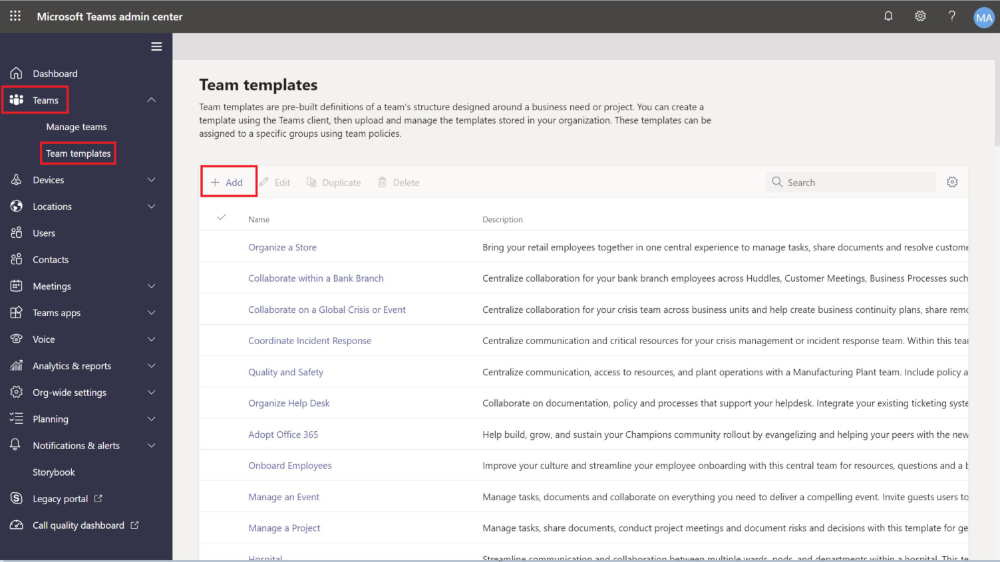
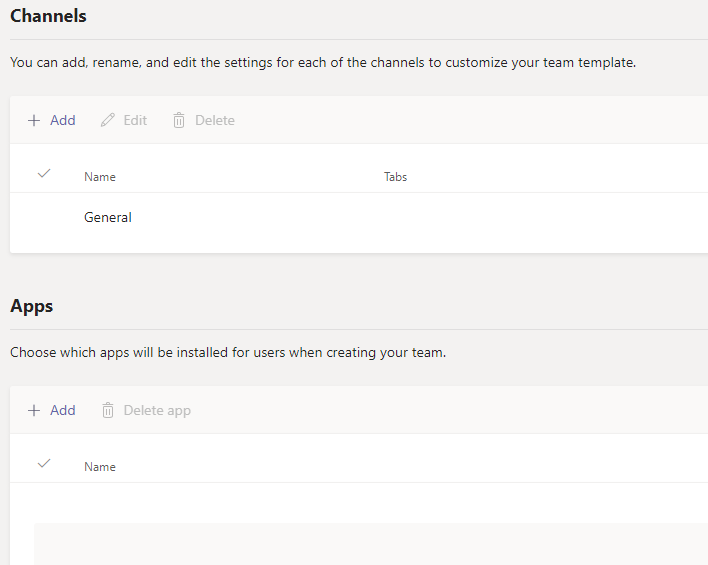
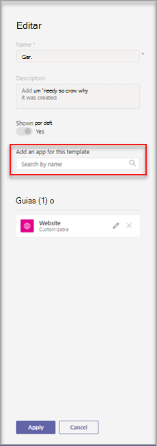
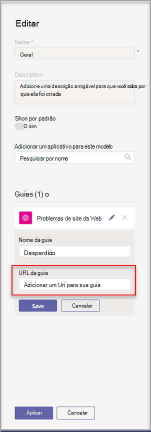
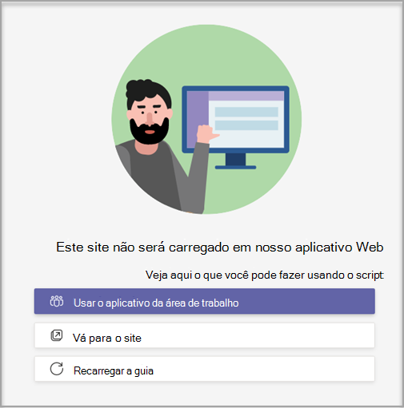

# Criar um modelo de equipe personalizado Microsoft Teams

**Modelos personalizados ainda não são suportados para clientes EDU.**

Um modelo de equipe personalizado é uma estrutura de equipe predefinida com um conjunto de canais, guias e aplicativos. Você pode desenvolver um modelo que o ajude a criar o espaço de colaboração correto rapidamente. Seu modelo de equipe personalizado usa suas configurações preferenciais.  

 

> [!VIDEO https://www.microsoft.com/en-us/videoplayer/embed/RE4P5rx]

Para começar:

1. Entre no Centro de administração do Teams.

2. Na navegação à esquerda, expanda **Teams**  >  **modelos de equipe**.

3. Selecione **Adicionar**.

    

4. Na seção **Modelos de Equipe,** selecione **Criar um novo modelo**.

5. Na seção **Configurações do modelo,** conclua os seguintes campos e selecione **Next**:
    - Nome do modelo
    - Descrições curtas e longas do modelo
    - Visibilidade de localidade  

    

6. Na seção **canais, guias e aplicativos,** adicione todos os canais e aplicativos de que sua equipe precisa.

    1. Na seção **Canais,** selecione **Adicionar**.
    2. Na caixa **de diálogo Adicionar,** nomeia o canal.
    3. Adicione uma descrição.
    4. Decida se o canal deve ser mostrado por padrão.
    5. Procure um nome de aplicativo que você deseja adicionar ao canal.
    6. Selecione **Aplicar** quando concluído.

    

8. Selecione **Enviar** quando concluído.

Seu novo modelo é exibido na lista **Modelos de** equipe. O modelo pode ser usado para criar uma equipe em Teams.

> [!Note]
> Pode levar até 24 horas para que os usuários do teams vejam uma alteração de modelo personalizada na galeria.

## Personalização de aplicativos de Guia do Site

> [!Note]
> Esse recurso está na visualização inicial

Talvez você queira especificar URLs para guias de site para canais em modelos de equipe personalizados. Os usuários finais que criam equipes com modelos terão guias de site predefinidas para a URL do site especificada.

Para começar:

1. Crie um novo modelo de equipe ou edite um modelo de equipe existente.

2. Na seção Canais, adicione um novo canal ou selecione um canal existente e selecione **Editar**.

3. Na seção **Adicionar um aplicativo para este modelo,** adicione um aplicativo site.

    

4. Selecione o ícone de edição e input a URL de sua escolha.

    

5. Selecione **Salvar** para suas edições do aplicativo de tabulação e selecione **Aplicar** para salvar suas alterações.

## Problemas conhecidos

**Problema**: se você criou uma equipe a partir de um modelo personalizado que continha guias personalizadas adicionais, você pode ver guias em branco no lugar de seus aplicativos de guia personalizados. Suas guias padrão (como **Postagens,** **Arquivos** e **Wiki**) serão exibidas conforme o esperado.

**Solução**: para corrigir esse problema, remova a guia personalizada e adicione uma nova guia com o mesmo aplicativo. Se você não tiver permissões para remover a guia personalizada e adicionar uma nova guia, contate o proprietário da equipe para saber mais.

No momento, estamos trabalhando em uma correção para equipes futuras criadas a partir de modelos personalizados.

**Problema**: ao usar Teams no navegador, alguns sites não suportam ser renderizados em uma guia Teams.

**Solução**: se você tiver problemas para exibir o conteúdo da guia site, será redirecionado para abrir a guia em uma página da Web separada ou abrir o Teams no aplicativo da área de trabalho em vez de exibir seu aplicativo de guia de site.

## Tópicos relacionados

- [Começar a usar modelos de equipe no centro de administração](get-started-with-teams-templates-in-the-admin-console.md)
- [Criar um modelo de uma equipe existente](create-template-from-existing-team.md)
- [Criar um modelo de equipe a partir de um modelo de equipe existente](create-template-from-existing-template.md)
