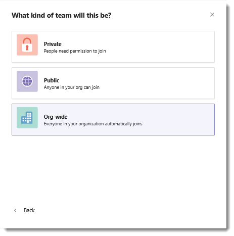

# Criar uma equipe de toda a organização no Microsoft Teams

As equipes de toda a organização fornecem uma maneira automática para que todos em uma organização de pequeno a médio porte sejam parte de uma equipe única e colaborativa.

Com equipes de toda a organização, os administradores globais podem criar facilmente uma equipe pública com as seguintes características:
- Efetua pull de todos os usuários na organização
- Mantém a associação atualizada com o Active Directory à medida que os usuários ingressam e saem da organização.

Somente administradores globais podem criar equipes de toda a organização. Atualmente, uma equipe de toda a organização está limitada a organizações com no menos 10.000 usuários. Também há um limite de cinco equipes de toda a organização por locatário. Ao criar uma equipe, se esses requisitos forem atendidos, os administradores  globais verão toda a organização como uma opção quando selecionarem Criar **uma equipe do zero**.

Quando uma equipe de toda a organização é criada, todos os administradores globais e administradores de serviços do Teams são adicionados como proprietários da equipe e todos os usuários ativos são adicionados como membros da equipe. Os usuários não licenciados também são adicionados à equipe. Na primeira vez que um usuário não licenciado entra no Teams, o usuário recebe uma licença do Microsoft Teams Exploratory. Para saber mais sobre a licença Exploratory, confira [gerenciar a licença do Microsoft Teams Exploratory](teams-exploratory.md).

Os seguintes tipos de contas não serão adicionados à sua equipe de toda a organização:

- Contas que estão impedidas de entrar
- Usuários convidados
- Contas de recurso ou serviço (por exemplo, contas associadas a atendedores automáticos e filas de chamadas)
- Contas de sala ou equipamento
- Contas com caixa de correio compartilhada

À medida que o diretório da sua organização é atualizado para incluir novos usuários ativos ou para desabilitar contas de usuários que não trabalham mais em sua empresa, as alterações são sincronizadas automaticamente e os usuários são adicionados ou removidos da equipe. Os membros da equipe não podem sair de uma equipe de toda a organização. Como proprietário da equipe, você poderá adicionar ou remover usuários manualmente, se necessário.

> [!NOTE]
>
> - Se você não vir a opção em  toda a organização ao criar uma equipe e for um administrador global, poderá ter atingido o limite de cinco equipes em toda a organização ou sua organização pode ter mais do que o limite de tamanho atual de 10.000 membros. Queremos aumentar esse limite no futuro. As equipes de toda a organização ainda não estão disponíveis no Teams para Educação.
> - Salas que não fazem parte de uma lista de salas, equipamentos e contas de recursos podem ser adicionadas ou sincronizadas com a equipe de toda a organização. Os proprietários da equipe podem remover facilmente essas contas da equipe.
> - Todas as ações do sistema para adicionar ou remover membros são postadas no canal Geral. O canal também será marcado como tendo uma nova atividade no cliente do Teams.
> - Criaremos automaticamente uma equipe de toda a organização se sua organização for nova no Teams e não tiver mais de 5.000 usuários. O nome da equipe refletirá o nome do locatário e terá um canal Geral. Os administradores globais podem editar essa equipe como qualquer outra equipe.

## Práticas recomendadas

Para obter o máximo de sua equipe de toda a organização, recomendamos que os proprietários da equipe executem as seguintes tarefas:

### Permitir que somente proprietários de equipe publiquem no canal Geral

Reduza o ruído do canal fazendo com que somente os proprietários da equipe publiquem no canal Geral.

1. Vá para a equipe, localize o canal Geral e selecione **... Mais opções Gerenciar** > **canal**.
2. Na guia **Configurações do Canal** , clique **em Permissões** e selecione **Somente proprietários podem postar mensagens**.

### Desativar as menções à @equipe e @[nome da equipe]

Reduza as @menções para evitar que elas sobrecarreguem toda a organização.

1. Vá para a equipe e clique **em ... Mais opções Gerenciar** \> **Equipe**.
2. Na guia **Configurações**, clique \> **@mentions desativar Mostrar** aos membros a opção de @team **ou @[nome da equipe]**.

### Mostrar canais importantes automaticamente

Mostre canais importantes para garantir que todos em sua organização se envolvam em conversas específicas. Para saber mais, confira [Adicionar canais aos Favoritos automaticamente para toda a equipe](https://support.office.com/article/auto-favorite-channels-for-the-whole-team-a948272c-5aa5-429c-863c-4e1e1cd6b0f6).

### Configurar a moderação de canal

Considere configurar a moderação de canal e conceder recursos de moderador a determinados membros da equipe. (Quando a moderação é configurada, os proprietários da equipe recebem recursos de moderador automaticamente.) Os moderadores podem:

- Controlar quem pode iniciar uma nova postagem em um canal
- Adicionar e remover moderadores
- Controlar se os membros da equipe podem responder a mensagens de canal existentes
- Controle se bots e conectores podem enviar mensagens de canal.

Para mais informações, consulte [Configurar e gerenciar a moderação de canal no Microsoft Teams](manage-channel-moderation-in-teams.md).

### Remover contas que possam não pertencer

Embora os membros não possam sair de uma equipe de toda a organização, como proprietário da equipe, você pode gerenciar a lista de participantes da equipe removendo contas que não pertencem. **Certifique-se de usar o Teams para remover usuários da sua equipe de toda a organização.** Se você usar outra maneira de remover um usuário, como o Centro de administração do Microsoft 365 ou de um grupo no Outlook, o usuário poderá ser adicionado de volta à equipe de toda a organização.

## Perguntas frequentes

### Há uma maneira de criar uma equipe de toda a organização além de usar o cliente do Teams?

Somente administradores globais podem criar uma equipe de toda a organização usando o cliente do Teams. Se a sua organização limita a criação de equipes ao uso do PowerShell, a solução alternativa recomendada é adicionar seus administradores globais ao grupo de segurança de usuários que podem criar uma equipe.

Para obter mais informações, confira [Gerenciar quem pode criar grupos](/microsoft-365/admin/create-groups/manage-creation-of-groups).

Se essa solução alternativa não for uma opção, você poderá usar o PowerShell para criar uma equipe pública e adicionar um administrador global como o proprietário da equipe. Em seguida, faça com que o administrador global clique em **Mais opções** ao lado do nome da equipe, clique em **Editar equipe** e, em seguida, altere a privacidade para **Toda a organização - Todos na organização serão adicionados automaticamente**.

> [!NOTE]
> Somente os proprietários da equipe podem acessar **a opção Editar equipe** e somente administradores globais podem ver a **opção em toda a** organização.

### Há uma maneira de converter uma equipe existente em uma equipe de toda a organização?

Os administradores globais podem converter uma equipe existente em uma equipe de toda a organização editando-a no cliente do Teams. Vá para o nome da equipe, clique em **Mais opções** > **Editar equipe**.

### Posso criar uma equipe de toda a organização usando um modelo de equipe?

Os modelos de equipe não podem ser usados para criar uma equipe de toda a organização. O trabalho para esse recurso está em andamento no momento.

## Confira também

Assista a um vídeo [sobre como criar uma equipe de toda a organização no Microsoft Teams](https://www.youtube.com/watch?v=x3qGlwwCz_w).
