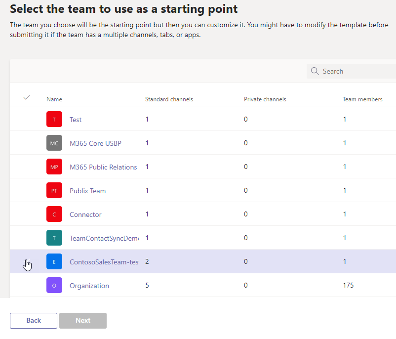

# Criar um modelo de equipe de uma equipe existente no Microsoft Teams

[!INCLUDE [preview-feature](includes/preview-feature.md)]

**Modelos personalizados ainda não são suportados para clientes EDU.**

Microsoft Teams permite criar um modelo de uma equipe existente que pode ser salvo e modificado para atender às suas necessidades organizacionais específicas.

1. Entre no Centro de administração do Teams.

2. Na navegação à esquerda, expanda **Teams**  >  **modelos de equipe**.

3. Selecione **Adicionar**.

4. Selecione **Usar uma equipe existente como modelo e** selecione **Next**.

 

5. Selecione uma equipe a ser usada como ponto de partida selecionando ao lado do nome da equipe e selecione **Next**.

6. Na seção **Configurações do modelo,** conclua os seguintes campos e selecione **Next**:
    - Nome do modelo
    - Descrições curtas e longas do modelo
    - Visibilidade de localidade  
  
7. Na seção **canais, guias e aplicativos,** adicione todos os canais e aplicativos de que sua equipe precisa.

    1. Na seção **Canais,** selecione **Adicionar**.
    2. Na caixa **de diálogo Adicionar,** nomeia o canal.
    3. Adicione uma descrição.
    4. Decida se o canal deve ser mostrado por padrão.
    5. Procure um nome de aplicativo que você deseja adicionar ao canal.
    6. Selecione **Aplicar** quando concluído.

8. Selecione **Enviar** para salvar suas alterações.

Seu novo modelo é exibido na lista **Modelos de** equipe. O modelo pode ser usado para criar uma equipe em Teams.

> [!Note]
> Pode levar até 24 horas para que os usuários do teams vejam um modelo personalizado na galeria.

## Artigos relacionados

- [Começar a usar modelos de equipe no centro de administração](get-started-with-teams-templates-in-the-admin-console.md)
- [Criar um modelo de um modelo de equipe existente](create-template-from-existing-template.md)
- [Criar um modelo de equipe](create-a-team-template.md)
