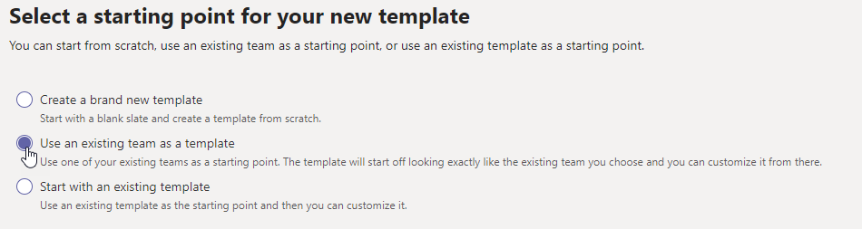

# Criar um modelo a partir de uma equipe existente no Microsoft TeamsCreate a template from an existing team in Microsoft Teams

[!INCLUDE [template](includes/preview-feature.md)]

**Os modelos personalizados ainda não têm suporte para clientes EDU.****Custom templates are not yet supported for EDU customers.**

O Microsoft Teams permite que você crie um modelo a partir de uma equipe existente que pode ser salva e modificada para atender às suas necessidades organizacionais específicas.Microsoft Teams lets you create a template from an existing team that can be saved and modified to meet your particular organizational needs.

1. Conecte-se ao centro de administração.Log in to the admin center.

2. Na navegação à esquerda **, expanda**  >  **modelos de equipe do teams**.In the left navigation, expand **Teams** > **Team templates**.

3. Clique em **Adicionar**.Click **Add**.

4. Selecione **usar uma equipe existente como um modelo**e clique em **Avançar**.Select **Use an existing team as a template**, and click **Next**.

 

5. Selecione uma equipe para usar como ponto de partida clicando em ao lado do nome da equipe e, em seguida, clique em **Avançar**.Select a team to use as a starting point by clicking next to the team name, and then click **Next**.

6. Na seção **configurações de modelo** , preencha os campos a seguir e clique em **Avançar**:In the **Template settings** section, complete the following fields and then click **Next**:
    - Nome do modeloTemplate name
    - Descrições de modelo curto e longoTemplate short and long descriptions
    - Visibilidade de localidadeLocale visibility  
  
7. Na seção **canais, guias e aplicativos** , adicione os canais e aplicativos de que sua equipe precisa.In the **channels, tabs, and apps** section, add any channels and apps that your team needs.

    1. Na seção **canais** , clique em **Adicionar**.In the **Channels** section, click **Add**.
    2. Na caixa de diálogo **Adicionar** , nomeie o canal.In the **Add** dialog, name the channel.
    3. Adicione uma descrição.Add a description.
    4. Decida se o canal deve ser mostrado por padrão.Decide if the channel should be shown by default.
    5. Procure o nome de um aplicativo que você deseja addd para o canal.Search for an app name that you want to addd to the channel.
    6. Clique em **aplicar** quando concluir.Click **Apply** when finished.

8. Clique em **Enviar** para salvar as alterações.Click **Submit** to save your changes.

Seu novo modelo é exibido na lista **modelos de equipe** .Your new template is displayed in the **Team templates** list. O modelo pode ser usado para criar uma equipe no Microsoft Teams.The template can be used to create a team in Teams.

## Artigos relacionadosRelated articles

- [Introdução aos modelos de equipe no centro de administraçãoGet started with team templates in the admin center](get-started-with-teams-templates-in-the-admin-console.md)
- [Criar um modelo a partir de um modelo de equipe existenteCreate a template from an existing team template](create-template-from-existing-template.md)
- [Criar um modelo de equipeCreate a team template](create-a-team-template.md)
