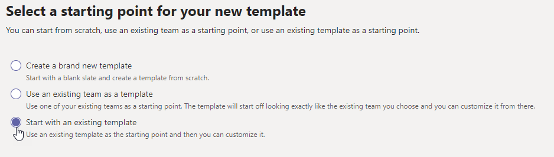

# Criar um novo modelo de equipe a partir de um modelo de equipe existente no Microsoft Teams

**Modelos personalizados ainda não são suportados para clientes EDU.**

Microsoft Teams fornece modelos pré-construídos que podem ser salvos e modificados para atender às suas necessidades organizacionais específicas.

1. Entre no Centro de administração do Teams.

2. Na navegação à esquerda, **expanda Teams** >  **modelos Deteam**.

3. Na seção **Modelos de equipe** , selecione ao lado de um modelo de equipe que você deseja duplicar para realça-lo.

4. Selecione **Duplicar**.

(Como alternativa, você pode selecionar **Adicionar** >  **Comece com um modelo existente para** abrir **Selecione o modelo a ser usado como ponto de partida**.)

5. Na tela **Selecionar o modelo a ser usado como ponto inicial** , selecione **Próximo**.

    O modelo duplicado é aberto e a palavra **Copiar** é anexada ao nome.

6. Conclua os seguintes campos e selecione **Próximo**:
    - Nome do modelo
    - Descrições curtas e longas do modelo
    - Visibilidade de localidade  

7. Na seção **canais, guias e aplicativos** , modifique todos os canais e aplicativos existentes de que sua equipe precisa.

    1. Selecione um canal para editar e selecione **Editar**.
    2. **Aplique** suas alterações quando terminar.

8. Adicione qualquer canal ou aplicativo que sua equipe precise.

    1. Na seção **Canais** , selecione **Adicionar**.
    2. Na caixa **de diálogo Adicionar** , nomeia o canal.
    3. Adicione uma descrição.
    4. Decida se o canal deve ser mostrado por padrão.
    5. Procure um nome de aplicativo que você deseja adicionar ao canal.
    6. Selecione **Aplicar** quando concluído.

7. Selecione **Enviar** quando terminar de adicionar canais e aplicativos.

    O novo modelo é salvo na biblioteca de modelos.

> [!Note]
> Pode levar até 24 horas para que os usuários do teams vejam um modelo personalizado na galeria.

## Artigos relacionados

- [Começar a usar modelos de equipe no centro de administração](get-started-with-teams-templates-in-the-admin-console.md)
- [Criar um modelo de uma equipe existente](create-template-from-existing-team.md)
- [Criar um modelo de equipe](create-a-team-template.md)