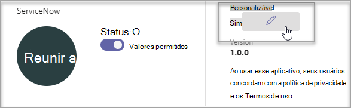

# Personalizar aplicativos no Microsoft TeamsCustomize apps in Microsoft Teams

 Microsoft Teams oferece personalização de aplicativo para aprimorar a experiência Teams aplicativo.Microsoft Teams provides app customization to enhance the Teams experience. Alguns desenvolvedores de aplicativos permitem que um aplicativo seja personalizado pelo Teams administrador. O administrador pode personalizar ou renomear as propriedades do aplicativo com base nas necessidades organizacionais usando a página Gerenciar aplicativos Teams **centro** de administração.Some app developers allow an app to be customized by the Teams admin. The admin can customize or rebrand the app properties based on the organizational needs using the Teams admin center **Manage apps** page. Os detalhes que você pode personalizar são:The details you can customize are:

- Nome curtoShort name
- Descrição curtaShort description
- Descrição completaFull description
- URL da política de privacidadePrivacy policy URL
- URL do siteWebsite URL
- URL de termos de usoTerms of use URL
- Ícone de corColor icon
- Ícone de outlineOutline icon
- Cor do destaqueAccent color

Consulte o [Teams de manifesto para](/microsoftteams/platform/resources/schema/manifest-schema) obter detalhes sobre os campos que você pode personalizar.See the [Teams Manifest schema](/microsoftteams/platform/resources/schema/manifest-schema) for details about the fields that you can customize.

> [!NOTE]
> Não há suporte para personalização de aplicativos Nuvem da Comunidade Governamental High (GCCH) ou Departamento de Defesa (DoD) neste momento.Customizing apps isn't supported in Government Community Cloud High (GCCH) or Department of Defense (DoD) at this time.
> Atualmente, esse recurso não está disponível para aplicativos Microsoft Teams sideload.Currently, this feature is not available for sideloaded Microsoft Teams apps.

## Personalizar os detalhes do aplicativoCustomize the app's details

Para começar a personalizar um aplicativo, conclua as seguintes etapas:To start customizing an app, complete the following steps:

1. Entre no Centro de administração do Teams.Sign in to the Teams admin center.
2. Expanda **Teams Aplicativos** e selecione **Gerenciar aplicativos**.Expand **Teams Apps** and select **Manage apps**.
3. Verifique a **coluna Personalizável** da lista de aplicativos e classificar por aplicativos personalizáveis.Check the **Customizable** column of the apps list and sort by apps that are customizable.

   

   Há três pontos de entrada para acessar o recurso personalizar:There are three entry points to access the customize feature:

   - Selecione ao lado do aplicativo que você deseja personalizar e selecione **Personalizar**.Select next to the app that you want to customize, and then select **Customize**.

     

   - Selecione o nome do aplicativo e **personalizável**.Select the app name and then **Customizable**.

     

   - Selecione o nome do aplicativo e selecione **Personalizar** no menu suspenso **Ações.**Select the app name, and then select **Customize** from the **Actions** dropdown.

     

4. Expanda **a seção Detalhes** e personalize os seguintes campos:Expand the **Details** section and customize the following fields:

    - Nome curtoShort name
    - Descrição curtaShort description
    - Descrição completaFull description
    - SiteWebsite
    - URL da política de privacidadePrivacy policy URL
    - URL de termos de usoTerms of use URL

   

> [!Note]
> Somente os campos atribuídos pelo desenvolvedor de aplicativos como personalizáveis estarão visíveis.Only the fields that the app developer has assigned as customizable will be visible.

5. Expanda **a seção Ícone.**Expand the **Icon** section.

   a.a. Upload um ícone.Upload an icon. Use um ícone de cor completa (192 x 192) pixel no formato PNG.Use one full-color icon (192x192) pixel in PNG format.

   b.b. Escolha uma cor de contorno de ícone.Choose an icon outline color. Use um pixel de contorno transparente (32x32) no formato PNG.Use one transparent outline (32x32) pixel in PNG format.

   c.c. Selecione uma cor de destaque do aplicativo que corresponde ao ícone.Select an app accent color that matches the icon.

    

6. Depois que seu aplicativo tiver sido personalizado, selecione **Aplicar**.Once your app has been customized, select **Apply**.

7. Selecione **Publicar** para publicar o aplicativo personalizado.Select **Publish** to publish the customized app.

   O aplicativo personalizado agora está listado na página **Gerenciar aplicativos.**The customized app is now listed in your **Manage apps** page. Você terá apenas uma versão do aplicativo, já que a personalização dos recursos do aplicativo não cria uma cópia do aplicativo.You'll have only one version of the app, since customizing the app features doesn't create a copy of the app.

Agora, Teams usuários finais podem abrir o cliente Teams para ver o aplicativo personalizado.Now your Teams end users can open their Teams client to see the customized app.

   

### Considerações especiais para personalizar um aplicativoSpecial considerations for customizing an app

A observação a seguir inclui detalhes importantes sobre como personalizar um aplicativo.The following note includes important details about customizing an app.

> [!Note]
> - Ao personalizar aplicativos e qualquer descrição relacionada a um aplicativo, certifique-se de seguir quaisquer diretrizes de personalização, se fornecidos pelo editor de aplicativos em sua documentação ou termos de uso.When you customize apps, and any description related to an app, ensure that you follow any customization guidelines if provided by the app publisher in their documentation or terms of use. Você também é responsável por respeitar os direitos de outras pessoas em relação a quaisquer imagens de terceiros que você possa usar.You're also responsible for respecting the rights of others regarding any third-party images you might use.
> - Os dados de personalização fornecidos pelo administrador são armazenados na região mais próxima.Admin-provided customization data is stored in the nearest region.
> - Você é responsável por garantir que os links para termos de uso ou política de privacidade sejam válidos.You are responsible for ensuring that links to terms of use or privacy policy are valid.
> - Caso o editor de aplicativos não permita mais que um campo seja personalizável, uma mensagem será exibida na página de detalhes do aplicativo notificando o administrador sobre os campos que não podem mais ser personalizados.In case the app publisher no longer allows a field to be customizable, a message appears on the app details page notifying the admin about the fields that can't be customized any longer. Todas as alterações feitas nesse campo serão revertidas para os valores originais.All the changes made to that field will be reverted to the original values.
> - Recomendamos testar as alterações de personalização do aplicativo em um Teams de teste antes de fazer essas alterações em seu ambiente de produção.We recommend testing app customization changes in a Teams test tenant before making these changes in your production environment.
> - As alterações na identidade visual podem exigir até 24 horas para os usuários verem as alterações.Changes to branding might require up to 24 hours for the users to see the changes.

## Revisar detalhes do aplicativoReview app details

Talvez você queira ver os detalhes do aplicativo para revisar as informações.You might want to see the app details to review the information.

1. Entre no Centro de administração do Teams.Sign in to the Teams admin center.

2. Expanda **aplicativos Teams** e selecione **Gerenciar aplicativos**.Expand **Teams apps** and select **Manage apps**.

3. Selecione o nome do aplicativo.Select the app name.

4. Exibir os detalhes do aplicativo, incluindo o nome do aplicativo original **Nome curto do editor**.View the app details, including the original app name **Short name from publisher**.

   

   O **nome curto do campo editor** só será visível se você tiver alterado o nome curto do aplicativo.The **Short name from publisher** field is only visible if you've changed the app's short name.

## Redefinir os detalhes do aplicativo como padrãoReset app details to default

A qualquer momento, você pode redefinir os detalhes do aplicativo para as configurações originais.At any time, you can reset the app details to the original settings.

1. Entre no Centro de administração do Teams.Sign in to the Teams admin center.

2. Expanda **Teams Aplicativos** e selecione **Gerenciar aplicativos**.Expand **Teams Apps** and select **Manage apps**.

3. Selecione o nome do aplicativo.Select the app name.

4. Selecione **Redefinir como padrão** no menu suspenso **Ações.**Select **Reset to default** from the **Actions** dropdown.

   

## Perguntas frequentesFrequently asked questions

**Quanto tempo levará para meus usuários verem o aplicativo personalizado?****How long will it take for my users to see the customized app?**

Embora o administrador possa ver imediatamente as alterações no Teams Admin Center, pode levar até 24 horas para os usuários finais verem as alterações.Although the admin can immediately see the changes in Teams Admin Center, it might take up to 24 hours for the end users to see the changes.  

**O provedor de aplicativos pode personalizar o aplicativo para seus clientes?****Can the app provider customize the app for its customers?**

 Não, o administrador de um locatário precisa personalizar o aplicativo para seu locatário usando o Teams Admin Center.No, the admin of a tenant needs to customize the app for their tenant using the Teams Admin Center.

**O aplicativo personalizado será implantado automaticamente para substituir meu aplicativo personalizado atual em um locatário?****Will the customized app automatically get deployed to replace my current custom app in a tenant?**

Não, os administradores de locatários terão que remover manualmente qualquer aplicativo personalizado e publicar a versão personalizada do aplicativo.No, the tenant admins will have to manually remove any custom app and publish the customized version of the app. Se você tiver personalizado um aplicativo e publicado como um aplicativo personalizado, o novo aplicativo personalizado usando o recurso de personalização do aplicativo não substituirá o aplicativo personalizado atual.If you have customized an app and published it as a custom app, the new app customized using the app customization feature won't replace the current custom app.  

**O relatório de uso do aplicativo também mostrará os valores personalizados, como nome curto personalizado?****Will the app usage report also show the customized values such as customized short name?**

 Não, o relatório de uso do aplicativo ainda mostrará o nome original do aplicativo enviado do editor.No, the app usage report will still show the original name of the app sent from the publisher.

**Quais aplicativos posso personalizar usando o recurso de personalização do aplicativo?****Which apps can I customize using the app customization feature?**

Você só pode personalizar aplicativos que tenham permissão para serem personalizáveis pelo editor de aplicativos.You can only customize apps that have been allowed to be customizable by the app publisher. O editor de aplicativos precisará optar por permitir que seus clientes personalizem o aplicativo.The app publisher will need to opt in to allow its customers to customize the app.

**As propriedades personalizadas aparecerão na tela de consentimento de permissão do gráfico?****Will the customized properties show up on the graph permission consent screen?**

Não, a tela de consentimento de permissão ainda mostrará o valor original enviado pelo editor.No, the permission consent screen will still show the original value sent by the publisher.

## Artigo relacionadoRelated article

- [Gerenciar aplicativosManage apps](manage-apps.md)
- [Personalizar sua loja de aplicativosCustomize your app store](customize-your-app-store.md)
- [Renomear seus aplicativosRebrand your apps](https://techcommunity.microsoft.com/t5/microsoft-teams-blog/rebrand-apps-to-your-own-organization-s-branding-with-app/ba-p/2376296)
