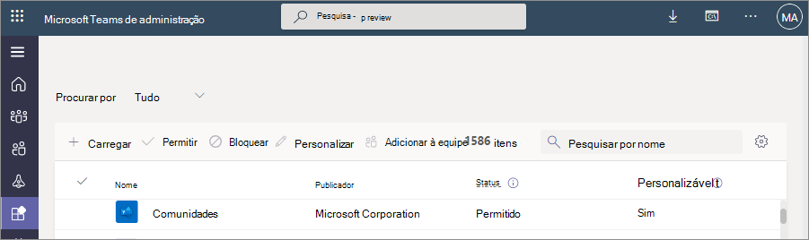
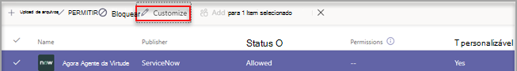
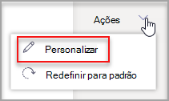
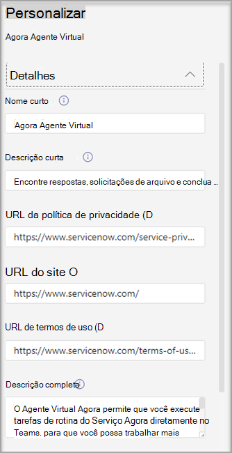
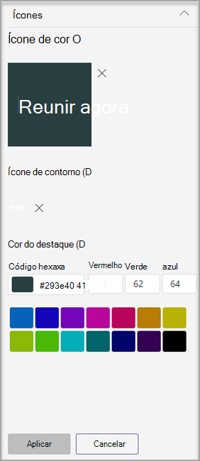
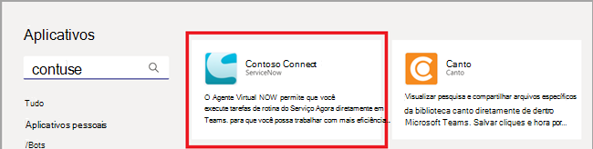
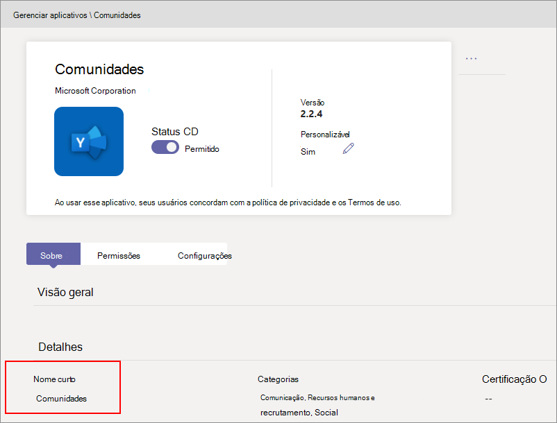
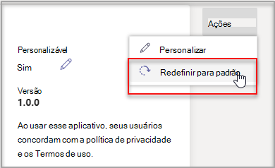

# Personalizar a aparência dos aplicativos na loja de Teams sua organização

Microsoft Teams permite que os administradores personalizem Teams aplicativo para aprimorar a experiência da loja e aderir à identidade visual da organização. Um desenvolvedor de aplicativos pode permitir que seu aplicativo seja personalizado por um Teams administrador. Em seguida, você pode atualizar as propriedades do aplicativo com base nas necessidades organizacionais, na página Gerenciar aplicativos no Teams de administração. Os detalhes que você pode personalizar são:

* Nome curto
* Descrição curta
* Descrição completa
* URL da política de privacidade
* URL do Site
* URL de termos de uso
* Ícone do aplicativo
* Cor da estrutura de tópicos do ícone
* Cor de destaque

Para obter informações sobre os vários campos de metadados do aplicativo, consulte [o esquema Teams manifesto](/microsoftteams/platform/resources/schema/manifest-schema) na documentação do desenvolvedor.

> [!NOTE]
> Você não pode personalizar aplicativos com sideload em nenhuma organização. Você não pode personalizar nenhum aplicativo em Nuvem da Comunidade Governamental alta (GCCH) ou nuvens do Departamento de Defesa (DoD).

## Personalizar detalhes de um aplicativo

Para personalizar um aplicativo, conclua as seguintes etapas:

1. Entre no Centro de administração do Teams.

1. **Expanda Teams aplicativos e** selecione **[Gerenciar aplicativos](https://admin.teams.microsoft.com/policies/manage-apps)**.

1. Verifique a **coluna personalizável** da lista de aplicativos e classifique por aplicativos personalizáveis.

   

   Há três pontos de entrada para acessar o recurso de personalização:

   * Selecione ao lado do aplicativo que você deseja personalizar e, em seguida, **selecione Personalizar**.

     

   * Selecione o nome do aplicativo e, em seguida, selecione o ícone de edição em **Personalizável**.

     

   * Selecione o nome do aplicativo, clique no **menu de estouro** focalizando **Ações** e selecione personalizar.

     

1. Expanda **a seção** Detalhes e personalize um ou mais dos campos a seguir. Os campos atribuídos como personalizáveis pelo desenvolvedor estão visíveis.

    * Nome curto
    * Descrição curta
    * Descrição completa
    * Site
    * URL da política de privacidade
    * URL de termos de uso

   

1. Expanda **a seção Ícone** .

1. Upload um ícone. Use um ícone (192 x 192) pixel no formato PNG.

1. Escolha uma cor da estrutura de tópicos do ícone. Use um pixel de contorno transparente (32 x 32) no formato PNG.

1. Selecione uma cor de destaque do aplicativo que corresponda ao ícone.

   

1. Depois de personalizar o aplicativo, selecione **Aplicar**.

1. Selecione **Publicar** para publicar o aplicativo personalizado.

   O aplicativo personalizado agora está listado na página **Gerenciar aplicativos** . Você terá apenas uma versão do aplicativo, pois a personalização dos recursos do aplicativo não cria uma cópia do aplicativo.

Agora, Teams usuários finais podem ver o aplicativo personalizado em seu cliente.

   

Observe os seguintes detalhes sobre como personalizar um aplicativo:

* Ao personalizar aplicativos e qualquer descrição relacionada a um aplicativo, certifique-se de seguir as diretrizes de personalização, se fornecidas pelo editor do aplicativo em sua documentação ou termos de uso. Você também é responsável por respeitar os direitos de outras pessoas em relação a quaisquer imagens de terceiros que você possa usar.

* Administração dados de personalização fornecidos são armazenados na região mais próxima.

* Você é responsável por garantir que os links para termos de uso ou política de privacidade sejam válidos.

* Caso o editor de aplicativos não permita mais que um campo seja personalizável, uma mensagem será exibida na página de detalhes do aplicativo notificando o administrador sobre os campos que não podem mais ser personalizados. Todas as alterações feitas nesse campo serão revertidas para os valores originais.

* É recomendável testar as alterações de personalização do aplicativo em um Teams de teste antes de fazer essas alterações em seu ambiente de produção.

* As alterações na identidade visual podem exigir até 24 horas para serem propagadas para todos os usuários.

* Para que um aplicativo se torne personalizável, os desenvolvedores podem fornecer uma nova versão do aplicativo. Carregue a nova versão e remova a versão anterior do aplicativo. Se você personalizou um aplicativo e o publicou, o novo aplicativo personalizado usando o recurso de personalização do aplicativo não substituirá o aplicativo atual.

* O [relatório de uso](teams-analytics-and-reports/app-usage-report.md) do aplicativo exibe o nome original do aplicativo fornecido pelo editor.

* A caixa Graph de consentimento de permissão do Microsoft Graph exibe o nome original do aplicativo fornecido pelo editor. Ele ajuda você a identificar com precisão um aplicativo ao fornecer permissões a ele.

## Examinar detalhes do aplicativo

Talvez você queira ver os detalhes do aplicativo para examinar as informações.

1. Entre no Centro de administração do Teams.

1. **Expanda Teams aplicativos e** selecione **[Gerenciar aplicativos](https://admin.teams.microsoft.com/policies/manage-apps)**.

1. Selecione o nome do aplicativo.

1. Exiba os detalhes do aplicativo, incluindo o nome do aplicativo original **Nome curto do editor**.

   

   O **nome curto do campo** do editor só estará visível se você tiver alterado o nome curto do aplicativo.

## Redefinir detalhes do aplicativo para valores padrão

Você pode redefinir os detalhes do aplicativo para os valores originais fornecidos pelo desenvolvedor do aplicativo. A opção só está disponível para o aplicativo que você personalizar.

1. No Teams de administração, acesse **Teams Aplicativos** > **[Gerenciados](https://admin.teams.microsoft.com/policies/manage-apps)**.

1. Selecione o nome do aplicativo.

1. Selecione **Redefinir para padrão** **no menu** Ações.

   

## Artigo relacionado

* [Gerenciar aplicativos](manage-apps.md)
* [Personalizar a loja de aplicativos da sua organização](customize-your-app-store.md)
* [Renomear seus aplicativos](https://techcommunity.microsoft.com/t5/microsoft-teams-blog/rebrand-apps-to-your-own-organization-s-branding-with-app/ba-p/2376296)
