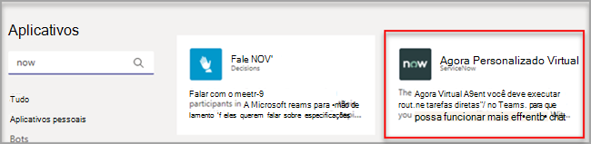
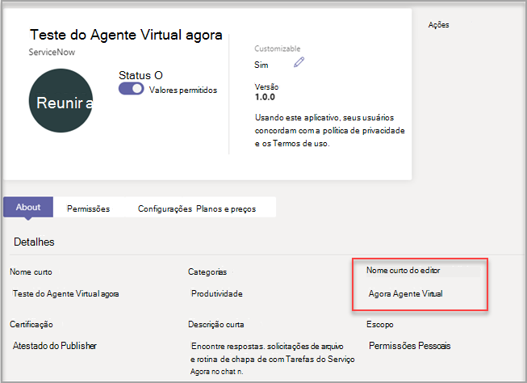

# Personalizar aplicativos no Microsoft Teams

[!INCLUDE [preview-feature](includes/preview-feature.md)]

 O Microsoft Teams fornece personalização de aplicativos para aprimorar a experiência do Teams. Alguns desenvolvedores de aplicativos permitem que um aplicativo seja personalizado pelo administrador do Teams. O administrador pode personalizar ou renomear as propriedades do aplicativo com base nas necessidades organizacionais usando a página Gerenciar **aplicativos** do Centro de administração do Teams. Os detalhes que você pode personalizar são:

- Nome curto
- Descrição curta
- Descrição completa
- URL da política de privacidade
- URL do site
- URL de termos de uso
- Ícone de cor
- Ícone de outline
- Cor do destaque

Consulte o [esquema de Manifesto do Teams](https://docs.microsoft.com/microsoftteams/platform/resources/schema/manifest-schema) para obter detalhes sobre os campos que você pode personalizar.

> [! OBSERVAÇÃO A personalização de aplicativos não é suportada no GCCH (Government Community Cloud High) ou no Departamento de Defesa (DoD) neste momento.

## Personalizar os detalhes do aplicativo

Para começar a personalizar um aplicativo, conclua as seguintes etapas:

1. Entre no Centro de administração do Teams.
2. Expanda **Aplicativos do Teams** e selecione **Gerenciar aplicativos**.
3. Verifique a **coluna Personalizável** da lista de aplicativos e classificar por aplicativos personalizáveis.

   

   Há três pontos de entrada para acessar o recurso personalizar:

   - Selecione ao lado do aplicativo que você deseja personalizar e selecione **Personalizar**.

     

   - Selecione o nome do aplicativo e **personalizável**.

     

   - Selecione o nome do aplicativo e selecione **Personalizar** no menu suspenso **Ações.**

     

4. Expanda **a seção Detalhes** e personalize os seguintes campos:

    - Nome curto
    - Descrição curta
    - Descrição completa
    - Site
    - URL da política de privacidade
    - URL de termos de uso

   

> [!Note]
> Somente os campos atribuídos pelo desenvolvedor de aplicativos como personalizáveis estarão visíveis.

5. Expanda **a seção Ícone.**

   a. Carregar um ícone. Use um ícone de cor completa (192 x 192) pixel no formato PNG.

   b. Escolha uma cor de contorno de ícone. Use um pixel de contorno transparente (32x32) no formato PNG.

   c. Selecione uma cor de destaque do aplicativo que corresponde ao ícone.

    

6. Depois que seu aplicativo tiver sido personalizado, selecione **Aplicar**.

7. Selecione **Publicar** para publicar o aplicativo personalizado.

   O aplicativo personalizado agora está listado na página **Gerenciar aplicativos.** Você terá apenas uma versão do aplicativo, já que a personalização dos recursos do aplicativo não cria uma cópia do aplicativo.

Agora, os usuários finais do Teams podem abrir o cliente do Teams para ver o aplicativo personalizado.

   

### Considerações especiais para personalizar um aplicativo

A observação a seguir inclui detalhes importantes sobre como personalizar um aplicativo.

> [!Note]
> - Ao personalizar aplicativos e qualquer descrição relacionada a um aplicativo, certifique-se de seguir quaisquer diretrizes de personalização, se fornecidos pelo editor de aplicativos em sua documentação ou termos de uso. Você também é responsável por respeitar os direitos de outras pessoas em relação a quaisquer imagens de terceiros que você possa usar.
> - Os dados de personalização fornecidos pelo administrador são armazenados na região mais próxima.
> - Você é responsável por garantir que os links para termos de uso ou política de privacidade sejam válidos.
> - Caso o editor de aplicativos não permita mais que um campo seja personalizável, uma mensagem será exibida na página de detalhes do aplicativo notificando o administrador sobre os campos que não podem mais ser personalizados. Todas as alterações feitas nesse campo serão revertidas para os valores originais.
> - As alterações na identidade visual podem exigir até 24 horas para os usuários verem as alterações.

## Revisar detalhes do aplicativo

Talvez você queira ver os detalhes do aplicativo para revisar as informações.

1. Entre no Centro de administração do Teams.

2. Expanda **aplicativos Teams** e selecione **Gerenciar aplicativos**.

3. Selecione o nome do aplicativo.

4. Exibir os detalhes do aplicativo, incluindo o nome do aplicativo original **Nome curto do editor**.

   

   O **nome curto do campo editor** só será visível se você tiver alterado o nome curto do aplicativo.

## Redefinir os detalhes do aplicativo como padrão

A qualquer momento, você pode redefinir os detalhes do aplicativo para as configurações originais.

1. Entre no Centro de administração do Teams.

2. Expanda **Aplicativos do Teams** e selecione **Gerenciar aplicativos**.

3. Selecione o nome do aplicativo.

4. Selecione **Redefinir como padrão** no menu suspenso **Ações.**

   

## Perguntas frequentes

**Quanto tempo levará para meus usuários verem o aplicativo personalizado?**

Embora o administrador possa ver imediatamente as alterações no Centro de Administração do Teams, pode levar até 24 horas para os usuários finais verem as alterações.  

**O provedor de aplicativos pode personalizar o aplicativo para seus clientes?**

 Não, o administrador de um locatário precisa personalizar o aplicativo para seu locatário usando o Centro de Administração do Teams.

**O aplicativo personalizado será implantado automaticamente para substituir meu aplicativo personalizado atual em um locatário?**

Não, os administradores de locatários terão que remover manualmente qualquer aplicativo personalizado e publicar a versão personalizada do aplicativo. Se você tiver personalizado um aplicativo e publicado como um aplicativo personalizado, o novo aplicativo personalizado usando o recurso de personalização do aplicativo não substituirá o aplicativo personalizado atual.  

**O relatório de uso do aplicativo também mostrará os valores personalizados, como nome curto personalizado?**

 Não, o relatório de uso do aplicativo ainda mostrará o nome original do aplicativo enviado do editor.

**Quais aplicativos posso personalizar usando o recurso de personalização do aplicativo?**

Você só pode personalizar aplicativos que tenham permissão para serem personalizáveis pelo editor de aplicativos. O editor de aplicativos precisará optar por permitir que seus clientes personalizem o aplicativo.

**As propriedades personalizadas aparecerão na tela de consentimento de permissão do gráfico?**

Não, a tela de consentimento de permissão ainda mostrará o valor original enviado pelo editor.

## Artigo relacionado

- [Gerenciar aplicativos](manage-apps.md)
- [Personalizar sua loja de aplicativos](customize-your-app-store.md)
