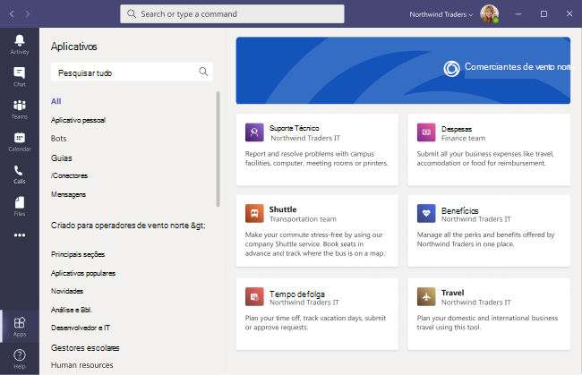

# Armazenamento de aplicativos personalizados Microsoft Teams

Agora você pode personalizar o armazenamento de aplicativos da sua organização no Teams com a identidade visual da sua empresa adicionando seu logotipo, fundos personalizados e cores de texto personalizadas para torná-lo mais convidativo para os usuários finais.

> [!Note]
> As alterações na identidade visual exigirão 24 horas para que entre em vigor.

Você pode acessar o armazenamento personalizado no centro de administração selecionando **Teams**  >  **aplicativos personalizar o armazenamento**.

  

Este artigo descreve os recursos de armazenamento de aplicativos personalizados e como usá-los.

## Personalizar o logotipo da sua organização

<!-- Bookmark used by Context Sensitive Help (CSH). Do not delete. -->

<!-- Do not remove the bookmark link above. -->

Aqui você pode carregar o logotipo da sua organização. O logotipo selecionado aparecerá no cliente Teams **aplicativos**  >  **criado para sua página de locatário.**

Ao selecionar **a opção Escolher uma imagem,** você pode carregar o arquivo de sua escolha. O logotipo deve ser 240x60 ou será dimensionado para esse tamanho. Não deve ser maior do que 5 MB. Os formatos com suporte são:

- .svg
- .png
- .jpg

O logotipo é mostrado no canto superior direito do catálogo de aplicativos do locatário no Teams store.

## Personalizar seu logotipo pequeno

<!-- Bookmark used by Context Sensitive Help (CSH). Do not delete. -->

<!-- Do not remove the bookmark link above. -->

A marca de logomarca da sua organização ou logotipo pequeno é uma imagem ou símbolo que representa a marca da sua organização e não inclui o nome da sua empresa. O lovemark ajuda os membros da equipe a identificar o armazenamento de aplicativos. O logotipo selecionado aparecerá na página Teams cliente em Aplicativos.

Ao selecionar **a opção Escolher uma imagem,** você pode carregar o arquivo de sua escolha. A marca de logotipo deve ter 32 x 32 pixels ou será dimensionada para esse tamanho. Não deve ser maior do que 5 MB. Os formatos com suporte são:

- .svg
- .png
- .jpg

O logotipo pequeno é mostrado ao lado do título da seção **Built for tenant** na Teams de aterrissagem da loja.

## Personalizar a cor do plano de fundo

<!-- Bookmark used by Context Sensitive Help (CSH). Do not delete. -->

<!-- Do not remove the bookmark link above. -->

Certifique-se de que o plano de fundo tenha contraste suficiente com o texto para que os usuários possam ler o texto claramente. O plano de fundo aparecerá no cliente Teams **aplicativos**  >  **criado para o** seu header de locatário.

Suas opções são:

- Usar Teams de plano de fundo padrão do cliente
- Escolha uma imagem. Ao selecionar a imagem em segundo plano, você pode carregar o arquivo de sua escolha. O plano de fundo deve ter 1212x100 pixels ou será dimensionado para esse tamanho. Não deve ser maior do que 5 MB. Os formatos com suporte são:
  - .svg
  - .png
  - .jpg
- Escolha um plano de fundo personalizado. Quando você seleciona **Escolher uma cor personalizada,** um seletor de cores é aberto. Selecione a cor que você deseja ajustando a escala do seletor de cores.

A imagem ou cor do plano de fundo é usada como o plano de fundo da faixa superior no catálogo de aplicativos Teams locatário.

## Personalizar a cor do texto do seu nome

<!-- Bookmark used by Context Sensitive Help (CSH). Do not delete. -->

<!-- Do not remove the bookmark link above. -->

Certifique-se de que a cor do texto tenha contraste suficiente com o plano de fundo para que os usuários possam ler o nome da sua organização claramente. O texto aparecerá no cliente Teams **aplicativos**  >  **criado para o** seu header de locatário.

Quando você seleciona **Escolher uma cor personalizada,** um seletor de cores é aberto. Selecione a cor que você deseja ajustando a escala do seletor de cores.

 

## Concluir a personalização do armazenamento de aplicativos de equipe

Quando terminar de personalizar o armazenamento de aplicativos, selecione **Salvar** para salvar suas alterações.
Para visualizar suas alterações, selecione **Visualizar o armazenamento de aplicativos** para ver uma representação do armazenamento de aplicativos personalizados.

> [!Note]
> A representação pode variar da versão final do armazenamento de aplicativos personalizados porque algumas cores padrão são baseadas na versão do cliente Teams usuários.

## Artigo relacionado

[Gerenciar seus aplicativos](manage-apps.md)
