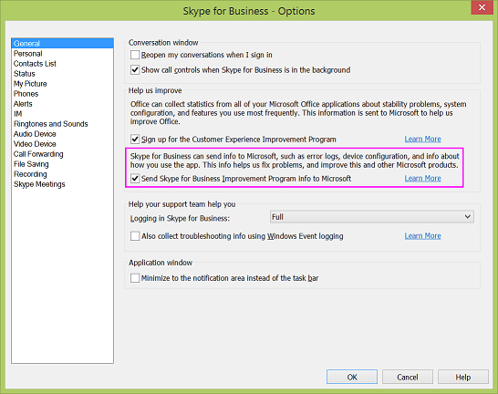

# Práticas de coleta de dados do Skype for Business e do Microsoft Teams

O Skype for Business Server e o Skype for Business Online, juntamente com os aplicativos Skype for Business e Microsoft Teams, coletam dados para ajudar a Microsoft a entender como esses produtos são usados e quais tipos de erros, como erros de conexão, ocorreram. Essas informações nos ajudam a entender os padrões de uso, planejar novos recursos e solucionar problemas e áreas de problemas.

Enquanto alguns dados de uso são coletados automaticamente, outros dados só podem ser coletados quando o administrador e/ou o usuário optar por permitir isso. A coleta de dados se encaixa nestas três categorias:

- Dados do censo

- Dados de uso

- Dados de relatório de erros

## Dados do censo

Os dados do censo são adquiridos exclusivamente para fornecer, dar suporte e melhorar o Skype for Business. Microsoft Teams e Skype for Business online. Inclui informações ambientais, como versões de dispositivos e sistemas operacionais e configurações regionais e de idioma. Ele também inclui contadores para tentativas e falhas de entrada. Aqui estão alguns exemplos específicos dos dados do censo coletados:

|**Tipo de dados**|**Exemplo**|**Observações**|
|:-----|:-----|:-----|
|AppName    |iPhoneSkype    ||
|DeviceModel    |iPhone    ||
|OSName    |iPhoneiOS    ||
|Versão do sistema operacional    |8,3    ||
|UserLanguage    |EN-US    ||
|ID    |E296D735-4F36-4E18-7C3B-52E1A02A0164    |A ID é codificada duas vezes: uma vez no cliente e novamente no serviço de telemetria. O hash garante que a identificação não pode ser vinculada a um usuário específico.    |
|DeviceID    |5E872200-F546-4CCD-8F23-AF5F507AA2DD    |A ID do dispositivo é um GUID gerado aleatoriamente uma vez no dispositivo e enviado ao serviço de telemetria.    |

Os dados do censo não contêm nenhuma informação que identifique sua organização ou seus usuários. Consulte a [declaração de privacidade do Skype for Business](https://www.microsoft.com/privacystatement/SkypeforBusiness/Default.aspx) para obter mais informações.

Os dados do censo são ativados por padrão e não podem ser desativados por administradores ou usuários finais.

## Dados de uso

Os dados de uso incluem informações como o número de chamadas feitas, o número de mensagens de chat enviadas ou recebidas, o número de reuniões associadas, a frequência de recursos usados e problemas de estabilidade.

Os dados de uso podem conter informações que identificam sua organização, como contoso.com. Veja alguns exemplos específicos dos dados de uso coletados:

|**Tipo de dados**|**Exemplo**|**Observações**|
|:-----|:-----|:-----|
|Mensagem instantânea enviada    |12    ||
|Mensagem instantânea recebida    |5    ||
|Ingressar em uma reunião (tentativas)    |5    ||
|Ingressar em uma reunião (sucesso)    |4    ||
|Minutos de chamada/reunião    |30 minutos    ||
|FederationPartner    |Microsoft.com    |Esse é o nome da Organização registrada no Office 365 e é transmitido em texto não criptografado, o que significa que não está ofuscado.    |

Os dados de uso não contêm informações que identifiquem os usuários.

A coleta de dados de uso está ativada por padrão, mas os administradores locais podem desativá-lo usando a configuração de política de grupo do DisableAutomaticSendTracing no Skype for Business Server. Desativar essa configuração afetará todos os usuários da organização. Consulte [Configurar políticas de inicialização do cliente](/skypeforbusiness/deploy/deploy-clients/configure-client-bootstrapping-policies) para obter mais informações.

Os usuários finais não podem ativar ou desativar a coleta de dados de uso.

Para o aplicativo reuniões do Skype e as páginas da Web do inicializador de junção, a maneira de controlar a telemetria é por meio desta política:

`Set-CsWebServiceConfiguration -MeetingUxEnableTelemetry $True`

Essa política é definida como false, portanto, a coleta de telemetria está desativada por padrão. Essa configuração é por pool e controla todos os usuários que se conectam ao aplicativo reuniões do Skype a uma reunião hospedada nesse servidor.

## Dados de relatório de erros

Os dados de relatório de erros podem incluir informações sobre desempenho e confiabilidade, configuração de dispositivo, qualidade da conexão de rede, códigos de erro, logs de erros e exceções. Veja alguns exemplos específicos de dados de relatório de erros que são coletados:

|**Tipo de dados**|**Exemplo**|**Observações**|
|:-----|:-----|:-----|
|Direção da mensagem    |Chega    ||
|Estado da conversa    |Ociosidade    ||
|ID do thread da conversa    |AdDO8hsJqilU93hQHC3OZaPR2saEA = =    ||
|ID    |amosmarble   |A ID é enviada em texto sem formatação, que é o hash do serviço de telemetria antes de armazená-lo    |

Os dados de relatório de erros também podem conter informações de identificação pessoal, como o endereço IP do usuário e o URI de recurso Uniform Resource Identifier (SIP URI). Consulte a [declaração de privacidade do Skype for Business](https://www.microsoft.com/privacystatement/SkypeforBusiness/Default.aspx) para obter uma explicação detalhada do que foi coletado.

O relatório de erros requer duas coisas:

- A configuração da política de grupo DisableAutomaticSendTracing é definida como false no servidor ou no centro de administração do locatário (esse é o estado padrão). Consulte [Configurar políticas de inicialização do cliente](/skypeforbusiness/deploy/deploy-clients/configure-client-bootstrapping-policies) para obter mais informações.
    
- Os usuários finais optam individualmente na guia Geral (  engrenagem e, em seguida, a caixa de diálogo **Opções** é aberta com a guia **geral** exibida) no cliente Skype for Business.
    
 

  
Para o aplicativo reuniões do Skype, o MeetingUxEnableTelemetry também controla o relatório de erros, embora, no caso de falhas no Windows, controle as configurações do Watson carreguem informações de falha. Não há nenhuma configuração de usuário para o aplicativo reuniões do Skype como você vê na caixa de diálogo cliente da área de trabalho.

Consulte [definir opções gerais no Skype for Business](https://support.office.com/article/e1a46d3e-dcea-437a-ba7b-6d442a40f439) para obter mais informações.

Você pode ver [configurar sua rede para o Skype for Business online](https://support.office.com/article/81fa5e16-418d-4698-a5f0-e666211c5c66) para configurar sua rede.

Se você estiver usando o Office 365 operado pela 21Vianet na China, consulte [configurar sua rede para o Skype for Business online operado pela 21vianet](https://support.office.com/article/d21f89b0-3afc-432e-b735-036b2432fdbf).

## Tópicos relacionados
[Programa de aperfeiçoamento da experiência do usuário](https://www.microsoft.com/products/ceip/default.mspx)

[Disponibilidade da Audioconferência e dos Planos de Chamadas por país e região](country-and-region-availability-for-audio-conferencing-and-calling-plans/country-and-region-availability-for-audio-conferencing-and-calling-plans.md)
