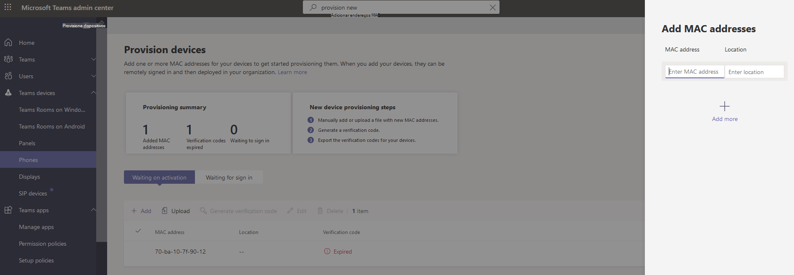
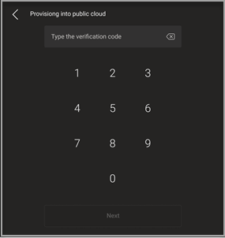
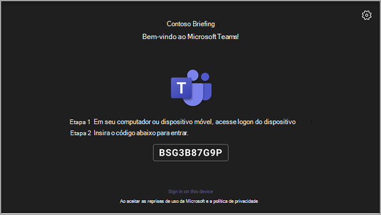
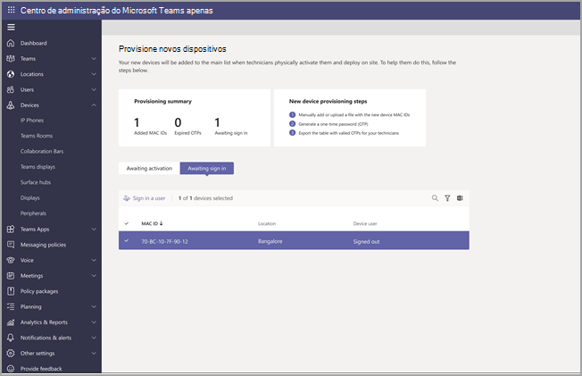
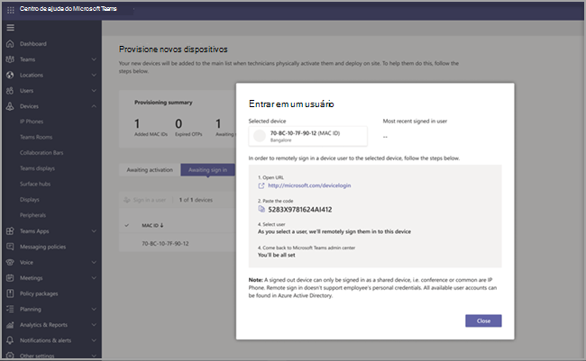

# Provisionamento remoto e entrada para dispositivos Android do Teams

Os administradores de TI podem provisionar e entrar remotamente em um dispositivo Android do Teams. Para provisionar um dispositivo remotamente, o administrador precisa carregar as IDs MAC dos dispositivos que estão sendo provisionados e criar um código de verificação. Todo o processo pode ser concluído remotamente no centro de administração do Teams.

## Examinar os dispositivos com suporte

A lista a seguir mostra os requisitos de firmware do dispositivo Android.

|Categoria de dispositivo|Modelo de dispositivo|Versão do firmware|
|---|---|---|
|Telefones do Teams|Yealink T55/T56/T58|58.15.0.124|
|Telefones do Teams|Yealink VP59|91.15.0.58|
|Telefones do Teams|Yealink CP960|73.15.0.117|
|Telefones do Teams|Yealink MP56/MP54/MP58|122.15.0.36|
|Telefones do Teams|Crestron UC-2|1.0.3.52|
|Telefones do Teams|Poly Trio C60|7.0.2.1071|
|Telefones do Teams|CCX400/CCX500/CCX600 |7.0.2.1072|
|Telefones do Teams|Códigos de áudio C448HD/C450HD/C470HD|1.10.120|
|Painéis do Teams|Crestron 770/1070|1.004.0115|
|Salas do Teams no Android|Logitech Rally Bar Mini|1.2.982|
|Salas do Teams no Android|Logitech Rally Bar|1.2.982|
|Salas do Teams no Android|AudioCodes RXV80|1.13.361|
|Salas do Teams no Android|EPOS EXPAND Vision 3T|1.2.2.21182.10|
|Salas do Teams no Android|Yealink MeetingBar A30|133.15.0.60|
|Salas do Teams no Android|Yealink MeetingBar A20|133.15.0.60|
|Salas do Teams no Android|Console de toque yealink CTP18|137.15.0.37|
|Salas do Teams no Android|Poly Studio X30|3.5.0.344025|
|Salas do Teams no Android|Poly Studio X50|3.5.0.344025|
|Salas do Teams no Android|Console de toque poly TC8 |3.5.0.210489|
|Salas do Teams no Android|Yealink VC210|118.15.0.54|

## Adicionar um endereço MAC do dispositivo

Conclua as etapas a seguir para provisionar um novo dispositivo.

1. Entre no Centro de administração do Teams.
2. Expanda **dispositivos do Teams**.
3. Selecione **Provisionar novo dispositivo** na **guia** Ações.

Na janela **Provisionar novos** dispositivos, você pode adicionar o endereço MAC manualmente ou carregar um arquivo.

### Adicionar manualmente um endereço MAC do dispositivo

1. Na guia **Aguardando na ativação** , selecione **Adicionar ID do MAC**.

   

1. Insira a ID do MAC.
1. Insira um local, que ajuda os técnicos a identificar onde instalar os dispositivos.
1. Selecione **Aplicar** quando terminar.

### Carregar um arquivo para adicionar um endereço MAC do dispositivo

1. Na guia **Aguardando na ativação** , selecione **Carregar IDs mac**.
2. Baixe o modelo de arquivo.
3. Insira a ID e o local do MAC e salve o arquivo.
4. **Selecione o arquivo** e, em seguida, **selecione Carregar**.

## Gerar um código de verificação

Você precisa de um código de verificação para os dispositivos. O código de verificação é gerado em massa ou no nível do dispositivo e é válido por 24 horas.

1. Na guia **Aguardando na ativação** , selecione uma ID mac existente.
   Uma senha é criada para o endereço MAC e é mostrada na coluna **Código de** Verificação.

2. Forneça a lista de IDs MAC e códigos de verificação para os técnicos de campo. Você pode exportar os detalhes diretamente em um arquivo e compartilhar o arquivo com o técnico que está fazendo o trabalho de instalação real.

## Provisionar o dispositivo

Quando o dispositivo está ligado e conectado à rede, o técnico provisiona o dispositivo. Essas etapas são concluídas no dispositivo teams.

1. O técnico seleciona **Provisionar dispositivo** nas **Configurações**.  

   
  
2. O técnico insere o código de verificação específico do dispositivo no campo de entrada fornecido.

   

   Depois que o dispositivo for provisionado com êxito, o nome do locatário aparecerá na página de entrada.

   

## Primeira vez que você entra remotamente

O dispositivo provisionado aparece na **guia Aguardando entrada** . Inicie o processo de entrada remota selecionando o dispositivo individual.

1. Selecione um dispositivo na **guia Aguardando** entrada.

   

2. Siga as instruções em **Conectar um usuário** e, em seguida, selecione **Fechar**.

   

## Artigos relacionados

- [Gerenciar seus dispositivos no Teams](device-management.md)
- [Entrar e sair remotamente](remote-sign-in-and-sign-out.md)
- [Atualizar dispositivos do Teams remotamente](remote-update.md)
