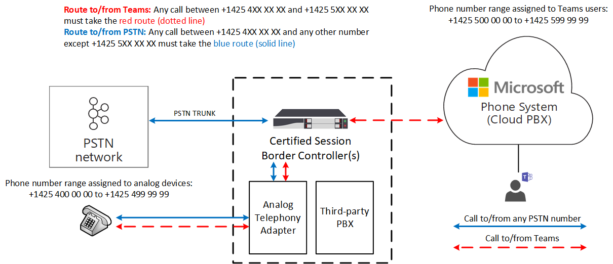

# <a name="how-to-use-analog-devices-with-direct-routing"></a>Como usar dispositivos analógicos com Roteamento Direto

Este artigo descreve como usar dispositivos analógicos com Roteamento Direto. Para conectar dispositivos analógicos ao Roteamento Direto, você deve usar um Adaptador de Telefonia Analógica (ATA) e esse adaptador deve ter suporte do fornecedor certificado do Controlador de Borda de Sessão (SBC). 

Quando um usuário faz uma chamada de um dispositivo analógico, a sinalização e a mídia fluem através do Adaptador de Telefonia Analógica (ATA) para o SBC.  O SBC envia a chamada para um ponto de extremidade Microsoft Teams ou para a PSTN (Rede Telefônica Pública Comucionada) com base na tabela de roteamento interna.  Quando um dispositivo faz uma chamada, a rota que ele faz depende das políticas de roteamento criadas para o dispositivo.

No diagrama a seguir, O Roteamento Direto é configurado para que qualquer Teams chame para e a partir dos números entre +1425 4XX XX e +1425 5XX XX XX deve tomar a rota vermelha (linha pontilhada), e qualquer chamada PSTN de e para números entre +1425 4XX XX e qualquer outro número, exceto o intervalo de números +1425 5XX XX, deve tomar a rota azul (linha sólida). 

> [!div class="mx-imgBorder"]
> 

## <a name="example-how-to-configure-the-use-of-analog-devices-with-direct-routing"></a>Exemplo: como configurar o uso de dispositivos analógicos com Roteamento Direto

Para configurar o uso de dispositivos analógicos com Roteamento Direto, você deve conectar o Adaptador de Telefonia Analógica ao SBC e configurar o SBC para funcionar com Roteamento Direto. 

Este exemplo orienta você pelas seguintes etapas:

1. Conexão SBC para Roteamento Direto.
2. Crie o Uso de PSTN.
3. Crie uma rota de voz e a associe-a ao Uso de PSTN.
4. Atribua a rota de voz ao Uso PSTN.
5. Habilitar o usuário online.
6. Atribua a política de rota de voz ao usuário.
7. Crie uma rota de voz para um dispositivo analógico.

Para obter informações sobre como conectar um ATA a um SBC e configurar o SBC, consulte o guia de configuração do fabricante SBC:

- [Documentação de configuração de AudioCodes](https://www.audiocodes.com/media/14278/connecting-audiocodes-sbc-with-analog-device-to-microsoft-teams-direct-routing-enterprise-model-configuration-note.pdf)

- [Documentação de configuração da faixa de opções](https://support.sonus.net/display/UXDOC81/Connect+SBC+Edge+to+Microsoft+Teams+Direct+Routing+to+Support+Analog+Devices)
- [Documentação de configuração do Oracle](https://www.oracle.com/technical-resources/documentation/acme-packet.html#Link-MicrosoftTeams)

## <a name="step-1-connect-the-sbc-to-direct-routing"></a>Etapa 1. Conexão SBC para Roteamento Direto

O comando a seguir configura a conexão SBC da seguinte forma:

- FQDN sbc.contoso.com
- Porta de sinalização 5068
- Modo de bypass de mídia
- Informações do histórico de chamada encaminhadas para o SBC-
- Header P-Asserted-Identity (PAI) encaminhado junto com a chamada 

```powershell
PS C:\> New-CsOnlinePSTNGateway -FQDN sbc.contoso.com -SIPSignalingPort 5068 -ForwardCallHistory $true -ForwardPAI $true -MediaBypass $true -Enabled $true 
```

## <a name="step-2-create-the-pstn-usage"></a>Etapa 2: Criar o uso PSTN 

O próximo comando cria um uso PSTN vazio. Os usos de PSTN online são valores de cadeia de caracteres usados para autorização de chamada. Um uso PSTN online vincula uma política de voz online a uma rota. Este exemplo adiciona a cadeia de caracteres "Interop" à lista atual de usos PSTN disponíveis. 

```powershell
PS C:\> Set-CsOnlinePstnUsage -Identity global -Usage @{add="Interop"} 
```

## <a name="step-3-create-a-voice-route-and-associate-it-with-the-pstn-usage"></a>Etapa 3: Criar uma rota de voz e associá-la ao uso de PSTN

Este comando cria uma nova rota de voz online com a identidade "analog-interop" para o intervalo de números +1425 XXX XX.  A rota de voz é aplicável a uma lista de gateways online sbc.contoso.com e associa a rota ao uso de PSTN online "Interop". Uma rota de voz inclui uma expressão regular que identifica quais números de telefone serão roteados por uma determinada rota de voz:

```powershell
PS C:\> New-CsOnlineVoiceRoute -Identity analog-interop -NumberPattern "^\+1(425)(\d{7})$" -OnlinePstnGatewayList sbc.contoso.com -Priority 1 -OnlinePstnUsages "Interop"
```

## <a name="step-4-assign-the-voice-route-to-the-pstn-usage"></a>Etapa 4: Atribuir a rota de voz ao uso PSTN:

Este comando cria uma nova política de roteamento de voz online por usuário com a identidade "AnalogInteropPolicy". Esta política recebe um único uso de PSTN online: "Interop".

```powershell
PS C:\> New-CsOnlineVoiceRoutingPolicy -Identity "AnalogInteropPolicy" -OnlinePstnUsages "Interop"
```

## <a name="step-5-enable-the-online-user"></a>Etapa 5: Habilitar o usuário online

Este comando modifica a conta de usuário com a identidade exampleuser@contoso.com. Nesse caso, a conta é modificada para habilitar Enterprise Voice, a implementação da Microsoft do VoIP, com caixa postal habilitada e atribui o número +142550000000 a esse usuário.  Esse comando deve ser executado para cada Teams usuário (excluindo usuários de dispositivo ATA) no locatário da empresa.

```powershell
PS C:\> Set-CsUser -Identity "exampleuser@contoso.com" -EnterpriseVoiceEnabled $True -HostedVoiceMail $True -OnPremLineUri "tel:+14255000000"
```

## <a name="step-6-assign-the-voice-route-policy-to-a-user"></a>Etapa 6: Atribuir a política de rota de voz a um usuário

Este comando atribui a política de roteamento de voz online por usuário AnalogInteropPolicy ao usuário com a identidade exampleuser@contoso.com. Esse comando deve ser executado para cada Teams usuário (excluindo usuários de dispositivo ATA) no locatário da empresa.

```powershell
PS C:\> Grant-CsOnlineVoiceRoutingPolicy -Identity "exampleuser@contoso.com" -PolicyName "AnalogInteropPolicy" 
```

## <a name="step-7-create-a-voice-route-for-an-analog-device"></a>Etapa 7: Criar uma rota de voz para um dispositivo analógico

Este comando cria uma rota de voz online com a identidade "analog-interop" para o intervalo de números +1425 4XX XX XX aplicáveis a uma lista de gateways online sbc.contoso.com e a associa ao uso de PSTN online "Interop".  Esse comando deve ser executado para cada dispositivo analógico com o padrão de número de telefone apropriado. Como alternativa, um padrão de número adequado para dispositivos analógicos pode ser usado durante a configuração da rota de voz online durante uma das etapas anteriores.

```powershell
PS C:\> New-CsOnlineVoiceRoute -Identity analog-interop -NumberPattern "^\+1(4254)(\d{6})$"  -OnlinePstnGatewayList sbc.contoso.com -Priority 1 -OnlinePstnUsages "Interop"
```

## <a name="considerations"></a>Considerações

- A menos que observe de outra forma, um dispositivo analógico é qualquer dispositivo que pode enviar dígitos DTMF para fazer uma chamada. Por exemplo, telefones analógicos, computadores de fax e pagers de sobrecarga.

- Telefones analógicos conectados a um ATA não são pesquisáveis Teams. Teams os usuários devem inserir manualmente o número de telefone associado ao dispositivo para chamar esse dispositivo.  
 

## <a name="see-also"></a>Confira também

[Planejar o Roteamento Direto](direct-routing-plan.md)

[Configurar o Roteamento Direto](direct-routing-configure.md)
