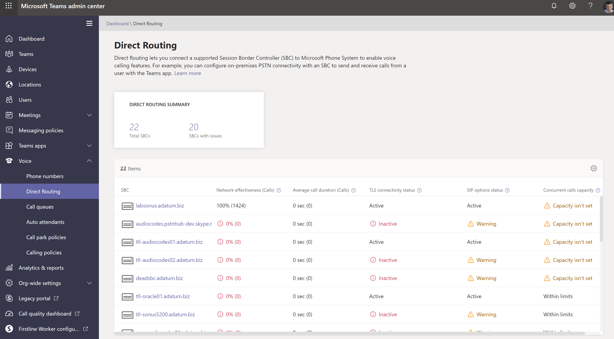

# Painel de Saúde para Roteamento Direto

O Painel de Saúde para Roteamento Direto permite monitorar a conexão entre o Controlador de Borda de Sessão (SBC) e a interface de Roteamento Direto.  Com o Painel de Saúde, você pode monitorar informações sobre seu SBC, o serviço de telefonia e os parâmetros de rede entre seu SBC e a interface de Roteamento Direto. Essas informações podem ajudá-lo a identificar problemas, incluindo o motivo das chamadas não a atender. Por exemplo, o SBC pode parar de enviar chamadas se um certificado no SBC tiver expirado ou se houver problemas de rede. Veja as [funções de administrador](using-admin-roles.md) para saber quem tem acesso ao painel de saúde.

O Painel de Saúde monitora dois níveis de informações:

- Saúde geral dos SBCs conectados
- Informações detalhadas sobre os SBCs conectados

Você pode exibir o Painel de Saúde no Microsoft Teams e no Centro de Administração do Skype for Business.

## Saúde geral

O Painel de Saúde fornece as seguintes informações relacionadas à saúde geral dos SBCs conectados:

 

- **Resumo do Roteamento** Direto – Mostra o número total de SBCs registrados no sistema. O registro significa que o administrador do locatário adicionou um SBC usando o comando New-CsOnlinePSTNGateway usuário. Se o SBC foi adicionado ao PowerShell, mas nunca foi conectado, o Painel de Saúde o mostrará em um status não saudável.

- **SBC** – O FQDN do SBC emparelhado.

- **Network Effectiveness Ratio (NER)** - O NER mede a capacidade de uma rede de fazer chamadas mede o número de chamadas enviadas versus o número de chamadas entregues a um destinatário.  

   O NER mede a capacidade das redes de fazer chamadas para o terminal de extremidade distante, excluindo as ações do usuário que resultam em rejeições de chamadas.  Se o destinatário rejeitou uma chamada ou enviou a chamada para a caixa postal, a chamada é contada como uma entrega bem-sucedida. Isso significa que uma mensagem de resposta, um sinal ocupado ou um toque sem resposta são considerados chamadas bem-sucedidas.
  
   Por exemplo, suponha que o Roteamento Direto tenha enviado uma chamada para o SBC e o SBC retorne o código SIP "Tempo limite do servidor 504 – O servidor tentou acessar outro servidor ao tentar processar a solicitação e não recebeu uma resposta de aviso". Essa resposta indica que há um problema no lado SBC, e isso diminuirá o NER no Painel de Saúde para este SBC.
  
   Como a ação que você tomar pode depender do número de chamadas afetadas, o Painel de Saúde mostra quantas chamadas foram analisadas para calcular um parâmetro. Se o número de chamadas for menor que 100, o NER pode ser muito baixo, mas ainda ser normal.

   A fórmula usada para calcular NER é:

   NER = 100 x (Chamadas atendidas + Usuário Ocupado + Tocar no Answer+Terminal Reject Rejects)/Total de Chamadas

- **Duração média da** chamada – As informações sobre a duração média da chamada podem ajudá-lo a monitorar a qualidade das chamadas. A duração média de uma chamada PSTN de 1:1 é de quatro a cinco minutos.  No entanto, para cada empresa, essa média pode ser diferente.  A Microsoft recomenda estabelecer uma linha de base para a duração média da chamada para sua empresa. Se esse parâmetro ficar significativamente abaixo da linha de base, ele pode indicar que os usuários estão tendo problemas com a qualidade ou a confiabilidade das chamada e estão desligando antes do normal. Se você começar a ver uma duração média de chamada extremamente baixa, por exemplo, 15 segundos, os chamadores podem estar desligando porque seu serviço não está executando de forma confiável.

   Como a ação que você tomar pode depender do número de chamadas afetadas, o Painel de Saúde mostra quantas chamadas foram analisadas para calcular um parâmetro.

- Status de conectividade **TLS** - A conectividade TLS (Transport Layer Security) mostra o status das conexões TLS entre o Roteamento Direto e o SBC. O Painel de Saúde também analisa a data de validade do certificado e avisa se um certificado está definido para expirar dentro de 30 dias para que os administradores possam renovar o certificado antes que o serviço seja interrompido.

   Ao clicar na mensagem Aviso, você pode ver uma descrição detalhada do problema em uma janela pop-up à direita e recomendações sobre como corrigir o problema.

- **Status das opções SIP** – por padrão, o SBC envia mensagens de opções a cada minuto. Essa configuração pode variar para diferentes fornecedores SBC. O Roteamento Direto avisa se as opções SIP não são enviadas ou não estão configuradas. Para obter mais informações sobre monitoramento de opções SIP e condições quando um SBC pode ser marcado como não funcional, consulte Monitorar e solucionar [problemas de Roteamento Direto.](direct-routing-monitor-and-troubleshoot.md)

- **Status de opções SIP detalhadas** - Além de mostrar que há um problema com o fluxo de opções SIP, o Painel de Saúde também fornece descrições detalhadas dos erros. Você pode acessar a descrição clicando na mensagem "Aviso". Uma janela pop-up à direita mostrará a descrição detalhada do erro.

   Os valores possíveis para mensagens de status de opções SIP são os mesmos:

    - Ativo – O SBC está ativo– o serviço de Roteamento Direto da Microsoft vê as opções fluindo em um intervalo regular.

    - Aviso, sem opções SIP - O Controlador de Borda de Sessão existe no banco de dados (o administrador o criou usando o comando New-CsOnlinePSTNGateway). Ele está configurado para enviar opções SIP, mas o serviço de Roteamento Direto nunca viu as opções SIP voltando desse SBC.

    - Aviso: As mensagens SIP não estão configuradas. O monitoramento de tronco usando as opções SIP não está ligado. O Microsoft Calling System usa opções SIP e monitoramento de handshake TLS (Transport Layer Security) para detectar a saúde dos SBCs (Controladores de Borda de Sessão) conectados no nível do aplicativo. Você terá problemas se esse tronco puder ser atingido no nível da rede (por ping), mas o certificado tiver expirado ou a pilha SIP não funcionar. Para ajudar a identificar esses problemas mais cedo, a Microsoft recomenda habilenciar o envio de opções SIP. Verifique a documentação do fabricante SBC para configurar as opções de envio de SIP.

- **Capacidade de** chamadas simultâneas - Você pode especificar o limite de chamadas simultâneas que um SBC pode lidar usando o comando Novo ou Set-CsOnlinePSTNGateway com o parâmetro -MaxConcurrentSessions. Este parâmetro calcula quantas chamadas foram enviadas ou recebidas pelo Roteamento Direto usando um SBC específico e o compara com o limite definido. Observação: se o SBC também lidar com chamadas para PBXs diferentes, esse número não mostrará as chamadas simultâneas reais.

## Informações detalhadas para cada SBC

Você também pode exibir as informações detalhadas de um SBC específico, conforme mostrado na captura de tela a seguir:

A exibição detalhada mostra os seguintes parâmetros adicionais:

- **Status de conectividade TLS** – essa é a mesma métrica da página "Saúde Geral";

- **Último status de Conectividade TLS** – mostra a hora em que o SBC fez uma conexão TLS com o serviço roteamento direto;

- **Status de opções SIP** – a mesma métrica da página "Saúde Geral".

- **Opções SIP verificadas pela** última vez – hora em que as opções SIP foram recebidas da última vez.

- **Status SBC** – status geral do SBC, com base em todos os parâmetros monitorados.

- **Chamada simultânea**– mostra quantas chamadas simultâneas o SBC lidou. Essas informações são úteis para prever o número de canais simultâneos que você precisa e ver a tendência. Você pode deslizar os dados por número de dias e direção da chamada (entrada/saída/Todos os fluxos).

- **Parâmetros de rede** – Todos os parâmetros de rede são medidos da interface roteamento direto para o Controlador de Borda de Sessão. Para obter informações sobre os valores recomendados, consulte Preparar a rede da sua organização para o [Microsoft Teams](https://docs.microsoft.com/microsoftteams/prepare-network)e veja a borda do cliente para os valores recomendados pelo Microsoft Edge.

   - Jitter – é a medida milissegunda de variação no tempo de atraso de propagação da rede calculado entre dois pontos de extremidade usando RTCP (O Protocolo de Controle RTP).

   - Perda de pacote – é uma medida de pacote que não conseguiu chegar; ele é calculado entre dois pontos de extremidade.

   - Latência - (também conhecido como tempo de viagem de ida e volta) é o tempo necessário para que um sinal seja enviado, além do tempo necessário para que o sinal seja recebido. Esse atraso consiste nos tempos de propagação entre os dois pontos de um sinal.

   Você pode deslizar os dados por número de dias e direção da chamada (entrada/saída/Todos os fluxos).

**Taxa de eficácia da rede** – esse é o mesmo parâmetro que aparece no painel Saúde Geral, mas com a opção de dividir os dados por série de tempo ou direção da chamada.
