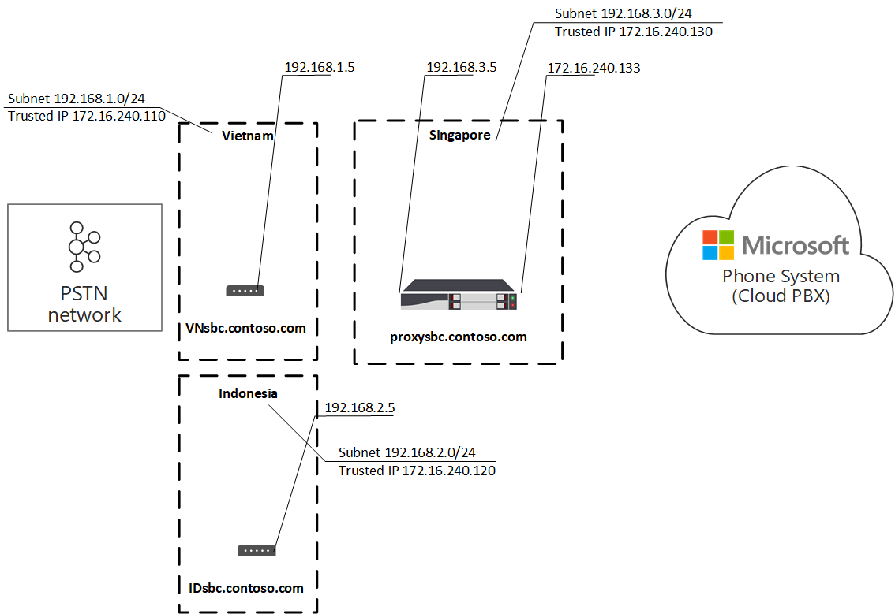
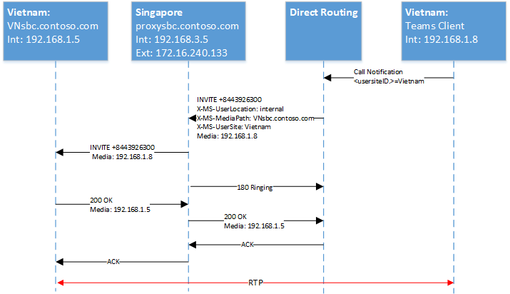

# <a name="configure-local-media-optimization-for-direct-routing"></a>Configurar a Otimização de Mídia Local para Roteamento Direto

A configuração para Otimização de Mídia Local é baseada em configurações de rede comuns a outros recursos de voz na nuvem, como roteamento Location-Based roteamento e chamadas de emergência dinâmicas. Para saber mais sobre regiões de rede, sites de rede, sub-redes de rede e endereços IP confiáveis, consulte Configurações de rede para recursos [de voz na nuvem.](cloud-voice-network-settings.md)

Antes de configurar a Otimização de Mídia Local, consulte [Otimização de mídia local para Roteamento Direto.](direct-routing-media-optimization.md)  

Para configurar a Otimização de Mídia Local, as etapas a seguir são necessárias. Você pode usar o centro de administração Teams ou o PowerShell. Para obter detalhes, consulte [Manage your network topology](manage-your-network-topology.md).

1. Configure o usuário e os sites SBC (conforme descrito neste artigo).
2. Configure os SBCs para Otimização de Mídia Local (de acordo com a especificação do fornecedor SBC).

O diagrama a seguir mostra a configuração de rede usada nos exemplos ao longo deste artigo.

> [!div class="mx-imgBorder"]
> 


## <a name="configure-the-user-and-the-sbc-sites"></a>Configurar o usuário e os sites SBC

Para configurar o usuário e os sites SBC, você precisará:

1. [Gerenciar endereços IP confiáveis externos](#manage-external-trusted-ip-addresses).  

2. [Defina a topologia de](#define-the-network-topology) rede configurando as regiões de rede, os sites de rede e as sub-redes de rede.

3. [Defina a topologia de](#define-the-virtual-network-topology) rede virtual atribuindo SBC(s) a sites(s) com modos relevantes e valores SBC de proxy.

> [!NOTE]
> A lógica de Otimização de Mídia Local depende de endereços cliente que estão sendo configurados como externos ou internos, em relação a redes corporativas com acesso a uma interface interna SBC (Controlador de Borda de Sessão) certificada pelo Roteamento Direto. O local do cliente (interno/externo) é determinado durante o processamento de cada chamada, observando o endereço usado para alcançar retransmissão de transporte.
> 
> Em cenários VPN de túnel dividido em que retransmissão podem ser alcançadas por meio do ISP, a lógica de melhor rota do cliente prefere a rota padrão da interface local (por exemplo, WiFi público). Isso faz com que a Microsoft sinalize para o SBC que o cliente é externo, mesmo que possa alcançar a interface interna do SBC de Roteamento Direto do cliente. Os clientes de Roteamento Direto usando a Otimização de Mídia Local podem ter tempos de configuração de chamadas prolongados e, em alguns casos, nenhum áudio ao receber chamadas da PSTN.
> 
> Para evitar isso, os administradores de VPN devem bloquear o acesso entre usuários vpn remotos e a interface interna do SBC de Roteamento Direto.


## <a name="configure-sbcs-for-local-media-optimization-according-to-the-sbc-vendor-specification"></a>Configurar SBC(s) para Otimização de Mídia Local de acordo com a especificação do fornecedor SBC

Este artigo descreve a configuração para componentes da Microsoft. Para obter informações sobre a configuração do SBC, consulte a documentação do fornecedor SBC. Para obter informações sobre quais fornecedores SBC suportam a Otimização de Mídia Local, consulte Controladores de Borda de Sessão [Certificados para Roteamento Direto.](direct-routing-border-controllers.md)

## <a name="manage-external-trusted-ip-addresses"></a>Gerenciar endereços IP confiáveis externos

IPs confiáveis externos são os IPs externos da Internet da rede corporativa. Esses IP são os endereços IP usados pelos clientes Microsoft Teams quando eles se conectam a Microsoft 365. Você precisa adicionar esses IPs externos para cada site onde você tem usuários usando a Otimização de Mídia Local.

Para adicionar os endereços IP públicos para cada site, use New-CsTenantTrustedIPAddress cmdlet. Você pode definir um número ilimitado de endereços IP confiáveis para um locatário. Se os IPs externos vistos Microsoft 365 endereços IPv4 e IPv6, você precisará adicionar ambos os tipos de endereços IP. Para IPv4, use a máscara 32. Para IPv6, use a máscara 128. Você pode adicionar endereços IP externos individuais e sub-redes IP externas especificando diferentes MaskBits no cmdlet.

```
New-CsTenantTrustedIPAddress -IPAddress <External IP address> -MaskBits <Subnet bitmask> -Description <description>
```


Exemplo de adição de endereços IP confiáveis.

```
New-CsTenantTrustedIPAddress -IPAddress 172.16.240.110 -MaskBits 32 -Description "Vietnam site trusted IP"
New-CsTenantTrustedIPAddress -IPAddress 172.16.240.120 -MaskBits 32 -Description "Indonesia site trusted IP"
New-CsTenantTrustedIPAddress -IPAddress 172.16.240.130 -MaskBits 32 -Description "Singapore site trusted IP"
```


## <a name="define-the-network-topology"></a>Definir a topologia de rede

Esta seção descreve como definir as regiões de rede, sites de rede e sub-redes de rede para sua topologia de rede.

Todos os parâmetros são sensíveis a minúsculas, portanto, você precisa garantir que você use o mesmo caso que foi usado durante a instalação.  (Por exemplo, os valores gatewaySiteID "Vietnã" e "vietnã" serão tratados como sites diferentes.)

### <a name="define-network-regions"></a>Definir regiões de rede

Para definir regiões de rede, use o cmdlet New-CsTenantNetworkRegion de rede. O parâmetro RegionID é um nome lógico que representa a geografia da região e não tem dependências ou restrições. O parâmetro CentralSite `<site ID>` é opcional.

```powershell
New-CsTenantNetworkRegion -NetworkRegionID <region ID>  
```

O exemplo a seguir cria uma região de rede chamada APAC:

```powershell
New-CsTenantNetworkRegion -NetworkRegionID "APAC"  
```

###  <a name="define-network-sites"></a>Definir sites de rede

Para definir sites de rede, use o cmdlet New-CsTenantNetworkSite de rede. Cada site de rede deve estar associado a uma região de rede.

```powershell
New-CsTenantNetworkSite -NetworkSiteID <site ID> -NetworkRegionID <region ID>
```

O exemplo a seguir cria três novos sites de rede, Vietnã, Indonésia e Cingapura na região do APAC:

```powershell
New-CsTenantNetworkSite -NetworkSiteID "Vietnam" -NetworkRegionID "APAC"
New-CsTenantNetworkSite -NetworkSiteID "Indonesia" -NetworkRegionID "APAC"
New-CsTenantNetworkSite -NetworkSiteID "Singapore" -NetworkRegionID "APAC"
```

### <a name="define-network-subnets"></a>Definir sub-redes de rede

Para definir sub-redes de rede e associá-las a sites de rede, use o cmdlet New-CsTenantNetworkSubnet rede. Cada sub-rede de rede só pode ser associada a um site. 

```powershell
New-CsTenantNetworkSubnet -SubnetID <Subnet IP address> -MaskBits <Subnet bitmask> -NetworkSiteID <site ID>
```

O exemplo a seguir define três sub-redes de rede e as associa aos três sites de rede: Vietnã, Indonésia e Cingapura:

```powershell
New-CsTenantNetworkSubnet -SubnetID 192.168.1.0 -MaskBits 24 -NetworkSiteID “Vietnam”
New-CsTenantNetworkSubnet -SubnetID 192.168.2.0 -MaskBits 24 -NetworkSiteID “Indonesia”
New-CsTenantNetworkSubnet -SubnetID 192.168.3.0 -MaskBits 24 -NetworkSiteID “Singapore”
```

## <a name="define-the-virtual-network-topology"></a>Definir a topologia de rede virtual 

Primeiro, o administrador de locatários cria uma nova configuração SBC para cada SBC relevante usando o cmdlet New-CsOnlinePSTNGateway.
O administrador de locatários define a topologia de rede virtual especificando os sites de rede para os objetos de gateway PSTN usando o cmdlet Set-CsOnlinePSTNGateway:

```powershell
PS C:\> Set-CsOnlinePSTNGateway -Identity <Identity> -GatewaySiteID <site ID> -MediaBypass <true/false> -BypassMode <Always/OnlyForLocalUsers> -ProxySBC  <proxy SBC FQDN or $null>
```

Observe o seguinte: 
   - Se o cliente tiver um único SBC, o parâmetro -ProxySBC deve ser um valor FQDN $null ou FQDN do SBC (SBC Central com cenário de troncos centralizados).
   - O parâmetro -MediaBypass deve ser definido como $true para dar suporte à Otimização de Mídia Local.
   - Se o SBC não tiver o parâmetro -BypassMode definido, os headers X-MS não serão enviados. 
   - Todos os parâmetros são sensíveis a minúsculas, portanto, você precisa garantir que você use o mesmo caso que foi usado durante a instalação.  (Por exemplo, os valores gatewaySiteID "Vietnã" e "vietnã" serão tratados como sites diferentes.)

O exemplo a seguir adiciona três SBCs aos sites de rede Vietnã, Indonésia e Cingapura na região do APAC com o modo Sempre ignorar:

```powershell
Set-CSOnlinePSTNGateway -Identity “proxysbc.contoso.com” -GatewaySiteID “Singapore” -MediaBypass $true -BypassMode “Always” -ProxySBC $null

Set-CSOnlinePSTNGateway -Identity “VNsbc.contoso.com” -GatewaySiteID “Vietnam” -MediaBypass $true -BypassMode “Always” -ProxySBC “proxysbc.contoso.com”

Set-CSOnlinePSTNGateway -Identity “IDsbc.contoso.com” -GatewaySiteID “Indonesia” -MediaBypass $true -BypassMode “Always” -ProxySBC “proxysbc.contoso.com”
```

> [!NOTE]
> Para garantir operações ininterruptas quando a Otimização de Mídia Local e o roteamento de Location-Based (LBR) são configurados ao mesmo tempo, os SBCs downstream devem ser habilitados para LBR definindo o parâmetro GatewaySiteLbrEnabled como $true para cada SBC downstream. (Essa configuração não é obrigatória para o SBC proxy.)

Com base nas informações acima, o Roteamento Direto incluirá três headers SIP proprietários para convites SIP e re-convites, conforme mostrado na tabela a seguir.

Os Headers X-MS introduzidos no Roteamento Direto em Convites e Re-Invites se BypassMode estiver definido:

| Nome do header | Valores | Comentários | 
|:------------|:-------|:-------|
| X-MS-UserLocation | interno/externo | Indica se o usuário é interno ou externo |
| Request-URI INVITE sip: +84439263000@VNsbc.contoso.com SIP /2.0 | SBC FQDN | O FQDN direcionado para a chamada, mesmo que o SBC não esteja diretamente conectado ao Roteamento Direto |
| X-MS-MediaPath | Exemplo: proxysbc.contoso.com, VNsbc.contoso.com | Ordem dos SBCs que devem ser usados para o caminho de mídia entre o usuário e o SBC de destino. O SBC final é sempre o último |
| X-MS-UserSite | usersiteID | Cadeia de caracteres definida pelo administrador de locatários |

## <a name="call-flows"></a>Fluxos de chamada 

O seguinte mostra fluxos de chamada para dois modos:

- [Sempre Ignorar](#always-bypass-mode)
- [Somente para usuários locais](#only-for-local-users-mode)

### <a name="always-bypass-mode"></a>Modo Sempre Ignorar

O modo Sempre Ignorar é a opção mais simples a ser configurada. O administrador de locatários pode configurar um único site para todos os usuários e SBCs se todos os SBCs puderem ser acessíveis de qualquer site.

Os exemplos mostram o modo sempre bypass para os seguintes cenários:

- [Chamadas de saída e o usuário está no mesmo local que o SBC](#outbound-calls-and-the-user-is-in-the-same-location-as-the-sbc-with-always-bypass)
- [Chamadas de entrada e o usuário está no mesmo local que o SBC](#inbound-calls-and-the-user-is-in-the-same-location-as-the-sbc-with-always-bypass)
- [Chamadas de saída e o usuário é externo](#outbound-calls-and-the-user-is-external-with-always-bypass)
- [Chamadas de entrada e o usuário é externo](#inbound-calls-and-the-user-is-external-with-always-bypass)

A tabela a seguir mostra os endereços FQDN e IP usados nos exemplos:

| FQDN | Endereço IP externo SBC | Endereço IP interno SBC | Sub-rede interna | Localização | NAT externo (IP confiável) |
|:------------|:-------|:-------|:-------|:-------|:-------|
| VNsbc.contoso.com | Nenhum | 192.168.1.5 | 192.168.1.0/24 | Vietnã | 172.16.240.110 |
| IDsbc.contoso.com | Nenhum | 192.168.2.5 | 192.168.2.0/24 | Indonésia | 172.16.240.120 |
| proxysbc.contoso.com | 172.16.240.133 | 192.168.3.5 | 192.168.3.0/24 | Singapura | 172.16.240.130 |


#### <a name="outbound-calls-and-the-user-is-in-the-same-location-as-the-sbc-with-always-bypass"></a>Chamadas de saída e o usuário está no mesmo local que o SBC com Sempre Ignorar

| Modo |    Usuário |  Localização |  Direção da chamada |
|:------------|:-------|:-------| :-------|
| AlwaysBypass |    Interno |  O mesmo site do SBC |  Saída |

A tabela a seguir mostra a configuração e a ação do usuário final:

| Local físico do usuário| O usuário faz ou recebe uma chamada para/de número | Número de telefone do usuário  | Política de Roteamento de Voz Online | Modo configurado para SBC |
|:------------|:-------|:-------|:-------|:-------|
| Vietnã | +84 4 3926 3000 | +84 4 5555 5555   | Prioridade 1: ^ \+ 84(\d {9} )$ -VNsbc.contoso.com <br> Prioridade 2: .* - proxysbc.contoso.com   | VNsbc.contoso.com – Sempre Ignorar <br> proxysbc.contoso.com – Sempre Ignorar


O diagrama a seguir mostra a escala SIP para uma chamada de saída com o modo sempre bypass e o usuário no mesmo local que o SBC.

> [!div class="mx-imgBorder"]
> 

A tabela a seguir mostra os headers X-MS enviados por Roteamento Direto:

| Parâmetro | Explicação |
|:------------|:-------|
| Convidar +8443926300@VNsbc.contoso.com | O FQDN de destino do SBC conforme definido na Política de Roteamento de Voz Online é enviado no URI de solicitação | 
| X-MS-UserLocation: interno | O campo indica que o usuário está localizado dentro da rede corporativa |
| X-MS-MediaPath: VNsbc.contoso.com |   Especifica qual SBC o cliente deve percorrer para o SBC de destino. Nesse caso, como temos Sempre Ignorar, e o cliente é interno o nome de destino enviado como o único nome no header. | 
|X-MS-UserSite: Vietnã |   O campo indicado no site em que o usuário está localizado. |


#### <a name="inbound-calls-and-the-user-is-in-the-same-location-as-the-sbc-with-always-bypass"></a>Chamadas de entrada e o usuário está no mesmo local que o SBC com Sempre Ignorar

| Modo |    Usuário |  Localização |  Direção da chamada |
|:------------|:-------|:-------|:-------|:-------|
| AlwaysBypass |    Interno | O mesmo site do SBC | Entrada |


Em uma chamada de entrada, o local do usuário é desconhecido, e o SBC deve adivinhar onde o usuário está. Se o palpite não estiver correto, será necessário um novo convite. Esse caso supõe que o usuário é interno, a mídia pode fluir diretamente e nenhuma outra ação é necessária (convite de novo).
O SBC conectado ao serviço de Roteamento Direto relata o local SBC de origem, fornecendo Record-Route e campos de contato. Com base nesses campos, o caminho de mídia é calculado pelo Roteamento Direto.

Observação: Como um usuário pode ter vários pontos de extremidade, o suporte ao 183 não é possível. O Roteamento Direto sempre usará o Toque 180 nesse caso. 

O diagrama a seguir mostra a lista SIP para chamada de entrada com o modo AlwaysBypass e o usuário está no mesmo local que o SBC.

> [!div class="mx-imgBorder"]
> 


#### <a name="outbound-calls-and-the-user-is-external-with-always-bypass"></a>Chamadas de saída e o usuário é externo com Sempre Ignorar

| Modo |    Usuário |  Site |  Direção da chamada
|:------------|:-------|:-------|:-------|
AlwaysBypass |  Externo |  N/D | Saída |


O diagrama a seguir mostra a escala SIP para uma chamada de saída com o modo AlwaysBypass e o usuário é externo:

> [!div class="mx-imgBorder"]
> 

A tabela a seguir mostra os headers X-MS enviados pelo serviço de Roteamento Direto:

| Parâmetro |   Explicação |
|:------------|:-------|
|Convidar +8443926300@VNsbc.contoso.com | O FQDN de destino do SBC conforme definido na Política de Roteamento de Voz Online é enviado no URI de solicitação.|
| X-MS-UserLocation: externo | O campo indica que o usuário está localizado fora da rede corporativa. |
| X-MS-MediaPath: proxysbc.contoso.com, VNsbc.contoso.com    | Especifica qual SBC o cliente deve percorrer para o SBC de destino. Nesse caso, como temos Sempre Ignorar, e o cliente é externo. |

#### <a name="inbound-calls-and-the-user-is-external-with-always-bypass"></a>Chamadas de entrada e o usuário é externo com Sempre Ignorar

| Modo | Usuário | Site |  Direção da chamada |
|:------------|:-------|:-------|:-------|
AlwaysBypass |  Externo |  N/D |   Entrada |

Para uma chamada de entrada, o SBC conectado ao Roteamento Direto precisa enviar um novo convite (por padrão, os candidatos de mídia local sempre são oferecidos) se o local do usuário for externo.  O X-MediaPath é calculado com base Record-Route e o usuário SBC especificado.

O diagrama a seguir mostra a escala SIP para uma chamada de entrada com o modo AlwaysBypass e o usuário é externo.

> [!div class="mx-imgBorder"]
> 


### <a name="only-for-local-users-mode"></a>Somente para o modo de usuários locais

Os candidatos de mídia local do SBC de destino serão oferecidos somente se um usuário estiver no mesmo local que o SBC. Em todos os outros casos, a mídia fluirá por meio de um IP interno ou externo do SBC proxy.

Os seguintes cenários são descritos:

- [Chamadas de saída e o usuário está no mesmo local que o SBC](#outbound-calls-and-the-user-is-in-the-same-location-as-the-sbc-with-only-for-local-users)
- [Chamadas de entrada e o usuário está no mesmo local que o SBC](#inbound-calls-and-the-user-is-in-the-same-location-as-the-sbc-with-only-for-local-users)
- [O usuário não está no mesmo local que o SBC, mas está na rede corporativa](#user-is-not-at-the-same-location-as-the-sbc-but-is-in-the-corporate-network-with-only-for-local-users)
- [Chamadas de entrada e o usuário é interno, mas não está no mesmo local que o SBC](#inbound-call-and-the-user-is-internal-but-is-not-at-the-same-location-as-the-sbc-with-only-for-local-users)

A tabela a seguir mostra a configuração e a ação do usuário final:

| Local físico do usuário |  O usuário faz ou recebe uma chamada para/de número |  Número de telefone do usuário | Política de Roteamento de Voz Online |   Modo configurado para SBC |
|:------------|:-------|:-------|:-------|:-------|
| Vietnã | +84 4 3926 3000 |  +84 4 5555 5555 | Prioridade 1: ^ \+ 84(\d {9} )$ -VNsbc.contoso.com <br> Prioridade 2: .* - proxysbc.contoso.com | VNsbc.contoso.com – OnlyForLocalUsers Proxysbc.contoso.com – Sempre Ignorar |

#### <a name="outbound-calls-and-the-user-is-in-the-same-location-as-the-sbc-with-only-for-local-users"></a>Chamadas de saída e o usuário está no mesmo local que o SBC com Somente para usuários locais

| Modo | Usuário | Site | Direção da chamada |
|:------------|:-------|:-------|:-------|
| OnlyForLocalUsers |   Interno |O mesmo que SBC   | Saída |

O diagrama a seguir mostra uma chamada de saída com o modo OnlyForLocalUsers e o usuário está no mesmo local que o SBC. Esse é o mesmo fluxo mostrado em chamadas de saída quando o usuário está no [mesmo local que o SBC](#outbound-calls-and-the-user-is-in-the-same-location-as-the-sbc-with-always-bypass).

> [!div class="mx-imgBorder"]
> 


#### <a name="inbound-calls-and-the-user-is-in-the-same-location-as-the-sbc-with-only-for-local-users"></a>Chamadas de entrada e o usuário está no mesmo local que o SBC com Somente para usuários locais

| Modo | Usuário | Site | Direção da chamada |
|:------------|:-------|:-------|:-------|
| OnlyForLocalUsers |   Interno | O mesmo que SBC | Entrada |

O diagrama a seguir mostra uma chamada de entrada com o modo OnlyForLocalUsers e o usuário está no mesmo local que o SBC. Esse é o mesmo fluxo mostrado em chamadas de entrada quando o usuário está no [mesmo local que o SBC](#inbound-calls-and-the-user-is-in-the-same-location-as-the-sbc-with-always-bypass).

> [!div class="mx-imgBorder"]
> 


#### <a name="user-is-not-at-the-same-location-as-the-sbc-but-is-in-the-corporate-network-with-only-for-local-users"></a>O usuário não está no mesmo local que o SBC, mas está na rede corporativa com Somente para usuários locais

| Modo | Usuário | Site |Direção da chamada |
|:------------|:-------|:-------|:-------|
| OnlyForLocalUsers  | Interno |   Diferente do SBC | Saída |

O roteamento direto calcula o X-MediaPath com base no local relatado do usuário e do modo configurado no SBC.


O diagrama a seguir mostra uma chamada de saída com o modo OnlyForLocalUsers e um usuário interno que não está no mesmo local que o SBC.

> [!div class="mx-imgBorder"]
> 


#### <a name="inbound-call-and-the-user-is-internal-but-is-not-at-the-same-location-as-the-sbc-with-only-for-local-users"></a>Chamada de entrada e o usuário é interno, mas não está no mesmo local que o SBC com Somente para usuários locais

| Modo |    Usuário |  Site |  Direção da chamada |
|:------------|:-------|:-------|:-------|
| OnlyForLocalUsers | Interno |    Diferente do SBC |    Entrada |

O diagrama a seguir mostra uma chamada de entrada com o modo OnlyForLocalUsers e um usuário interno que não está no mesmo local que o SBC.

> [!div class="mx-imgBorder"]
> 

