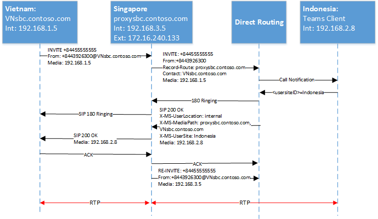

# <a name="configure-local-media-optimization-for-direct-routing"></a>Configurar a otimização de mídia local para roteamento direto

A configuração da otimização de mídia local é baseada em configurações de rede que são comuns a outros recursos de voz em nuvem, como roteamento baseado em localização e chamadas de emergência dinâmicas. Para saber mais sobre regiões de rede, sites de rede, sub-redes de rede e endereços IP confiáveis, consulte [configurações de rede para recursos de voz na nuvem](cloud-voice-network-settings.md).

Antes de configurar a otimização de mídia local, consulte [otimização de mídia local para roteamento direto](direct-routing-media-optimization.md).  

Para configurar a otimização de mídia local, as etapas a seguir são necessárias. Você pode usar o centro de administração do teams ou o PowerShell. Para obter detalhes, consulte [gerenciar a topologia de rede](manage-your-network-topology.md).

1. Configure o usuário e os sites de SBC (conforme descrito neste artigo).
2. Configurar o SBCs para otimização de mídia local (de acordo com a especificação do fornecedor do SBC).

O diagrama a seguir mostra a configuração de rede usada nos exemplos ao longo deste artigo.


## <a name="configure-the-user-and-the-sbc-sites"></a>Configurar o usuário e os sites de SBC

Para configurar o usuário e os sites de SBC, você precisará:

1. [Gerenciar endereços IP externos confiáveis](#manage-external-trusted-ip-addresses).  

2. [Defina a topologia de rede](#define-the-network-topology) configurando as regiões de rede, sites de rede e sub-redes de rede.

3. [Defina a topologia de rede virtual](#define-the-virtual-network-topology) atribuindo SBC (s) a (s) site (s) a (s) o (s) site (s) com os modos relevantes e valores


## <a name="configure-sbcs-for-local-media-optimization-according-to-the-sbc-vendor-specification"></a>Configurar o SBC (s) para otimização de mídia local de acordo com a especificação do fornecedor do SBC

Este artigo descreve a configuração dos componentes da Microsoft. Para obter informações sobre a configuração do SBC, consulte seu fornecedor de SBC documenation.

A otimização de mídia local é compatível com os seguintes fornecedores de SBC:

| Fornecedor | Produto |    Versão do software |
|:------------|:-------|:-------| :-------|
| [Audiocodes](https://www.audiocodes.com/media/13253/connecting-audiocodes-sbc-to-microsoft-teams-direct-routing-enterprise-model-configuration-note.pdf) |    Mediant 500 SBC |   7.20 a. 256 | 
|            |  Mediant 800 SBC |   7.20 a. 256 | 
|            |  Mediant 2600 SBC |  7.20 a. 256 | 
|            |  Mediant 4000 SBC |  7.20 a. 256 | 
|            |  1000B de SBC médio | 7.20 a. 256 | 
|            |  Mamédia 9000 SBC |  7.20 a. 256 | 
|            |  Representação mediana virtual da edição virtual |   7.20 a. 256 | 
|            |  Mamediat Cloud Edition SBC | 7.20 a. 256 |
| [Faixa de opções do SBC Core](https://support.sonus.net/display/ALLDOC/SBC+8.2+-+Configure+Local+Media+Optimization)  |  SBC 5110         | 8,2  |
|            |  SBC 5210         | 8,2  |
|            |  SBC 5400         | 8,2  |
|            |  SBC 7000         | 8,2  |
|            |  SBC SWe          | 8,2  |
| [Borda SBC da faixa de opções](https://support.sonus.net/display/UXDOC81/Microsoft+Teams+Direct+Routing+-+On+Premises+Deployment)  |  SBC 1000         | 8.1.1, Build 527 |
|            |  SBC 2000         | 8.1.1, Build 527 |
|            |  SBC SWe Lite     | 8.1.0, Build 222 |
| [TE-SYSTEMS](https://www.anynode.de/local_media_optimization/) |  anynode          | 4.0.1 + |


## <a name="manage-external-trusted-ip-addresses"></a>Gerenciar endereços IP externos confiáveis

Os IPs externos confiáveis são os IPs externos da Internet da rede corporativa. Estes IP são os endereços IP usados pelos clientes do Microsoft Teams quando eles se conectam ao Microsoft 365. Você precisa adicionar esses IPs externos para cada site em que você tem usuários usando a otimização de mídia local.

Para adicionar os endereços IP públicos para cada site, use o cmdlet New-CsTenantTrustedIPAddress. Você pode definir um número ilimitado de endereços IP confiáveis para um locatário. Se os IPs externos vistos pelo Microsoft 365 forem endereços IPv4 e IPv6, você precisará adicionar os dois tipos de endereços IP. Para IPv4, use máscara 32. Para IPv6, use máscara 128. Você pode adicionar endereços IP externos individuais e sub-redes externas de IP especificando diferentes MaskBits no cmdlet.

```
New-CsTenantTrustedIPAddress -IPAddress <External IP address> -MaskBits <Subnet bitmask> -Description <description>
```


Exemplo de como adicionar endereços IP confiáveis.

```
New-CsTenantTrustedIPAddress -IPAddress 172.16.240.110 -MaskBits 32 -Description "Vietnam site trusted IP"
New-CsTenantTrustedIPAddress -IPAddress 172.16.240.120 -MaskBits 32 -Description "Indonesia site trusted IP"
New-CsTenantTrustedIPAddress -IPAddress 172.16.240.130 -MaskBits 32 -Description "Singapore site trusted IP"
```


## <a name="define-the-network-topology"></a>Definir a topologia de rede

Esta seção descreve como definir as regiões de rede, sites de rede e sub-redes de rede para a sua topologia de rede.

Todos os parâmetros diferenciam maiúsculas de minúsculas, portanto, você precisa garantir que você use o mesmo caso que foi usado durante a instalação.  (Por exemplo, os valores de GatewaySiteID "Vietnã" e "Vietnã" serão tratados como sites diferentes.)

### <a name="define-network-regions"></a>Definir regiões de rede

Para definir regiões de rede, use o cmdlet New-CsTenantNetworkRegion. O parâmetro RegionID é um nome lógico que representa a geografia da região e não tem dependências ou restrições. O parâmetro <site ID> CentralSite é opcional.

```
New-CsTenantNetworkRegion -NetworkRegionID <region ID>  
```

O exemplo a seguir cria uma região de rede chamada Ásia-Pacífico:

```
New-CsTenantNetworkRegion -NetworkRegionID "APAC"  
```

###  <a name="define-network-sites"></a>Definir sites de rede

Para definir sites de rede, use o cmdlet New-CsTenantNetworkSite. Cada site de rede deve estar associado a uma região de rede.

```
New-CsTenantNetworkSite -NetworkSiteID <site ID> -NetworkRegionID <region ID>
```

O exemplo a seguir cria três novos sites de rede, Vietnã, Indonésia e Cingapura na região da Ásia/Pacífico:

```
New-CsTenantNetworkSite -NetworkSiteID "Vietnam" -NetworkRegionID "APAC"
New-CsTenantNetworkSite -NetworkSiteID "Indonesia" -NetworkRegionID "APAC"
New-CsTenantNetworkSite -NetworkSiteID "Singapore" -NetworkRegionID "APAC"
```

### <a name="define-network-subnets"></a>Definir sub-redes de rede

Para definir sub-redes de rede e associá-las a sites de rede, use o cmdlet New-CsTenantNetworkSubnet. Cada sub-rede de rede só pode ser associada a um site. 

```
New-CsTenantNetworkSubnet -SubnetID <Subnet IP address> -MaskBits <Subnet bitmask> -NetworkSiteID <site ID>
```

O exemplo a seguir define três sub-redes de rede e as associa aos três locais de rede: Vietnã, Indonésia e Cingapura:

```
New-CsTenantNetworkSubnet -SubnetID 192.168.1.0 -MaskBits 24 -NetworkSiteID “Vietnam”
New-CsTenantNetworkSubnet -SubnetID 192.168.2.0 -MaskBits 24 -NetworkSiteID “Indonesia”
New-CsTenantNetworkSubnet -SubnetID 192.168.3.0 -MaskBits 24 -NetworkSiteID “Singapore”
```

## <a name="define-the-virtual-network-topology"></a>Definir a topologia de rede virtual 

Primeiro, o administrador do locatário cria uma nova configuração do SBC para cada SBC relevante usando o cmdlet New-CsOnlinePSTNGateway.
O administrador do locatário define a topologia de rede virtual especificando os sites de rede dos objetos do gateway PSTN usando o cmdlet Set-CsOnlinePSTNGateway:

```
PS C:\> Set-CsOnlinePSTNGateway -Identity <Identity> -GatewaySiteID <site ID> -MediaBypass <true/false> -BypassMode <Always/OnlyForLocalUsers> -ProxySBC  <proxy SBC FQDN or $null>
```

Observe o seguinte: 
   - Se o cliente tiver um único SBC, o parâmetro-ProxySBC deve ser obrigatório $null ou o valor de FQDN do SBC (SBC central com o cenário de troncos centralizados).
   - O parâmetro-MediaBypass deve ser definido como $true para dar suporte à otimização de mídia local.
   - Se o SBC não tiver o parâmetro-Bypassmode definido, os cabeçalhos X-MS não serão enviados. 
   - Todos os parâmetros diferenciam maiúsculas de minúsculas, portanto você precisa garantir que você use o mesmo caso que foi usado durante a instalação.  (Por exemplo, os valores de GatewaySiteID "Vietnã" e "Vietnã" serão tratados como sites diferentes.)

O exemplo a seguir adiciona três SBCs aos locais de rede Vietnã, Indonésia e Cingapura na região da Ásia com o modo sempre ignorar:

```
Set-CSOnlinePSTNGateway -Identity “proxysbc.contoso.com” -GatewaySiteID “Singapore” -MediaBypass $true -BypassMode “Always” -ProxySBC $null

Set-CSOnlinePSTNGateway -Identity “VNsbc.contoso.com” -GatewaySiteID “Vietnam” -MediaBypass $true -BypassMode “Always” -ProxySBC “proxysbc.contoso.com”

Set-CSOnlinePSTNGateway -Identity “IDsbc.contoso.com” -GatewaySiteID “Indonesia” -MediaBypass $true -BypassMode “Always” -ProxySBC “proxysbc.contoso.com”
```

Observação: para garantir operações ininterruptas quando a otimização de mídia local e o roteamento baseado em local (LBR) estiverem configurados ao mesmo tempo, o SBCs downstream deve ser habilitado para LBR definindo o parâmetro GatewaySiteLbrEnabled para $true para cada SBC downstream. (Essa configuração não é obrigatória para o SBC do proxy.)

Com base nas informações acima, o roteamento direto incluirá três cabeçalhos SIP exclusivos para convites SIP e reconvida, conforme mostrado na tabela a seguir.

Cabeçalhos X-MS inseridos no roteamento direto em convites e convites novamente se Bypassmode for definido:

| Nome do cabeçalho | Valores | Comentários | 
|:------------|:-------|:-------|
| X-MS-userlocation | interno/externo | Indica se o usuário é interno ou externo |
| CONVITE de solicitação-URI SIP: + 84439263000@VNsbc.contoso.com SIP/2,0 | O FQDN DO SBC | O FQDN que é direcionado para a chamada mesmo se o SBC não estiver diretamente conectado ao roteamento direto |
| X-MS-MediaPath | Exemplo: proxysbc.contoso.com, VNsbc.contoso.com | Ordem do SBCs que deve ser usada para o caminho de mídia entre o usuário e o SBC de destino. O SBC final é sempre último |
| Site do X-MS-usersite | usersiteid | Cadeia de caracteres definida pelo administrador locatário |

## <a name="call-flows"></a>Fluxos de chamadas 

Veja a seguir os fluxos de chamadas para dois modos:

- [Sempre ignorar](#always-bypass-mode)
- [Somente para usuários locais](#only-for-local-users-mode)

### <a name="always-bypass-mode"></a>Modo sempre ignorar

Sempre ignorar modo é a opção mais simples de configurar. O administrador do locatário pode configurar um único site para todos os usuários e o SBCs se todos os SBCs forem acessíveis em qualquer site.

Os exemplos mostram sempre o modo ignorar para os seguintes cenários:

- [Chamadas de saída e o usuário está no mesmo local que o SBC](#outbound-calls-and-the-user-is-in-the-same-location-as-the-sbc-with-always-bypass)
- [As chamadas recebidas e o usuário estão no mesmo local que o SBC](#inbound-calls-and-the-user-is-in-the-same-location-as-the-sbc-with-always-bypass)
- [Chamadas de saída e o usuário é externo](#outbound-calls-and-the-user-is-external-with-always-bypass)
- [As chamadas recebidas e o usuário são externos](#inbound-calls-and-the-user-is-external-with-always-bypass)

A tabela a seguir mostra os endereços IP e FQDN usados nos exemplos:

| FQDN | Endereço IP externo do SBC | Endereço IP interno do SBC | Sub-rede interna | Local | NAT externo (IP confiável) |
|:------------|:-------|:-------|:-------|:-------|:-------|
| VNsbc.contoso.com | Nenhum | 192.168.1.5 | 192.168.1.0/24 | Vietnã | 172.16.240.110 |
| IDsbc.contoso.com | Nenhum | 192.168.2.5 | 192.168.2.0/24 | Indonésia | 172.16.240.120 |
| proxysbc.contoso.com | 172.16.240.133 | 192.168.3.5 | 192.168.3.0/24 | Singapura | 172.16.240.130 |


#### <a name="outbound-calls-and-the-user-is-in-the-same-location-as-the-sbc-with-always-bypass"></a>Chamadas de saída e o usuário está no mesmo local que o SBC com sempre ignorar

| Modo |    Usuário |  Local |  Direção da chamada |
|:------------|:-------|:-------| :-------|
| AlwaysBypass |    Interno |  O mesmo site que o SBC |  Saída |

A tabela a seguir mostra a ação e a configuração do usuário final:

| Localização física do usuário| O usuário faz ou recebe uma chamada de/para um número | Número de telefone do usuário  | Política de roteamento de voz online | Modo configurado para SBC |
|:------------|:-------|:-------|:-------|:-------|
| Vietnã | + 84 4 3926 3000 | + 84 4 5555 5555   | Prioridade 1: ^\+84 (\d{9}) $-VNsbc.contoso.com <br> Prioridade 2:. *-proxysbc.contoso.com   | VNsbc.contoso.com – sempre ignorar <br> proxysbc.contoso.com – sempre ignorar


O diagrama a seguir mostra a escada SIP para uma chamada de saída com o modo sempre ignorado e o usuário no mesmo local do SBC.


A tabela a seguir mostra os cabeçalhos X-MS enviados pelo roteamento direto:

| Parâmetro | Explicação |
|:------------|:-------|
| Convidar + 8443926300@VNsbc.contoso.com | O nome de destino do SBC, conforme definido na política de roteamento de voz online, é enviado no URI de solicitação | 
| X-MS-userlocation: Internal | O campo indicou que o usuário está localizado dentro da rede corporativa |
| X-MS-MediaPath: VNsbc.contoso.com |   Especifica qual SBC o cliente deve atravessar para o SBC de destino. Nesse caso, como sempre ignoramos, e o cliente é interno o nome de destino enviado como o único nome no cabeçalho. | 
|X-MS-usersite: Vietnã |   O campo indicado no site em que o usuário está localizado. |


#### <a name="inbound-calls-and-the-user-is-in-the-same-location-as-the-sbc-with-always-bypass"></a>As chamadas recebidas e o usuário estão no mesmo local que o SBC com sempre ignorar

| Modo |    Usuário |  Local |  Direção da chamada |
|:------------|:-------|:-------|:-------|:-------|
| AlwaysBypass |    Interno | O mesmo site que o SBC | Entrada |


Em uma chamada de entrada, o local do usuário é desconhecido, e o SBC deve adivinhar onde está o usuário. Se a estimativa estiver incorreta, será preciso um novo convite. Esse caso presume que o usuário seja interno, a mídia pode fluir diretamente e não são necessárias mais ações (convidar novamente).
O SBC conectado ao serviço de roteamento direto relata o local do SBC de origem fornecendo campos de rota de registro e de contato. Com base nesses campos, o caminho de mídia é calculado pelo roteamento direto.

Observação: Considerando que um usuário pode ter vários pontos de extremidade, o suporte do 183 não é possível. O roteamento direto sempre usará o 180 tocando nesse caso. 

O diagrama a seguir mostra a escada em SIP para a chamada de entrada com o modo AlwaysBypass, e o usuário está no mesmo local do SBC.


#### <a name="outbound-calls-and-the-user-is-external-with-always-bypass"></a>Chamadas de saída e o usuário é externo sempre bypass

| Modo |    Usuário |  Site |  Direção da chamada
|:------------|:-------|:-------|:-------|
AlwaysBypass |  Externo |  Não disponível | Saída |


O diagrama a seguir mostra a escada SIP para uma chamada de saída com o modo AlwaysBypass e o usuário é externo:


A tabela a seguir mostra os cabeçalhos X-MS enviados pelo serviço de roteamento direto:

| Parâmetro |   Explicação |
|:------------|:-------|
|Convidar + 8443926300@VNsbc.contoso.com | O nome de destino do SBC, conforme definido na política de roteamento de voz online, é enviado no URI de solicitação.|
| X-MS-userlocation: External | O campo indicou que o usuário está localizado fora da rede da empresa. |
| X-MS-MediaPath: proxysbc.contoso.com, VNsbc.contoso.com    | Especifica qual SBC o cliente deve atravessar para o SBC de destino. Nesse caso, como sempre ignoramos, e o cliente é externo. |

#### <a name="inbound-calls-and-the-user-is-external-with-always-bypass"></a>As chamadas recebidas e o usuário externo sempre ignoram

| Modo | Usuário | Site |  Direção da chamada |
|:------------|:-------|:-------|:-------|
AlwaysBypass |  Externo |  Não disponível |   Entrada |

Para uma chamada de entrada, o SBC conectado ao roteamento direto precisa enviar um novo convite (por padrão, os candidatos à mídia local são sempre oferecidos) se a localização do usuário for externa.  O X-MediaPath é calculado com base em rota de registro e o usuário SBC especificado.

O diagrama a seguir mostra a escada SIP para uma chamada de entrada com o modo AlwaysBypass e o usuário é externo.


### <a name="only-for-local-users-mode"></a>Somente para o modo usuários locais

Os candidatos à mídia local do SBC de destino serão oferecidos apenas se um usuário estiver no mesmo local do SBC. Em todos os outros casos, a mídia fluirá por um IP interno ou externo do SBC do proxy.

Os seguintes cenários são descritos:

- [Chamadas de saída e o usuário está no mesmo local que o SBC](#outbound-calls-and-the-user-is-in-the-same-location-as-the-sbc-with-only-for-local-users)
- [As chamadas recebidas e o usuário estão no mesmo local que o SBC](#inbound-calls-and-the-user-is-in-the-same-location-as-the-sbc-with-only-for-local-users)
- [O usuário não está no mesmo local do SBC, mas está na rede corporativa](#user-is-not-at-the-same-location-as-the-sbc-but-is-in-the-corporate-network-with-only-for-local-users)
- [Chamadas recebidas e o usuário é interno, mas não está no mesmo local que o SBC](#inbound-call-and-the-user-is-internal-but-is-not-at-the-same-location-as-the-sbc-with-only-for-local-users)

A tabela a seguir mostra a ação e a configuração do usuário final:

| Localização física do usuário |  O usuário faz ou recebe uma chamada de/para um número |  Número de telefone do usuário | Política de roteamento de voz online |   Modo configurado para SBC |
|:------------|:-------|:-------|:-------|:-------|
| Vietnã | + 84 4 3926 3000 |  + 84 4 5555 5555 | Prioridade 1: ^\+84 (\d{9}) $-VNsbc.contoso.com <br> Prioridade 2:. *-proxysbc.contoso.com | VNsbc.contoso.com – OnlyForLocalUsers Proxysbc.contoso.com – sempre ignorar |

#### <a name="outbound-calls-and-the-user-is-in-the-same-location-as-the-sbc-with-only-for-local-users"></a>Chamadas de saída e o usuário está no mesmo local que o SBC somente para usuários locais

| Modo | Usuário | Site | Direção da chamada |
|:------------|:-------|:-------|:-------|
| OnlyForLocalUsers |   Interno |Mesmo que SBC   | Saída |

O diagrama a seguir mostra uma chamada de saída com o modo OnlyForLocalUsers, e o usuário está no mesmo local que o SBC. Esse é o mesmo fluxo mostrado em [chamadas de saída quando o usuário está no mesmo local do SBC](#outbound-calls-and-the-user-is-in-the-same-location-as-the-sbc-with-always-bypass).


#### <a name="inbound-calls-and-the-user-is-in-the-same-location-as-the-sbc-with-only-for-local-users"></a>As chamadas recebidas e o usuário estão no mesmo local que o SBC somente para usuários locais

| Modo | Usuário | Site | Direção da chamada |
|:------------|:-------|:-------|:-------|
| OnlyForLocalUsers |   Interno | Mesmo que SBC | Entrada |

O diagrama a seguir mostra uma chamada de entrada com o modo OnlyForLocalUsers, e o usuário está no mesmo local do SBC. Esse é o mesmo fluxo mostrado em [chamadas de entrada quando o usuário está no mesmo local do SBC](#inbound-calls-and-the-user-is-in-the-same-location-as-the-sbc-with-always-bypass).


#### <a name="user-is-not-at-the-same-location-as-the-sbc-but-is-in-the-corporate-network-with-only-for-local-users"></a>O usuário não está no mesmo local do SBC, mas está na rede corporativa somente com usuários locais

| Modo | Usuário | Site |Direção da chamada |
|:------------|:-------|:-------|:-------|
| OnlyForLocalUsers  | Interno |   Diferente do SBC | Saída |

O roteamento direto calcula o X-MediaPath com base na localização informada do usuário e do modo configurado no SBC.


O diagrama a seguir mostra uma chamada de saída com o modo OnlyForLocalUsers e um usuário interno que não está no mesmo local do SBC.


#### <a name="inbound-call-and-the-user-is-internal-but-is-not-at-the-same-location-as-the-sbc-with-only-for-local-users"></a>A chamada de entrada e o usuário são internas, mas não estão no mesmo local que o SBC somente para usuários locais

| Modo |    Usuário |  Site |  Direção da chamada |
|:------------|:-------|:-------|:-------|
| OnlyForLocalUsers | Interno |    Diferente do SBC |    Entrada |

O diagrama a seguir mostra uma chamada de entrada com o modo OnlyForLocalUsers e um usuário interno que não está no mesmo local do SBC.




