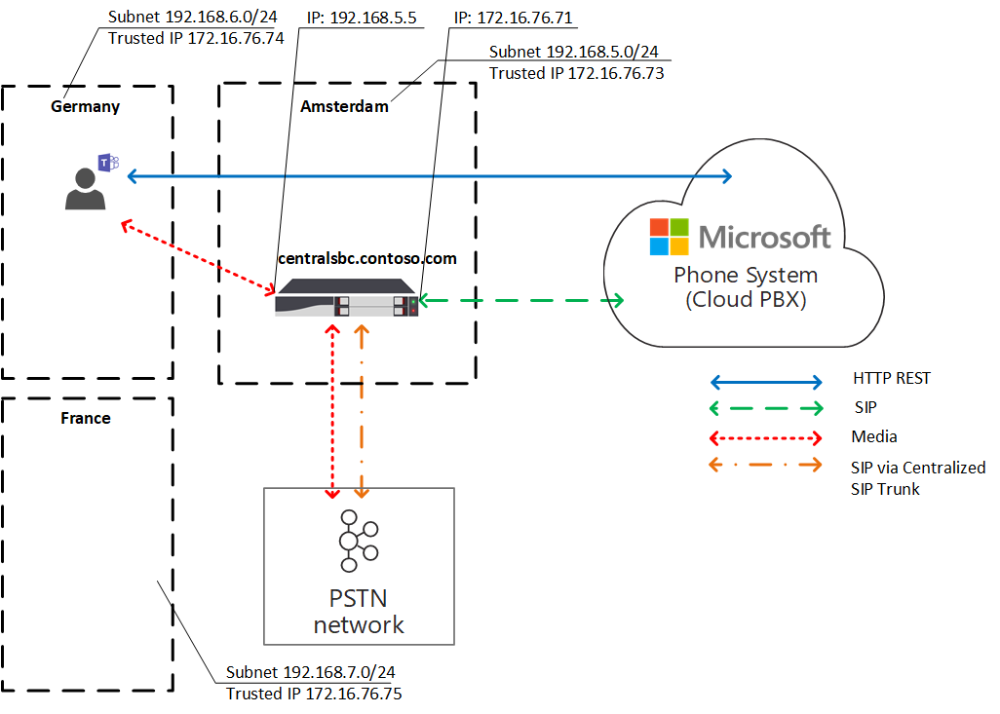

# Planejar a Otimização de Mídia Local para Roteamento Direto

A voz PSTN (Rede Telefônica Pública Comunada) é considerada um aplicativo comercialmente crítico com altas expectativas de qualidade de voz. O Roteamento Direto permite controlar os fluxos de tráfego de mídia para acomodar uma variedade de topologias de rede e configurações de telefonia local para várias empresas em todo o mundo.

A Otimização de Mídia Local para Roteamento Direto permite gerenciar a qualidade da voz:

- Controlar como o tráfego de mídia flui entre os Teams clientes e os SBCs (Controladores de Borda de Sessão) do cliente.
- Manter a mídia local dentro dos limites das sub-redes de rede corporativa.
- Permitir fluxos de mídia entre os Teams e os SBCs, mesmo que os SBCs estejam protegidos por firewalls corporativos com IPs privados e não estejam visíveis diretamente para a Microsoft.

A Otimização de Mídia Local dá suporte a dois cenários:

- Centralização de todos os troncos locais por meio de um SBC centralizado conectado ao tronco sip (Protocolo de Iniciação de Sessão) principal, fornecendo serviços de telefonia para todas as filiais locais da empresa.

- Criação de uma topologia de rede virtual de SBCs, em que os SBCs nas filiais locais estão conectados a um SBC de proxy centralizado visível e comunicando-se com o Telefone Microsoft por meio de seu endereço IP externo. Em uma topologia de rede virtual, os SBCs downstream estão se comunicando por meio de IPs internos e não são visíveis diretamente para Sistema de Telefonia.

Este artigo descreve a funcionalidade do recurso e os cenários e soluções do cliente. Para obter detalhes sobre a configuração, consulte [Configurar Otimização de Mídia Local](direct-routing-media-optimization-configure.md).

  > [!NOTE]
  > Se você quiser manter a mídia local dentro dos limites da intranet, é recomendável a Otimização de Mídia Local. Se você já tiver o Bypass de Mídia e usar apenas os endereços IP públicos de seus SBCs, não será obrigatório migrar para a Otimização de Mídia Local. Você pode continuar a usar o Bypass de Mídia. Para obter mais informações, consulte [Plan Media Bypass](direct-routing-plan-media-bypass.md).

Para obter informações sobre quais fornecedores SBC dão suporte à Otimização de Mídia Local, consulte [Controladores de Borda de Sessão certificados para roteamento direto](direct-routing-border-controllers.md).

## Cenários de clientes com suporte

Para essa discussão, suponha que a Contoso execute várias empresas em todo o mundo da seguinte maneira. (Observe que as regiões europa e APAC são usadas apenas como exemplos. Uma empresa pode ter várias regiões diferentes com requisitos semelhantes.)

- **Na Europa**, a Contoso tem escritórios em aproximadamente 30 países. Cada escritório tem seu próprio PBX (Private Branch Exchange).

  A Contoso foi oferecida a opção de centralizar os troncos em um único local – Amsterdã – para todos os 30 escritórios europeus. A Contoso implantou o SBC em Amsterdã, forneceu largura de banda suficiente para executar chamadas por meio do local centralizado, conectou um tronco SIP central ao local centralizado e começou a atender a todos os locais europeus de Amsterdã.

- **Na região APAC**, a Contoso tem vários escritórios em diferentes países.

  Em muitos países, a empresa ainda tem troncos TDM (multiplexação de divisão de tempo) em filiais locais. A centralização dos troncos TDM não é uma opção na região do APAC, portanto, não é possível alternar para SIP. Suponha que haja mais de 50 filiais da Contoso em toda a região do APAC com centenas de SBCs (gateways). Nesse cenário, não é possível emparelhar todos os gateways com a interface de Roteamento Direto devido à falta de endereços IP públicos e/ou de quebras de Internet locais. Além disso, alguns países impõem requisitos regulatórios que não podem ser atendidos sem ter conectividade de rede PSTN local.

Com base nos requisitos de negócios, a Contoso implementou duas soluções com a Otimização de Mídia Local para Roteamento Direto:

- **Na Europa**, todos os troncos são centralizados e os fluxos de mídia entre o SBC central e os usuários, com base na localização do usuário.

  - Se um usuário estiver conectado à sub-rede local de uma rede corporativa (ou seja, o usuário é interno), a mídia fluirá entre o IP interno do SBC central e o cliente Teams do usuário.

  - Se um usuário estiver fora dos limites da rede corporativa, por exemplo, se o usuário estiver usando uma conexão de Internet sem fio pública, o usuário será considerado externo. Nesse caso, a mídia flui entre o IP externo do SBC central e o Teams cliente.

- **Na região do APAC**, um SBC de proxy centralizado é emparelhado com o Roteamento Direto da Microsoft, que direciona a mídia entre a interface de Roteamento Direto e os SBCs downstream em filiais locais.

  Os SBCs downstream nas filiais locais não são diretamente visíveis para o Roteamento Direto no APAC, mas são emparelhados usando o cmdlet Set-CSOnlinePSTNGateway para criar uma topologia de rede virtual no Telefone Microsoft System. A mídia sempre permanece local quando possível. Os usuários externos têm mídia fluindo entre o Teams cliente e o IP público do SBC do proxy.

## SBC Central com troncos centralizados

Para criar uma solução em que os serviços PSTN são fornecidos a todas as filiais locais por meio de um único SBC central com um tronco SIP centralizado conectado, o administrador de locatários contoso emparelha um SBC (centralsbc.contoso.com) ao serviço; o SBC tem um tronco SIP centralizado conectado a ele.

- Quando um usuário está na rede interna da empresa, o SBC fornece o IP interno do SBC para mídia.

- Quando um usuário está fora da rede corporativa, o SBC fornece o IP externo (público) do SBC.

> [!NOTE]
> Todos os valores em exemplos, tabelas ou diagramas são apresentados apenas para fins ilustrativos.

Tabela 1. Parâmetros de rede de exemplo para SBCs

| Localização | SBC FQDN | Sub-rede interna | NAT externo (IP confiável) | Endereço IP externo SBC | Endereço IP interno do SBC |
|:------------|:-------|:-------|:-------|:-------|:-------|
| Amsterdã | centralsbc.contoso.com | 192.168.5.0/24 | 172.16.76.73 | 172.16.76.71 | 192.168.5.5 |
| Alemanha | Não implantado | 192.168.6.0/24 | 172.16.76.74 | Não implantado |  Não implantado |
| França | Não implantado | 192.168.7.0/24 | 172.16.76.75 | Não implantado |  Não implantado |

### Usuário interno

O diagrama a seguir mostra o fluxo de tráfego quando um usuário está conectado à rede corporativa na filial ou site do usuário.

No local, o usuário é atribuído à filial local na Alemanha. O usuário faz uma chamada telefônica de Roteamento Direto por meio Teams.

- O cliente Teams do usuário se comunica com o Sistema de Telefonia diretamente por meio da API REST, mas a mídia gerada durante a chamada flui para o endereço IP interno do SBC central.

- O SBC redireciona o fluxo para Sistema de Telefonia rede PSTN conectada.

- O SBC central é visível para Sistema de Telefonia somente pelo endereço IP externo.

Diagrama 1. Fluxo de tráfego quando o usuário está no site 'home' com um SBC centralizado e com um Tronco SIP centralizado conectado

### Usuário externo

O diagrama a seguir mostra o fluxo de tráfego quando um usuário não está no local e não está conectado à rede corporativa (ou seja, o dispositivo do usuário está conectado à Internet por meio de um dispositivo móvel ou Wi-Fi público). O usuário faz uma chamada telefônica de Roteamento Direto por meio Teams:

- O cliente Teams do usuário se comunica com o Sistema de Telefonia diretamente por meio da API REST, mas, nesse caso, a mídia gerada durante a chamada flui para o endereço IP externo do SBC central.

- O SBC redireciona o fluxo para Sistema de Telefonia rede PSTN conectada.

- O SBC central é visível para Sistema de Telefonia somente pelo endereço IP externo.

Nesse caso, o comportamento é semelhante se o usuário é local para a filial na Alemanha ou para qualquer outra filial. O usuário é considerado externo porque o usuário está fora dos limites da rede corporativa.

Diagrama 2. Fluxo de tráfego quando o usuário é externo com um SBC centralizado e com um tronco SIP centralizado conectado

## SBC de proxy com SBCs downstream conectados

Para criar uma solução em que os serviços PSTN são fornecidos em todas as filiais locais na região do APAC, em que a centralização dos troncos TDM não é uma opção, o administrador da Contoso emparelha um SBC (proxysbc.contoso.com), também chamado de proxy SBC, para o serviço de Roteamento Direto.

Posteriormente, o administrador da Contoso adiciona alguns SBCs downstream indicando que eles podem ser acessados por meio do proxy SBC proxysbc.contoso.com. Os SBCs downstream não têm IPs públicos, no entanto, eles podem ser atribuídos a rotas de voz. A tabela a seguir mostra exemplos de parâmetros de rede e configuração.

Quando um usuário está na filial local em que o SBC downstream está localizado, o tráfego de mídia flui diretamente entre o usuário e o SBC downstream local. Se um usuário estiver fora do escritório (em uma Internet pública), a mídia fluirá do usuário para o IP público do Proxy SBC, o que o enviará para os SBC(s) downstream relevantes.

Tabela 2. Informações de rede SBC de exemplo

| Localização | SBC FQDN | Sub-rede interna | NAT externo (IP confiável) | Endereço IP externo SBC  | Endereço IP interno do SBC |
|:------------|:-------|:-------|:-------|:-------|:-------|
| Vietnã | VNsbc.contoso.com | 192.168.1.0/24 | 172.16.240.110 | Nenhum |  192.168.1.5 |
| Indonésia  | IDsbc.contoso.com | 192.168.2.0/24 | 172.16.240.120 | Nenhum |  192.168.2.5 |
| Singapura | proxysbc.contoso.com |   192.168.3.0/24 | 172.16.240.130 | 172.16.240.133 | 192.168.3.5 |

### Usuário interno

O diagrama a seguir mostra o fluxo de tráfego de alto nível para o cenário quando um usuário está dentro do escritório na região do APAC.
O usuário, que é atribuído a uma filial local no Vietnã e está no local, faz uma chamada telefônica de Roteamento Direto por meio Teams.

- O cliente de Teams do usuário se comunica com o Sistema de Telefonia diretamente por meio da API REST, mas a mídia gerada durante a chamada flui para o endereço IP interno do SBC local.

- O SBC local redireciona o fluxo para o proxy SBC em Singapura e para a rede PSTN local conectada.

-  O SBC do proxy é visível para Sistema de Telefonia somente pelo endereço IP externo e roteia o fluxo do SBC downstream (nesse caso, o SBC local no Vietnã) para Sistema de Telefonia.

- O SBC downstream na filial local não é visível para Sistema de Telefonia diretamente, mas é mapeado na topologia de rede virtual definida pelo administrador da Contoso durante a configuração da Otimização de Mídia Local.

> [!NOTE]
> O comportamento pode ser diferente para usuários locais e usuários não locais, dependendo do modo de Otimização de Mídia Local configurado.

Para obter mais informações sobre possíveis modos e comportamento relevante, consulte Configurar Otimização de Mídia Local.

Diagrama 3. Fluxo de tráfego quando o usuário está na rede "home" com um proxy SBC e com SBCs downstream conectados

! [Diagrama novamente mostrando a Otimização de Mídia Local do fluxo de tráfego.] (media/direct-routing-media-op-3.png "Fluxo de tráfego no caso de SBC de proxy com SBCs downstream conectados quando o usuário está na rede "home" ")

### Usuário externo

O diagrama a seguir mostra o fluxo de tráfego quando um usuário está fora dos limites de rede corporativa. O usuário não está no local (não está dentro dos limites da rede corporativa). O usuário faz uma chamada telefônica de Roteamento Direto Teams para um número de telefone no Vietnã.

- O cliente Teams do usuário se comunica com o Sistema de Telefonia diretamente por meio da API REST, mas a mídia gerada durante a chamada flui primeiro para o endereço IP externo do proxy SBC em Singapura.

- Com base na configuração e nas políticas de voz (consulte Configurar Otimização de Mídia [Local](direct-routing-media-optimization-configure.md) para obter detalhes), o SBC do proxy redireciona o fluxo para o SBC downstream no Vietnã.

- O SBC downstream no Vietnã redireciona o fluxo para a rede PSTN local conectada.

- O SBC do proxy é visível Sistema de Telefonia somente pelo endereço IP externo.

-  O SBC downstream na filial local não é visível para Sistema de Telefonia diretamente, mas é mapeado na topologia de rede virtual definida pelo administrador da Contoso durante a configuração da Otimização de Mídia Local. No exemplo, o usuário é considerado externo porque o usuário está fora dos limites da rede corporativa.

Diagrama 4. Fluxo de tráfego quando o usuário é externo com um proxy SBC e com SBCs downstream conectados

## Modos de Otimização de Mídia Local

A Otimização de Mídia Local dá suporte a dois modos:

- **Modo 1: sempre ignorar**. Nesse caso, se o usuário for interno, a mídia fluirá pelo endereço IP interno do SBC downstream local, independentemente da localização real do usuário interno; por exemplo, dentro da mesma filial em que o SBC downstream está localizado ou em alguma outra filial.

- **Modo 2: somente para usuários locais**. Nesse modo, a mídia fluirá diretamente para o endereço IP interno do SBC downstream local somente quando gerado pelo usuário interno localizado na mesma filial que o SBC downstream.

Para distinguir entre modos de Otimização de Mídia Local, o administrador de locatários precisa definir o parâmetro -BypassMode como 'Always' ou 'OnlyForLocalUsers' para cada SBC usando o cmdlet Set-CSonlinePSTNGateway. Para obter mais informações, consulte [Configurar a Otimização de Mídia Local](direct-routing-media-optimization-configure.md).

> [!NOTE]
> Quando os usuários são internos, a conectividade de mídia entre o usuário e o SBC pelo endereço IP **interno é necessária**. Não há nenhum fallback para retransmissões de transporte público para mídia nesse caso, pois o SBC fornecerá um IP interno para conectividade de mídia.

### Modo 1: sempre ignorar

Se você tiver uma boa conexão entre filiais, o modo recomendado será Sempre ignorar.

Por exemplo, suponha que uma empresa tenha um tronco SIP centralizado em Amsterdã, que atende a 30 países e tem boa conectividade entre todos os 30 sites e usuários locais. Também há uma ramificação na Alemanha em que um SBC local é implantado.

O SBC na Alemanha pode ser configurado no modo "Sempre ignorar". Os usuários, independentemente de sua localização, se conectarão ao SBC diretamente por meio do endereço IP interno do SBC (por exemplo, da França para a Alemanha; consulte o diagrama abaixo para referência).

O seguinte descreve dois cenários:

- Cenário 1. O usuário está no mesmo local que o SBC definido na Política de Roteamento de Voz Online.

- Cenário 2. O usuário e os gateways estão em sites diferentes.

#### Cenário 1. O usuário está no mesmo local que o SBC definido na Política de Roteamento de Voz Online

O SBC em Amsterdã está configurado para ser um proxy SBC para um SBC downstream local na Alemanha. O usuário está na Alemanha dentro da mesma sub-rede que a rede corporativa do SBC local. Os SBCs (proxy e downstream) são configurados para o modo Sempre Ignorar. As políticas de roteamento de voz online especificam que, no caso de chamadas na Alemanha (com código de área +49), elas devem ser roteados para o SBC local na Alemanha. Todas as outras chamadas , e caso o SBC na Alemanha falhe, as chamadas na Alemanha devem ser roteados para o proxy SBC em Amsterdã. A tabela a seguir resume a configuração de exemplo.

Tabela 3. Configuração de exemplo para o Cenário 1

| Local físico do usuário | O usuário faz uma chamada para um número | Política de Roteamento de Voz Online | Modo configurado para SBC | Mídia Flow |
|:------------|:-------|:-------|:-------|:-------|
| Alemanha | +49 1 437 2800 | Prioridade 1: ^\+49(\d{8})$ -DEsbc.contoso.com Prioridade 2: .* – proxysbc.contoso.com| DEsbc.contoso.com – Sempre ignorar  proxysbc.contoso.com – Sempre ignorar | Teams usuário <–> DEsbc.contoso.com |

O diagrama a seguir mostra o fluxo de tráfego de alto nível para o usuário interno na Alemanha fazendo uma chamada telefônica de Roteamento Direto por meio Teams para o número na Alemanha.

- O cliente de Teams do usuário se comunica com Sistema de Telefonia diretamente por meio da API REST.

- A mídia gerada durante a chamada flui para o endereço IP interno do SBC local.

- O SBC local redireciona o fluxo para o proxy SBC em Amsterdã e para a rede PSTN local conectada.

- O SBC do proxy é visível para Sistema de Telefonia somente pelo endereço IP externo e roteia o fluxo do SBC downstream (nesse caso, o SBC local na Alemanha) para Sistema de Telefonia.

- O SBC downstream na filial local não é visível para Sistema de Telefonia diretamente, mas é mapeado na topologia de rede virtual definida pelo administrador da Contoso durante a configuração da Otimização de Mídia Local.

Diagrama 5.  Fluxo de tráfego com o modo "Sempre Ignorar" e o usuário está no site "home"

! [Um diagrama mostrando a Otimização de Mídia Local do fluxo de tráfego.] (mídia/direct-routing-media-op-5.png "Fluxo de tráfego com o modo "Sempre Ignorar" e o usuário está no site "página inicial")

#### Cenário 2: o usuário e os gateways estão em sites diferentes

O SBC em Amsterdã está configurado para ser um proxy SBC para um SBC downstream local na Alemanha. Os SBCs (proxy e downstream) são configurados para o modo Sempre Ignorar. O usuário interno na França, localizado na filial local, está fazendo uma chamada de Roteamento Direto para a Alemanha. As políticas de roteamento de voz online especificam que as chamadas para a Alemanha (com código de área +49) devem ser roteados para o SBC local na Alemanha. Todas as outras chamadas , e, caso o SBC na Alemanha falhe, todas as chamadas na Alemanha devem ser roteados para o proxy SBC em Amsterdã. A tabela a seguir resume a configuração de exemplo.

Tabela 4. Configuração de exemplo para o Cenário 2

| Local físico do usuário | O usuário faz uma chamada para um número | Política de Roteamento de Voz Online | Modo configurado para SBC | Mídia Flow |
|:------------|:-------|:-------|:-------|:-------|
| França | +49 1 437 2800 | Prioridade 1: ^\+49(\d{8})$ -DEsbc.contoso.com  Prioridade 2: .* – proxysbc.contoso.com |  DEsbc.contoso.com – Sempre ignorar proxysbc.contoso.com – Sempre ignorar | Teams usuário <– > DEsbc.contoso.com  |

O diagrama a seguir mostra o fluxo de tráfego de alto nível quando o usuário alemão interno localizado na França faz uma chamada telefônica de Roteamento Direto por Teams para o número na Alemanha.

- O cliente de Teams do usuário se comunica com Sistema de Telefonia diretamente por meio da API REST.

- A mídia gerada durante a chamada flui diretamente para o SBC no endereço IP interno da Alemanha.

- O SBC na Alemanha redireciona o fluxo para o proxy SBC em Amsterdã e para a rede PSTN local conectada.

Diagrama 6.  Fluxo de tráfego com o modo "Sempre Ignorar" e o usuário não está no site "home", mas na rede interna

! [Um diagrama mostra a Otimização de Mídia Local do fluxo de tráfego.] (mídia/direct-routing-media-op-6.png "Fluxo de tráfego com o modo "Sempre Ignorar" e o usuário não está no site "página inicial", mas na rede interna")

### Modo 2: somente para usuários locais

Se houver conexões incorretas entre filiais locais, mas boas conexões entre cada filial local e escritório regional, o modo recomendado será "Somente Para Usuários Locais".

Por exemplo, na região APAC, suponha que a Contoso tenha vários escritórios em países diferentes. Para muitos países, a mudança para SIP não é possível porque a empresa ainda tem troncos TDM em muitas filiais locais. A centralização dos troncos TDM não é uma opção na região do APAC. Além disso, há mais de 50 filiais da Contoso em toda a região do APAC com centenas de SBCs (gateways).

Para criar uma solução em que os serviços PSTN são fornecidos em todas as filiais locais na região do APAC, em que a centralização dos troncos TDM não é uma opção, o administrador da Contoso emparelha um SBC regional em Singapura como o proxy SBC para o serviço de Roteamento Direto. A conexão direta entre as filiais locais não é boa, mas há uma boa conexão entre cada filial local e o SBC regional em Singapura. Para o SBC regional, o administrador escolhe o modo 'Sempre Ignorar' e, para os SBCs downstream locais, o administrador escolhe o modo 'Somente para Usuários Locais'.

O seguinte descreve dois cenários:

- Cenário 1. O usuário está no mesmo local que o SBC definido na Política de Roteamento de Voz Online

- Cenário 2. O usuário e os gateways estão em sites diferentes

#### Cenário 1. O usuário está no mesmo local que o SBC definido na Política de Roteamento de Voz Online

Suponha que o SBC em Singapura esteja configurado para ser um proxy SBC para os SBCs downstream locais no Vietnã e na Indonésia. O usuário está no Vietnã no mesmo local que o SBC local. As políticas de roteamento de voz online especificam que as chamadas no Vietnã (com código de área +84) devem ser roteados para o SBC local no Vietnã. Todas as outras chamadas , e, se o SBC no Vietnã falhar, as chamadas no Vietnã devem ser roteados para o proxy SBC em Singapura. A tabela a seguir resume a configuração de exemplo.

Tabela 5. Configuração de exemplo para o modo 'Somente Para Usuários Locais' Cenário 1

| Local físico do usuário | O usuário faz uma chamada para um número | Política de Roteamento de Voz Online | Modo configurado para SBC | Mídia Flow |
|:------------|:-------|:-------|:-------|:-------|
| Vietnã | +84 4 3926 3000 | Prioridade 1: ^\+84(\d{9})$ -VNsbc.contoso.com  Prioridade 2: .* – proxysbc.contoso.com | VNsbc.contoso.com – somente para usuários locais   proxysbc.contoso.com – Sempre ignorar | Teams usuário <–> VNsbc.contoso.com |

No diagrama a seguir, um usuário atribuído à filial local no Vietnã, enquanto estiver no local, faz uma chamada telefônica de Roteamento Direto por meio Teams.

- O cliente de Teams do usuário se comunica com Sistema de Telefonia diretamente por meio da API REST.

- A mídia gerada durante a chamada flui para o endereço IP interno do SBC local.

- O SBC local redireciona o fluxo para o proxy SBC em Singapura e para a rede PSTN local conectada.

- O SBC do proxy é visível para Sistema de Telefonia somente pelo endereço IP externo e roteia o fluxo do SBC downstream (nesse caso, o SBC local no Vietnã) para Sistema de Telefonia.

- O SBC downstream na filial local não é visível Sistema de Telefonia diretamente, mas é mapeado na topologia de rede virtual.

Diagrama 7. Fluxo de tráfego com o modo "Somente Para Usuários Locais" e o usuário está no site "home"

! [Outro diagrama mostrando a Otimização de Mídia Local do fluxo de tráfego.] (mídia/direct-routing-media-op-7.png "Fluxo de tráfego com o modo "Somente para Usuários Locais" e o usuário está no site "página inicial")

#### Cenário 2. O usuário e os gateways estão em sites diferentes

Suponha que o SBC em Singapura esteja configurado para ser um proxy SBC para os SBCs downstream locais no Vietnã e na Indonésia. O usuário interno na Indonésia, localizado na filial local, está fazendo uma chamada de Roteamento Direto para o Vietnã. As políticas de roteamento de voz online especificam que as chamadas para o Vietnã (com código de área +84) devem ser roteados para o SBC local no Vietnã. Todas as outras chamadas , e, caso o SBC no Vietnã falhe, as chamadas para o Vietnã devem ser roteados para o proxy SBC em Singapura. O proxy SBC em Singapura é definido como o modo "Sempre Ignorar" e o SBC local no Vietnã é definido como o modo "Somente para Usuários Locais". A tabela a seguir resume a configuração de exemplo.

Tabela 6. Configuração do usuário

| Local físico do usuário | O usuário faz uma chamada para um número | Política de Roteamento de Voz Online | Modo configurado para SBC | Mídia Flow |
|:------------|:-------|:-------|:-------|:-------|
| Indonésia | +84 4 3926 3000 | Prioridade 1: ^\+84(\d{9})$ -VNsbc.contoso.com   Prioridade 2: .* – proxysbc.contoso.com |VNsbc.contoso.com – somente para usuários locais   proxysbc.contoso.com – Sempre ignorar | Teams usuário <–> proxysbc.contoso.com <-> VNsbc.contoso.com |

No diagrama a seguir, o usuário interno, enquanto estiver no local na filial indonésia, faz uma chamada telefônica de Roteamento Direto por meio Teams para um número no Vietnã.

- O cliente de Teams do usuário se comunica com Sistema de Telefonia diretamente por meio da API REST.

- A mídia gerada durante os fluxos de chamada para o endereço IP interno do SBC do proxy primeiro.

- O proxy SBC em Singapura redireciona o fluxo para o endereço IP interno do SBC downstream no Vietnã e para Sistema de Telefonia.

- O SBC downstream no Vietnã roteia o fluxo para a rede PSTN local conectada.

- O SBC do proxy é visível Sistema de Telefonia somente pelo endereço IP externo.

- Os SBCs downstream em filiais locais não são visíveis Sistema de Telefonia diretamente, mas são mapeados na topologia de rede virtual.

Diagrama 8.  Fluxo de tráfego com o modo "Somente Para Usuários Locais" e o usuário não está no site "página inicial", mas na rede interna

! [Outro diagrama mostra a Otimização de Mídia Local do fluxo de tráfego.] (mídia/direct-routing-media-op-8.png "Fluxo de tráfego com o modo "Somente Para Usuários Locais", o usuário não está no site "página inicial", mas na rede interna")

## Problemas conhecidos

A seguir está uma lista de problemas conhecidos que estão presentes atualmente na Otimização de Mídia Local. A Microsoft está trabalhando para resolver esses problemas.

| Problema | Solução alternativa |
| :--- | :--- |
| Teams cliente não é **identificado como interno** quando o IP público do cliente Teams corresponde à lista de IP confiáveis do cliente. | A Otimização de Mídia Local requer que Teams sub-rede do cliente corresponda a uma sub-rede de rede configurada [pelo locatário](/powershell/module/skype/new-cstenantnetworksubnet)|
| Escalonamentos de chamadas resultam em chamadas descartadas quando Teams cliente é identificado como interno.| Desabilite a Otimização de Mídia Local no SBC de Roteamento Direto.|
| Escalonamentos de chamadas de 1 a 1 chamada entre clientes internos para chamada multiparte com cliente/recurso externo resultam em chamadas descartadas | Trabalhe em andamento em uma correção. Como alternativa, desabilite a Otimização de Mídia Local no SBC de Roteamento Direto.|
| Teams usuário coloca a chamada em espera. A música é reproduzida no final do PSTN e a Otimização de Mídia Local está funcionando. O Teams usuário retoma a chamada. A chamada para PSTN é retomada, mas a Otimização de Mídia Local não está funcionando e a chamada continua por meio do SBC Central (Proxy) | Quando um usuário para uma chamada para iniciar música em espera (MoH), ela está sendo escalonada de 1:1 para uma chamada multiparte pelo Controlador de Chamada para invocar o Controlador de Mídia e o Processador de Mídia (servindo como mixer AVMCU) por meio do qual o MoH atinge um usuário que foi colocado em espera. O escalonamento para uma chamada 1:1 depois que a chamada é retomada nunca acontece de acordo com o design. Desabilite a Otimização de Mídia Local no SBC de Roteamento Direto.|
|Enquanto uma chamada está sendo estabelecida por alguns segundos, o usuário pode ouvir silêncio.| Devido à complexidade da arquitetura de Otimização de Mídia Local, isso pode ocorrer em alguns casos.|
|Os aplicativos de voz (por exemplo, Atendedor Automático, Fila de Chamadas) não funcionam.| O LMO não dá suporte a Aplicativos de Voz, pois eles residem na nuvem e exigem conectividade externa. Nenhuma solução alternativa por enquanto.|
