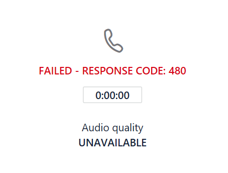

# Monitorar e solucionar problemas do Roteamento Direto

Este artigo descreve como monitorar e solucionar problemas de configuração de roteamento direto. 

A capacidade de fazer e receber chamadas usando o roteamento direto envolve os seguintes componentes: 

- Controladores de borda de sessão (SBCs) 
- Componentes de roteamento direto no Microsoft Cloud 
- Troncos de telecomunicações 

Se tiver dificuldades para solucionar problemas, você pode abrir um caso de suporte com o fornecedor do SBC ou a Microsoft. 

A Microsoft está trabalhando para fornecer mais ferramentas para solução de problemas e monitoramento. Verifique a documentação em busca de atualizações periodicamente. 

## Monitorando a disponibilidade de controladores de borda de sessão usando mensagens de opções do protocolo de início de sessão (SIP)

O roteamento direto usa as opções de SIP enviadas pelos controladores de borda da sessão para monitorar a integridade do SBC. Não há nenhuma ação necessária do administrador do locatário para habilitar o monitoramento de opções SIP. As informações coletadas são levadas em consideração quando são feitas decisões de roteamento. 

Por exemplo, se, para um usuário específico, há vários SBCs disponíveis para direcionar uma chamada, o roteamento direto considera as informações de opções SIP recebidas de cada SBC para determinar o roteamento. 

O diagrama a seguir mostra um exemplo da configuração: 

Quando um usuário faz uma chamada para número + 1 425 \<quaisquer sete dígitos>, o roteamento direto avalia a rota. Há dois SBCs na rota: sbc1.contoso.com e sbc2.contoso.com. O SBCs tem prioridade igual na rota. Antes de escolher um SBC, o mecanismo de roteamento avalia a integridade do SBCs com base em quando o SBC enviou as opções de SIP pela última vez. 

Um SBC é considerado Íntegro se as estatísticas no momento de enviar a chamada mostrarem que o SBC envia as opções a cada minuto.  

Quando uma chamada é feita, a seguinte lógica se aplica:

- O SBC foi emparelhado em 11:00 AM.  
- O SBC envia opções em 11:01 AM, 11:02 AM e assim por diante.  
- Em 11:15, um usuário faz uma chamada e o mecanismo de roteamento seleciona esse SBC. 

O roteamento direto usa as opções de intervalo regular três vezes (o intervalo regular é um minuto). Se as opções forem enviadas durante os últimos três minutos, o SBC será considerado íntegro.

Se o SBC no exemplo enviou opções em qualquer período entre 11:12 AM e 11:15 AM (o tempo em que a chamada foi feita), ele é considerado íntegro. Caso contrário, o SBC será rebaixado da rota. 

O rebaixamento significa que o SBC não será tentado primeiro. Por exemplo, temos sbc1.contoso.com e sbc2.contoso.com com prioridade igual.  

Se o sbc1.contoso.com não enviar opções de SIP em um intervalo regular conforme descrito anteriormente, ele será rebaixado. Em seguida, sbc2.contoso.com tenta fazer a chamada. Se sbc2. contoso. con não puder enviar a chamada, o sbc1.contoso.com (rebaixado) será tentado novamente antes de uma falha ser gerada. 

Se dois (ou mais) SBCs em uma rota forem considerados saudáveis e iguais, a ordem aleatória Yates será aplicada para distribuir as chamadas entre o SBCs.

## Monitorar o painel de análise de qualidade de chamada e os logs SBC 
 
Em alguns casos, especialmente durante o emparelhamento inicial, pode haver problemas relacionados à configuração incorreta do SBCs ou do serviço de roteamento direto. 

Você pode usar as seguintes ferramentas para monitorar a configuração:  
 
- Painel de Qualidade da Chamada 
- Logs SBC 

O serviço de roteamento direto tem códigos de erro muito descritivos relatados para os logs de análise de chamada ou de SBC. 

O painel de qualidade de chamada fornece informações sobre a qualidade da chamada e a confiabilidade. Para saber mais sobre como solucionar problemas usando a análise de chamadas, consulte [ativar e usar o painel de qualidade de chamada para Microsoft Teams e Skype for Business online](https://docs.microsoft.com/SkypeForBusiness/using-call-quality-in-your-organization/turning-on-and-using-call-quality-dashboard) e [usar a análise de chamadas para solucionar problemas de qualidade de chamada deficiente](https://docs.microsoft.com/SkypeForBusiness/using-call-quality-in-your-organization/use-call-analytics-to-troubleshoot-poor-call-quality). 

Em caso de falhas de chamadas, o recurso de análise de chamadas fornece códigos SIP padrão para ajudá-lo a solucionar o problema. 

No entanto, a análise de chamadas só pode ajudar quando chamadas chegam aos componentes internos de roteamento direto e falham. Em caso de problemas com emparelhamento de SBC ou problemas nos quais o SIP "INVITE" foi recusado (por exemplo, o nome do FQDN do tronco está configurado incorretamente), a análise de chamadas não ajuda. Nesse caso, consulte os logs do SBC. O roteamento direto envia uma descrição detalhada de problemas para o SBCs; esses problemas podem ser lidos nos logs SBC. 
