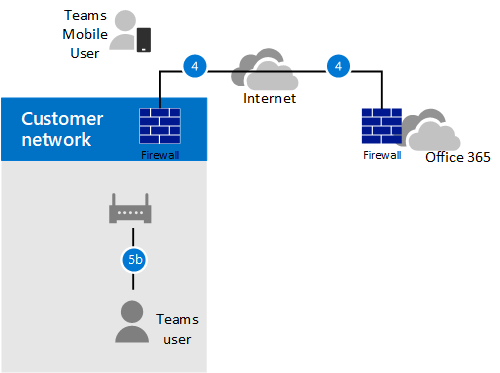
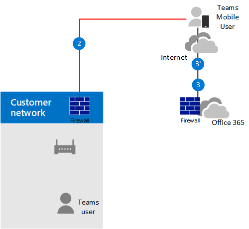

# Planejar o bypass de mídia com Roteamento Direto

## Sobre desvio de mídia com Roteamento Direto

O bypass de mídia permite reduzir o caminho do tráfego de mídia e reduzir o número de saltos em trânsito para melhorar o desempenho. Com o bypass de mídia, a mídia é mantida entre o Controlador de Borda de Sessão (SBC) e o cliente, em vez de enviá-lo por meio do Telefone Microsoft System. Para configurar o bypass de mídia, o SBC e o cliente devem estar no mesmo local ou rede.

Você pode controlar o bypass de mídia para cada SBC usando o comando **Set-CSOnlinePSTNGateway** com o parâmetro **-MediaBypass** definido como true ou false. Se você habilitar o bypass de mídia, isso não significa que todo o tráfego de mídia ficará dentro da rede corporativa. Este artigo descreve o fluxo de chamada em diferentes cenários.

Os diagramas a seguir ilustram a diferença no fluxo de chamada com e sem bypass de mídia.

Sem bypass de mídia, quando um cliente faz ou recebe uma chamada, a sinalização e o fluxo de mídia entre o SBC, o sistema Telefone Microsoft e o cliente Teams, conforme mostrado no diagrama a seguir:

> [!div class="mx-imgBorder"]
> 

Mas vamos supor que um usuário está no mesmo edifício ou rede que o SBC. Por exemplo, suponha que um usuário que está em um edifício em Frankfurt faça uma chamada para um usuário PSTN: 

- **Sem o bypass de** mídia, a mídia fluirá por Meio de Amsterdã ou Dublin (onde os datacenters da Microsoft são implantados) e de volta para o SBC em Frankfurt. 

  O datacenter na Europa é selecionado porque o SBC está na Europa e a Microsoft usa o datacenter mais próximo do SBC. Embora essa abordagem não afete a qualidade das chamada devido à otimização do fluxo de tráfego nas redes da Microsoft na maioria das regiões geográficas, o tráfego tem um loop desnecessário.     

- **Com o bypass de** mídia, a mídia é mantida diretamente entre o usuário Teams e o SBC, conforme mostrado no diagrama a seguir:

  > [!div class="mx-imgBorder"]
  > 

O bypass de mídia aproveita protocolos chamados Desodorado Interativo de Conectividade (ICE) no cliente Teams e no ICE lite no SBC. Esses protocolos permitem que o Roteamento Direto use o caminho de mídia mais direto para obter a melhor qualidade. ICE e ICE Lite são padrões WebRTC. Para obter informações detalhadas sobre esses protocolos, consulte RFC 5245.

## Planejamento de fluxo de chamada e firewall

O planejamento do fluxo de chamada e do firewall depende se o usuário tem acesso direto ao endereço IP público do SBC e se o usuário está dentro ou fora da rede.

### Fluxo de chamada se o usuário tiver acesso direto ao endereço IP público do SBC

Se o usuário tiver acesso direto ao endereço IP público do SBC, o fluxo de chamada será o seguinte:

- Para bypass de mídia, o Teams cliente deve ter acesso ao endereço IP público do SBC, mesmo de uma rede interna. Se a mídia direta não for desejada, a mídia poderá fluir por meio de Retransmissão de Transporte.

- Essa é a solução recomendada quando um usuário está no mesmo edifício e/ou rede que o SBC – remova os componentes do Microsoft Cloud do caminho de mídia.

- A sinalização sempre flui por meio da nuvem da Microsoft.

O diagrama a seguir mostra o fluxo de chamada quando o bypass de mídia está habilitado, o cliente é interno e o cliente pode alcançar o endereço IP público do SBC (mídia direta): 

- As setas e os valores numéricos dos caminhos estão de acordo com Microsoft Teams [fluxos de chamada](./microsoft-teams-online-call-flows.md).

- A sinalização SIP sempre tem caminhos 4 e 4' (dependendo da direção do tráfego). A mídia permanece local e segue o caminho 5b.

> [!div class="mx-imgBorder"]
> 

### Fluxo de chamada se o usuário não tiver acesso ao endereço IP público do SBC

O seguinte descreve o fluxo de chamada se o usuário não tiver acesso ao endereço IP público do SBC. 

Por exemplo, suponha que o usuário seja externo e o administrador do locatário decidiu não abrir o endereço IP público do SBC para todos na Internet, mas apenas para o Microsoft Cloud. Os componentes internos do tráfego podem fluir por meio do Teams Retransmissão de Transporte. Considere o seguinte:

- Teams Retransmissão de transporte são usadas.

- Para bypass de mídia, a Microsoft usa uma versão de Retransmissão de Transporte que requer a abertura de portas 50 000 a 59 999 entre retransmissão de transporte Teams e o SBC (no futuro, planejamos mover para a versão que exige portas 3478-3481).

O diagrama a seguir mostra o fluxo de chamada quando o bypass de mídia está habilitado, o cliente é externo e o cliente não pode alcançar o endereço IP público do Controlador de Borda de Sessão (a mídia é retransmitida pelo Teams Transport Relay).

- As setas e os valores numéricos dos caminhos estão de acordo com Microsoft Teams [fluxos de chamada](./microsoft-teams-online-call-flows.md).

- A mídia é repassada pelos caminhos 3, 3', 4 e 4'

> [!div class="mx-imgBorder"]
> 

### Fluxo de chamada se um usuário estiver fora da rede e tiver acesso ao IP público do SBC

> [!NOTE]
> Essa não é uma configuração recomendada porque não tira proveito de Teams Retransmissão de Transporte. Em vez disso, você deve considerar o cenário anterior em que o usuário não tem acesso ao endereço IP público do SBC. 

O diagrama a seguir mostra o fluxo de chamada quando o bypass de mídia está habilitado, o cliente é externo e o cliente pode alcançar o endereço IP público do SBC (mídia direta).

- As setas e os valores numéricos dos caminhos estão de acordo com o artigo Microsoft Teams [fluxos de](./microsoft-teams-online-call-flows.md) chamada.

- A sinalização SIP sempre tem caminhos 3 e 3' (dependendo da direção do tráfego). Fluxos de mídia usando o caminho 2.

> [!div class="mx-imgBorder"]
> 

## Uso de Processadores de Mídia e Retransmissão de Transporte

Há dois componentes no Microsoft Cloud que podem estar no caminho do tráfego de mídia: Processadores de Mídia e Retransmissão de Transporte. 

- O Processador de Mídia é um componente voltado para o público que lida com mídia em casos que não ignoram e lida com mídia para aplicativos de voz.

   Processadores de mídia estão sempre no caminho para chamadas não ignoradas pelo usuário final, mas nunca no caminho para chamadas ignoradas. Processadores de mídia estão sempre no caminho para todos os aplicativos de voz, como Estacionamento de Chamadas, Atendedor Automático Organizacionais e Filas de Chamadas.

- O Retransmissão de Transporte é usado para se conectar ao Serviço de Transporte mais próximo para enviar tráfego em tempo real.

   Retransmissão de transporte pode ou não estar no caminho para chamadas ignoradas, originadas ou destinadas a usuários finais, dependendo de onde o usuário está e como a rede está configurada .

O diagrama a seguir mostra dois fluxos de chamada – um com bypass de mídia habilitado e o segundo com bypass de mídia desabilitado.

> [!NOTE]
> O diagrama ilustra apenas o tráfego proveniente de ou destinado a usuários finais.  

- O Controlador de Mídia é um microserviço no Azure que atribui processadores de mídia e cria ofertas de Protocolo de Descrição de Sessão (SDP).

- O Proxy SIP é um componente que converte a sinalização REST HTTP usada Teams para SIP.    

> [!div class="mx-imgBorder"]
> 

A tabela a seguir resume a diferença entre Processadores de Mídia e Retransmissão de Transporte.

|    | Processadores de mídia | Retransmissão de transporte|
| :--------------|:---------------|:------------|
No caminho de mídia para chamadas não ignoradas para usuários finais | Always | Se o cliente não puder acessar diretamente o Processador de Mídia | 
No caminho da mídia para chamadas ignoradas para usuários finais | Never | Se o cliente não puder alcançar o SBC no endereço IP público | 
No caminho de mídia para aplicativos de voz | Always | Never | 
Pode fazer transcodificação (B2BUA)\* | Sim | Não, somente retransmite áudio entre pontos de extremidade | 
Número de instâncias em todo o mundo e local | 10 total: 2 nos EUA Leste e Oeste; 2 em Amsterdã e Dublin; 2 em Hong Kong e Cingapura; 2 no Japão; 2 na Austrália Leste e Sudeste | Vários

Os intervalos de IP são:
- 52.112.0.0/14 (endereços IP de 52.112.0.1 a 52.115.255.254)
- 52.120.0.0/14 (endereços IP de 52.120.0.1 a 52.123.255.254)

\* Explicação de transcodificação: 

- O Processador de Mídia é B2BUA, o que significa que ele pode alterar um codecs (por exemplo, SILK de um cliente Teams para MP e G.711 entre MP e SBC).

- Retransmissão de transporte não são B2BUA, o que significa que o codec nunca é alterado entre o cliente e o SBC , mesmo que o tráfego flua por retransmissão.

### Uso de Teams processadores de mídia se o tronco estiver configurado para bypass de mídia

Teams Processadores de mídia são sempre inseridos no caminho da mídia nos seguintes cenários:

- A chamada é escalonada de 1:1 para uma chamada de grupo
- A chamada será para um usuário federado Teams usuário
- A chamada é encaminhada ou transferida para um Skype for Business usuário

Verifique se o SBC tem acesso aos intervalos processadores de mídia e retransmissão de transporte conforme descrito abaixo.    

## Sinalização SIP: FQDNs

Para sinalização SIP, os requisitos de FQDN e firewall são os mesmos para casos não ignorados. 

O Roteamento Direto é oferecido nos seguintes Microsoft 365 ou Office 365 ambientes:
- Microsoft 365 ou Office 365
- Office 365 GCC
- Office 365 GCC Alta
- Office 365 DoD Saiba mais sobre [Office 365 e ambientes](/office365/servicedescriptions/office-365-platform-service-description/office-365-us-government/office-365-us-government) do Governo dos EUA, como GCC, GCC Alta e DoD.

### Microsoft 365, Office 365 ambientes Office 365 GCC ambientes

Os pontos de conexão para Roteamento Direto são os três FQDNs a seguir:

- **sip.pstnhub.microsoft.com** – FQDN Global – deve ser experimentado primeiro. Quando o SBC envia uma solicitação para resolver esse nome, os servidores DNS Microsoft Azure retornam um endereço IP apontando para o datacenter principal do Azure atribuído ao SBC. A atribuição é baseada em métricas de desempenho dos datacenters e proximidade geográfica com o SBC. O endereço IP retornado corresponde ao FQDN principal.

- **sip2.pstnhub.microsoft.com** – FQDN secundário – mapeia geograficamente para a região de segunda prioridade.

- **sip3.pstnhub.microsoft.com** – FQDN terciário – mapeia geograficamente para a região de terceira prioridade.

Você deve colocar esses três FQDNs para:

- Forneça uma experiência ideal (menos carregada e mais próxima do datacenter SBC atribuído consultando o primeiro FQDN).

- Forneça failover quando uma conexão de um SBC é estabelecida com um datacenter que está enfrentando um problema temporário. Para obter mais informações, consulte Mecanismo de failover abaixo.

Os FQDNs **sip.pstnhub.microsoft.com,** **sip2.pstnhub.microsoft.com** e sip3.pstnhub.microsoft.com **serão** resolvidos para endereços IP a partir das seguintes sub-redes:
- 52.112.0.0/14
- 52.120.0.0/14

Você precisa abrir portas para todos esses intervalos DE IP no firewall para permitir o tráfego de entrada e saída dos endereços para sinalização. Se o firewall for compatível com nomes DNS, o FQDN **sip-all.pstnhub.microsoft.com** resolverá todas essas sub-redes IP. 

### Office 365 GCC ambiente do DoD

O ponto de conexão para Roteamento Direto é o seguinte FQDN:

**sip.pstnhub.dod.teams.microsoft.us** – FQDN Global. Como o Office 365 do DoD existe apenas nos data centers dos EUA, não há FQDNs secundários e terciários.

O FQDN sip.pstnhub.dod.teams.microsoft.us será resolvido para um endereço IP da seguinte sub-rede:

- 52.127.64.0/21

Você precisa abrir portas para todos esses intervalos DE IP no firewall para permitir o tráfego de entrada e saída dos endereços para sinalização.  Se o firewall dá suporte a nomes DNS, o FQDN sip.pstnhub.dod.teams.microsoft.us resolvido para todas essas sub-redes IP. 

### Office 365 GCC ambiente high

O ponto de conexão para Roteamento Direto é o seguinte FQDN:

**sip.pstnhub.gov.teams.microsoft.us** – FQDN Global. Como o GCC ambiente High existe apenas nos data centers dos EUA, não há FQDNs secundários e terciários.

O FQDN sip.pstnhub.gov.teams.microsoft.us será resolvido para um endereço IP a partir da seguinte sub-rede:

- 52.127.88.0/21

Você precisa abrir portas para todos esses intervalos DE IP no firewall para permitir o tráfego de entrada e saída dos endereços para sinalização.  Se o firewall for compatível com nomes DNS, o FQDN sip.pstnhub.gov.teams.microsoft.us resolverá todas essas sub-redes IP. 

## Sinalização SIP: Portas

Os requisitos de porta são os mesmos para todos os ambientes Office 365 em que o Roteamento Direto é oferecido:
- Microsoft 365 ou Office 365
- Office 365 GCC
- Office 365 GCC Alta
- Office 365 DoD

Você deve usar as seguintes portas:

| Tráfego | De | Até | Porta de origem | Porta de destino|
| :-------- | :-------- |:-----------|:--------|:---------|
SIP/TLS| SIP Proxy | SBC | 1024 - 65535 | Definido no SBC |
| SIP/TLS | SBC | SIP Proxy | Definido no SBC | 5061 |

## Tráfego de mídia: intervalos de IP e porta

O tráfego de mídia flui entre o SBC e o cliente Teams se a conectividade direta estiver disponível ou por meio de retransmissão de transporte Teams se o cliente não puder alcançar o SBC usando o endereço IP público.

### Requisitos para tráfego de mídia direta (entre o cliente Teams e o SBC) 

O cliente deve ter acesso às portas especificadas (consulte tabela) no endereço IP público do SBC. 

> [!NOTE]
> Se o cliente estiver em uma rede interna, a mídia flui para o endereço IP público do SBC. Você pode configurar o fixamento de pelos em seu dispositivo NAT para que o tráfego nunca saia do equipamento de rede empresarial.

| Tráfego | De | Até | Porta de origem | Porta de destino|
| :-------- | :-------- |:-----------|:--------|:---------|
UDP/SRTP | Cliente | SBC | 3478-3481 e 49152 – 53247| Definido no SBC |
| UDP/SRTP | SBC | Cliente | Definido no SBC | 3478-3481 e 49152 – 53247  |

> [!NOTE]
> Se você tiver um dispositivo de rede que traduza as portas de origem do cliente, verifique se as portas traduzidas são abertas entre o equipamento de rede e o SBC. 

### Requisitos para usar retransmissão de transporte

Retransmissão de transporte estão no mesmo intervalo que processadores de mídia (para casos que não são de bypass): 

### Microsoft 365, Office 365 ambientes Office 365 GCC ambientes

- 52.112.0.0 /14 (endereços IP de 52.112.0.1 a 52.115.255.254)

### Office 365 GCC ambiente do DoD

- 52.127.64.0/21

### Office 365 GCC ambiente high

- 52.127.88.0/21

O intervalo de portas do Teams Retransmissão de Transporte (aplicável a todos os ambientes) é mostrado na tabela a seguir:

| Tráfego | De | Até | Porta de origem | Porta de destino|
| :-------- | :-------- |:-----------|:--------|:---------|
UDP/SRTP | Retransmissão de transporte | SBC | 50 000 -59 999    | Definido no SBC |
| UDP/SRTP | SBC | Retransmissão de transporte | Definido no SBC | 50 000 – 59 999, 3478-3481     |

> [!NOTE]
> A Microsoft recomenda pelo menos duas portas por chamada simultânea no SBC. Como a Microsoft tem duas versões de Retransmissão de Transporte, o seguinte é necessário:
> 
> - v4, que só pode funcionar com o intervalo de portas de 50 000 a 59 999
> 
> - v6, que funciona com as portas 3478-3481

Neste momento, o bypass de mídia só dá suporte à versão v4 de Retransmissão de Transporte. Apresentaremos o suporte do v6 no futuro. 

Você precisa abrir as portas 3478-3481 para transição. Quando a Microsoft apresentar suporte para retransmissão de transporte v6 com Bypass de Mídia, você não precisará reconfigurar seu equipamento de rede ou SBCs. 

### Requisitos para usar processadores de mídia

Processadores de mídia estão sempre no caminho de mídia para aplicativos de voz e para clientes Web (por exemplo, Teams clientes no Edge ou no Google Chrome). Os requisitos são os mesmos da configuração que não ignora.

O intervalo de IP para tráfego de mídia é 

### Office 365 e Office 365 GCC ambientes

- 52.112.0.0 /14 (endereços IP de 52.112.0.1 a 52.115.255.254)

### Office 365 GCC ambiente do DoD

- 52.127.64.0/21

### Office 365 GCC ambiente high

- 52.127.88.0/21

O intervalo de portas dos Processadores de Mídia (aplicável a todos os ambientes) é mostrado na tabela a seguir:

| Tráfego | De | Até | Porta de origem | Porta de destino|
| :-------- | :-------- |:-----------|:--------|:---------|
UDP/SRTP | Processador de Mídia | SBC | 3478-3481 e 49 152 – 53 247    | Definido no SBC |
| UDP/SRTP | SBC | Processador de Mídia | Definido no SBC | 3478-3481 e 49 152 – 53 247     |

## Configurar troncos separados para bypass de mídia e bypass sem mídia  

Se você estiver migrando para o bypass de mídia de desvio de não mídia e quiser confirmar a funcionalidade antes de migrar todo o uso para o bypass de mídia, você pode criar um tronco separado e uma política de Roteamento de Voz Online separada para rotear para o tronco de bypass de mídia e atribuir a usuários específicos. 

Etapas de configuração de alto nível:

- Identifique os usuários para testar o bypass de mídia.

- Crie dois troncos separados com FQDNs diferentes: um habilitado para bypass de mídia; o outro não. 

  Ambos os troncos apontam para o mesmo SBC. As portas para sinalização SIP TLS devem ser diferentes. As portas para mídia devem ser as mesmas.

- Crie uma nova política de Roteamento de Voz Online e atribua o tronco de bypass de mídia às rotas correspondentes associadas ao uso PSTN dessa política.

- Atribua a nova política de Roteamento de Voz Online aos usuários identificados para testar o bypass de mídia.

O exemplo a seguir ilustra essa lógica.

| Conjunto de usuários | Número de usuários | FQDN de tronco atribuído no OVRP | Bypass de mídia habilitado |
| :------------ |:----------------- |:--------------|:--------------|
Usuários com tronco de bypass que não seja de mídia | 980 | sbc1.contoso.com:5061 | false |
Usuários com tronco de bypass de mídia | 20 | sbc2.contoso.com:5060 | true | 

Ambos os troncos podem apontar para o mesmo SBC com o mesmo endereço IP público. As portas de sinalização TLS no SBC devem ser diferentes, conforme mostrado no diagrama a seguir. Observe que você precisará certificar-se de que seu certificado dá suporte a ambos os troncos. Em SAN, você precisa ter dois nomes (**sbc1.contoso.com** e **sbc2.contoso.com**) ou ter um certificado curinga.

> [!div class="mx-imgBorder"]
> 

Para obter informações sobre como configurar dois troncos no mesmo SBC, consulte a documentação fornecida pelo fornecedor SBC:

 - [Documentação de implantação de AudioCodes](https://www.audiocodes.com/solutions-products/products/products-for-microsoft-365/direct-routing-for-microsoft-teams)
- [Documentação de implantação do Oracle](https://www.oracle.com/industries/communications/enterprise-session-border-controller/microsoft.html)
- [Documentação de implantação do Ribbon Communications](https://ribboncommunications.com/solutions/enterprise-solutions/microsoft-solutions/direct-routing-microsoft-teams-calling)
- [Documentação de implantação do TE-Systems (anynode)](https://www.anynode.de/anynode-and-microsoft-teams/)

## Pontos de extremidade do cliente com suporte com bypass de mídia

O bypass de mídia é compatível com todos os clientes Teams desktop autônomos, clientes Android e iOS e Teams Telefone Dispositivos. 

Para todos os outros pontos de extremidade que não suportam bypass de mídia, converteremos a chamada em não ignorar, mesmo que ela seja iniciada como uma chamada de bypass. Isso acontece automaticamente e não exige ações do administrador. Isso inclui Skype for Business telefones 3PIP e Teams Web que suportam chamadas de Roteamento Direto (clientes baseados em WebRTC em execução no Microsoft Edge, Google Chrome, Mozilla Firefox). 
 
## Confira também

[Configurar o bypass de mídia com Roteamento Direto](direct-routing-configure-media-bypass.md)
