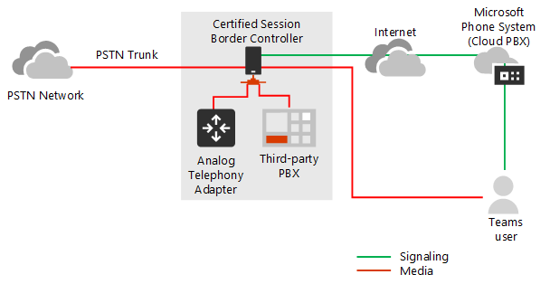

# Planejar o bypass de mídia com Roteamento Direto

## Sobre o bypass de mídia com Roteamento Direto

O bypass de mídia permite reduzir o caminho do tráfego de mídia e reduzir o número de saltos em trânsito para melhorar o desempenho. Com o bypass de mídia, a mídia é mantida entre o Controlador de Borda de Sessão (SBC) e o cliente, em vez de enviá-lo por meio do Microsoft Phone System. Para configurar o bypass de mídia, o SBC e o cliente devem estar no mesmo local ou rede.

Você pode controlar o bypass de mídia para cada SBC usando o comando **Set-CSOnlinePSTNGateway** com o parâmetro **-MediaBypass** definido como verdadeiro ou falso. Se você habilitar o bypass de mídia, isso não significa que todo o tráfego de mídia ficará dentro da rede corporativa. Este artigo descreve o fluxo de chamada em diferentes cenários.    

Os diagramas a seguir ilustram a diferença no fluxo de chamada com e sem bypass de mídia.

Sem bypass de mídia, quando um cliente faz ou recebe uma chamada, a sinalização e a mídia fluem entre o SBC, o Microsoft Phone System e o cliente teams, conforme mostrado no diagrama a seguir:

> [!div class="mx-imgBorder"]
> 

Mas vamos supor que um usuário está no mesmo edifício ou rede que o SBC. Por exemplo, suponha que um usuário que está em um prédio noTase faça uma chamada para um usuário PSTN: 

- **Sem o bypass de** mídia, a mídia fluirá por Amsterdã ou Dublin (onde os datacenters da Microsoft são implantados) e voltarão para o SBC em Dublin. 

  O datacenter na Europa é selecionado porque o SBC está na Europa e a Microsoft usa o datacenter mais próximo do SBC. Embora essa abordagem não afete a qualidade das chamada devido à otimização do fluxo de tráfego nas redes da Microsoft na maioria das regiões geográficas, o tráfego tem um loop desnecessário.     

- **Com o bypass de** mídia, a mídia é mantida diretamente entre o usuário do Teams e o SBC, conforme mostrado no diagrama a seguir:

  > [!div class="mx-imgBorder"]
  > 

O bypass de mídia aproveita protocolos chamados Desaquecimento Interativo de Conectividade (ICE) no cliente teams e ICE lite no SBC. Esses protocolos permitem que o Roteamento Direto use o caminho de mídia mais direto para obter a melhor qualidade. ICE e ICE Lite são padrões WebRTC. Para obter informações detalhadas sobre esses protocolos, consulte RFC 5245.

## Planejamento de fluxo de chamada e firewall

O planejamento do fluxo de chamada e do firewall depende se o usuário tem acesso direto ao endereço IP público do SBC e se o usuário está dentro ou fora da rede.

### Fluxo de chamada se o usuário tiver acesso direto ao endereço IP público do SBC

Se o usuário tiver acesso direto ao endereço IP público do SBC, o fluxo de chamada será o seguinte:

- Para ignorar mídia, o cliente do Teams deve ter acesso ao endereço IP público do SBC, mesmo a partir de uma rede interna. Se a mídia direta não for desejada, a mídia poderá fluir por meio de Retransmissão de Transporte.

- Essa é a solução recomendada quando um usuário está no mesmo edifício e/ou rede que o SBC – remova os componentes do Microsoft Cloud do caminho de mídia.

- A sinalização sempre flui pela nuvem da Microsoft.

O diagrama a seguir mostra o fluxo de chamada quando o bypass de mídia está habilitado, o cliente é interno e o cliente pode alcançar o endereço IP público do SBC (mídia direta): 

- As setas e os valores numéricos dos caminhos estão de acordo com os fluxos de [chamada do Microsoft Teams.](https://docs.microsoft.com/microsoftteams/microsoft-teams-online-call-flows)

- A sinalização SIP sempre leva caminhos 4 e 4' (dependendo da direção do tráfego). A mídia permanece local e segue o caminho 5b.

> [!div class="mx-imgBorder"]
> 

### Fluxo de chamada se o usuário não tiver acesso ao endereço IP público do SBC

O seguinte descreve o fluxo de chamada se o usuário não tiver acesso ao endereço IP público do SBC. 

Por exemplo, suponha que o usuário seja externo e o administrador do locatário decidiu não abrir o endereço IP público do SBC para todos na Internet, mas somente para o Microsoft Cloud. Os componentes internos do tráfego podem fluir por meio das Retransmissão de Transporte do Teams. Considere o seguinte:

- As Retransmissão de Transporte do Teams são usadas.

- Para ignorar mídia, a Microsoft usa uma versão de Retransmissão de Transporte que requer a abertura de portas de 50 000 a 59 999 entre as Retransmissão de Transporte do Teams e o SBC (no futuro planejamos mover para a versão que requer apenas 3478 e 3479 portas).

O diagrama a seguir mostra o fluxo de chamada quando o bypass de mídia está habilitado, o cliente é externo e o cliente não pode alcançar o endereço IP público do Controlador de Borda de Sessão (a mídia é retransmitida pela Retransmissão de Transporte do Teams).

- As setas e os valores numéricos dos caminhos estão de acordo com os fluxos de [chamada do Microsoft Teams.](https://docs.microsoft.com/microsoftteams/microsoft-teams-online-call-flows)

- A mídia é reeddiada por meio dos caminhos 3, 3', 4 e 4'

> [!div class="mx-imgBorder"]
> 

### Fluxo de chamada se um usuário estiver fora da rede e tiver acesso ao IP público do SBC

> [!NOTE]
> Essa não é uma configuração recomendada porque não tira proveito das Retransmissão de Transporte do Teams. Em vez disso, você deve considerar o cenário anterior em que o usuário não tem acesso ao endereço IP público do SBC. 

O diagrama a seguir mostra o fluxo de chamada quando o bypass de mídia está habilitado, o cliente é externo e o cliente pode alcançar o endereço IP público do SBC (mídia direta).

- As setas e os valores numéricos dos caminhos estão de acordo com o artigo de fluxos de chamada [do Microsoft Teams.](https://docs.microsoft.com/microsoftteams/microsoft-teams-online-call-flows)

- A sinalização SIP sempre leva caminhos 3 e 3' (dependendo da direção do tráfego). A mídia flui usando o caminho 2.

> [!div class="mx-imgBorder"]
> 

## Uso de Processadores de Mídia e Retransmissão de Transporte

Há dois componentes no Microsoft Cloud que podem estar no caminho do tráfego de mídia: Processadores de Mídia e Retransmissão de Transporte. 

- O Processador de Mídia é um componente voltado para o público que lida com mídia em casos que não ignoram e lida com mídia para aplicativos de voz.

   Os Processadores de Mídia estão sempre no caminho para chamadas não ignoradas pelo usuário final, mas nunca no caminho para chamadas ignoradas. Os Processadores de Mídia estão sempre no caminho para todos os aplicativos de voz, como Call Park, Organizational Auto Attendant e Filas de Chamadas.

- A Retransmissão de Transporte é usada para se conectar ao Serviço de Transporte mais próximo para enviar tráfego em tempo real.

   As Retransmissão de Transporte podem ou não estar no caminho para chamadas ignoradas, provenientes ou destinadas a usuários finais, dependendo de onde o usuário está e de como a rede está configurada.

O diagrama a seguir mostra dois fluxos de chamada: um com bypass de mídia habilitado e o segundo com bypass de mídia desabilitado. Observe que o diagrama apenas ilustra o tráfego proveniente de usuários finais ou destinados a.  
- O Controlador de Mídia é um microservidor do Azure que atribui processadores de mídia e cria ofertas SDP (Session Description Protocol).

- O Proxy SIP é um componente que converte a sinalização HTTP REST usada no Teams para SIP.    

> [!div class="mx-imgBorder"]
> 

A tabela a seguir resume a diferença entre Processadores de Mídia e Retransmissão de Transporte.

|    | Processadores de Mídia | Retransmissão de Transporte|
| :--------------|:---------------|:------------|
No caminho de mídia para chamadas não ignoradas para usuários finais | Sempre | Nunca | 
No caminho da mídia para chamadas ignoradas para usuários finais | Nunca | Se o cliente não conseguir alcançar o SBC no endereço IP público | 
No caminho de mídia para aplicativos de voz | Sempre | Nunca | 
Pode fazer transcodificação (B2BUA)\* | Sim | Não, apenas retransmiti áudio entre pontos de extremidade | 
Número de instâncias em todo o mundo e localização | 10 total: 2 no Leste e no Oeste dos EUA; 2 em Amsterdã e Dublin; 2 em Hong Kong e Cingapura; 2 no Japão; 2 na Austrália Leste e Sudeste | Vários

Os intervalos de IP são:
- 52.112.0.0/14 (endereços IP de 52.112.0.1 a 52.115.255.254)
- 52.120.0.0/14 (endereços IP de 52.120.0.1 a 52.123.255.254)

\* Explicação de transcodificação: 

- O processador de mídia é B2BUA, o que significa que ele pode alterar um codecs (por exemplo, SILK do cliente Teams para MP e G.711 entre MP e SBC).

- As Retransmissão de Transporte não são B2BUA, o que significa que o codec nunca é alterado entre o cliente e o SBC, mesmo que o tráfego flua por retransmissão.

### Uso dos Processadores de Mídia do Teams se o tronco estiver configurado para bypass de mídia

Os Processadores de Mídia do Teams sempre são inseridos no caminho de mídia nos seguintes cenários:

- A chamada é escalonada de 1:1 para uma chamada em grupo
- A chamada será para um usuário federado do Teams
- A chamada é encaminhada ou transferida para um usuário do Skype for Business

Verifique se o SBC tem acesso aos intervalos de Processadores de Mídia e Retransmissão de Transporte conforme descrito abaixo.    

## Sinalização SIP: FQDNs

Para a sinalização SIP, os requisitos de FQDN e firewall são os mesmos para casos não ignorados. 

O Roteamento Direto é oferecido nos seguintes ambientes do Microsoft 365 ou office 365:
- Microsoft 365 ou Office 365
- Cc do Office 365
- Office 365 GCC High
- Office 365 DoD Saiba mais sobre ambientes do [Office 365](https://docs.microsoft.com/office365/servicedescriptions/office-365-platform-service-description/office-365-us-government/office-365-us-government) e do Governo dos EUA, como GCC, GCC High e DoD.

### Ambientes do Microsoft 365, Office 365 e Office 365 GCC

Os pontos de conexão para Roteamento Direto são os três FQDNs a seguir:

- **sip.pstnhub.microsoft.com** – FQDN Global – deve ser tentado primeiro. Quando o SBC envia uma solicitação para resolver esse nome, os servidores DNS do Microsoft Azure retornam um endereço IP apontando para o datacenter principal do Azure atribuído ao SBC. A atribuição se baseia nas métricas de desempenho dos datacenters e da proximidade geográfica do SBC. O endereço IP retornado corresponde ao FQDN principal.

- **sip2.pstnhub.microsoft.com** – FQDN Secundário – mapeia geograficamente a região de segunda prioridade.

- **sip3.pstnhub.microsoft.com** – FQDN terciário – mapeia geograficamente a região de terceira prioridade.

Você deve colocar esses três FQDNs para:

- Forneça uma experiência ideal (menos carregada e mais próxima do datacenter SBC atribuído consultando o primeiro FQDN).

- Forneça failover quando uma conexão de um SBC é estabelecida com um datacenter que está enfrentando um problema temporário. Para obter mais informações, consulte o mecanismo failover abaixo.

Os FQDNs **sip.pstnhub.microsoft.com,** **sip2.pstnhub.microsoft.com** e **sip3.pstnhub.microsoft.com** serão resolvidos para um dos seguintes endereços IP:
- 52.114.148.0
- 52.114.132.46
- 52.114.16.74
- 52.114.20.29
- 52.114.75.24
- 52.114.76.76
- 52.114.7.24
- 52.114.14.70

Você precisa abrir portas para todos esses endereços IP no firewall para permitir o tráfego de entrada e saída de e para os endereços para sinalização. Se o firewall for compatível com  nomes DNS, a sip-all.pstnhub.microsoft.com FQDN será resolvida para todos esses endereços IP. 

### Ambiente de DoD GCC do Office 365

O ponto de conexão do Roteamento Direto é o seguinte FQDN:

**sip.pstnhub.dod.teams.microsoft.us** – FQDN global. Como o ambiente do Office 365 DoD existe apenas nos data centers dos EUA, não há FQDNs secundários e terciários.

Os FQDNs – sip.pstnhub.dod.teams.microsoft.us serão resolvidos para um dos seguintes endereços IP:

- 52.127.64.33
- 52.127.68.34

Você precisa abrir portas para todos esses endereços IP no firewall para permitir o tráfego de entrada e saída de e para os endereços para sinalização.  Se o firewall for compatível com nomes DNS, o FQDN sip.pstnhub.dod.teams.microsoft.us resolverá todos esses endereços IP. 

### Ambiente do Office 365 GCC High

O ponto de conexão do Roteamento Direto é o seguinte FQDN:

**sip.pstnhub.gov.teams.microsoft.us** – FQDN global. Como o ambiente GCC High existe apenas nos data centers dos EUA, não há FQDNs secundários e terciários.

Os FQDNs – sip.pstnhub.gov.teams.microsoft.us serão resolvidos para um dos seguintes endereços IP:

- 52.127.88.59
- 52.127.92.64

Você precisa abrir portas para todos esses endereços IP no firewall para permitir o tráfego de entrada e saída de e para os endereços para sinalização.  Se o firewall for compatível com nomes DNS, o FQDN sip.pstnhub.gov.teams.microsoft.us resolverá para todos esses endereços IP. 

## Sinalização SIP: Portas

Os requisitos de portabilidade são os mesmos para todos os ambientes do Office 365 em que o Roteamento Direto é oferecido:
- Microsoft 365 ou Office 365
- Cc do Office 365
- Office 365 GCC High
- Office 365 DoD

Você deve usar as seguintes portas:

| Tráfego | De | Até | Porta de origem | Porta de destino|
| :-------- | :-------- |:-----------|:--------|:---------|
SIP/TLS| SIP Proxy | Sbc | 1024 - 65535 | Definido no SBC |
| SIP/TLS | Sbc | SIP Proxy | Definido no SBC | 5061 |

## Tráfego de mídia: intervalos de IP e Porta

O tráfego de mídia fluirá entre o cliente SBC e o cliente do Teams se a conectividade direta estiver disponível ou por meio de Retransmissão de Transporte do Teams se o cliente não puder alcançar o SBC usando o endereço IP público.

### Requisitos para tráfego direto de mídia (entre o cliente do Teams e o SBC) 

O cliente deve ter acesso às portas especificadas (ver tabela) no endereço IP público do SBC. 

Observação: se o cliente estiver em uma rede interna, a mídia fluirá para o endereço IP público do SBC. Você pode configurar o fixamento de pelos em seu dispositivo NAT para que o tráfego nunca deixe o equipamento de rede corporativa.

| Tráfego | De | Até | Porta de origem | Porta de destino|
| :-------- | :-------- |:-----------|:--------|:---------|
UDP/SRTP | Cliente | Sbc | 50 000 – 50 019  | Definido no SBC |
| UDP/SRTP | Sbc | Cliente | Definido no SBC | 50 000 – 50 019  |

> [!NOTE]
> Se você tiver um dispositivo de rede que traduz as portas de origem do cliente, verifique se as portas traduzidas estão abertas entre o equipamento de rede e o SBC. 

### Requisitos para usar retransmissão de transporte

As Retransmissão de Transporte estão no mesmo intervalo que os Processadores de Mídia (para casos não ignorados): 

### Ambientes do Microsoft 365, Office 365 e Office 365 GCC

- 52.112.0.0 /14 (endereços IP de 52.112.0.1 a 52.115.255.254)

## Ambiente de DoD GCC do Office 365

- 52.127.64.0/21

### Ambiente do Office 365 GCC High

- 52.127.88.0/21

O intervalo de portas das Retransmissão de Transporte do Teams (aplicável a todos os ambientes) é mostrado na tabela a seguir:

| Tráfego | De | Até | Porta de origem | Porta de destino|
| :-------- | :-------- |:-----------|:--------|:---------|
UDP/SRTP | Retransmissão de Transporte | Sbc | 50 000 -59 999    | Definido no SBC |
| UDP/SRTP | Sbc | Retransmissão de Transporte | Definido no SBC | 50 000 – 59 999, 3478, 3479     |

> [!NOTE]
> A Microsoft recomenda pelo menos duas portas por chamada simultânea no SBC. Como a Microsoft tem duas versões de Retransmissão de Transporte, os seguintes são necessários:
> 
> - v4, que só pode funcionar com o intervalo de portas de 50 000 a 59 999
> 
> - v6, que funciona com as portas 3478, 3479

No momento, o bypass de mídia só dá suporte à versão v4 das Retransmissão de Transporte. Apresentaremos o suporte do v6 no futuro. 

Você precisa abrir as portas 3478 e 3479 para transição. Quando a Microsoft introduz suporte para retransmissão de transporte v6 com Bypass de Mídia, você não precisará reconfigurar seu equipamento de rede ou SBCs. 

### Requisitos para usar processadores de mídia

Os Processadores de Mídia estão sempre no caminho de mídia para aplicativos de voz e para clientes Web (por exemplo, clientes do Teams no Edge ou no Google Chrome). Os requisitos são os mesmos para configurações que não ignoram.

O intervalo IP para tráfego de mídia é 

### Ambientes do Office 365 e do Office 365 GCC

- 52.112.0.0 /14 (endereços IP de 52.112.0.1 a 52.115.255.254)

## Ambiente de DoD GCC do Office 365

- 52.127.64.0/21

### Ambiente do Office 365 GCC High

- 52.127.88.0/21

O intervalo de portas dos Processadores de Mídia (aplicável a todos os ambientes) é mostrado na tabela a seguir:

| Tráfego | De | Até | Porta de origem | Porta de destino|
| :-------- | :-------- |:-----------|:--------|:---------|
UDP/SRTP | Processador de Mídia | Sbc | 3478, 3479 e 49 152 – 53 247    | Definido no SBC |
| UDP/SRTP | Sbc | Processador de Mídia | Definido no SBC | 3478, 3479 e 49 152 – 53 247     |

## Configurar troncos separados para bypass de mídia e bypass sem mídia  

Se estiver migrando para o bypass de mídia de bypass que não seja mídia e quiser confirmar a funcionalidade antes de migrar todo o uso para bypass de mídia, você pode criar um tronco separado e separar a política de Roteamento de Voz Online para rotear para o tronco de bypass de mídia e atribuir a usuários específicos. 

Etapas de configuração de alto nível:

- Identifique os usuários para testar o bypass de mídia.

- Crie dois troncos separados com FQDNs diferentes: um habilitado para bypass de mídia; o outro não. 

  Ambos os troncos apontam para o mesmo SBC. As portas para sinalização SIP TLS devem ser diferentes. As portas para mídia devem ser as mesmas.

- Crie uma nova política de Roteamento de Voz Online e atribua o tronco de bypass de mídia às rotas correspondentes associadas ao uso de PSTN para essa política.

- Atribua a nova política de Roteamento de Voz Online aos usuários que você identificou para testar o bypass de mídia.

O exemplo a seguir ilustra essa lógica.

| Conjunto de usuários | Número de usuários | FQDN do tronco atribuído no OVRP | Ignorar mídia habilitado |
| :------------ |:----------------- |:--------------|:--------------|
Usuários com tronco de bypass que não seja mídia | 980 | sbc1.contoso.com:5060 | Verdade
Usuários com tronco de bypass de mídia | 20 | sbc2.contoso.com:5061 | False | 

Ambos os troncos podem apontar para o mesmo SBC com o mesmo endereço IP público. As portas de sinalização TLS no SBC devem ser diferentes, conforme mostrado no diagrama a seguir. Observe que você precisará garantir que seu certificado seja compatível com ambos os troncos. Em SAN, você precisa ter dois nomes (**sbc1.contoso.com** e **sbc2.contoso.com**) ou ter um certificado curinga.

> [!div class="mx-imgBorder"]
> 

Para obter informações sobre como configurar dois troncos no mesmo SBC, consulte a documentação fornecida pelo fornecedor do SBC:

 - [Documentação de implantação de AudioCodes](https://www.audiocodes.com/solutions-products/products/products-for-microsoft-365/direct-routing-for-microsoft-teams)
- [Documentação de implantação oracle](https://www.oracle.com/industries/communications/enterprise-session-border-controller/microsoft.html)
- [Documentação de implantação de Comunicações da Faixa de Opções](https://ribboncommunications.com/solutions/enterprise-solutions/microsoft-solutions/direct-routing-microsoft-teams-calling)
- [Documentação de implantação do TE-Systems (qualquernode)](https://www.anynode.de/anynode-and-microsoft-teams/)

## Pontos de extremidade do cliente com suporte com bypass de mídia

O bypass de mídia é compatível com todos os clientes autônomos da área de trabalho do Teams, clientes Android e iOS e dispositivos de telefone do Teams. 

Para todos os outros pontos de extremidade que não suportam bypass de mídia, converteremos a chamada em não ignorar, mesmo que ela seja iniciada como uma chamada de bypass. Isso acontece automaticamente e não requer ações do administrador. Isso inclui telefones Skype for Business 3PIP e Clientes Web do Teams que são compatíveis com chamadas de Roteamento Direto (clientes baseados na WebRTC que executam no Microsoft Edge, Google Chrome, Mozilla Firefox). 
 
## Confira também

[Configurar o bypass de mídia com Roteamento Direto](direct-routing-configure-media-bypass.md)

