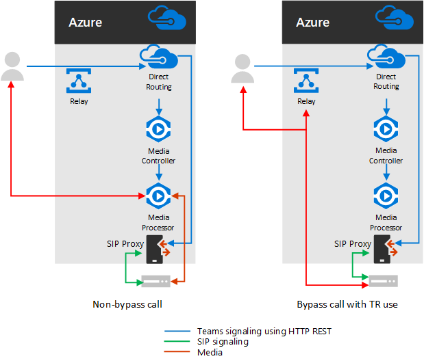

# Planejar o bypass de mídia com Roteamento Direto

## Sobre o bypass de mídia com roteamento direto

O bypass de mídia permite reduzir o caminho do tráfego de mídia e reduzir o número de saltos em trânsito para melhorar o desempenho. Com o bypass de mídia, a mídia é mantida entre o controlador de borda de sessão (SBC) e o cliente, em vez de enviá-lo por meio do sistema telefônico da Microsoft. Para configurar o bypass de mídia, o SBC e o cliente devem estar no mesmo local ou na rede.

Você pode controlar o bypass de mídia para cada SBC usando o comando **set-CSOnlinePSTNGateway** com o parâmetro **-MediaBypass** definido como true ou false. Se você habilitar o bypass de mídia, isso não significa que todo o tráfego de mídia permaneça dentro da rede corporativa. Este artigo descreve o fluxo de chamadas em diferentes cenários.    

Os diagramas a seguir ilustram a diferença no fluxo de chamadas com e sem bypass de mídia.

Sem bypass de mídia, quando um cliente faz ou recebe uma chamada, tanto a sinalização quanto o fluxo de mídia entre o SBC, o sistema telefônico da Microsoft e o cliente da equipe, conforme mostrado no diagrama a seguir:

Mas vamos pressupor que um usuário esteja no mesmo prédio ou na mesma rede do SBC. Por exemplo, suponha que um usuário que está em um edifício em Frankfurt faça uma chamada para um usuário PSTN: 

- **Sem bypass de mídia**, a mídia fluirá via Amsterdã ou Dublin (em que o Microsoft datacenters será implantado) e voltará para o SBC em Frankfurt. 

  O datacenter na Europa está selecionado porque o SBC está na Europa e a Microsoft usa o datacenter mais próximo do SBC. Embora essa abordagem não afete a qualidade da chamada devido à otimização do fluxo de tráfego nas redes Microsoft na maioria dos países, o tráfego tem um loop desnecessário.     

- **Com o bypass de mídia**, a mídia é mantida diretamente entre o usuário do Teams e o SBC, conforme mostrado no diagrama a seguir:

O bypass de mídia aproveita protocolos chamados de ICE (estabelecimento de conectividade interativa) no cliente de equipes e ICE Lite no SBC. Esses protocolos permitem o roteamento direto usar o caminho de mídia mais direto para obter a melhor qualidade. ICE e ICE Lite são padrões de WebRTC. Para obter informações detalhadas sobre esses protocolos, consulte RFC 5245.

## Fluxo de chamadas e planejamento de firewall

O fluxo de chamadas e o planejamento de firewalls dependem se o usuário tem acesso direto ao endereço IP público do SBC e se o usuário está dentro ou fora da rede.

### Fluxo de chamadas se o usuário tiver acesso direto ao endereço IP público do SBC

Se o usuário tiver acesso direto ao endereço IP público do SBC, o fluxo de chamadas será o seguinte:

- Para bypass de mídia, o cliente de equipes deve ter acesso ao endereço IP público do SBC mesmo a partir de uma rede interna. Se a mídia direta não for desejada, a mídia poderá fluir por retransmissões de transporte.

- Esta é a solução recomendada quando um usuário está no mesmo prédio e/ou rede do SBC – remover componentes de nuvem da Microsoft do caminho de mídia.

- A sinalização sempre flui via nuvem da Microsoft.

O diagrama a seguir mostra o fluxo de chamadas quando o bypass de mídia está habilitado, o cliente é interno e o cliente pode alcançar o endereço IP público do SBC (mídia direta): 

- As setas e os valores numéricos dos caminhos estão de acordo com o artigo [Microsoft Teams Call flui](https://docs.microsoft.com/microsoftteams/microsoft-teams-online-call-flows) .

- O sinal SIP sempre usa os caminhos 4 e 4 (dependendo da direção do tráfego). A mídia permanece local e usa o caminho 5b.

### Fluxo de chamadas se o usuário não tiver acesso ao endereço IP público do SBC

O procedimento a seguir descreve o fluxo de chamadas se o usuário não tiver acesso ao endereço IP público do SBC. 

Por exemplo, suponha que o usuário seja externo, e o administrador de locatários decidiu não abrir o endereço IP público do SBC para todos na Internet, mas somente para a nuvem da Microsoft. Os componentes internos do tráfego podem fluir pelas retransmissões de transporte de equipe. Esta é a configuração recomendada para usuários fora da rede corporativa. Considere o seguinte:

- As retransmissões de transporte de equipes são usadas.

- Para bypass de mídia, a Microsoft usa uma versão de retransmissões de transporte que requer as portas de abertura 50 000 a 59 999 entre as retransmissões de transporte de equipes e o SBC (no futuro, planejamos mudar para a versão que requer apenas as portas 3478 e 3479).

- Para fins de otimização de mídia, a Microsoft recomenda abrir o endereço IP público do SBC somente para retransmissões de transporte de equipe. Para clientes fora da rede corporativa, a Microsoft recomenda usar retransmissões de transporte em vez de acessar o endereço IP público do SBC diretamente.

O diagrama a seguir mostra o fluxo de chamadas quando o bypass de mídia está habilitado, o cliente é externo, e o cliente não pode alcançar o endereço IP público do controlador de borda de sessão (a mídia é retransmitida pela retransmissão de transporte do Teams).

- As setas e os valores numéricos dos caminhos estão de acordo com o artigo [Microsoft Teams Call flui](https://docs.microsoft.com/microsoftteams/microsoft-teams-online-call-flows) .

- A mídia é retransmitida pelos caminhos 3, 3 ', 4 e 4 '

### Fluxo de chamadas se um usuário estiver fora da rede e tiver acesso ao IP público do SBC

> [!NOTE]
> Essa não é uma configuração recomendada porque não aproveita as retransmissões de transporte de equipes. Em vez disso, considere o cenário anterior em que o usuário não tem acesso ao endereço IP público do SBC. 

O diagrama a seguir mostra o fluxo de chamadas quando o bypass de mídia está habilitado, o cliente é externo e o cliente pode alcançar o endereço IP público do SBC (Direct Media).

- As setas e os valores numéricos dos caminhos estão de acordo com o artigo [Microsoft Teams Call flui](https://docs.microsoft.com/microsoftteams/microsoft-teams-online-call-flows) .

- O sinal SIP sempre usa os caminhos 3 e 3 ' (dependendo da direção do tráfego). Fluxos de mídia usando o caminho 2.

## Uso de processadores de mídia e retransmissões de transporte

Há dois componentes na nuvem da Microsoft que podem estar no caminho do tráfego de mídia: processadores de mídia e retransmissões de transporte. 

- O processador de mídia é um componente voltado para o público que manipula mídia em casos não bypass e manipula mídia para aplicativos de voz.

   Processadores de mídia estão sempre no caminho para chamadas não ignoradas pelo usuário final, mas nunca no caminho para chamadas ignoradas. Processadores de mídia estão sempre no caminho para todos os aplicativos de voz, como parque de chamadas, atendedor automático organizacional e filas de chamadas.

- A retransmissão de transporte é usada para se conectar ao serviço de transporte mais próximo para enviar tráfego em tempo real.

   As retransmissões de transporte podem ou não estar no caminho para chamadas ignoradas – originadas de ou destinados a usuários finais, dependendo de onde o usuário está e como a rede está configurada.

O diagrama a seguir mostra dois fluxos de chamadas – um com bypass de mídia habilitado e o segundo com bypass de mídia desabilitado. Observação o diagrama só ilustra o tráfego originário de--ou de usuários destinados para usuários finais.  
- O controlador de mídia é um microserviço no Azure que atribui processadores de mídia e cria ofertas de protocolo de descrição de sessão (SDP).

- O proxy SIP é um componente que traduz a sinalização REST HTTP usada no Teams para SIP.    

A tabela a seguir resume a diferença entre processadores de mídia e retransmissões de transporte.

|    | Processadores de mídia | Retransmissões de transporte|
| :--------------|:---------------|:------------|
Em caminho de mídia para chamadas não ignoradas para usuários finais | Ativa | Não | 
Em caminho de mídia para chamadas ignoradas para usuários finais | Não | Se o cliente não puder alcançar o SBC no endereço IP público | 
Em caminho de mídia para aplicativos de voz | Ativa | Não | 
Pode fazer transcodificação (B2BUA)\* | Sim | Não, somente retransmite o áudio entre os pontos de extremidade | 
Número de instâncias mundiais e locais | 8 no total: 2 em leste dos EUA e oeste; 2 em Amsterdã e Dublin; 2 em Hong Kong e Cingapura; 2 no Japão (sendo adicionado ao Q1CY2019)  | Muitos

O intervalo IP é 52.112.0.0/14 (endereços IP de 52.112.0.1 a 52.115.255.254). 

\*Explicação da transcodificação: 

- O processador de mídia é B2BUA, o que significa que ele pode alterar codecs (por exemplo, SILK do cliente do teams para MP e G. 711 entre MP e SBC).

- As retransmissões de transporte não são B2BUA, o que significa que o codec nunca é alterado entre o cliente e o SBC, mesmo se o tráfego fluir via retransmissões.

### Uso de retransmissões de transporte de equipe em cenários de escalonamento se o tronco estiver configurado para bypass de mídia

As retransmissões de transporte de equipes são sempre no caminho de mídia nos seguintes cenários:

- A chamada é escalonada de 1:1 para uma chamada em grupo
- A chamada está indo para um usuário de equipes federadas
- A chamada é encaminhada ou transferida para um usuário do Skype for Business

Verifique se o seu SBC tem acesso às retransmissões de transporte, conforme descrito abaixo.    

## Sinalização SIP: FQDNs e portas de firewall

Para sinalização SIP, os requisitos de FQDN e de firewall são iguais aos dos casos sem bypass. 

Os pontos de conexão para roteamento direto são os três FQDNs a seguir:

- **SIP.pstnhub.Microsoft.com** – FQDN global – deve ser tentado primeiro. Quando o SBC envia uma solicitação para resolver esse nome, os servidores DNS do Microsoft Azure retornam um endereço IP apontando para o datacenter principal do Azure atribuído ao SBC. A atribuição se baseia em métricas de desempenho dos datacenters e da proximidade geográfica com o SBC. O endereço IP retornado corresponde ao FQDN primário.

- **SIP2.pstnhub.Microsoft.com** – FQDN secundário – mapas geograficamente para a segunda região de prioridade.

- **sip3.pstnhub.Microsoft.com** – FQDN (FQDN) – mapas geograficamente para a terceira região de prioridade.

Você deve colocar esses três FQDNs em ordem para:

- Ofereça uma experiência ideal (menos carregada e mais próxima ao datacenter SBC atribuída consultando o primeiro FQDN).

- Fornecer failover quando uma conexão de um SBC é estabelecida com um datacenter que está apresentando um problema temporário. Para obter mais informações, consulte o mecanismo de failover abaixo.

Os FQDNs **SIP.pstnhub.Microsoft.com**, **SIP2.pstnhub.Microsoft.com**e **sip3.pstnhub.Microsoft.com** serão resolvidos como um dos seguintes endereços IP:
- 52.114.148.0
- 52.114.132.46
- 52.114.75.24
- 52.114.76.76
- 52.114.7.24
- 52.114.14.70

Você precisará abrir portas para todos esses endereços IP no seu firewall para permitir o recebimento e o tráfego de entrada e saída dos endereços para sinalização. Se o seu firewall der suporte a nomes DNS, a **SIP-ALL.PSTNHUB.Microsoft.com** FQDN será resolvida para todos os endereços IP acima. Você deve usar as seguintes portas:

| Traffic | De | Até | Porta de origem | Porta de destino|
| :-------- | :-------- |:-----------|:--------|:---------|
SIP/TLS| Proxy SIP | SBC | 1024-65535 | Definido no SBC |
| SIP/TLS | SBC | Proxy SIP | Definido no SBC | 5061 |

## Tráfego de mídia: intervalos IP e de porta

O tráfego de mídia flui entre o cliente do SBC e do teams se a conectividade direta estiver disponível ou por meio das retransmissões de transporte do teams se o cliente não puder alcançar o SBC usando o endereço IP público.

### Requisitos para tráfego direto de mídia (entre o cliente de equipes e o SBC) 

O cliente deve ter acesso às portas especificadas (consulte Table) no endereço IP público do SBC. 

Observação: se o cliente estiver em uma rede interna, a mídia flui para o endereço IP público do SBC. Você pode configurar o hairpinning no seu dispositivo NAT para que o tráfego nunca saia do equipamento de rede da empresa.

| Traffic | De | Até | Porta de origem | Porta de destino|
| :-------- | :-------- |:-----------|:--------|:---------|
UDP/SRTP | Cliente | SBC | 50 000 – 50 019  | Definido no SBC |
| UDP/SRTP | SBC | Cliente | Definido no SBC | 50 000 – 50 019  |

Observação: se você tiver um dispositivo de rede que traduz as portas de origem do cliente, certifique-se de que as portas convertidas sejam abertas entre o equipamento de rede e o SBC. 

### Requisitos para usar retransmissões de transporte

As retransmissões de transporte estão no mesmo intervalo dos processadores de mídia (para casos não bypass): 52.112.0.0/14 (endereços IP de 52.112.0.1 para 52.115.255.254).

O intervalo de portas das retransmissões de transporte de equipes é mostrado na tabela a seguir:

| Traffic | De | Até | Porta de origem | Porta de destino|
| :-------- | :-------- |:-----------|:--------|:---------|
UDP/SRTP | Retransmissão de transporte | SBC | 50 000-59 999    | Definido no SBC |
| UDP/SRTP | SBC | Retransmissão de transporte | Definido no SBC | 50 000 – 59 999, 3478, 3479     |

Observação: a Microsoft recomenda pelo menos duas portas por chamada simultânea no SBC. Como a Microsoft tem duas versões de relés de transporte, é preciso o seguinte:

- v4, que só pode funcionar com o intervalo de porta 50 000 a 59 999

- V6, que funciona com as portas 3478, 3479

No momento, o bypass de mídia aceita apenas a versão v4 de retransmissões de transporte. Apresentaremos o suporte do V6 no futuro. 

Você precisa abrir as portas 3478 e 3479 para fazer a transição. Quando a Microsoft apresentar suporte para retransmissões de transporte V6 com bypass de mídia, você não precisará reconfigurar seu equipamento de rede ou o SBCs. 

### Requisitos para usar processadores de mídia

Processadores de mídia estão sempre no caminho de mídia para aplicativos de voz. Os requisitos são iguais aos da configuração não bypass.

O intervalo IP para tráfego de mídia é 52.112.0.0/14 (endereços IP de 52.112.0.1 para 52.115.255.254).

O intervalo de portas dos processadores de mídia é mostrado na tabela a seguir:

| Traffic | De | Até | Porta de origem | Porta de destino|
| :-------- | :-------- |:-----------|:--------|:---------|
UDP/SRTP | Processador de mídia | SBC | 49 152 – 53 247    | Definido no SBC |
| UDP/SRTP | SBC | Processador de mídia | Definido no SBC | 49 152 – 53 247     |

## Considerações se você tiver telefones do Skype for Business na sua rede  

Se você tiver qualquer ponto de extremidade do Skype for Business na sua rede que está usando o roteamento direto--por exemplo, um usuário do teams pode ter um telefone 3PIP baseado no cliente Skype for Business –-o bypass de mídia no tronco que atende a esses usuários deve ser desativado.

Você pode criar um tronco separado para esses usuários e atribuir a ele uma política de roteamento de voz online.

Etapas de configuração de alto nível:

- Dividir os usuários por tipo – dependendo se o usuário tem ou não um telefone 3PIP.

- Crie dois troncos separados com FQDNs diferentes: um habilitado para bypass de mídia; o outro não. 

  Ambos os troncos apontam para o mesmo SBC. As portas para sinalização SIP TLS devem ser diferentes. As portas para mídia devem ser iguais.

- Atribua o tronco correto dependendo do tipo de usuário na política de roteamento de voz online.

O exemplo a seguir ilustra essa lógica.

| Conjunto de usuários | Número de usuários | FQDN de tronco atribuído no OVRP | Bypass de mídia habilitado |
| :------------ |:----------------- |:--------------|:--------------|
Usuários com clientes do Teams e telefones 3PIP | cedido | sbc1.contoso.com:5061 | falsas | 
Usuários com apenas pontos de extremidade de equipes (incluindo novos telefones certificados para equipes) | 980 | sbc2.contoso.com:5060 | verdadeiro

Os dois troncos podem apontar para o mesmo SBC com o mesmo endereço IP público. As portas de sinalização TLS no SBC devem ser diferentes, conforme mostrado no diagrama a seguir. Observação Você precisará verificar se o seu certificado dá suporte a ambos troncos. Na SAN, você precisa ter dois nomes (**sbc1.contoso.com** e **sbc2.contoso.com**) ou ter um certificado curinga.

Para obter informações sobre como configurar dois troncos no mesmo SBC, consulte a documentação fornecida pelo seu fornecedor de SBC:

- AudioCodes
- Faixa
- Anynode (SMS)   

## Pontos de extremidade do cliente com suporte com bypass de mídia

O bypass de mídia é compatível com todos os pontos de extremidade do Teams, exceto clientes Web da Teams, até notificação adicional. 

Se seus usuários preferem o aplicativo Web Teams no Microsoft Edge, Google Chrome ou Mozilla Firefox, o bypass de mídia para tais usuários deve ser desativado. Introduziremos a chamada usando um tronco habilitado para bypass de mídia no futuro.   
 
## Confira também

[Configurar o bypass de mídia com Roteamento Direto](direct-routing-configure-media-bypass.md)

