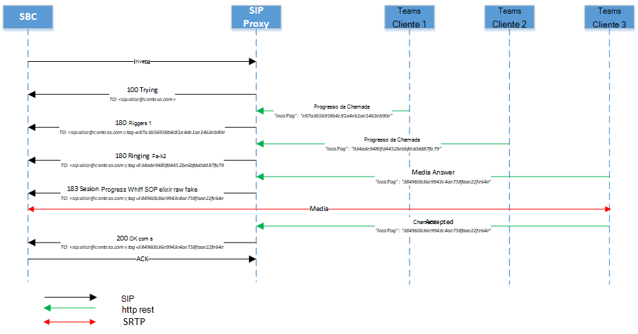
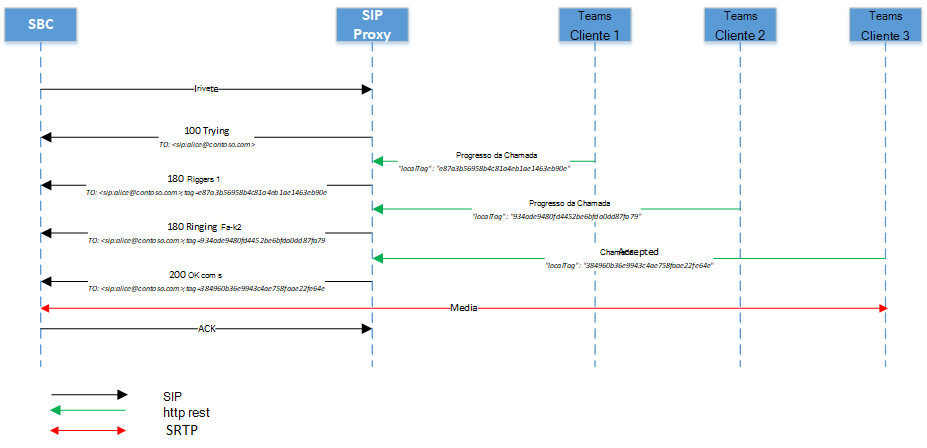
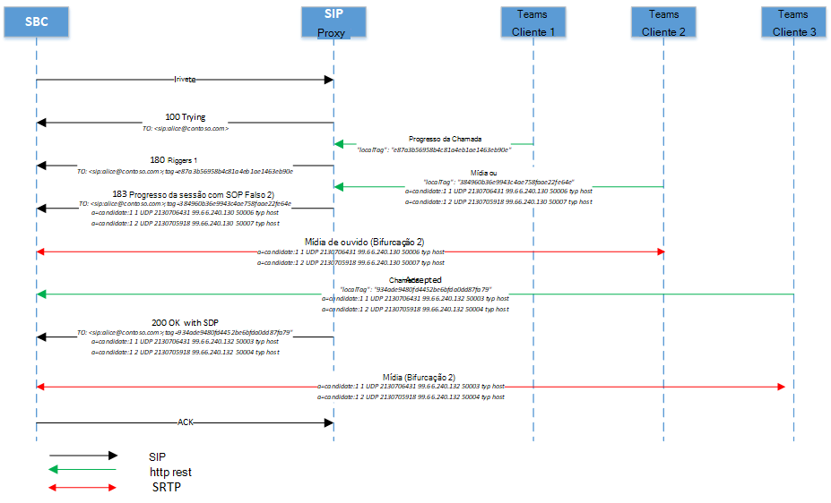
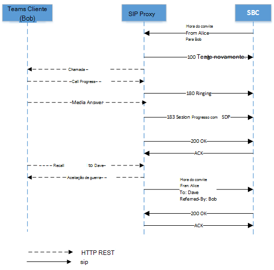

# <a name="direct-routing---sip-protocol"></a>Roteamento Direto - protocolo SIP

Este artigo descreve como o Roteamento Direto implementa o Protocolo de Iniciação de Sessão (SIP). Para rotear corretamente o tráfego entre um Controlador de Borda de Sessão (SBC) e o proxy SIP, alguns parâmetros SIP devem ter valores específicos. Este artigo destina-se aos administradores de voz responsáveis por configurar a conexão entre o SBC local e o serviço proxy SIP.

## <a name="processing-the-incoming-request-finding-the-tenant-and-user"></a>Processamento da solicitação de entrada: localizar o locatário e o usuário

Antes que uma chamada de entrada ou saída possa ser processada, as mensagens OPTIONS são trocadas entre o Proxy SIP e o SBC. Essas mensagens OPTIONS permitem que o Proxy SIP forneça os recursos permitidos ao SBC. É importante que a negociação OPTIONS seja bem-sucedida (resposta 200OK), permitindo maior comunicação entre SBC e Proxy SIP para estabelecer chamadas. Os headers SIP em uma mensagem OPTIONS para Proxy SIP são fornecidos como um exemplo abaixo:

| Nome do parâmetro | Exemplo do valor | 
| :---------------------  |:---------------------- |
| Request-URI | OPÇÕES sip:sip.pstnhub.microsoft.com:5061 SIP /2.0 |
| Via Header | Via: SIP/2.0/TLS sbc1.adatum.biz:5058;alias;branch=z9hG4bKac2121518978 | 
| Max-Forwards header | Max-Forwards:68 |
| De Header | Do Header From: <sip:sbc1.adatum.biz:5058> |
| Para o Header | Para: <sip:sip.pstnhub.microsoft.com:5061> |
| Header CSeq | CSeq: 1 INVITE | 
| Header de contato | Contato: <sip:sbc1.adatum.biz:50588;transport=tls> |

> [!NOTE]
> Os headers SIP não contêm userinfo no URI SIP em uso. De acordo com [a RFC 3261, seção 19.1.1](https://tools.ietf.org/html/rfc3261#section-19.1.1), a parte userinfo de um URI é opcional e PODE estar ausente quando o host de destino não tem uma noção de usuários ou quando o próprio hosst é o recurso que está sendo identificado. Se o sinal @ estiver presente em um URI SIP, o campo do usuário NÃO DEVE estar vazio.
> Observe que o URI SIPS não deve ser usado com Roteamento Direto, pois não é suportado.
> Verifique a configuração do Controlador de Borda de Sessão e verifique se você não está usando os headers "Replaces" em solicitações SIP. O Roteamento Direto rejeitará solicitações SIP que tenham os headers Replaces definidos.

Em uma chamada de entrada, o proxy SIP precisa encontrar o locatário ao qual a chamada está destinada e encontrar o usuário específico dentro desse locatário. O administrador de locatários pode configurar números não DID, por exemplo +1001, em vários locatários. Portanto, é importante encontrar o locatário específico no qual executar a análise de números, pois os números não DID podem ser os mesmos em várias organizações Microsoft 365 ou Office 365.  

Esta seção descreve como o proxy SIP localiza o locatário e o usuário e executa a autenticação do SBC na conexão de entrada.

Veja a seguir um exemplo da mensagem Convite SIP em uma chamada de entrada:

| Nome do parâmetro | Exemplo do valor | 
| :---------------------  |:---------------------- |
| Request-URI | CONVIDAR SIP:+18338006777@SIP.PSTNHUB.MICROSOFT.COM SIP /2.0 |
| Via Header | Via: SIP/2.0/TLS sbc1.adatum.biz:5058;alias;branch=z9hG4bKac2121518978 | 
| Max-Forwards header | Max-Forwards:68 |
| De Header | From Header From: <sip:+17168712781@sbc1.adatum.biz;transport=udp;tag=1c747237679 |
| Para o Header | Para: sip:+183338006777@sbc1.adatum.biz | 
| Header CSeq | CSeq: 1 INVITE | 
| Header de contato | Contato: <sip: 68712781@sbc1.adatum.biz:5058;transport=tls> | 

Ao receber o convite, o proxy SIP executa as seguintes etapas:

1. Verifique o certificado. Na conexão inicial, o serviço de Roteamento Direto pega o nome FQDN apresentado no header Contato e o corresponde ao Nome Comum ou Nome Alternativo de Assunto do certificado apresentado. O nome SBC deve corresponder a uma das seguintes opções:

   - Opção 1. O nome FQDN completo apresentado no header Contato deve corresponder ao nome comum/nome alternativo do certificado apresentado.  

   - Opção 2.  A parte de domínio do nome FQDN apresentada no header contact (por exemplo, adatum.biz do nome FQDN sbc1.adatum.biz) deve corresponder ao valor curinga em Nome Comum/Nome Alternativo do Assunto (por exemplo *.adatum.biz).

2. Tente encontrar um locatário usando o nome FQDN completo apresentado no header Contato.  

   Verifique se o nome FQDN do header de contato (sbc1.adatum.biz) está registrado como um nome DNS em qualquer Microsoft 365 ou Office 365 organização. Se for encontrada, a procurar o usuário será realizada no locatário que tem o FQDN SBC registrado como um nome de domínio. Se não for encontrada, a Etapa 3 será aplicada.   

3. A etapa 3 só se aplica se a Etapa 2 falhar. 

   Remova a parte do host do FQDN, apresentada no header de contato (FQDN: sbc12.adatum.biz, após remover a parte do host: adatum.biz) e verifique se esse nome está registrado como um nome DNS em qualquer organização Microsoft 365 ou Office 365. Se for encontrada, a procurar usuário será realizada neste locatário. Se não for encontrada, a chamada falhará.

4. Usando o número de telefone apresentado no Request-URI, execute a consulta de número reverso no locatário encontrado na Etapa 2 ou 3. Corresponder o número de telefone apresentado a um URI SIP do usuário no locatário encontrado na etapa anterior.

5. Aplicar configurações de tronco. Encontre os parâmetros definidos pelo administrador do locatário para este SBC.

   A Microsoft não dá suporte a ter um proxy SIP de terceiros ou Servidor de Agente de Usuário entre o proxy SIP da Microsoft e o SBC emparelhado, que pode modificar o URI de solicitação criado pelo SBC emparelhado.

   Os requisitos para as duas buscas (etapas 2 e 3) necessárias para o cenário em que um SBC está interconectado a muitos locatários (cenário de operadora) são abordados posteriormente neste artigo.

### <a name="detailed-requirements-for-contact-header-and-request-uri"></a>Requisitos detalhados para o header de contato e o Request-URI

#### <a name="contact-header"></a>Header de contato

Para todas as mensagens SIP de entrada (OPÇÕES, CONVIDAR) para o proxy SIP da Microsoft, o header de contato deve ter o FQDN SBC emparelhado no nome do host URI da seguinte forma:

Sintaxe: Contato: <sip:phone ou sip address@FQDN do SBC;transport=tls> 

De acordo [com a RFC 3261, seção 11.1](https://tools.ietf.org/html/rfc3261#section-11.1), um campo De contato pode estar presente em uma mensagem OPTIONS. No Roteamento Direto, o header de contato é necessário. Para mensagens INVITE no formato acima, para mensagens OPTIONS, o userinfo pode ser removido do URI SIP e somente FQDN enviado no formato da seguinte maneira:

Sintaxe: Contato: <sip:FQDN do SBC;transport=tls>

Esse nome (FQDN) também deve estar nos campos Nome Comum ou Nome alternativo do certificado apresentado. A Microsoft dá suporte ao uso de valores curinga dos nomes(s) nos campos Nome Comum ou Nome Alternativo de Assunto do certificado.   

O suporte para curingas está descrito na [RFC 2818, seção 3.1](https://tools.ietf.org/html/rfc2818#section-3.1). Especificamente:

*"Os nomes podem conter o caractere curinga \* que é considerado para corresponder a qualquer componente de nome de domínio único ou fragmento de componente. Por exemplo, \*.a.com corresponde foo.a.com mas não bar.foo.a.com. f.com\* corresponde foo.com, mas não bar.com."*

Se mais de um valor no header contato apresentado em uma mensagem SIP for enviado pelo SBC, somente a parte FQDN do primeiro valor do header contato será usada.

Como regra geral para Roteamento Direto, é importante que o FQDN seja usado para preencher URI SIP em vez de IP. Uma mensagem INVITE ou OPTIONS de entrada para o Proxy SIP com o header de Contato onde hostname é representado por IP e não FQDN, a conexão será recusada com o 403 Forbidden.

#### <a name="request-uri"></a>Request-URI 

Para todas as chamadas de entrada, o Request-URI é usado para corresponder o número de telefone a um usuário.   

Atualmente, o número de telefone deve conter um sinal de a mais (+), conforme mostrado no exemplo a seguir. 

```console
INVITE sip:+18338006777@sip.pstnhub.microsoft.com SIP /2.0
```
#### <a name="from-header"></a>De Header

Para todas as chamadas de entrada, o Header De é usado para corresponder o número de telefone do chamador com a lista de números de telefone bloqueados do chamador.

O número de telefone deve conter um + conforme mostrado no exemplo a seguir.

```console
From: <sip:+17168712781@sbc1.adatum.biz;transport=udp;tag=1c747237679
```

## <a name="contact-and-record-route-headers-considerations"></a>Considerações sobre contatos e Record-Route de headers

O proxy SIP precisa calcular o FQDN do próximo salto para novas transações de cliente na caixa de diálogo (por exemplo, Bye ou Re-Invite) e ao responder a Opções SIP. Os contatos ou Record-Route são usados. 

De acordo com [o RFC 3261, seção 8.1.1.8](https://tools.ietf.org/html/rfc3261#section-8.1.1.8), o header de contato é necessário em qualquer solicitação que possa resultar em uma nova caixa de diálogo. A Record-Route só será necessária se um proxy quiser permanecer no caminho das solicitações futuras em uma caixa de diálogo. Se um SBC proxy estiver em uso com a Otimização de Mídia [Local](./direct-routing-media-optimization.md) para Roteamento Direto, uma rota de registro precisará ser configurada conforme o SBC do proxy precisa permanecer na rota. 

A Microsoft recomenda usar somente o header contato se um SBC proxy não for usado:

- Por [RFC 3261, seção 20.30](https://tools.ietf.org/html/rfc3261#section-20.30), o Record-Route é usado se um proxy quiser permanecer no caminho de solicitações futuras em uma caixa de diálogo, o que não é essencial se nenhum SBC proxy estiver configurado à medida que todo o tráfego se intermedia entre o proxy SIP da Microsoft e o SBC emparelhado. 

- O proxy SIP da Microsoft usa apenas o header contact (não Record-Route) para determinar o próximo salto ao enviar opções de ping de saída. Configurar apenas um parâmetro (Contato) em vez de dois (Contato e Rota de Registro) simplifica a administração se um SBC proxy não estiver em uso. 

Para calcular o próximo salto, o proxy SIP usa:

- Prioridade 1. Rota de registro de nível superior. Se o Record-Route de nível superior contiver o nome FQDN, o nome FQDN será usado para fazer a conexão de saída na caixa de diálogo.

- Prioridade 2. Header de contato. Se Record-Route não existir, o proxy SIP procurará o valor do header contact para fazer a conexão de saída. (Esta é a configuração recomendada.)

Se Contact e Record-Route for usado, o administrador do SBC deverá manter seus valores idênticos, o que causa sobrecarga administrativa. 

### <a name="use-of-fqdn-name-in-contact-or-record-route"></a>Uso do nome FQDN em Contato ou Record-Route

Não há suporte para o uso de um endereço IP Record-Route contato. A única opção suportada é um FQDN, que deve corresponder ao Nome Comum ou Nome Alternativo de Assunto do certificado SBC (há suporte para valores curinga no certificado).

- Se um endereço IP for apresentado em Rota de Registro ou Contato, a verificação de certificado falhará e a chamada falhará.

- Se o FQDN não corresponder ao valor do Nome Alternativo Comum ou Assunto no certificado apresentado, a chamada falhará. 

## <a name="inbound-call-sip-dialog-description"></a>Chamada de entrada: descrição da caixa de diálogo SIP

A tabela a seguir resume as diferenças de fluxo de chamada e semelhanças entre os modos de bypass e bypass:

| Nome do parâmetro | Modo não bypass | Modo bypass
| :---------------------  |:---------------------- |:----------------|
| Candidatos de mídia em 183 e 200 mensagens provenientes | Processadores de mídia | Clientes | 
| Número de 183 mensagens que o SBC pode receber | Um por sessão | Vários | 
| A chamada pode ser com resposta provisória (183) | Sim | Sim |
| A chamada pode estar sem resposta provisória (183) | Sim | Sim |

###  <a name="non-media-bypass-flow"></a>Fluxo de bypass que não seja de mídia

Um Teams usuário pode ter vários pontos de extremidade ao mesmo tempo. Por exemplo, Teams para Windows cliente, Teams para cliente iPhone e Teams Telefone (Teams cliente Android). Cada ponto de extremidade pode sinalizar um rest HTTP da seguinte forma:

-   Progresso da chamada – convertido pelo proxy SIP para a mensagem SIP 180. Ao receber a mensagem 180, o SBC deve gerar toque local.

-   Resposta de mídia – convertida pelo proxy SIP para a mensagem 183 com candidatos à mídia no Protocolo de Descrição da Sessão (SDP). Ao receber a mensagem 183, o SBC espera se conectar aos candidatos de mídia recebidos na mensagem SDP. 

    > [!NOTE]
    > Em alguns casos, a resposta de mídia pode não ser gerada e o ponto final pode responder com a mensagem "Chamada Aceita".

-   Chamada aceita – convertida pelo proxy SIP para a mensagem SIP 200 com SDP. Ao receber a mensagem 200, espera-se que o SBC envie e receba mídia de e para os candidatos SDP fornecidos.

    > [!NOTE]
    > O Roteamento Direto não dá suporte a Convite de Oferta Atrasada (Convidar sem SDP).

#### <a name="multiple-endpoints-ringing-with-provisional-answer"></a>Vários pontos de extremidade tocando com resposta provisória

1.  Ao receber o primeiro Convite do SBC, o proxy SIP envia a mensagem "SIP SIP/2.0 100 Tentando" e notifica todos os pontos de extremidade do usuário final sobre a chamada de entrada. 

2.  Após a notificação, cada ponto de extremidade começará a tocar e enviar mensagens "Andamento da chamada" para o proxy SIP. Como um Teams usuário pode ter vários pontos de extremidade, o proxy SIP pode receber várias mensagens de Progresso de Chamada.

3.  Para cada mensagem de Progresso de Chamada recebida dos clientes, o proxy SIP converte a mensagem Progresso da Chamada para a mensagem SIP "SIP SIP/2.0 180 Ringing". O intervalo para o envio dessas mensagens é definido pelo intervalo de mensagens de recebimento do Controlador de Chamada. No diagrama a seguir, há duas 180 mensagens geradas pelo proxy SIP. Essas mensagens vêm dos dois Teams pontos de extremidade do usuário. Cada cliente tem uma ID de Marca exclusiva.  Cada mensagem proveniente de um ponto de extremidade diferente será uma sessão separada (o parâmetro "tag" no campo "Para" será diferente). Mas um ponto de extremidade pode não gerar a mensagem 180 e enviar a mensagem 183 imediatamente, conforme mostrado no diagrama a seguir.

4.  Depois que um ponto de extremidade gera uma mensagem de Resposta de Mídia com os endereços IP dos candidatos à mídia do ponto de extremidade, o proxy SIP converte a mensagem recebida em uma mensagem "Progresso da Sessão SIP 183" com o SDP do cliente substituído pelo SDP do Processador de Mídia. No diagrama a seguir, o ponto de extremidade do Bifurcação 2 atendeu à chamada. Se o tronco não for ignorado, a mensagem SIP 183 será gerada apenas uma vez (Ring Bot ou Client End Point). O 183 pode vir em uma bifurcação existente ou iniciar um novo.

5.  Uma mensagem de Aceitação de Chamada é enviada com os candidatos finais do ponto de extremidade que aceitaram a chamada. A mensagem aceitação de chamada é convertida na mensagem SIP 200. 

> [!div class="mx-imgBorder"]
> 

#### <a name="multiple-endpoints-ringing-without-provisional-answer"></a>Vários pontos de extremidade tocando sem resposta provisória

1.  Ao receber o primeiro Convite do SBC, o proxy SIP envia a mensagem "SIP SIP/2.0 100 Tentando" e notifica todos os pontos de extremidade do usuário final sobre a chamada de entrada. 

2.  Após a notificação, cada ponto de extremidade começará a tocar e enviar a mensagem "Progresso da chamada" para o proxy SIP. Como um Teams usuário pode ter vários pontos de extremidade, o proxy SIP pode receber várias mensagens de Progresso de Chamada.

3.  Para cada mensagem de Progresso de Chamada recebida dos clientes, o proxy SIP converte a mensagem Progresso da Chamada para a mensagem SIP "SIP SIP/2.0 180 Trying".  O intervalo para o envio das mensagens é definido pelo intervalo de recebimento das mensagens do Controlador de Chamada. Na imagem abaixo, há duas 180 mensagens geradas pelo proxy SIP, o que significa que o usuário se registrou em três clientes Teams e cada cliente envia o andamento da chamada. Cada mensagem será uma sessão separada (parâmetro "tag" no campo "Para" é diferente)

4.  Uma mensagem de Aceitação de Chamada é enviada com os candidatos finais do ponto de extremidade que aceitaram a chamada. A mensagem aceitação de chamada é convertida na mensagem SIP 200. 

> [!div class="mx-imgBorder"]
> 

### <a name="media-bypass-flow"></a>Fluxo de bypass de mídia

As mesmas mensagens (100 Tentando, 180, 183) são usadas no cenário de bypass de mídia. 

O esquema abaixo mostra um exemplo do fluxo de chamada de bypass. 

> [!NOTE]
> Os candidatos à mídia podem vir de pontos de extremidade diferentes. 

> [!div class="mx-imgBorder"]
> 

## <a name="replaces-option"></a>Substitui a opção

O SBC deve dar suporte a Convidar com Substituições.

## <a name="size-of-sdp-considerations"></a>Tamanho das considerações de SDP

A interface de Roteamento Direto pode enviar uma mensagem SIP superior a 1.500 bytes.  O tamanho do SDP causa isso principalmente. No entanto, se houver um tronco UDP atrás do SBC, ele poderá rejeitar a mensagem se for encaminhada do proxy SIP da Microsoft para o tronco nãomodificado. A Microsoft recomenda a desmoção de alguns valores no SDP no SBC ao enviar a mensagem para os troncos UDP. Por exemplo, os candidatos ICE ou codecs não usadas podem ser removidos.

## <a name="call-transfer"></a>Transferência de chamadas

O Roteamento Direto dá suporte a dois métodos para transferência de chamada:

- Opção 1. Processos de proxy SIP Refer from the client locally and acts as a Referee as described in section 7.1 of RFC 3892.

  Com essa opção, o proxy SIP encerra a transferência e adiciona um novo Invite. 


- Opção 2.  O proxy SIP envia o refer to the SBC e age como um Transferor conforme descrito na Seção 6 da RFC 5589.

  Com essa opção, o proxy SIP envia um Refer para o SBC e espera que o SBC manipulará totalmente a Transferência.

O proxy SIP seleciona o método com base nos recursos relatados pelo SBC. Se o SBC indicar que ele dá suporte ao método "Refer", o proxy SIP usará a Opção 2 para transferências de chamada.

Veja a seguir um exemplo de um SBC enviando a mensagem de suporte para o método Refer:

```console
ALLOW: INVITE, OPTIONS, INFO, BYE, CANCEL, ACK, PRACK, UPDATE, REFER, SUBSCRIBE, NOTIFY
```

Se o SBC não indicar que Refer como um método com suporte, o Roteamento Direto usará a Opção 1 (proxy SIP age como um Referee) . O SBC também deve sinalizar que ele dá suporte ao método Notify:

Exemplo de SBC indicando que o método Refer não tem suporte:

```console
ALLOW: INVITE, ACK, CANCEL, BYE, INFO, NOTIFY, PRACK, UPDATE, OPTIONS
```

### <a name="sip-proxy-processes-refer-from-the-client-locally-and-acts-as-a-referee"></a>Processos de proxy SIP Referem-se ao cliente localmente e age como um Referee

Se o SBC indicar que o método Refer não tem suporte, o proxy SIP atuará como um Referee. 

A solicitação Refer que vem do cliente será encerrada no proxy SIP. (A solicitação Refer do cliente é mostrada como "Transferência de chamada para Dave" no diagrama a seguir.  Para obter mais informações, consulte a seção 7.1 do [RFC 3892](https://www.ietf.org/rfc/rfc3892.txt). 

> [!div class="mx-imgBorder"]
> 

### <a name="sip-proxy-send-the-refer-to-the-sbc-and-acts-as-a-transferor"></a>Proxy SIP envia o refer to the SBC e age como um Transferor

Esse é o método preferencial para transferências de chamada e é obrigatório para dispositivos que procuram a certificação de bypass de mídia. A transferência de chamada sem que o SBC possa manipular Refer não é suportada no modo de bypass de mídia. 

O padrão é explicado na Seção 6 da RFC 5589. Os RFCs relacionados são:

- [Controle de chamada sip (protocolo de iniciação de sessão) - Transferência](https://tools.ietf.org/html/rfc5589)

- [Header "Substitui" do Protocolo de Iniciação de Sessão (SIP)](https://tools.ietf.org/html/rfc3891)

- [Mecanismo SIP (Session Initiation Protocol) "Referred-By"](https://tools.ietf.org/html/rfc3892)

Essa opção assume que o proxy SIP age como um Transferor e envia uma mensagem Refer para o SBC. O SBC age como um Transferee e lida com Refer para gerar uma nova oferta de transferência. Há dois casos possíveis:

- A chamada é transferida para um participante PSTN externo. 
- A chamada é transferida de um Teams para outro Teams usuário no mesmo locatário por meio do SBC. 

Se a chamada for transferida de um usuário Teams para outro por meio do SBC, o SBC deverá emitir um novo convite (iniciar uma nova caixa de diálogo) para o destino de transferência (o usuário Teams) usando as informações recebidas na mensagem Referir. 

Para preencher os campos To/Transferor para a transação da solicitação internamente, o proxy SIP precisa transmitir essas informações dentro dos headers REFER-TO/REFERRED-BY. 

O proxy SIP formará o REFER-TO como um URI SIP composto por um FQDN de proxy SIP no nome do host e um dos seguintes:

- Um número de telefone E.164 na parte de nome de usuário do URI caso o destino da transferência seja um número de telefone ou

- Parâmetros x-m e x-t codificando a MRI de destino de transferência completa e a ID do locatário, respectivamente 

O header REFERRED-BY é um URI SIP com MRI transferor codificado nele, bem como a ID de locatário do transferidor e outros parâmetros de contexto de transferência, conforme mostrado na tabela a seguir:

| Parâmetro | Valor | Descrição |  
|:---------------------  |:---------------------- |:---------------------- |
| x-m | MRI | MRI completa do destino de transferência/transferência, conforme preenchido pelo CC |
| x-t | ID do locatário | ID opcional do locatário x-t, conforme preenchido pelo CC |
| x-ti | ID de Correlação do Transferidor | ID de correlação da chamada para o transferidor |
| x-tt | Transferir URI de chamada de destino | URI de substituição de chamada codificada |

O tamanho do Header de Referência pode ter até 400 símbolos nesse caso. O SBC deve dar suporte ao tratamento de Encaminhar mensagens com tamanho de até 400 símbolos.

> [!div class="mx-imgBorder"]
> 

## <a name="session-timer"></a>Timer de sessão

O proxy SIP dá suporte (sempre oferece) o Timer de Sessão em chamadas que não ignoram, mas não o oferece em chamadas de bypass. O uso do Temporizador de Sessão pelo SBC não é obrigatório.

##  <a name="use-of-request-uri-parameter-userphone"></a>Uso do parâmetro Request-URI user=phone

O proxy SIP analisa o Request-URI e, se o parâmetro user=phone estiver presente, o serviço tratará o Request-URI como um número de telefone, correspondendo o número a um usuário. Se o parâmetro não estiver presente, o proxy SIP aplicará heurística para determinar o tipo de usuário Request-URI (número de telefone ou um endereço SIP).

A Microsoft recomenda sempre aplicar o parâmetro user=phone para simplificar o processo de configuração de chamada.

## <a name="history-info-header"></a>History-Info header

O History-Info é usado para retargeting de solicitações SIP e "fornecer(s) um mecanismo padrão para capturar as informações do histórico de solicitações para habilitar uma ampla variedade de serviços para redes e usuários finais". Para obter mais informações, [consulte RFC 4244 – Seção 1.1](http://www.ietf.org/rfc/rfc4244.txt). Para Telefone Microsoft System, esse header é usado em cenários de Encaminhamento de Chamada e Simulring.  

Se o envio, o History-Info está habilitado da seguinte forma:

- O proxy SIP inserirá um parâmetro que contém o número de telefone associado em entradas individuais History-Info que compõem o History-Info enviado ao Controlador PSTN.  Usando apenas entradas que tenham o parâmetro de número de telefone, o Controlador PSTN recriará um novo History-Info e o transmitirá ao provedor de tronco SIP por meio de proxy SIP.

- History-Info header será adicionado para casos simultâneos de encaminhamento de chamada e anel.

- History-Info header não será adicionado para casos de transferência de chamada.

- Uma entrada de histórico individual no header History-Info reconstruído terá o parâmetro de número de telefone fornecido combinado com o FQDN de Roteamento Direto (sip.pstnhub.microsoft.com) definido como a parte host do URI; um parâmetro de 'user=phone' será adicionado como parte do URI SIP.  Quaisquer outros parâmetros associados ao History-Info original, exceto os parâmetros de contexto do telefone, serão passados no header History-Info re-construído.  

  > [!NOTE]
  > Entradas privadas (conforme determinado pelos mecanismos definidos na Seção 3.3 do RFC 4244) serão encaminhadas como é porque o provedor de tronco SIP é um par confiável.

- O History-Info de entrada é ignorado.

A seguir está o formato do header History-info enviado pelo proxy SIP:

```console
<sip:UserB@sip.pstnhub.microsoft.com?Privacy=history&Reason=SIP%3B\cause%3D486>;index=1.2,
```

Se a chamada foi redirecionada várias vezes, as informações sobre cada redirecionamento serão incluídas com o motivo apropriado em ordem cronológica.


Exemplo de header:

```console
History-info: 
<sip:+14257123456@sip.pstnhub.microsoft.com;user=phone?Reason=SIP;cause=302;text=”Move Temporarily”>;index=1
<sip:+14257123457@sip.pstnhub.microsoft.com;user=phone?Reason=SIP;cause=496;text=”User Busy”>;index=1.1
```

O History-Info é protegido por um mecanismo TLS obrigatório. 

## <a name="sbc-connection-to-direct-routing-and-failover-mechanism"></a>Conexão SBC com o mecanismo de roteamento direto e failover

Consulte o mecanismo de failover da seção para sinalização SIP em [Plan for Direct Routing](direct-routing-plan.md#failover-mechanism-for-sip-signaling).

## <a name="retry-after"></a>Retry-After

Se um datacenter de Roteamento Direto estiver ocupado, o serviço poderá enviar uma mensagem Retry-After com um intervalo de um segundo para o SBC. Quando o SBC recebe uma mensagem 503 com um Retry-After em resposta a um INVITE, o SBC deve encerrar essa conexão e tentar o próximo datacenter da Microsoft disponível.

## <a name="handling-retries-603-response"></a>Tratamento de recuperações (resposta 603)
Se um usuário final observar várias chamadas perdidas para uma chamada após o declínio da chamada de entrada, isso significa que o mecanismo de nova tentativa do provedor de tronco SBC ou PSTN está mal configurado. O SBC deve ser reconfigurado para interromper os esforços de nova tentativa na resposta 603.

## <a name="ice-restart-media-bypass-call-transferred-to-an-endpoint-that-does-not-support-media-bypass"></a>Reinicialização de ICE: Chamada de bypass de mídia transferida para um ponto de extremidade que não dá suporte a bypass de mídia

O SBC deve dar suporte a reinicializações de ICE conforme descrito na [RFC 5245, seção 9.1.1.1](https://tools.ietf.org/html/rfc5245#section-9.1.1.1).

A reinicialização no Roteamento Direto é implementada de acordo com os seguintes parágrafos da RFC:

*Para reiniciar o ICE, um agente DEVE alterar o ice-pwd e o ice-ufrag para o fluxo de mídia em uma oferta.  Observe que é permitido usar um atributo de nível de sessão em uma oferta, mas para fornecer o mesmo ice-pwd ou ice-ufrag como um atributo de nível de mídia em uma oferta subsequente.  Isso não é uma alteração na senha, apenas uma alteração em sua representação e não causa uma reinicialização de ICE.*

*Um agente define o restante dos campos no SDP para esse fluxo de mídia como faria em uma oferta inicial desse fluxo de mídia (consulte a Seção 4.3).  Consequentemente, o conjunto de candidatos PODE incluir alguns, nenhum ou todos os candidatos anteriores para esse fluxo e MAY incluem um conjunto totalmente novo de candidatos coletados, conforme descrito na Seção 4.1.1.*

Se a chamada foi estabelecida inicialmente com bypass de mídia e a chamada é transferida para um cliente Skype for Business, o Roteamento Direto precisa inserir um Processador de Mídia, isso porque o Roteamento Direto não pode ser usado com um cliente Skype for Business com bypass de mídia. O Roteamento Direto inicia o processo de reinicialização do ICE alterando o ice-pwd e o ice-ufrag e oferecendo novos candidatos à mídia em uma reinvite.
