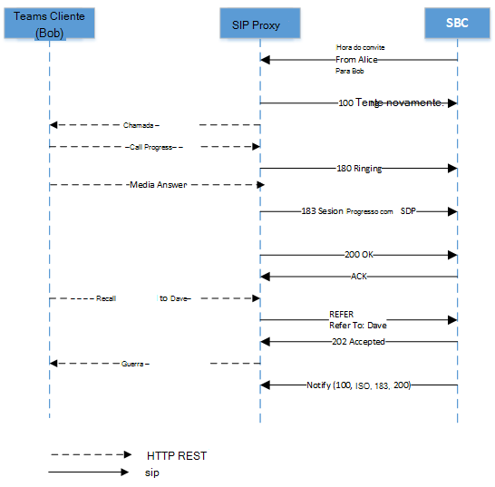

# <a name="direct-routing---sip-protocol"></a>Roteamento Direto – protocolo SIP

Este artigo descreve como o Roteamento Direto implementa o SIP (Protocolo de Iniciação de Sessão). Para rotear corretamente o tráfego entre um SBC (Controlador de Borda de Sessão) e o proxy SIP, alguns parâmetros SIP devem ter valores específicos. Este artigo destina-se aos administradores de voz responsáveis por configurar a conexão entre o SBC local e o serviço proxy SIP.

## <a name="processing-the-incoming-request-finding-the-tenant-and-user"></a>Processamento da solicitação de entrada: localizando o locatário e o usuário

Antes que uma chamada de entrada ou saída possa ser processada, as mensagens OPTIONS são trocadas entre o Proxy SIP e o SBC. Essas mensagens OPTIONS permitem que o PROXY SIP forneça os recursos permitidos ao SBC. É importante que a negociação options seja bem-sucedida (resposta 200OK), permitindo uma comunicação adicional entre o SBC e o SIP Proxy para estabelecer chamadas. Os cabeçalhos SIP em uma mensagem OPTIONS para o PROXY SIP são fornecidos como um exemplo abaixo:

| Nome do parâmetro | Exemplo do valor | 
| :---------------------  |:---------------------- |
| Request-URI | OPÇÕES sip:sip.pstnhub.microsoft.com:5061 SIP /2.0 |
| Via Cabeçalho | Via: SIP/2.0/TLS sbc1.adatum.biz:5058;alias;branch=z9hG4bKac2121518978 | 
| cabeçalho Max-Forwards | Max-Forwards:68 |
| De Cabeçalho | De Cabeçalho de: <sip:sbc1.adatum.biz:5058> |
| Para Cabeçalho | Para: <sip:sip.pstnhub.microsoft.com:5061> |
| Cabeçalho CSeq | CSeq: 1 INVITE | 
| Cabeçalho de Contato | Contato: <sip:sbc1.adatum.biz:50588;transport=tls> |

> [!NOTE]
> Os cabeçalhos SIP não contêm userinfo no URI SIP em uso. De acordo com [o RFC 3261, seção 19.1.1](https://tools.ietf.org/html/rfc3261#section-19.1.1), a parte userinfo de um URI é opcional e PODE estar ausente quando o host de destino não tem uma noção de usuários ou quando o host em si é o recurso que está sendo identificado. Se o sinal @ estiver presente em um URI SIP, o campo de usuário NÃO DEVERÁ estar vazio.
> Observe que o URI SIPS não deve ser usado com Roteamento Direto, pois não há suporte.
> Verifique a configuração do Controlador de Borda de Sessão e verifique se você não está usando cabeçalhos "Substitui" em solicitações SIP. O Roteamento Direto rejeitará as solicitações SIP que têm cabeçalhos Replaces definidos.

Em uma chamada de entrada, o proxy SIP precisa encontrar o locatário ao qual a chamada está destinada e localizar o usuário específico dentro desse locatário. O administrador do locatário pode configurar números não DID, por exemplo, +1001, em vários locatários. Portanto, é importante encontrar o locatário específico no qual executar a pesquisa de números, pois os números não DID podem ser os mesmos em várias organizações Microsoft 365 ou Office 365.  

Esta seção descreve como o proxy SIP localiza o locatário e o usuário e executa a autenticação do SBC na conexão de entrada.

A seguir está um exemplo da mensagem convite SIP em uma chamada de entrada:

| Nome do parâmetro | Exemplo do valor | 
| :---------------------  |:---------------------- |
| Request-URI | INVITE sip:+18338006777@sip.pstnhub.microsoft.com SIP /2.0 |
| Via Cabeçalho | Via: SIP/2.0/TLS sbc1.adatum.biz:5058;alias;branch=z9hG4bKac2121518978 | 
| cabeçalho Max-Forwards | Max-Forwards:68 |
| De Cabeçalho | De Cabeçalho de: <sip:+17168712781@sbc1.adatum.biz;transport=udp;tag=1c747237679 |
| Para Cabeçalho | Para: sip:+183338006777@sbc1.adatum.biz | 
| Cabeçalho CSeq | CSeq: 1 INVITE | 
| Cabeçalho de Contato | Contato: <sip:+17168712781@sbc1.adatum.biz:5058;transport=tls> | 

Ao receber o convite, o proxy SIP executa as seguintes etapas:

1. Verifique o certificado. Na conexão inicial, o serviço de Roteamento Direto usa o nome FQDN apresentado no cabeçalho Contato e o corresponde ao nome comum ou nome alternativo de assunto do certificado apresentado. O nome SBC deve corresponder a uma das seguintes opções:

   - Opção 1. O nome FQDN completo apresentado no cabeçalho Contato deve corresponder ao nome alternativo nome/assunto comum do certificado apresentado.  

   - Opção 2.  A parte de domínio do nome FQDN apresentada no cabeçalho Contato (por exemplo, adatum.biz do nome FQDN sbc1.adatum.biz) deve corresponder ao valor curinga em Nome Comum/Nome Alternativo do Assunto (por exemplo , *.adatum.biz).

2. Tente encontrar um locatário usando o nome FQDN completo apresentado no cabeçalho Contato.  

   Verifique se o nome FQDN do cabeçalho contato (sbc1.adatum.biz) está registrado como um nome DNS em qualquer organização Microsoft 365 ou Office 365. Se encontrado, a pesquisa do usuário será executada no locatário que tem o SBC FQDN registrado como um nome de domínio. Se não for encontrada, a Etapa 3 se aplicará.   

3. A etapa 3 só se aplica se a Etapa 2 falhar. 

   Remova a parte do host do FQDN, apresentada no cabeçalho Contato (FQDN: sbc12.adatum.biz, depois de remover a parte do host: adatum.biz) e verifique se esse nome está registrado como um nome DNS em qualquer organização Microsoft 365 ou Office 365. Se encontrado, a pesquisa de usuário será executada neste locatário. Se não for encontrada, a chamada falhará.

4. Usando o número de telefone apresentado no Request-URI, execute a pesquisa de número inverso dentro do locatário encontrado na Etapa 2 ou 3. Corresponda o número de telefone apresentado a um URI SIP do usuário no locatário encontrado na etapa anterior.

5. Aplicar configurações de tronco. Localize os parâmetros definidos pelo administrador do locatário para este SBC.

   Microsoft não dá suporte a ter um proxy SIP de terceiros ou servidor de agente de usuário entre o proxy SIP Microsoft e o SBC emparelhado, o que pode modificar o URI de solicitação criado pelo SBC emparelhado.

   Os requisitos para as duas pesquisas (etapas 2 e 3) necessários para o cenário em que um SBC está interconectado a muitos locatários (cenário de operadora) são abordados posteriormente neste artigo.

### <a name="detailed-requirements-for-contact-header-and-request-uri"></a>Requisitos detalhados para cabeçalho de contato e Request-URI

#### <a name="contact-header"></a>Cabeçalho de contato

Para todas as mensagens SIP de entrada (OPções, INVITE) para o proxy SIP Microsoft, o cabeçalho Contato deve ter o SBC FQDN emparelhado no nome do host do URI da seguinte maneira:

Sintaxe: contato: <sip:phone ou sip address@FQDN do> SBC;transport=tls 

De acordo com [o RFC 3261, seção 11.1](https://tools.ietf.org/html/rfc3261#section-11.1), um campo de cabeçalho de contato pode estar presente em uma mensagem OPTIONS. No Roteamento Direto, o cabeçalho de contato é necessário. Para mensagens INVITE no formato acima, para mensagens OPTIONS, o userinfo pode ser removido do URI SIP e apenas FQDN enviado em formato da seguinte maneira:

Sintaxe: contato: <sip:FQDN do SBC;transport=tls>

Esse nome (FQDN) também deve estar no campo nome comum ou nome alternativo de assunto do certificado apresentado. Microsoft dá suporte ao uso de valores curinga dos nomes nos campos Nome Comum ou Nome Alternativo de Assunto do certificado.   

O suporte para curingas é descrito no [RFC 2818, seção 3.1](https://tools.ietf.org/html/rfc2818#section-3.1). Especificamente:

*"Os nomes podem conter o caractere \* curinga que é considerado para corresponder a qualquer componente de nome de domínio único ou fragmento de componente. Por exemplo, \*.a.com corresponde foo.a.com mas não bar.foo.a.com. f.com\* corresponde foo.com mas não bar.com".*

Se mais de um valor no cabeçalho Contato apresentado em uma mensagem SIP for enviado pelo SBC, somente a parte FQDN do primeiro valor do cabeçalho Contato será usada.

Como regra geral para Roteamento Direto, é importante que o FQDN seja usado para preencher o URI SIP em vez de IP. Uma mensagem INVITE ou OPTIONS de entrada para o PROXY SIP com cabeçalho de contato em que o nome do host é representado por IP e não por FQDN, a conexão será recusada com o 403 Forbidden.

#### <a name="request-uri"></a>Request-URI 

Para todas as chamadas recebidas, o Request-URI é usado para corresponder o número de telefone a um usuário.   

Atualmente, o número de telefone deve conter um sinal de adição (+) conforme mostrado no exemplo a seguir. 

```console
INVITE sip:+18338006777@sip.pstnhub.microsoft.com SIP /2.0
```
#### <a name="from-header"></a>De Cabeçalho

Para todas as chamadas recebidas, o Cabeçalho de Entrada é usado para corresponder o número de telefone do chamador com a lista de números de telefone bloqueado do destinatário.

O número de telefone deve conter um + conforme mostrado no exemplo a seguir.

```console
From: <sip:+17168712781@sbc1.adatum.biz;transport=udp;tag=1c747237679
```

## <a name="contact-and-record-route-headers-considerations"></a>Considerações de cabeçalhos de contato e Record-Route

O proxy SIP precisa calcular o FQDN do próximo salto para novas transações de cliente na caixa de diálogo (por exemplo, Bye ou Re-Convidar) e ao responder às Opções SIP. Contato ou Record-Route são usados. 

De acordo com o [RFC 3261, seção 8.1.1.8](https://tools.ietf.org/html/rfc3261#section-8.1.1.8), o cabeçalho de contato é necessário em qualquer solicitação que possa resultar em uma nova caixa de diálogo. O Record-Route só será necessário se um proxy quiser permanecer no caminho de solicitações futuras em uma caixa de diálogo. Se um SBC de proxy estiver em uso com [a Otimização de Mídia Local para Roteamento Direto](./direct-routing-media-optimization.md), uma rota de registro precisará ser configurada, pois o SBC proxy precisa permanecer na rota. 

Microsoft recomenda usar apenas o cabeçalho De contato se um SBC proxy não for usado:

- Por [RFC 3261, seção 20.30](https://tools.ietf.org/html/rfc3261#section-20.30), Record-Route é usado se um proxy quiser permanecer no caminho de solicitações futuras em uma caixa de diálogo, o que não é essencial se nenhum proxy SBC estiver configurado, pois todo o tráfego vai entre o proxy SIP Microsoft e o SBC emparelhado. 

- O proxy SIP Microsoft usa apenas o cabeçalho Contato (não Record-Route) para determinar o próximo salto ao enviar opções de ping de saída. Configurar apenas um parâmetro (Contato) em vez de dois (Contato e Rota de Registro) simplifica a administração se um SBC proxy não estiver em uso. 

Para calcular o próximo salto, o proxy SIP usa:

- Prioridade 1. Rota de registro de nível superior. Se o Record-Route de nível superior contiver o nome FQDN, o nome FQDN será usado para fazer a conexão de saída na caixa de diálogo.

- Prioridade 2. Cabeçalho de contato. Se Record-Route não existir, o proxy SIP procurará o valor do cabeçalho Contato para fazer a conexão de saída. (Essa é a configuração recomendada.)

Se o Contato e Record-Route forem usados, o administrador do SBC deverá manter seus valores idênticos, o que causa sobrecarga administrativa. 

### <a name="use-of-fqdn-name-in-contact-or-record-route"></a>Uso do nome FQDN em Contato ou Record-Route

Não há suporte para o uso de um endereço IP no Record-Route nem no Contact. A única opção com suporte é um FQDN, que deve corresponder ao Nome Comum ou Ao Nome Alternativo do Assunto do certificado SBC (há suporte para valores curinga no certificado).

- Se um endereço IP for apresentado em Rota de registro ou Contato, a verificação de certificado falhará e a chamada falhará.

- Se o FQDN não corresponder ao valor do Nome Alternativo Comum ou de Assunto no certificado apresentado, a chamada falhará. 

## <a name="inbound-call-sip-dialog-description"></a>Chamada de entrada: descrição da caixa de diálogo SIP

A tabela a seguir resume as diferenças de fluxo de chamada e as semelhanças entre os modos de não bypass e bypass:

| Nome do parâmetro | Modo sem bypass | Modo bypass
| :---------------------  |:---------------------- |:----------------|
| Candidatos à mídia em 183 e 200 mensagens provenientes | Processadores de mídia | Clientes | 
| Número de 183 mensagens que o SBC pode receber | Um por sessão | Vários | 
| A chamada pode ser com resposta provisória (183) | Sim | Sim |
| A chamada pode ser sem resposta provisória (183) | Sim | Sim |

###  <a name="non-media-bypass-flow"></a>Fluxo de bypass que não é de mídia

Um usuário do Teams pode ter vários pontos de extremidade ao mesmo tempo. Por exemplo, cliente do Teams para Windows, cliente do Teams para iPhone e Teams Phone (cliente Android do Teams). Cada ponto de extremidade pode sinalizar um descanso HTTP da seguinte maneira:

-   Progresso da chamada – convertido pelo proxy SIP na mensagem SIP 180. Ao receber a mensagem 180, o SBC deve gerar toques locais.

-   Resposta de mídia – convertida pelo proxy SIP para a mensagem 183 com candidatos de mídia no Protocolo de Descrição de Sessão (SDP). Ao receber a mensagem 183, o SBC espera se conectar aos candidatos de mídia recebidos na mensagem SDP. 

    > [!NOTE]
    > Em alguns casos, a resposta de mídia pode não ser gerada e o ponto final pode responder com a mensagem "Chamada Aceita".

-   Chamada aceita – convertida pelo proxy SIP na mensagem SIP 200 com SDP. Ao receber a mensagem 200, espera-se que o SBC envie e receba mídia de e para os candidatos SDP fornecidos.

    > [!NOTE]
    > O Roteamento Direto não dá suporte ao Convite de Oferta Atrasada (Convite sem SDP).

#### <a name="multiple-endpoints-ringing-with-provisional-answer"></a>Vários pontos de extremidade tocando com resposta provisória

1.  Ao receber o primeiro Convite do SBC, o proxy SIP envia a mensagem "SIP SIP/2.0 100 Tentando" e notifica todos os pontos de extremidade do usuário final sobre a chamada de entrada. 

2.  Após a notificação, cada ponto de extremidade começará a tocar e enviar mensagens de "Progresso de chamada" para o proxy SIP. Como um usuário do Teams pode ter vários pontos de extremidade, o proxy SIP pode receber várias mensagens de Progresso de Chamada.

3.  Para cada mensagem de Progresso de Chamada recebida dos clientes, o proxy SIP converte a mensagem Progresso de Chamada na mensagem SIP "SIP/2.0 180 Ringing". O intervalo para o envio dessas mensagens é definido pelo intervalo das mensagens recebidas do Controlador de Chamada. No diagrama a seguir, há duas 180 mensagens geradas pelo proxy SIP. Essas mensagens vêm dos dois pontos de extremidade do Teams do usuário. Cada um dos clientes tem uma ID de Marca exclusiva.  Cada mensagem proveniente de um ponto de extremidade diferente será uma sessão separada (o parâmetro "tag" no campo "To" será diferente). Mas um ponto de extremidade pode não gerar a mensagem 180 e enviar a mensagem 183 imediatamente, conforme mostrado no diagrama a seguir.

4.  Depois que um ponto de extremidade gera uma mensagem resposta de mídia com os endereços IP dos candidatos de mídia do ponto de extremidade, o proxy SIP converte a mensagem recebida em uma mensagem "SIP 183 Session Progress" com o SDP do cliente substituído pelo SDP do Processador de Mídia. No diagrama a seguir, o ponto de extremidade do Fork 2 atendeu à chamada. Se o tronco não for ignorado, a mensagem SIP 183 será gerada apenas uma vez (Ring Bot ou Client End Point). O 183 pode vir em uma bifurcação existente ou iniciar uma nova.

5.  Uma mensagem de Aceitação de Chamada é enviada com os candidatos finais do ponto de extremidade que aceitaram a chamada. A mensagem aceitação de chamada é convertida na mensagem SIP 200. 

> [!div class="mx-imgBorder"]
> 

#### <a name="multiple-endpoints-ringing-without-provisional-answer"></a>Vários pontos de extremidade tocando sem resposta provisória

1.  Ao receber o primeiro Convite do SBC, o proxy SIP envia a mensagem "SIP SIP/2.0 100 Tentando" e notifica todos os pontos de extremidade do usuário final sobre a chamada de entrada. 

2.  Após a notificação, cada ponto de extremidade começará a tocar e enviar a mensagem "Chamar progresso" para o proxy SIP. Como um usuário do Teams pode ter vários pontos de extremidade, o proxy SIP pode receber várias mensagens de Progresso de Chamada.

3.  Para cada mensagem de Progresso de Chamada recebida dos clientes, o proxy SIP converte a mensagem Progresso de Chamada na mensagem SIP "SIP/2.0 180 Trying".  O intervalo para enviar as mensagens é definido pelo intervalo de recebimento das mensagens do Controlador de Chamada. Na imagem abaixo, há duas 180 mensagens geradas pelo proxy SIP, o que significa que o usuário se registrou em três clientes do Teams e cada cliente envia o progresso da chamada. Cada mensagem será uma sessão separada (o parâmetro "tag" no campo "To" é diferente)

4.  Uma mensagem de Aceitação de Chamada é enviada com os candidatos finais do ponto de extremidade que aceitaram a chamada. A mensagem aceitação de chamada é convertida na mensagem SIP 200. 

> [!div class="mx-imgBorder"]
> 

### <a name="media-bypass-flow"></a>Fluxo de bypass de mídia

As mesmas mensagens (100 Trying, 180, 183) são usadas no cenário de bypass de mídia. 

O esquema abaixo mostra um exemplo do fluxo de chamada de bypass. 

> [!NOTE]
> Os candidatos à mídia podem vir de pontos de extremidade diferentes. 

> [!div class="mx-imgBorder"]
> 

## <a name="replaces-option"></a>Substitui a opção

O SBC deve dar suporte ao Convite com Substituições.

## <a name="size-of-sdp-considerations"></a>Tamanho das considerações do SDP

A interface de Roteamento Direto pode enviar uma mensagem SIP superior a 1.500 bytes.  O tamanho do SDP causa principalmente isso. No entanto, se houver um tronco UDP atrás do SBC, ele poderá rejeitar a mensagem se ela for encaminhada do proxy SIP Microsoft para o tronco não modificado. Microsoft recomenda retirar alguns valores no SDP no SBC ao enviar a mensagem para os troncos UDP. Por exemplo, os candidatos ICE ou codecs não utilizados podem ser removidos.

## <a name="call-transfer"></a>Transferência de chamadas

O Roteamento Direto dá suporte a dois métodos para transferência de chamada:

- Opção 1. Processos de proxy SIP Consulte o cliente localmente e atua como um Árbitro, conforme descrito na seção 7.1 do RFC 3892.

  Com essa opção, o proxy SIP encerra a transferência e adiciona um novo Convite. 


- Opção 2.  O proxy SIP envia o Refer para o SBC e atua como um Transferor como descrevendo na Seção 6 do RFC 5589.

  Com essa opção, o proxy SIP envia uma Referência ao SBC e espera que o SBC lide totalmente com a Transferência.

O proxy SIP seleciona o método com base nos recursos relatados pelo SBC. Se o SBC indicar que dá suporte ao método "Refer", o proxy SIP usará a opção 2 para transferências de chamada.

A seguir está um exemplo de um SBC enviando a mensagem de que o método Refer tem suporte:

```console
ALLOW: INVITE, OPTIONS, INFO, BYE, CANCEL, ACK, PRACK, UPDATE, REFER, SUBSCRIBE, NOTIFY
```

Se o SBC não indicar que Consulte como um método com suporte, o Roteamento Direto usará a opção 1 (o proxy SIP atua como um Árbitro) . O SBC também deve sinalizar que dá suporte ao método Notify:

Exemplo de SBC que indica que o método Refer não tem suporte:

```console
ALLOW: INVITE, ACK, CANCEL, BYE, INFO, NOTIFY, PRACK, UPDATE, OPTIONS
```

### <a name="sip-proxy-processes-refer-from-the-client-locally-and-acts-as-a-referee"></a>Processos de proxy SIP Referem-se ao cliente localmente e atuam como um Árbitro

Se o SBC indicou que o método Refer não tem suporte, o proxy SIP atuará como um Árbitro. 

A solicitação Refer que vem do cliente será encerrada no proxy SIP. (A solicitação De referência do cliente é mostrada como "Transferência de chamada para Dave" no diagrama a seguir.  Para obter mais informações, confira a seção 7.1 do [RFC 3892](https://www.ietf.org/rfc/rfc3892.txt). 

> [!div class="mx-imgBorder"]
> 

### <a name="sip-proxy-send-the-refer-to-the-sbc-and-acts-as-a-transferor"></a>O proxy SIP envia o refer para o SBC e atua como um Transferor

Esse é o método preferencial para transferências de chamadas e é obrigatório para dispositivos que buscam a certificação de bypass de mídia. Não há suporte para a transferência de chamada sem que o SBC seja capaz de lidar com o Refer no modo de bypass de mídia. 

O padrão é explicado na Seção 6 do RFC 5589. Os RFCs relacionados são:

- [Controle de chamada SIP (Protocolo de Iniciação de Sessão) – Transferência](https://tools.ietf.org/html/rfc5589)

- [Cabeçalho "Substitui" do SIP (Protocolo de Iniciação de Sessão)](https://tools.ietf.org/html/rfc3891)

- [Mecanismo SIP (Protocolo de Iniciação de Sessão) "Referenciado"](https://tools.ietf.org/html/rfc3892)

Essa opção pressupõe que o proxy SIP atue como um Transferor e envie uma mensagem De referência ao SBC. O SBC atua como um Transferee e manipula o Refer para gerar uma nova oferta de transferência. Há dois casos possíveis:

- A chamada é transferida para um participante do PSTN externo. 
- A chamada é transferida de um usuário do Teams para outro usuário do Teams no mesmo locatário por meio do SBC. 

Se a chamada for transferida de um usuário do Teams para outro por meio do SBC, espera-se que o SBC emita um novo convite (inicie uma nova caixa de diálogo) para o destino de transferência (o usuário do Teams) usando as informações recebidas na mensagem Encaminhar. 

Para preencher os campos To/Transferor para a transação da solicitação internamente, o proxy SIP precisa transmitir essas informações dentro dos cabeçalhos REFER-TO/REFERRED-BY. 

O proxy SIP formará o REFER-TO como um URI SIP composto por um FQDN proxy SIP no nome do host e um dos seguintes:

- Um número de telefone E.164 na parte de nome de usuário do URI caso o destino de transferência seja um número de telefone ou

- Parâmetros x-m e x-t codificando a ressonância magnética de destino de transferência completa e a ID do locatário, respectivamente 

O cabeçalho REFERRED-BY é um URI SIP com a MRI do transferidor codificada nele, bem como a ID do locatário do transferidor e outros parâmetros de contexto de transferência, conforme mostrado na tabela a seguir:

| Parâmetro | Valor | Descrição |  
|:---------------------  |:---------------------- |:---------------------- |
| x-m | RESSONÂNCIA | RM completa do transferor/destino de transferência conforme preenchido pelo CC |
| x-t | ID do locatário | ID do locatário opcional da ID do locatário x-t conforme preenchido por CC |
| x-ti | ID de correlação do transferidor | ID de correlação da chamada para o transferidor |
| x-tt | URI de chamada de destino de transferência | URI de substituição de chamada codificada |

O tamanho do Cabeçalho De Referência pode ser de até 400 símbolos nesse caso. O SBC deve dar suporte ao tratamento de mensagens de referência com tamanho de até 400 símbolos.

> [!div class="mx-imgBorder"]
> 

## <a name="session-timer"></a>Temporizador de sessão

O proxy SIP dá suporte (sempre oferece) o Temporizador de Sessão em chamadas não ignoradas, mas não o oferece em chamadas de bypass. O uso do Temporizador de Sessão pelo SBC não é obrigatório.

##  <a name="use-of-request-uri-parameter-userphone"></a>Uso do parâmetro Request-URI user=phone

O proxy SIP analisa o Request-URI e, se o parâmetro user=phone estiver presente, o serviço tratará o Request-URI como um número de telefone, correspondendo o número a um usuário. Se o parâmetro não estiver presente, o proxy SIP aplicará heurística para determinar o tipo de usuário Request-URI (número de telefone ou endereço SIP).

Microsoft recomenda sempre aplicar o parâmetro user=phone para simplificar o processo de configuração de chamada.

## <a name="history-info-header"></a>cabeçalho History-Info

O cabeçalho History-Info é usado para redirecionar solicitações SIP e "fornecer(s) um mecanismo padrão para capturar as informações do histórico de solicitações para habilitar uma ampla variedade de serviços para redes e usuários finais". Para obter mais informações, consulte [RFC 4244 – Seção 1.1](http://www.ietf.org/rfc/rfc4244.txt). Para Microsoft Sistema telefônico, esse cabeçalho é usado em cenários de Simulring e Encaminhamento de Chamadas.  

Se enviar, o History-Info estará habilitado da seguinte maneira:

- O proxy SIP inserirá um parâmetro que contém o número de telefone associado em entradas de History-Info individuais que compõem o cabeçalho History-Info enviado ao Controlador PSTN.  Usando apenas entradas que têm o parâmetro de número de telefone, o Controlador PSTN recompilará um novo cabeçalho History-Info e o transmitirá para o provedor de tronco SIP por meio do proxy SIP.

- History-Info cabeçalho será adicionado para casos simultâneos de encaminhamento de toque e chamada.

- History-Info cabeçalho não será adicionado para casos de transferência de chamada.

- Uma entrada de histórico individual no cabeçalho History-Info reconstruído terá o parâmetro de número de telefone fornecido combinado com o FQDN de Roteamento Direto (sip.pstnhub.microsoft.com) definido como a parte host do URI; um parâmetro de 'user=phone' será adicionado como parte do URI SIP.  Quaisquer outros parâmetros associados ao cabeçalho History-Info original, exceto para parâmetros de contexto telefônico, serão passados no cabeçalho History-Info recriado.  

  > [!NOTE]
  > As entradas privadas (conforme determinado pelos mecanismos definidos na Seção 3.3 do RFC 4244) serão encaminhadas como é porque o provedor de tronco SIP é um par confiável.

- O History-Info de entrada é ignorado.

A seguir está o formato do cabeçalho Histórico-informações enviado pelo proxy SIP:

```console
<sip:UserB@sip.pstnhub.microsoft.com?Privacy=history&Reason=SIP%3B\cause%3D486>;index=1.2,
```

Se a chamada foi redirecionada várias vezes, as informações sobre cada redirecionamento serão incluídas com o motivo apropriado em ordem cronológica.


Exemplo de cabeçalho:

```console
History-info: 
<sip:+14257123456@sip.pstnhub.microsoft.com;user=phone?Reason=SIP;cause=302;text=”Move Temporarily”>;index=1
<sip:+14257123457@sip.pstnhub.microsoft.com;user=phone?Reason=SIP;cause=496;text=”User Busy”>;index=1.1
```

O History-Info é protegido por um mecanismo TLS obrigatório. 

## <a name="sbc-connection-to-direct-routing-and-failover-mechanism"></a>Conexão SBC com o mecanismo de failover e roteamento direto

Consulte a seção Mecanismo de failover para sinalização SIP no [Plano para Roteamento Direto](direct-routing-plan.md#failover-mechanism-for-sip-signaling).

## <a name="retry-after"></a>Retry-After

Se um datacenter de Roteamento Direto estiver ocupado, o serviço poderá enviar uma mensagem Retry-After com um intervalo de um segundo para o SBC. Quando o SBC recebe uma mensagem 503 com um cabeçalho Retry-After em resposta a um INVITE, o SBC deve encerrar essa conexão e tentar o próximo datacenter Microsoft disponível.

## <a name="handling-retries-603-response"></a>Manipulação de repetições (resposta 603)
Se um usuário final observar várias chamadas perdidas para uma chamada após recusar a chamada de entrada, isso significa que o mecanismo de repetição do provedor de tronco SBC ou PSTN está configurado incorretamente. O SBC deve ser reconfigurado para interromper os esforços de repetição na resposta 603.

## <a name="ice-restart-media-bypass-call-transferred-to-an-endpoint-that-does-not-support-media-bypass"></a>Reinicialização do ICE: chamada de bypass de mídia transferida para um ponto de extremidade que não dá suporte a bypass de mídia

O SBC deve dar suporte a reinicializações do ICE, conforme descrito no [RFC 5245, seção 9.1.1.1](https://tools.ietf.org/html/rfc5245#section-9.1.1.1).

A reinicialização no Roteamento Direto é implementada de acordo com os seguintes parágrafos do RFC:

*Para reiniciar o ICE, um agente deve alterar o ice-pwd e o ice-ufrag para o fluxo de mídia em uma oferta.  Observe que é permitido usar um atributo de nível de sessão em uma oferta, mas para fornecer o mesmo ice-pwd ou ice-ufrag que um atributo de nível de mídia em uma oferta subsequente.  Isso não é uma alteração na senha, apenas uma alteração em sua representação e não causa uma reinicialização do ICE.*

*Um agente define o restante dos campos no SDP para esse fluxo de mídia como faria em uma oferta inicial desse fluxo de mídia (consulte Seção 4.3).  Consequentemente, o conjunto de candidatos PODE incluir alguns, nenhum ou todos os candidatos anteriores para esse fluxo e MAY incluem um conjunto totalmente novo de candidatos reunidos, conforme descrito na Seção 4.1.1.*

Se a chamada foi inicialmente estabelecida com bypass de mídia e a chamada for transferida para um cliente Skype for Business, o Roteamento Direto precisará inserir um Processador de Mídia — isso ocorre porque o Roteamento Direto não pode ser usado com um cliente Skype for Business com bypass de mídia. O Roteamento Direto inicia o processo de reinicialização do ICE alterando o ice-pwd e ice-ufrag e oferecendo novos candidatos à mídia em um reinvite.
