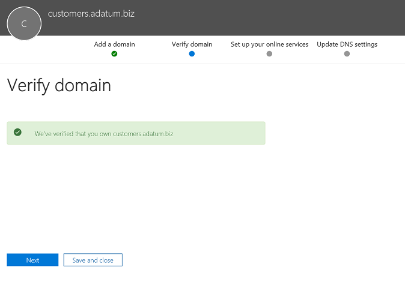
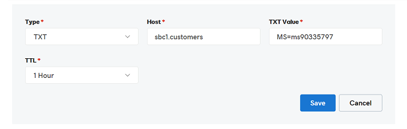

# Configurar um controlador de borda da sessão para vários locatários

O Roteamento Direto dá suporte à configuração de um Controlador de Borda de Sessão (SBC) para atender a vários locatários.

> [!NOTE]
> Este cenário foi projetado para parceiros da Microsoft e/ou operadoras PSTN, chamados de operadoras posteriormente neste documento. Uma operadora vende serviços de telefonia entregues Microsoft Teams para seus clientes. 

Uma operadora:
- Implanta e gerencia um SBC em seu datacenter (os clientes não precisam implementar um SBC e recebem serviços de telefonia da operadora no cliente Teams).
- Interconecta o SBC a vários locatários.
- Fornece serviços PSTN aos clientes.
- Gerencia a qualidade da chamada de ponta a ponta.
- Cobra separadamente pelos serviços PSTN.

A Microsoft não gerencia operadoras. A Microsoft oferece um PBX (Telefone Microsoft System) e um Teams cliente. A Microsoft também certifica telefones e certifica os SBCs que podem ser usados com o Telefone Microsoft System. Antes de escolher uma operadora, certifique-se de que sua escolha tenha um SBC certificado e possa gerenciar a qualidade da voz de ponta a ponta.

A seguir estão as etapas técnicas de implementação para configurar o cenário.

**Somente operadora:**
1. Implante o SBC e configure-o para o cenário de hospedagem de acordo com as instruções [dos fornecedores SBC certificados.](#deploy-and-configure-the-sbc)
2. Registre um nome de domínio base no locatário da operadora e solicite um certificado curinga.
3. Registre um subdomínio para cada cliente, que faz parte do domínio base.

**Operadora com um Administrador Global do Cliente:**
1. Adicione o nome do subdomínio ao locatário do cliente.
2. Ative o nome do subdomínio.
3. Configure o tronco da operadora para o locatário do cliente e provisione usuários.

*Certifique-se de entender as noções básicas de DNS e como o nome de domínio é gerenciado Microsoft 365 ou Office 365. Revise [Obter ajuda com Microsoft 365 ou Office 365 domínios antes](https://support.office.com/article/Get-help-with-Office-365-domains-28343f3a-dcee-41b6-9b97-5b0f4999b7ef) de prosseguir.*

## Implantar e configurar o SBC

Para as etapas detalhadas sobre como implantar e configurar SBCs para um cenário de hospedagem SBC, consulte a documentação do fornecedor SBC.

- **AudioCodes:** Notas de Configuração de Roteamento Direto [,](https://www.audiocodes.com/solutions-products/products/products-for-microsoft-365/direct-routing-for-Microsoft-Teams)a configuração do cenário de hospedagem SBC descrito em "Conectando AudioCodes SBC Microsoft Teams Observação de Configuração do Modelo de Hospedagem de Roteamento Direto". 
- **Oracle:** [Observações de Configuração](https://www.oracle.com/technetwork/indexes/documentation/acme-packet-2228107.html)de Roteamento Direto , a configuração do cenário de hospedagem SBC é descrita na seção "Microsoft". 
- **Comunicações da Faixa de Opções:**  Consulte o Guia de Configuração do Centro de Configuração do [S Microsoft Teams BC](https://support.sonus.net/display/IOT/PBXs+-+SBC+5k7kSWe) de Comunicações da Faixa de Opções para a documentação sobre como configurar os SBCs da série Ribbon Core e para esta página Ribbon [Best Practice - Configuring Carriers for Microsoft Teams Direct Routing SBC Edge](https://support.sonus.net/display/UXDOC81/Connect+SBC+Edge+to+Microsoft+Teams+Direct+Routing+to+Support+Direct+Routing+Carrier)
- **TE-Systems (anynode):**  Registre-se na página de Community [TE-Systems](https://community.te-systems.de/) para documentação e exemplos sobre como configurar o SBC anynode para vários locatários.
- **Metawitch:**  Registre-se na [página Community Metawitch](https://manuals.metaswitch.com/MAN39555) para documentação sobre como habilitar o Perimeta SBC para vários locatários.

> [!NOTE]
> Preste atenção em como configurar o header "Contact". O header de contato é usado para encontrar o locatário do cliente na mensagem de convite de entrada. 

## Registrar um domínio base e sub-domínios

Para o cenário de hospedagem, você precisa criar:
- Um nome de domínio base pertencente à operadora.
- Um subdomínio que faz parte do nome de domínio base em cada locatário do cliente.

No exemplo a seguir:
- O Adatum é uma operadora que atende vários clientes fornecendo serviços de Internet e telefonia.
- Woodgrove Bank, Contoso e Adventure Works são três clientes que têm Microsoft 365 ou Office 365 domínios, mas recebem os serviços de telefonia do Adatum.

Os subdomas **DEVEM** corresponder ao nome FQDN do tronco que será configurado para o cliente e o FQDN no header Contato ao enviar o convite para Microsoft 365 ou Office 365. 

Quando uma chamada chega à interface Microsoft 365 ou Office 365 Roteamento Direto, a interface usa o header Contato para encontrar o locatário onde o usuário deve ser procurado. O Roteamento Direto não usa a procurar número de telefone no Convite, pois alguns clientes podem ter números não DID que podem se sobrepor a vários locatários. Portanto, o nome FQDN no header contato é necessário para identificar o locatário exato para procurar o usuário pelo número de telefone.

*Confira Obter [ajuda com Office 365 domínios para](https://support.office.com/article/Get-help-with-Office-365-domains-28343f3a-dcee-41b6-9b97-5b0f4999b7ef) obter mais informações sobre como criar nomes de domínio em Microsoft 365 ou Office 365 organizações.*

O diagrama a seguir resume os requisitos para domínio base, subdomas e header de contato.

O SBC exige um certificado para autenticar as conexões. Para o cenário de hospedagem SBC, a operadora precisa solicitar um certificado com CN e/ou SAN *\* .base_domain (por exemplo, \* .customers.adatum.biz)*. Esse certificado pode ser usado para autenticar conexões com vários locatários atendidos de um único SBC.

A tabela a seguir é um exemplo de uma configuração.

|Novo nome de domínio |Tipo|Registrado  |Certificado CN/SAN para SBC  |Domínio padrão do locatário no exemplo  |Nome FQDN que o SBC deve apresentar no header Contato ao enviar chamadas aos usuários|
|---------|---------|---------|---------|---------|---------|
|customers.adatum.biz|    Base     |     No locatário da operadora  |    \*.customers.adatum.biz  |   adatum.biz      |NA, este é um locatário de serviço, nenhum usuário |
|sbc1.customers.adatum.biz|    Subdomínio  |    Em um locatário do cliente  |    \*.customers.adatum.biz  | woodgrovebank.us  |  sbc1.customers.adatum.biz|
|sbc2.customers.adatum.biz  |   Subdomínio | Em um locatário do cliente   |   \*.customers.adatum.biz   |contoso.com   |sbc2.customers.adatum.biz |
|sbc3.customers.adatum.biz |   Subdomínio | Em um locatário do cliente |   \*.customers.adatum.biz  |  adventureworks.com | sbc3.customers.adatum.biz |
||         |         |         |         |         |

Para configurar a base e os subdomas, siga as etapas descritas abaixo. No exemplo, configuraremos um nome de domínio base (customers.adatum.biz) e um subdomínio para um cliente (sbc1.customers.adatum.biz locatário do Woodgrove Bank).

> [!NOTE]
> Use sbcX.customers.adatum.biz para habilitar a voz no locatário da operadora. sbcX pode ser qualquer nome de host alfanumérico exclusivo e válido.

## Registrar um nome de domínio base no locatário da operadora

**Essas ações são executadas no locatário da operadora.**

### Verifique se você tem direitos apropriados no locatário da operadora

Você só poderá adicionar novos domínios se entrar no Centro de administração do Microsoft 365 como Administrador Global. 

Para validar a função que você tem, entre no Centro de administração do Microsoft 365 ( , acesse Usuários ativos e verifique se você tem uma função https://portal.office.com)   >  de Administrador Global. 

Para obter mais informações sobre funções de administrador e como atribuir uma função em Microsoft 365 ou Office 365, consulte [Sobre funções de administrador](https://support.office.com/article/About-Office-365-admin-roles-da585eea-f576-4f55-a1e0-87090b6aaa9d).

### Adicionar um domínio base ao locatário e confirmá-lo

1. No Centro de administração do Microsoft 365, vá para **Setup**  >  **Domains**  >  **Add domain**.
2. Na caixa **Inserir um domínio que você possui,** digite o FQDN do domínio base. No exemplo a seguir, o domínio base é *customers.adatum.biz*.

    

3. Click **Next**.
4. No exemplo, o locatário já adatum.biz como um nome de domínio verificado. O assistente não solicitará verificação adicional porque customers.adatum.biz é um subdomínio para o nome já registrado. No entanto, se você adicionar um FQDN que não tenha sido verificado antes, você precisará passar pelo processo de verificação. O processo de verificação é [descrito abaixo](#add-a-subdomain-to-the-customer-tenant-and-verify-it).

    

5. Clique **em Próximo** e, na página Atualizar **Configurações** DNS, selecione Eu mesmo adicionarei os registros **DNS** e clique em **Próximo**.
6. Na próxima página, limpe todos os valores (a menos que você queira usar o nome de domínio para Exchange, SharePoint ou Teams/Skype for Business), clique em Next **e** clique em **Concluir**. Certifique-se de que seu novo domínio está no status completo da Instalação.

    

### Ativar o nome de domínio

Depois de registrar um nome de domínio, você precisará ativá-lo adicionando pelo menos um usuário com uma licença Sistema de Telefonia e atribuindo um endereço SIP com a parte FQDN do endereço SIP correspondente ao domínio base criado.

> [!NOTE]
> O locatário da Operadora deve manter pelo menos uma licença Sistema de Telefonia atribuída ao locatário para evitar a remoção da configuração Skype for Business de usuário. 

*Confira [Obter ajuda com Microsoft 365 ou Office 365 domínios](https://support.office.com/article/Get-help-with-Office-365-domains-28343f3a-dcee-41b6-9b97-5b0f4999b7ef) para obter mais informações sobre como adicionar usuários em Microsoft 365 ou Office 365 organizações.*

Por exemplo: test@customers.adatum.biz

## Registrar um nome de subdomínio em um locatário do cliente

Você precisará criar um nome de subdomínio exclusivo para cada cliente. Neste exemplo, criaremos um subdomínio sbc1.customers.adatum.biz em um locatário com o nome de domínio padrão woodgrovebank.us.

**Todas as ações abaixo estão no locatário do cliente.**

### Verifique se você tem direitos apropriados no locatário do cliente

Você só poderá adicionar novos domínios se entrar no Centro de administração do Microsoft 365 como Administrador Global. 

Para validar a função que você tem, entre no Centro de administração do Microsoft 365 ( , acesse Usuários ativos e verifique se você tem uma função https://portal.office.com)   >  de Administrador Global. 

Para obter mais informações sobre funções de administrador e como atribuir uma função em Microsoft 365 ou Office 365, consulte [Sobre funções de administrador](https://support.office.com/article/About-Office-365-admin-roles-da585eea-f576-4f55-a1e0-87090b6aaa9d).

### Adicione um subdomínio ao locatário do cliente e verifique se ele
1. No Centro de administração do Microsoft 365, vá para **Setup**  >  **Domains**  >  **Add domain**.
2. Na caixa **Inserir um domínio que você possui,** digite o FQDN do subdomínio para esse locatário. No exemplo abaixo, o subdomínio é sbc1.customers.adatum.biz.

    

3. Click **Next**.
4. O FQDN nunca foi registrado no locatário. Na próxima etapa, você precisará verificar o domínio. Selecione **Adicionar um registro TXT em vez disso.** 

    

5. Clique **em Próximo** e observe o valor TXT gerado para verificar o nome de domínio.

    

6. Crie o registro TXT com o valor da etapa anterior no provedor de hospedagem DNS da operadora.

    

    Para obter mais informações, consulte [Create DNS records at any DNS hosting provider](https://support.office.com/article/create-dns-records-at-any-dns-hosting-provider-for-office-365-7b7b075d-79f9-4e37-8a9e-fb60c1d95166).

7. Volte para o cliente Centro de administração do Microsoft 365 clique em **Verificar**. 
8. Na próxima página, selecione **Eu mesmo adicionarei os registros DNS** e clique em **Next**.

    

9. Na página **Escolher seus serviços online,** des limpar todas as opções e clique em **Próximo**.

    

10. Clique **em Concluir** na página Atualizar **configurações dns.**

    

11. Certifique-se de que o status da **Instalação está concluído.** 
    
    
    
> [!NOTE]
> A URL base e o subdomínio para o cliente individual devem estar no mesmo locatário para permitir que você adicione um _tronco de rota_ direta.

### Ativar o nome do subdomínio

Depois de registrar um nome de domínio, você precisa ativá-lo adicionando pelo menos um usuário e atribuindo um endereço SIP com a parte FQDN do endereço SIP que corresponde ao subdomínio criado no locatário do cliente. 

*Confira [Obter ajuda com Microsoft 365 ou Office 365 domínios](https://support.office.com/article/Get-help-with-Office-365-domains-28343f3a-dcee-41b6-9b97-5b0f4999b7ef) para obter mais informações sobre como adicionar usuários em Microsoft 365 ou Office 365 organizações.*

Por exemplo: test@sbc1.customers.adatum.biz

### Criar um tronco e provisionamento de usuários

Com a versão inicial do Roteamento Direto, a Microsoft exigia que um tronco fosse adicionado a cada locatário atendido (locatário do cliente) usando New-CSOnlinePSTNGateway.

No entanto, isso não se mostrou ideal por dois motivos:
 
- **Gerenciamento de sobrecarga**. O descarregamento ou o esvaziamento de um SBC, por exemplo, altera alguns parâmetros, como a habilitação ou desabilitação do bypass de mídia. Alterar a porta exige alterar parâmetros em vários locatários (executando Set-CSOnlinePSTNGateway), mas na verdade é o mesmo SBC. 

-  **Processamento de sobrecarga**. Coleta e monitoramento de dados de integridade do tronco - as opções SIP coletadas de vários troncos lógicos que são, na verdade, o mesmo SBC e o mesmo tronco físico, retarda o processamento dos dados de roteamento.
 
Com base nesse feedback, a Microsoft está trazendo uma nova lógica para provisionar os troncos para os locatários do cliente.

Duas novas entidades foram introduzidas:
-    Um tronco de operadora registrado no locatário da operadora usando o comando New-CSOnlinePSTNGateway, por exemplo, New-CSOnlinePSTNGateway -FQDN customers.adatum.biz -SIPSignalingport 5068 -ForwardPAI $true.

-    Um tronco derivado, que não exige registro. É simplesmente um nome de host desejado adicionado do tronco da operadora. Ela deriva todos os parâmetros de configuração do tronco da operadora. O tronco derivado não precisa ser criado no PowerShell, e a associação com o tronco da operadora é baseada no nome FQDN (confira detalhes abaixo).

**Exemplo e lógica de provisionamento**

-    As operadoras só precisam configurar e gerenciar um único tronco (tronco de operadora no domínio da operadora), usando o comando Set-CSOnlinePSTNGateway. No exemplo acima, é adatum.biz;
-    No locatário do cliente, a operadora só precisa adicionar o FQDN de tronco derivado às políticas de roteamento de voz dos usuários. Não é necessário executar o New-CSOnlinePSTNGateway para um tronco.
-    O tronco derivado, como o nome sugere, herda ou deriva todos os parâmetros de configuração do tronco da operadora. Exemplos:
-    Customers.adatum.biz – o tronco da operadora que precisa ser criado no locatário da operadora.
-    Sbc1.customers.adatum.biz – o tronco derivado em um locatário do cliente que não precisa ser criado no PowerShell.  Você pode simplesmente adicionar o nome do tronco derivado no locatário do cliente na política de roteamento de voz online sem cria-lo (use FQDN de tronco derivado ao configurar a política de roteamento de voz no TAC em Teams-Voice-Direct Routing-Voice Routes field SBCs inscritos).
-   A operadora precisará configurar o registro DNS resolvendo FQDN de tronco derivado para o endereço ip SBC da operadora.

-    Todas as alterações feitas em um tronco de operadora (no locatário da operadora) são aplicadas automaticamente a troncos derivados. Por exemplo, as operadoras podem alterar uma porta SIP no tronco da operadora, e essa alteração se aplica a todos os troncos derivados. A nova lógica para configurar os troncos simplifica o gerenciamento, pois você não precisa ir a todos os locatários e alterar o parâmetro em cada tronco.
-    As opções são enviadas somente para o FQDN do tronco da operadora. O status de saúde do tronco da operadora é aplicado a todos os troncos derivados e é usado para decisões de roteamento. Saiba mais sobre as [opções de Roteamento Direto.](./direct-routing-monitor-and-troubleshoot.md)
-    A operadora pode drenar o tronco da operadora e todos os troncos derivados também serão esvaziados. 
 
> [!NOTE]
> Regras de conversão de números aplicadas no tronco da operadora não se aplicam a troncos derivados. Esse é um problema conhecido. Como solução alternativa, a regra de conversão de números deve ser criada para o locatário de cada cliente.

**Migração do modelo anterior para o tronco da operadora**
 
Para migrar da implementação atual do modelo hospedado da operadora para o novo modelo, as operadoras precisarão reconfigurar os troncos para locatários do cliente. Remova os troncos dos locatários do cliente usando Remove-CSOnlinePSTNGateway (deixando o tronco no locatário da operadora)-

É altamente recomendável migrar para a nova solução assim que possível, pois melhoraremos o monitoramento e o provisionamento usando a operadora e o modelo de tronco derivado.
 

Consulte as instruções do fornecedor [SBC](#deploy-and-configure-the-sbc) sobre como configurar o envio do nome FQDN de subdomas no header contato.

## Considerações sobre como configurar o failover de vários locatários 

Para configurar o failover para um ambiente de vários locatários, você precisará fazer o seguinte:

- Para cada locatário, adicione os FQDNs para dois SBCs diferentes.  Por exemplo:

   customer1.sbc1.contoso.com  
   customer1.sbc2.contoso.com  

- Nas políticas de Roteamento de Voz Online dos usuários, especifique ambos os SBCs.  Se um SBC falhar, a política de roteamento encaminhará chamadas para o segundo SBC.

## Confira também

[Planejar o Roteamento Direto](direct-routing-plan.md)

[Configurar o Roteamento Direto](direct-routing-configure.md)
