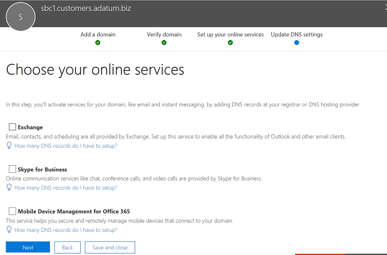

# <a name="configure-a-session-border-controller-for-multiple-tenants"></a>Configurar um controlador de borda da sessão para vários locatários

Roteamento direto suporta Configurando uma borda controlador sessão (SBC) para atender a vários locatários.

> [!NOTE]
> Este cenário foi projetado para parceiros da Microsoft e/ou operadoras PSTN, conhecidas como operadoras posteriormente contidas neste documento. Uma operadora de telefonia vende entregues a Microsoft Teams aos clientes de serviços de telefonia. 

Uma operadora de telefonia:
- Implanta e gerencia um SBC em datacenters (os clientes não precisam implementar um SBC e recebem serviços de telefonia da operadora no cliente equipes).
- Interconexão o SBC para vários locatários.
- Fornece serviços PSTN para os clientes.
- Gerencia a qualidade da chamada ponta a ponta.
- Encargos separadamente para serviços PSTN.

Microsoft não gerencia operadoras. Microsoft oferece um PBX (sistema de telefone da Microsoft) e um cliente de equipes, certifica telefones e certifica SBCs que podem ser usados com o sistema de telefone da Microsoft. Antes de escolher uma operadora de telefonia, verifique se sua escolha tem um SBC certificado e pode gerenciar a qualidade de voz ponta a ponta.

A seguir estão as etapas de implementação técnica para configurar o cenário.

**Operadora:**
1. Implante o SBC e configurá-lo para o cenário de hospedagem de acordo com as [instruções dos fornecedores certificados SBC](#deploy-and-configure-the-sbc).
2. Registrar um nome de domínio base no locatário operadora e solicitar um certificado curinga.
3. Registre um subdomínio para cada cliente, que é parte do domínio base.

**Operadora com um Administrador Global do cliente:**
1. Adicione o nome do subdomínio para o locatário do cliente.
2. Ative o nome do subdomínio.
3. Configure o tronco da operadora para os usuários de locatário e provisionar do cliente.

*Verifique se que você entendeu os fundamentos DNS e como o nome de domínio é gerenciado no Office 365. Revise a [obter ajuda com o Office 365](https://support.office.com/article/Get-help-with-Office-365-domains-28343f3a-dcee-41b6-9b97-5b0f4999b7ef) antes de continuar.*

## <a name="deploy-and-configure-the-sbc"></a>Implantar e configurar o SBC

Para obter as etapas detalhadas sobre como implantar e configurar SBCs para um cenário de hospedagem de SBC, consulte a documentação do fornecedor SBC.

- **AudioCodes:** [Notas de configuração de roteamento direto](https://www.audiocodes.com/solutions-products/products/products-for-microsoft-365/direct-routing-for-Microsoft-Teams), a configuração do SBC hospedando o cenário descrito em "Connecting AudioCodes SBC à Microsoft Teams direto roteamento Hosting modelo configuração nota". 
- **Communications da faixa de opções:**  Consulte o [Guia de configuração da faixa de opções Communications SBC Core Microsoft equipes](https://support.sonus.net/display/IOT/PBXs+-+SBC+5k7kSWe) para documentação sobre como configurar a faixa de opções Core série SBCs e para essa página [prática recomendada de faixa de opções - configurando operadoras para Microsoft equipes direto roteamento SBC Borda](https://support.sonus.net/display/UXDOC70/Best+Practice+-+Configuring+Carriers+for+Microsoft+Teams+Direct+Routing)

> [!NOTE]
> Por favor, preste atenção como configurar o cabeçalho "Contato". O cabeçalho de contato é usado para localizar o locatário do cliente na mensagem de entrada de convidar. 

## <a name="register-a-base-domain-and-subdomains"></a>Registrar um domínio base e subdomínios

Para o cenário de hospedagem, você precisa criar:
- Um nome de domínio base pertencente a operadora.
- Um subdomínio que faz parte do nome do domínio base em cada locatário do cliente.

No exemplo a seguir:
- Adatum é uma operadora de telefonia que serve de vários clientes fornecendo serviços de Internet e telefonia.
- Woodgrove Bank, Contoso e Adventure Works são três clientes que tenham domínios do Office 365, mas recebem os serviços de telefonia de Adatum.

Subdomínios **deve** correspondem ao nome do FQDN do tronco que será configurado para o cliente e o FQDN no cabeçalho contato ao enviar o convite para o Office 365. 

Quando uma chamada chega a interface do roteamento direto do Office 365, a interface usa o cabeçalho de contato para encontrar o locatário onde o usuário deve ser consultado. Roteamento direta não usa pesquisa de número de telefone no convite da, como alguns clientes podem ter não-números que podem sobrepor-se em vários locatários. Portanto, o nome FQDN no cabeçalho do contato é necessária para identificar o locatário exato para consultar o usuário pelo número de telefone.

*Analise a [obter ajuda com o Office 365](https://support.office.com/article/Get-help-with-Office-365-domains-28343f3a-dcee-41b6-9b97-5b0f4999b7ef) para obter mais informações sobre como criar nomes de domínio em locatários do Office 365.*

O diagrama a seguir resume os requisitos de domínio base, subdomínios e cabeçalho de contato.


O SBC requer um certificado para autenticar as conexões. Para o cenário de hospedagem de SBC, a operadora precisa solicitar um certificado com SAN * \*.base_domain (por exemplo, \*customers.adatum.biz)*. Este certificado pode ser usado para autenticar conexões com vários locatários servidos de um único SBC.

A tabela a seguir está um exemplo de uma configuração.


|Novo nome de domínio |Tipo|Registrado  |Certificado SAN para SBC  |Domínio de padrão de Inquilino no exemplo  |Nome do FQDN que SBC deve apresentar no cabeçalho contato ao enviar chamadas para usuários|
|---------|---------|---------|---------|---------|---------|
|Customers.adatum.biz|    Base     |     No locatário operadora  |    \*. customers.adatum.biz  |   adatum.biz      |NA, este é um locatário de serviço, nenhum usuário |
|sbc1.Customers.adatum.biz|    Subdomínio  |    Em um locatário do cliente  |    \*. customers.adatum.biz  | woodgrovebank.US  |  sbc1.Customers.adatum.biz|
|sbc2.Customers.adatum.biz  |   Subdomínio | Em um locatário do cliente   |   \*. customers.adatum.biz   |contoso.com   |sbc2.Customers.adatum.biz |
|sbc3.Customers.adatum.biz |   Subdomínio | Em um locatário do cliente |   \*. customers.adatum.biz  |  AdventureWorks.com | sbc3.Customers.adatum.biz |
||         |         |         |         |         |

Para configurar a base e os subdomínios, siga as etapas descritas abaixo. No exemplo, podemos configurar um nome de domínio básico (customers.adatum.biz) e um subdomínio para um cliente (sbc1.customers.adatum.biz no locatário Woodgrove Bank).

## <a name="register-a-base-domain-name-in-the-carrier-tenant"></a>Registrar um nome de domínio base no locatário operadora

**Essas ações são executadas no locatário operadora.**

### <a name="ensure-that-you-have-appropriate-rights-in-the-carrier-tenant"></a>Certifique-se de que você tenha os direitos apropriados no locatário operadora

Você só pode adicionar novos domínios se você entrou no Centro de administração do Office 365, como um Administrador Global. 

Para validar a função que você tiver, conecte-se ao centro de administração do Microsoft 365 (https://portal.office.com), vá para **usuários** > **Usuários ativos**e, em seguida, verifique se você possui uma função de Administrador Global. 

Para obter mais informações sobre funções de administração e como atribuir uma função no Office 365, consulte [funções de administrador do Office 365](https://support.office.com/article/About-Office-365-admin-roles-da585eea-f576-4f55-a1e0-87090b6aaa9d).

### <a name="add-a-base-domain-to-the-tenant-and-verify-it"></a>Adicionar um domínio de base para o inquilino e verifique se ele

1.  No Centro de administração do Microsoft 365, vá para a **instalação** > **domínios** > **Adicionar domínio**.
2.  Na caixa **Digite um domínio em que você é proprietário** , digite o FQDN do domínio base. No exemplo a seguir, o domínio de base é *customers.adatum.biz*.

    

3. Click **Next**.
4. No exemplo, o locatário já tiver adatum.biz como um nome de domínio verificado. O assistente não pedirá para verificação adicional porque customers.adatum.biz é um subdomínio para o nome já está registrado. No entanto, se você adicionar um FQDN que não foi verificado antes, você precisará percorrer o processo de verificação. O processo de verificação é [descrito abaixo](#add-a-subdomain-to-the-customer-tenant-and-verify-it).

    

5.  Clique em **Avançar**e na página **Configurações de DNS de atualização** , selecione **eu adicionará os registros DNS irei** e clique em **Avançar**.
6.  Na próxima página, limpe todos os valores (a menos que você deseja usar o nome de domínio para o Exchange, SharePoint ou equipes/Skype for Business), clique em **Avançar**e, em seguida, clique em **Concluir**. Certifique-se de que seu novo domínio se situa o status de instalação completo.

    

### <a name="activate-the-domain-name"></a>Ativar o nome de domínio

Depois que você registrou um nome de domínio, você precisa ativá-lo adicionando pelo menos um E1, E3, ou E5 licenciados usuário e atribuir um endereço SIP com a parte do FQDN do SIP endereços correspondência o domínio base criado. 

*Analise a [obter ajuda com o Office 365](https://support.office.com/article/Get-help-with-Office-365-domains-28343f3a-dcee-41b6-9b97-5b0f4999b7ef) para obter mais informações sobre a adição de usuários em locatários do Office 365.*

Por exemplo: test@customers.adatum.biz


## <a name="register-a-subdomain-name-in-a-customer-tenant"></a>Registrar um nome de subdomínio em um locatário do cliente

Você precisará criar um nome de subdomínio exclusivo para cada cliente. Neste exemplo, criaremos um sbc1.customers.adatum.biz subdomínio em um locatário com o woodgrovebank.us de nome de domínio padrão.

**Todas as ações a seguir estão no locatário do cliente.**

### <a name="ensure-that-you-have-appropriate-rights-in-the-customer-tenant"></a>Certifique-se de que você tenha os direitos apropriados no locatário do cliente

Você só pode adicionar novos domínios se você entrou no Centro de administração do Office 365, como um Administrador Global. 

Para validar a função que você tiver, conecte-se ao centro de administração do Microsoft 365 (https://portal.office.com), vá para **usuários** > **Usuários ativos**e, em seguida, verifique se você possui uma função de Administrador Global. 

Para obter mais informações sobre funções de administração e como atribuir uma função no Office 365, consulte [funções de administrador do Office 365](https://support.office.com/article/About-Office-365-admin-roles-da585eea-f576-4f55-a1e0-87090b6aaa9d).

### <a name="add-a-subdomain-to-the-customer-tenant-and-verify-it"></a>Adicionar um subdomínio para o locatário do cliente e verifique se ele
1. No Centro de administração do Microsoft 365, vá para a **instalação** > **domínios** > **Adicionar domínio**.
2. Na caixa **Digite um domínio em que você é proprietário** , digite o FQDN do subdomínio para este locatário. No exemplo a seguir, o subdomínio é sbc1.customers.adatum.biz.

    

3. Click **Next**.
4. O FQDN nunca foi registrado no inquilino. Na próxima etapa, você precisará verificar o domínio. Selecione **Adicionar um registro TXT em vez disso**. 

    

5. Clique em **Avançar**e observe o valor do TXT gerado para verificar o nome de domínio.

    

6. Crie o registro TXT com o valor da etapa anterior no provedor de hospedagem de DNS da operadora.

    

    Para obter mais informações, consulte [criar registros DNS em qualquer provedor de hospedagem de DNS para o Office 365](https://support.office.com/article/create-dns-records-at-any-dns-hosting-provider-for-office-365-7b7b075d-79f9-4e37-8a9e-fb60c1d95166).

7. Voltar ao centro de administração do Microsoft 365 do cliente e clique em **Verificar**. 
8. Na página seguinte, selecione **eu adicionará os registros DNS irei** e clique em **Avançar**.

    

9. Na página **Escolher seus serviços online** , desmarque todas as opções e clique em **Avançar**.

    

10. Na página **configurações de atualização de DNS** , clique em **Concluir** .

    

11. Certifique-se de que o status é **Concluir a instalação**. 
    
    

### <a name="activate-the-subdomain-name"></a>Ativar o nome do subdomínio

Após registrar um nome de domínio, você precisa ativá-lo adicionando pelo menos um usuário e atribuir um endereço SIP com a parte do FQDN do endereço SIP correspondente ao subdomínio criado no locatário do cliente.

*Analise a [obter ajuda com o Office 365](https://support.office.com/article/Get-help-with-Office-365-domains-28343f3a-dcee-41b6-9b97-5b0f4999b7ef) para obter mais informações sobre a adição de usuários em locatários do Office 365.*

Por exemplo: test@sbc1.customers.adatum.biz


### <a name="create-a-trunk-and-provision-users"></a>Criar um tronco e provisionar usuários

> [!NOTE]
> Com base nos comentários que recebemos no programa de adoção técnicos, Microsoft pode alterar o processo de criação de troncos em Inquilinos do cliente para simplificar o processo. Por favor, assista as atualizações de documentação nesta página e siga os blogs de comunidade técnica da Microsoft para obter mais informações. 

Crie um tronco no domínio do cliente usando o comando New-CSonlinePSTNGateway. O tronco FQDN **deve** corresponder ao subdomínio criado para o cliente.

Por exemplo:

```
New-CSOnlinePSTNGateway –FQDN sbc1.customers.adatum.biz -SipSignallingPort 5068
```

Ao criar o tronco, você receberá a seguinte mensagem de erro:

```
Can not use the "sbc1.customers.adatum.biz" domain as it was not configured for this tenant.
```

Aguarde algum tempo para que o registro de domínio e ativação para replicar e tente novamente.

Provisionar usuários com os números de telefone e configurar o roteamento de voz.

Para obter mais informações sobre o New-CSOnlinePSTNGateway, provisionamento de usuários e configurando o roteamento de voz, consultem [Configurar o roteamento direto](direct-routing-configure.md).


Consulte as [instruções do fornecedor SBC](#deploy-and-configure-the-sbc) sobre como configurar enviando o nome FQDN subdomínios no cabeçalho do contato.

